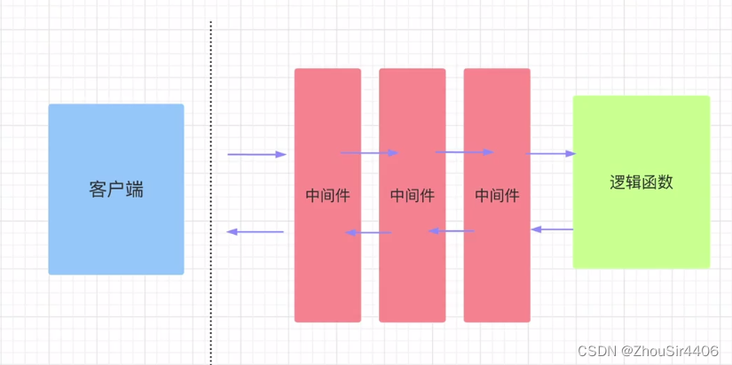

## FastApi框架简介

**天生支持异步**

自动生成可交互文档

适用于API,微服务，AI推理

FastApi是一个基于python的高性能web框架，专门用于快速构建API接口服务。


## 第一个FASTapi程序

```python
from fastapi import FastAPI


# 第一个实例
app = FastAPI()


@app.get("/")        #根目录
async def root():    # sync同步 async异步
    return {"message": "Hello World666"}

@app.get("/hello/{name}")
async def say_hello(name: str):
    return {"message": f"Hello {name}"}
# 启动fastapi
uvicorn backend.app.main:app --reload --port 8000

```

```cmd
uvicorn main:app --reload --port 8000

#在url中输入http://127.0.0.1:8000/docs
可以打开可交互文档页面
```

## 路由--URL与处理结果之间的映射关系

可以帮助我们访问不同的地址，得到不同的结果

```python
@app.get("/")        #根目录 app实例 get方法
async def root():    # sync同步 async异步
    return {"message": "Hello World666"}
```

## URL传参--路径参数


```python
#路径参数
@app.get("/hello/{name}")
async def say_hello(name: str):       #添加一个同名的形参
    return {"message": f"Hello {name}"}

#带类型的路径参数
from fastapi import FastAPI

app = FastAPI()


@app.get("/items/{item_id}")
async def read_item(item_id: int):
    return {"item_id": item_id}
#带Path限制的路径参数
from fastapi import FastAPI, Path
@app.get("/word_hello/{name}/{age}")
async def say_word_hello(name: str, age: int = Path(..., ge=1, le=100,description="年龄",min_length=1,max_length=3)):
    return {"message": f"Hello {name}, your age is {age}"}  
```


## 查询参数


```python
@app.get("/word_hello_world/")
async def say_word_hello_world(name: str = Query(...,description="姓名",min_length=1,max_length=3) ):
    return {"message": "Hello World"}
#查询参数可设置默认值，把...换成需要的默认值就可以
```

## 请求体参数


```python
from fastapi import FastAPI, Path, Query
from pydantic import BaseModel       #从pydantic import BaseModel 


from pydantic import BaseModel, Field

class User(BaseModel):
    name: str = Field(...,description="姓名",min_length=1,max_length=3)   
    pwd: str = Field(...,description="密码",min_length=1,max_length=3)
    
    
@app.post("/login")    #POST方式请求
async def login(user: User):
    return user
```

## JSON响应格式


**默认响应json格式。**

## HTML响应格式与文件响应格式


```python
# 装饰器指定响应类
from fastapi.responses import JSONResponse, HTMLResponse

@app.get("/html", response_class=HTMLResponse)
async def html():
    return """
    <html>
        <head>
            <title>Hello World</title>
        </head>
        <body>
            <h1>Hello World</h1>
        </body>
    </html>
    """


# 返回响应对象
@app.get("/file")
async def file():
    return FileResponse("PixPin_2026-03-15_23-11-46.png")


```

## response_model 约束响应结构

这一节用的是 `response_model` 参数：**不改变输出格式（最终还是 JSONResponse），只对返回的数据做质检**——校验字段类型、过滤多余字段（隐藏密码等敏感字段的标准手法）。

```python
#先定义需要的类型
class User1(BaseModel):
    id : int = Field(...,description="用户id",min_length=1,max_length=3)
    name: str = Field(...,description="姓名",min_length=1,max_length=3)   
    title: str = Field(...,description="职称",min_length=1,max_length=3)
    content: str = Field(...,description="内容",min_length=1,max_length=3)
    
    
#
@app.post("/user1", response_model=User1)
async def get_user1(user_id: int):
    if user_id == 1:
        raise HTTPException(status_code=404, detail="用户id不存在")
    return {"id": user_id, "name": "张三", "title": "工程师", "content": "这是一个测试数据"}

@app.post("/user1", response_model=User1)
async def get_user1(user_id: int):
    
    user_id = User1(id=user_id, name="张三", title="工程师", content="这是一个测试数据")

    return user_id
```


## 响应对象体系（Response家族总览）

前面的 JSON / HTML / 文件响应和 response_model 约束，本质都汇入同一个体系：全部继承自 **`Response` 基类**（来自 FastAPI 的底层框架 Starlette，`from fastapi.responses import Response`）。

**家族谱系**

| 类 | 干什么 | 典型场景 |
|---|---|---|
| `Response` | 基类：content + status_code + headers + media_type | 自定义子类的父类 |
| `JSONResponse` | dict → JSON 序列化 | **默认包装器**，`return dict` 走的就是它 |
| `HTMLResponse` | 字符串按 text/html 发 | 返回页面片段 |
| `PlainTextResponse` | 纯文本 | 健康检查、robots.txt |
| `RedirectResponse` | 302/307 + Location 头 | 登录跳转、接口迁移 |
| `StreamingResponse` | 生成器逐块发（chunked 编码） | SSE 日志流、大文件边读边发 |
| `FileResponse` | 不读进内存，服务器直接发文件句柄；自动带 Content-Length / ETag，支持 Range 断点续传 | 文件下载**优先用它** |

**核心机制：return 值的自动转换规则（只有两条）**

```python
@app.get("/a")
async def a():
    return {"x": 1}      # 规则1：普通值 → FastAPI 用默认包装器(JSONResponse)
                          # 序列化后发出

@app.get("/b")
async def b():
    return JSONResponse({"x": 1}, status_code=201)
                          # 规则2：Response 实例 → 原样发出，FastAPI 不做任何加工
```

推论：一旦手动 return Response 对象，`response_model` 的序列化和文档化就被绕过了——发什么客户端收什么。

**改状态码/响应头的推荐姿势：依赖注入临时 Response 对象**

```python
@app.get("/login")
async def login(response: Response):    # 注入的是 fastapi.Response 临时对象
    response.status_code = 201
    response.headers["X-Custom"] = "yes"
    response.set_cookie(key="session", value="abc", httponly=True)
    return {"ok": True}                 # return 的 dict 仍会被自动序列化，
                                         # 但对 response 的修改会合并进最终响应
```

这种方式比手动构造 JSONResponse 好：不破坏 response_model 的自动文档。

**换默认包装器的两种方式**

```python
# 方式1：装饰器参数（对整个接口生效，文档自动更新）
@app.get("/page", response_class=HTMLResponse, status_code=201)

# 方式2：应用级全局默认
from fastapi.responses import ORJSONResponse   # 高性能JSON，需 pip install orjson
app = FastAPI(default_response_class=ORJSONResponse)
```

**自定义 Response 子类：覆写 render()**

```python
class XMLResponse(Response):
    media_type = "application/xml"
    def render(self, content) -> bytes:
        return xml_dumps(content).encode()

@app.get("/data", response_class=XMLResponse)
async def data():
    return {"x": 1}      # 自动走 XML 渲染
```

**StreamingResponse：边产生边发送**

接收一个异步生成器，每 yield 一块就立刻推给客户端，不等数据凑齐：

```python
from fastapi.responses import StreamingResponse

@app.get("/api/stream")
async def stream():
    async def gen():
        yield "第一块数据\n"
        await asyncio.sleep(1)    # 这1秒里客户端已经收到了第一块
        yield "第二块数据\n"
    return StreamingResponse(gen(), media_type="text/event-stream")
```

- 不设 Content-Length，走 HTTP chunked 分块传输
- 背压友好：生成器惰性执行，网络发不动就暂停产出，不会堆内存
- 客户端断开时生成器被取消，可在 finally 里做清理
- 注意：生成器在事件循环里跑，别做 CPU 密集活，会卡住整个服务
- media_type="text/event-stream" + "data: xxx\n\n" 格式 = SSE 协议，前端用 EventSource 接收

**几个细节**

- 响应头一旦开始发送就改不了：StreamingResponse 的 headers 在第一个 chunk 发出前定型
- 文件下载优先 FileResponse（零内存拷贝 + 断点续传），数据还在产生中才用 StreamingResponse
- 三者的本质区别：**数据全部就绪才返回（JSON）vs 文件已存在（File）vs 数据边产生边发（Streaming）**

## 异常处理

对于客户端引发的错误返回一个错误响应

```python
from fastapi import FastAPI, Path, Query, HTTPException

@app.get("/id_num/{user_id}")
async def get_id_num(user_id: int):
    if user_id == 1:
        raise HTTPException(status_code=404, detail="用户id不存在")
    return {"message": f"用户id为{user_id}"}
```


## 中间件

中间件是一个函数，在每次请求进入fastAPI应用时都会执行。



```python
from fastapi import Request, Response, FastAPI

app = FastAPI()

@app.middleware("http")
async def add_process_time_header(request: Request, call_next):
    print("Middleware called")
    response = await call_next(request)
    print("Middleware ended")
    return response

@app.middleware("http")
async def add_process_time_header2(request: Request, call_next):
    print("Middleware2 called")
    response = await call_next(request)
    print("Middleware2 ended")
    return response

@app.get("/")
async def root():
    return {"message": "Hello World"}

#输出
INFO:     Application startup complete.
Middleware2 called
Middleware called
Middleware ended
Middleware2 ended
```

## 依赖注入


依赖性，是可以重复使用的组件。注入，FASTapi自动帮助你调用依赖性，并将`结果`注入到路径操作函数中。

**三步：创建依赖性（通用代码封装起来） 导入Depends   声明依赖性**

```python

#导入Depends
from fastapi import Depends


#创建依赖项
async def commen_func(
        skip:int = Query(0, ge=0, description="Number of items to skip"),
        limit:int = Query(100, ge=0, le=100, description="Number of items to limit")
):
    return {"skip": skip, "limit": limit}


#声明依赖性
@app.get("/items/{item_id}")
async def read_item(result = Depends(commen_func)):
    return result


```

