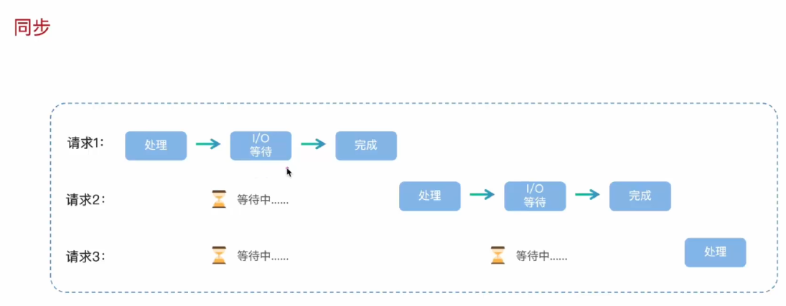
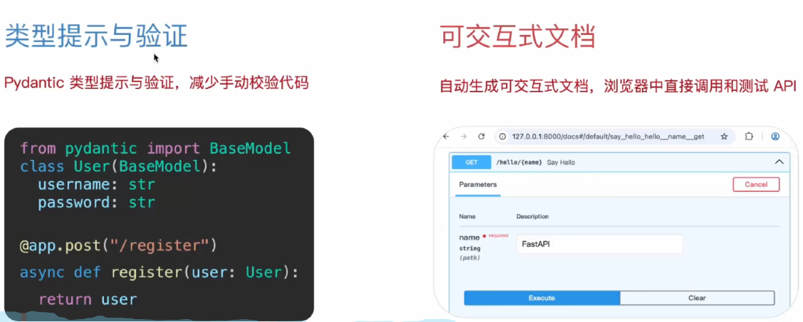
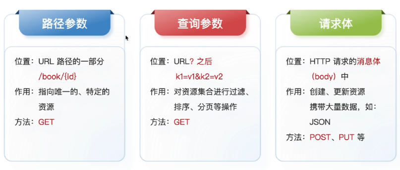
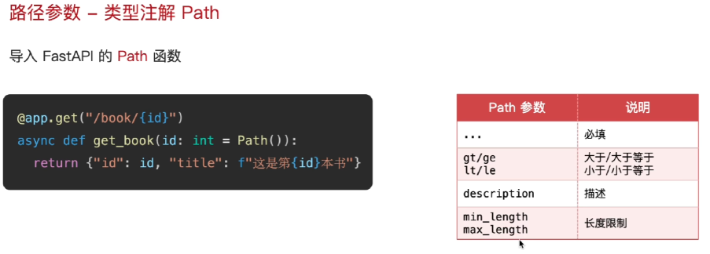
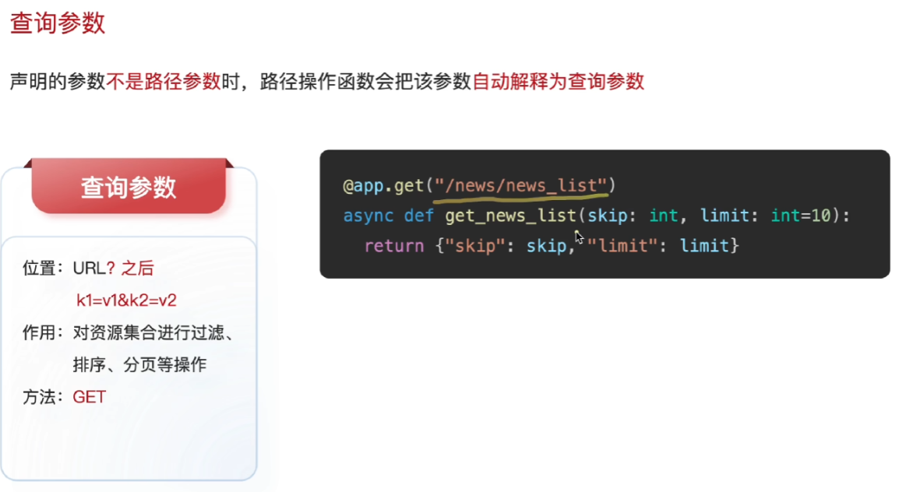
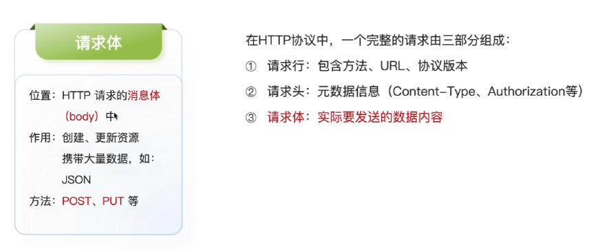
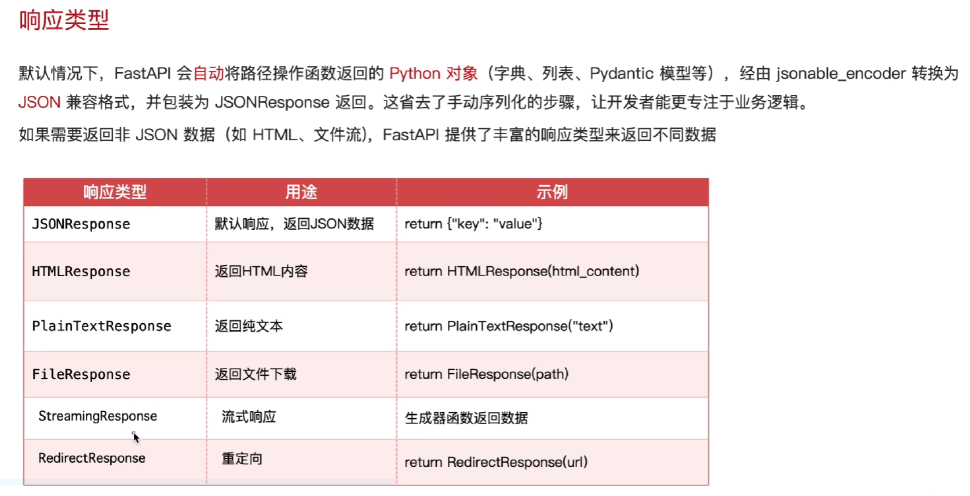
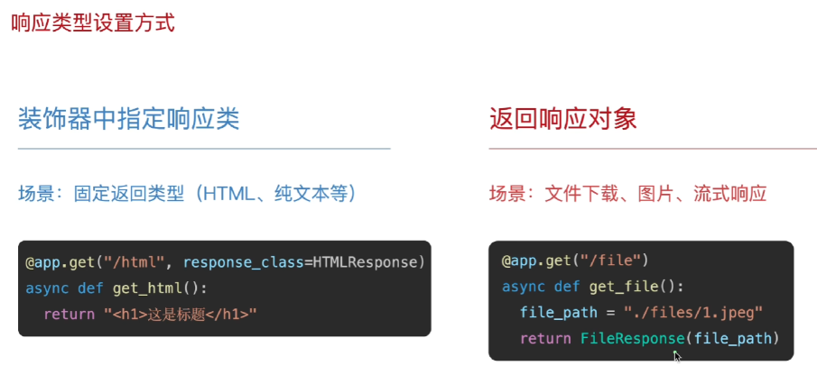

## FastApi框架简介

**天生支持异步**

自动生成可交互文档

适用于API,微服务，AI推理

FastApi是一个基于python的高性能web框架，专门用于快速构建API接口服务。






## 第一个FASTapi程序

```python
from fastapi import FastAPI


# 第一个实例
app = FastAPI()


@app.get("/")        #根目录
async def root():    # sync同步 async异步
    return {"message": "Hello World666"}

@app.get("/hello/{name}")
async def say_hello(name: str):
    return {"message": f"Hello {name}"}
# 启动fastapi
uvicorn backend.app.main:app --reload --port 8000

```

```cmd
uvicorn main:app --reload --port 8000

#在url中输入http://127.0.0.1:8000/docs
可以打开可交互文档页面
```

## 路由--URL与处理结果之间的映射关系

可以帮助我们访问不同的地址，得到不同的结果

```python
@app.get("/")        #根目录 app实例 get方法
async def root():    # sync同步 async异步
    return {"message": "Hello World666"}
```

## URL传参--路径参数



```python
#路径参数
@app.get("/hello/{name}")
async def say_hello(name: str):       #添加一个同名的形参
    return {"message": f"Hello {name}"}

#带类型的路径参数
from fastapi import FastAPI

app = FastAPI()


@app.get("/items/{item_id}")
async def read_item(item_id: int):
    return {"item_id": item_id}
#带Path限制的路径参数
from fastapi import FastAPI, Path
@app.get("/word_hello/{name}/{age}")
async def say_word_hello(name: str, age: int = Path(..., ge=1, le=100,description="年龄",min_length=1,max_length=3)):
    return {"message": f"Hello {name}, your age is {age}"}  
```



## 查询参数



```python
@app.get("/word_hello_world/")
async def say_word_hello_world(name: str = Query(...,description="姓名",min_length=1,max_length=3) ):
    return {"message": "Hello World"}
#查询参数可设置默认值，把...换成需要的默认值就可以
```

## 请求体参数



```python
from fastapi import FastAPI, Path, Query
from pydantic import BaseModel       #从pydantic import BaseModel 


from pydantic import BaseModel, Field

class User(BaseModel):
    name: str = Field(...,description="姓名",min_length=1,max_length=3)   
    pwd: str = Field(...,description="密码",min_length=1,max_length=3)
    
    
@app.post("/login")    #POST方式请求
async def login(user: User):
    return user
```

## JSON响应格式



**默认响应json格式。**

## HTML响应格式与文件响应格式



```python
# 装饰器指定响应类
from fastapi.responses import JSONResponse, HTMLResponse

@app.get("/html", response_class=HTMLResponse)
async def html():
    return """
    <html>
        <head>
            <title>Hello World</title>
        </head>
        <body>
            <h1>Hello World</h1>
        </body>
    </html>
    """


# 返回响应对象
@app.get("/file")
async def file():
    return FileResponse("PixPin_2026-03-15_23-11-46.png")


```

## 自定义响应格式

```python
#先定义需要的类型
class User1(BaseModel):
    id : int = Field(...,description="用户id",min_length=1,max_length=3)
    name: str = Field(...,description="姓名",min_length=1,max_length=3)   
    title: str = Field(...,description="职称",min_length=1,max_length=3)
    content: str = Field(...,description="内容",min_length=1,max_length=3)
    
    
#
@app.post("/user1", response_model=User1)
async def get_user1(user_id: int):
    if user_id == 1:
        raise HTTPException(status_code=404, detail="用户id不存在")
    return {"id": user_id, "name": "张三", "title": "工程师", "content": "这是一个测试数据"}

@app.post("/user1", response_model=User1)
async def get_user1(user_id: int):
    
    user_id = User1(id=user_id, name="张三", title="工程师", content="这是一个测试数据")

    return user_id
```


## 异常处理

对于客户端引发的错误返回一个错误响应

```python
from fastapi import FastAPI, Path, Query, HTTPException

@app.get("/id_num/{user_id}")
async def get_id_num(user_id: int):
    if user_id == 1:
        raise HTTPException(status_code=404, detail="用户id不存在")
    return {"message": f"用户id为{user_id}"}
```


## 中间件

中间件是一个函数，在每次请求进入fastAPI应用时都会执行。

```python
from fastapi import Request, Response, FastAPI

app = FastAPI()

@app.middleware("http")
async def add_process_time_header(request: Request, call_next):
    print("Middleware called")
    response = await call_next(request)
    print("Middleware ended")
    return response

@app.middleware("http")
async def add_process_time_header2(request: Request, call_next):
    print("Middleware2 called")
    response = await call_next(request)
    print("Middleware2 ended")
    return response

@app.get("/")
async def root():
    return {"message": "Hello World"}

#输出
INFO:     Application startup complete.
Middleware2 called
Middleware called
Middleware ended
Middleware2 ended
```

## 依赖注入


依赖性，是可以重复使用的组件。注入，FASTapi自动帮助你调用依赖性，并将`结果`注入到路径操作函数中。

**三步：创建依赖性（通用代码封装起来） 导入Depends   声明依赖性**

```python

#导入Depends
from fastapi import Depends


#创建依赖项
async def commen_func(
        skip:int = Query(0, ge=0, description="Number of items to skip"),
        limit:int = Query(100, ge=0, le=100, description="Number of items to limit")
):
    return {"skip": skip, "limit": limit}


#声明依赖性
@app.get("/items/{item_id}")
async def read_item(result = Depends(commen_func)):
    return result


```

