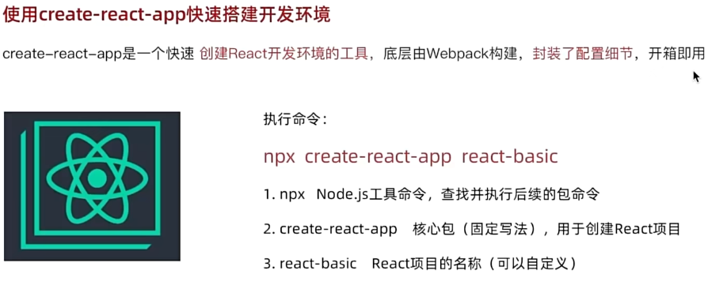

## 使用 create-react-app 快速构建 React 开发环境

快速上手，使用npx命令

```cmd
npx create-react-app my-app
npx node命令
create-react-app包名
my-app自定义名称


npm run dev 启动
```

```html
    <!--react核心包，提供了除dom操作外的核心功能-->
    <script src="https://unpkg.com/react@18/umd/react.development.js"></script>
    //react-dom包，提供了dom操作相关的功能
    <script src="https://unpkg.com/react-dom@18/umd/react-dom.development.js"></script>


```



项目文件中index是文件的入口，由此开始运行。

导入俩核心包

```python
import React from 'react';
import ReactDOM from 'react-dom/client';
#导入项目根组件
import App from './App';
#将app根组件渲染到id为root的dom节点
const root = ReactDOM.createRoot(document.getElementById('root'));
```

app.js是项目的根组件

```python
function App() {
  return (
    <div className="App">
      <header className="App-header">
        
      </header>
    </div>
  );
}

export default App;
```

React 允许你将标签、CSS 和 JavaScript 组合成自定义“组件”，即 **应用程序中可复用的 UI 元素**。上文中表示目录的代码可以改写成一个能够在每个页面中渲染的 `<TableOfContents />` 组件。实际上，使用的依然是 `<article>`、`<h1>` 等相同的 HTML 标签。

就像使用 HTML 标签一样，你可以组合、排序和嵌套组件来绘制整个页面。例如，你正在阅读的文档页面就是由 React 组件构成的：

```js
<PageLayout>
  <NavigationHeader>
    <SearchBar />
    <Link to="/docs">文档</Link>
  </NavigationHeader>
  <Sidebar />
  <PageContent>
    <TableOfContents />
    <DocumentationText />
  </PageContent>
</PageLayout>
```

定义组件return内的为组件。React 组件是常规的 JavaScript 函数，但 **组件的名称必须以大写字母开头**，否则它们将无法运行！

```js
export default function Profile() {
  return (
    
  )
}
```

在 JSX 的花括号 `{}` 中，**只能包含 JavaScript 表达式**（expression），而不能包含语句（statement）

### JSX: 将标签引入 JavaScript 

JSX是Javascript和HTML的缩写，表示JavaScript编写HTML模板结构。

JSX并不是标准的JS语法，浏览器本身不可以识别，需要解析工具（Babel）做解析之后才可以在浏览器中运行。

JSX可以使用{}识别JavaScript中的表达式，比如常见的变量，函数的调用。

多年以来，web 开发者都是将网页内容存放在 HTML 中，样式放在 CSS 中，而逻辑则放在 JavaScript 中 —— 通常是在不同的文件中！页面的内容通过标签语言描述并存放在 HTML 文件中，而逻辑则单独存放在 JavaScript 文件中。但随着 Web 的交互性越来越强，逻辑越来越决定页面中的内容。将一个按钮的渲染逻辑和标签放在一起可以确保它们在每次编辑时都能保持互相同步。

**jsx规则：**

- 只能返回一个元素
- 标签必须闭合像 `` 这样的自闭合标签必须书写成 ``，而像 `<li>oranges` 这样只有开始标签的元素必须带有闭合标签，需要改为 `<li>oranges</li>`
- 使用驼峰命名法给所有属性命名

```jsx
  return (
    <div className="App">
      <header className="App-header">
        
      </header>
    </div>
  );
//return 语句中这部分就是JSX
```

```jsx
//使用引号传递字符串
{"this is a message"}
//使用JavaScript变量
const count = 100
{count}
//函数调用
function getName(){
  return "John"
}
{getName()}
//方法调用
{new Date().getDate()}
//使用对象，一般改变下样式，为了能在 JSX 中传递，你必须用另一对额外的大括号包裹对象
<div className="App-logo" style={{color : "red"}}>
        this is a message
</div>

<MyButton count={count} onClick={handleClick} />
```


##  将 Props 传递给组件

React 组件使用 *props* 来互相通信。每个父组件都可以提供 props 给它的子组件，从而将一些信息传递给它。

Props 是你传递给 JSX 标签的信息。例如，`className`、`src`、`alt`、`width` 和 `height` 便是一些可以传递给 `` 的 props：

在这段代码中， `Profile` 组件没有向它的子组件 `Avatar` 传递任何 props ：

```js
export default function Profile() {
  return (
    <Avatar />
  );
}
//你可以分两步给 Avatar 一些 props。
//步骤 1: 将 props 传递给子组件
//首先，将一些 props 传递给 Avatar。例如，让我们传递两个 props：person（一个对象）和 size（一个数字）：
export default function Profile() {
  return (
    <Avatar
      person={{ name: 'Lin Lanying', imageId: '1bX5QH6' }}
      size={100}
    />
  );
}
//在子组件中读取 props
//你可以通过在 function Avatar 之后直接列出它们的名字 person, size 来读取这些 props。
function Avatar({ person, size }) {
  // 在这里 person 和 size 是可访问的
}
```

在 React 中，组件函数接收的第一个参数是 **props 对象**，里面包含了父组件传递的所有属性。
使用 `{ person, size }` 是 **ES6 的对象解构语法**，它的作用是：

- **直接从 props 对象中提取出 `person` 和 `size` 属性**，作为独立的变量。
- 这样在组件内部就可以直接使用 `person` 和 `size`，而不需要每次都写 `props.person` 和 `props.size`。

如果不加花括号，参数名通常写成 `props`，使用时就要用 `props.person`

在声明 props 时， **不要忘记 `(` 和 `)` 之间的一对花括号 `{` 和 `}`**

```js
function Avatar({ person, size }) {
  // ...
}
//这种语法被称为 “解构”，等价于于从函数参数中读取属性：
function Avatar(props) {
  let person = props.person;
  let size = props.size;
  // ...
}
```

可以指定props默认值

```js
function Avatar({ person, size = 100 }) {
  // ...
}
```

<Avatar {...props} />  这会将 `Profile` 的所有 props 转发到 `Avatar`，而不列出每个名字。类似于*，**。

**父传子-有时你会希望以相同的方式嵌套自己的组件：**

```js
<Card>
  <Avatar />
</Card>
//当你将内容嵌套在 JSX 标签中时，父组件将在名为 children 的 prop 中接收到该内容。例如，下面的 Card 组件将接收一个被设为 <Avatar /> 的 children prop 并将其包裹在 div 中渲染：
function Card({ children }) {
  return (
    <div className="card">
      {children}
    </div>
  );
}

export default function Profile() {
  return (
    <Card>
      <Avatar
        size={100}
        person={{ 
          name: 'Katsuko Saruhashi',
          imageId: 'YfeOqp2'
        }}
      />
    </Card>
  );
}
//这里children不可以跟换名字，不然需要自己显式调用
```


## 使用 Context 深层传递参数

**Context** 允许父组件向其下层无论多深的任何组件提供信息，而无需通过 props 显式传递。

首先，你需要创建这个 context，并 **将其从一个文件中导出**，这样你的组件才可以使用它：

```JS
import { createContext } from 'react';

export const LevelContext = createContext(1);

```

`createContext` 只需**默认值**这么一个参数。在这里, `1` 表示最大的标题级别，但是你可以传递任何类型的值（甚至可以传入一个对象）。你将在下一个步骤中见识到默认值的意义。


从 React 中引入 `useContext` Hook 以及你刚刚创建的 context:

```JS
import { useContext } from 'react';
import { LevelContext } from './LevelContext.js';
```

从你刚刚引入的 `LevelContext` 中读取值：

```JS
export default function Heading({ children }) {
  const level = useContext(LevelContext);
  // ...
}
```

`useContext` 是一个 Hook。和 `useState` 以及 `useReducer`一样，你只能在 React 组件中（不是循环或者条件里）立即调用 Hook。

`Section` 组件目前渲染传入它的子组件：**把它们用 context provider 包裹起来** 以提供 `LevelContext` 给它们：

```JS
import { LevelContext } from './LevelContext.js';

export default function Section({ level, children }) {
  return (
    <section className="section">
      <LevelContext value={level}>
        {children}
      </LevelContext>
    </section>
  );
}
```

这告诉 React：“如果在 `<Section>` 组件中的任何子组件请求 `LevelContext`，给他们这个 `level`。”组件会使用 UI 树中在它上层最近的那个 `<LevelContext>` 传递过来的值。

Context 的工作方式可能会让你想起 [CSS 属性继承](https://developer.mozilla.org/zh-CN/docs/Web/CSS/inheritance)。在 CSS 中，你可以为一个 `<div>` 手动指定 `color: blue`，并且其中的任何 DOM 节点，无论多深，都会继承那个颜色，除非中间的其他 DOM 节点用 `color: green` 来覆盖它。

## 渲染列表

你可能经常需要通过 [JavaScript 的数组方法](https://developer.mozilla.org/docs/Web/JavaScript/Reference/Global_Objects/Array#) 来操作数组中的数据，从而将一个数据集渲染成多个相似的组件。在这篇文章中，你将学会如何在 React 中使用 [`filter()`](https://developer.mozilla.org/docs/Web/JavaScript/Reference/Global_Objects/Array/filter) 筛选需要渲染的组件和使用 [`map()`](https://developer.mozilla.org/docs/Web/JavaScript/Reference/Global_Objects/Array/map) 把数组转换成组件数组。

map数组原型上的高阶函数，用于对数组中的每个元素执行指定操作，并返回由操作结果组成的新数组。

在 React 中，**`<ul>` 标签内可以直接放数组**，这是 JSX 的一个特性。

React 的渲染机制允许子节点是：

- 单个元素
- 字符串或数字
- 数组（元素会依次展开）

1. 首先，把数据 **存储** 到数组中：

```js
const people = [
  '凯瑟琳·约翰逊: 数学家',
  '马里奥·莫利纳: 化学家',
  '穆罕默德·阿卜杜勒·萨拉姆: 物理学家',
  '珀西·莱温·朱利亚: 化学家',
  '苏布拉马尼扬·钱德拉塞卡: 天体物理学家',
];
```

2. **遍历** `people` 这个数组中的每一项，并获得一个新的 JSX 节点数组 `listItems`

```js
const listItems = people.map(person => <li>{person}</li>);
//people.map(...) 遍历数组中的每一项。
//person => <li>{person}</li>这是一个 箭头函数，是 JavaScript ES6 中的一种简洁函数写法。function(person) {
//  return <li>{person}</li>;
//}
```

3. 把 `listItems` 用 `<ul>` 包裹起来，然后 **返回** 它：

```js
export default function List() {
  const listItems = people.map(person =>
    <li>{person}</li>
  );
  console.log(listItems)
  return <ul>{listItems}</ul>;
}
```

那么你可以使用 JavaScript 的 `filter()` 方法来返回满足条件的项。这个方法会让数组的子项经过 “过滤器”（一个返回值为 `true` 或 `false` 的函数）的筛选，最终返回一个只包含满足条件的项的新数组。

1. 首先，**创建** 一个用来存化学家们的新数组 `chemists`，这里用到 `filter()` 方法过滤 `people` 数组来得到所有的化学家，过滤的条件应该是 `person.profession === '化学家'`：

```js
const chemists = people.filter(person =>
  person.profession === '化学家'
);
```

2. 接下来 **用 map 方法遍历** `chemists` 数组:

```js
const listItems = chemists.map(person =>
  <li>
     
     <p>
       <b>{person.name}:</b>
       {' ' + person.profession + ' '}
       因{person.accomplishment}而闻名世界
     </p>
  </li>
);
```

3. 最后，**返回** `listItems`：

```js
return <ul>{listItems}</ul>;
```

此外，你必须给数组中的每一项都指定一个 `key`——它可以是字符串或数字的形式，只要能唯一标识出各个数组项就行：用作 key 的值应该在数据中提前就准备好，而不是在运行时才随手生成：即使元素的位置在渲染的过程中发生了改变，它提供的 `key` 值也能让 React 在整个生命周期中一直认得它。

```js
export const people = [
  {
    id: 0, // 在 JSX 中作为 key 使用
    name: '凯瑟琳·约翰逊',
    profession: '数学家',
    accomplishment: '太空飞行相关数值的核算',
    imageId: 'MK3eW3A',
  },
  {
    id: 1, // 在 JSX 中作为 key 使用
    name: '马里奥·莫利纳',
    profession: '化学家',
    accomplishment: '北极臭氧空洞的发现',
    imageId: 'mynHUSa',
  } 
];

<li key={person.id}>...</li>
```

`{...recipe}` 是 JSX 提供的语法糖，让你能用简洁的方式将对象的每个属性作为独立 prop 传递给组件，避免重复劳动。


## 条件渲染

在 React 中，你可以通过使用 JavaScript 的 if 语句、&& 和 ? : 运算符来选择性地渲染 JSX。
```js
function Item({ name, isPacked }) {
  if (isPacked) {
    return <li className="item">{name} ✅</li>;
  }
  return <li className="item">{name}</li>;
}
```

如果 `isPacked` 属性是 `true`，这段代码会**返回一个不一样的 JSX**。通过这样的改动，一些物品的名字后面会出现一个勾选符号：

你还可以这样实现：

```js
return (
  <li className="item">
    {isPacked ? name + ' ✅' : name}
  </li>
);
```


在一些情况下，你不想有任何东西进行渲染。比如，你不想显示已经打包好的物品。但一个组件必须返回一些东西。这种情况下，你可以直接返回 `null`。

```js
if (isPacked) {
  return null;
}
return <li className="item">{name}</li>;
```

你会遇到的另一个常见的快捷表达式是 [JavaScript 逻辑与（`&&`）运算符](https://developer.mozilla.org/zh-CN/docs/Web/JavaScript/Reference/Operators/Logical_AND#:~:text=The logical AND ( %26%26 ) operator,it returns a Boolean value.)。在 React 组件里，通常用在当条件成立时，你想渲染一些 JSX，**或者不做任何渲染**。使用 `&&`，你也可以实现仅当 `isPacked` 为 `true` 时，渲染勾选符号。

```js
return (
  <li className="item">
    {name} {isPacked && '✅'}
  </li>
);
```

当这些快捷方式妨碍写普通代码时，可以考虑使用 `if` 语句和变量。因为你可以使用 [`let`](https://developer.mozilla.org/zh-CN/docs/Web/JavaScript/Reference/Statements/let) 进行重复赋值，所以一开始你可以将你想展示的（这里指的是物品的名字）作为默认值赋予给该变量。

```js
let itemContent = name;

if (isPacked) {
  itemContent = name + " ✅";
}

<li className="item">
  {itemContent}
</li>
```


## 响应事件

使用 React 可以在 JSX 中添加 **事件处理函数**。其中事件处理函数为自定义函数，它将在响应交互（如点击、悬停、表单输入框获得焦点等）时触发。

如需添加一个事件处理函数，你需要先定义一个函数，然后 [将其作为 prop 传入](https://zh-hans.react.dev/learn/passing-props-to-a-component) 合适的 JSX 标签。例如，这里有一个没绑定任何事件的按钮：

```js
export default function Button() {
  return (
    <button>
      未绑定任何事件
    </button>
  );
}

```

按照如下三个步骤，即可让它在用户点击时显示消息：

1. 在 `Button` 组件 **内部** 声明一个名为 `handleClick` 的函数。
2. 实现函数内部的逻辑（使用 `alert` 来显示消息）。
3. 添加 `onClick={handleClick}` 到 `<button>` JSX 中。

```js
export default function Button() {
  function handleClick() {
    alert('你点击了我！');
  }

  return (
    <button onClick={handleClick}>
      点我
    </button>
  );
}
```

**传递给事件处理函数的函数应直接传递，而非调用。**

其中 `handleClick` 是一个 **事件处理函数** 。事件处理函数有如下特点:

- 通常在你的组件 **内部** 定义。
- 名称以 `handle` 开头，后跟事件名称。

 **将事件处理函数作为 props 传递**

通常，我们会在父组件中定义子组件的事件处理函数。比如：置于不同位置的 `Button` 组件，可能最终执行的功能也不同 —— 也许是播放电影，也许是上传图片。

为此，将组件从父组件接收的 prop 作为事件处理函数传递，如下所示：

```js
function Button({ onClick, children }) {
  return (
    <button onClick={onClick}>
      {children}
    </button>
  );
}

function PlayButton({ movieName }) {
  function handlePlayClick() {
    alert(`正在播放 ${movieName}！`);
  }

  return (
    <Button onClick={handlePlayClick}>
      播放 "{movieName}"
    </Button>
  );
}
//可以用这种方式为onClick传递参数
function UploadButton() {
  return (
    <Button onClick={() => alert('正在上传！')}>
      上传图片
    </Button>
  );
}

export default function Toolbar() {
  return (
    <div>
      <PlayButton movieName="魔女宅急便" />
      <UploadButton />
    </div>
  );
}

```

**事件处理函数还将捕获任何来自子组件的事件。通常，我们会说事件会沿着树向上“冒泡”或“传播”：它从事件发生的地方开始，然后沿着树向上传播。**

事件处理函数接收一个 **事件对象** 作为唯一的参数。按照惯例，它通常被称为 `e` ，代表 “event”（事件）。你可以使用此对象来读取有关事件的信息。

这个事件对象还允许你阻止传播。如果你想阻止一个事件到达父组件，你需要像下面 `Button` 组件那样调用 `e.stopPropagation()` ：

```js
function Button({ onClick, children }) {
  return (
    <button onClick={e => {
      e.stopPropagation();
      onClick();
    }}>
      {children}
    </button>
  );
}

export default function Toolbar() {
  return (
    <div className="Toolbar" onClick={() => {
      alert('你点击了 toolbar ！');
    }}>
      <Button onClick={() => alert('正在播放！')}>
        播放电影
      </Button>
      <Button onClick={() => alert('正在上传！')}>
        上传图片
      </Button>
    </div>
  );
}
```


某些浏览器事件具有与事件相关联的默认行为。例如，点击 `<form>` 表单内部的按钮会触发表单提交事件，默认情况下将重新加载整个页面：

你可以调用事件对象中的 `e.preventDefault()` 来阻止这种情况发生：

```js
export default function Signup() {
  return (
    <form onSubmit={e => {
      e.preventDefault();
      alert('提交表单！');
    }}>
      <input />
      <button>发送</button>
    </form>
  );
}

```

**什么是纯函数**

**React 假设你编写的所有组件都是纯函数**。也就是说，对于相同的输入，你所编写的 React 组件必须总是返回相同的 JSX。

**例如：**

纯函数不会改变函数作用域外的变量、或在函数调用前创建的对象——这会使函数变得不纯粹！

```js
export default function App() {
  return (
    <section>
      <h1>Spiced Chai Recipe</h1>
      <h2>For two</h2>
      <Recipe drinkers={2} />
      <h2>For a gathering</h2>
      <Recipe drinkers={4} />
    </section>
  );
}
```

## State：组件的记忆

组件通常需要根据交互更改屏幕上显示的内容。输入表单应该更新输入字段，单击轮播图上的“下一个”应该更改显示的图片，单击“购买”应该将商品放入购物车。组件需要“记住”某些东西：当前输入值、当前图片、购物车。在 React 中，这种组件特有的记忆被称为 **state**。

state变量一旦发生变化，组件视图也会变化。

在 React 中，`useState` 以及任何其他以“`use`”开头的函数都被称为 **Hook**。

**Hook 是特殊的函数，只在 React [渲染](https://zh-hans.react.dev/learn/render-and-commit#step-1-trigger-a-render)时有效**（我们将在下一节详细介绍）。它们能让你 “hook” 到不同的 React 特性中去。

State 只是这些特性中的一个，你之后还会遇到其他 Hook。

**添加一个 state 变量 **

React 将 state 存储在组件之外，就像在架子上一样。

要添加 state 变量，先从文件顶部的 React 中导入 `useState`：

```js
import { useState } from 'react';


//index 是一个 state 变量，setIndex 是对应的 setter 函数。
//这里的 [ 和 ] 语法称为数组解构，它允许你从数组中读取值。 useState 返回的数组总是正好有两项。
const [index, setIndex] = useState(0);
```


useState` 的唯一参数是 state 变量的**初始值**。在这个例子中，`index` 的初始值被`useState(0)`设置为 `0

每次你的组件渲染时，`useState` 都会给你一个包含两个值的数组：

1. **state 变量** (`index`) 会保存上次渲染的值。
2. **state setter 函数** (`setIndex`) 可以更新 state 变量并触发 React 重新渲染组件。

State 是屏幕上组件实例内部的状态。换句话说，**如果你渲染同一个组件两次，每个副本都会有完全隔离的 state**！改变其中一个不会影响另一个。

**调用 Hook 时，包括 `useState`，仅在组件或另一个 Hook 的顶层被调用才有效。**


## 渲染和提交

组件显示到屏幕之前，其必须被 React 渲染。

步骤一：触发渲染有两种原因会导致组件的渲染:

1. 组件的 **初次渲染。**
2. 组件（或者其祖先之一）的 **状态发生了改变。**

步骤二：在你触发渲染后，React 会调用你的组件来确定要在屏幕上显示的内容。**“渲染中” 即 React 在调用你的组件。**

- **在进行初次渲染时,** React 会调用根组件。
- **对于后续的渲染,** React 会调用内部状态更新触发了渲染的函数组件。

步骤三：React将更改提交到DOM上在渲染（调用）你的组件之后，React 将会修改 DOM。

- **对于初次渲染**，React 会使用 [`appendChild()`](https://developer.mozilla.org/docs/Web/API/Node/appendChild) DOM API 将其创建的所有 DOM 节点放在屏幕上。
- **对于重渲染**，React 将应用最少的必要操作（在渲染时计算！），以使得 DOM 与最新的渲染输出相互匹配。


## React 如何批量更新 state 

```js
<h1>{number}</h1>
      <button onClick={() => {
        setNumber(number + 1);
        setNumber(number + 1);
        setNumber(number + 1);
      }}>+3</button>

//每一次渲染的 state 值都是固定的，因此无论你调用多少次 setNumber(1)，在第一次渲染的事件处理函数内部的 number 值总是 0
//如果你想在下次渲染之前多次更新同一个 state，你可以像 setNumber(n => n + 1) 这样传入一个根据队列中的前一个 state 计算下一个 state 的 函数
<button onClick={() => {
        setNumber(n => n + 1);
        setNumber(n => n + 1);
        setNumber(n => n + 1);
      }}>+3</button>
```


## 更新 state 中的对象

state 中可以保存任意类型的 JavaScript 值，包括对象。但是，你不应该直接修改存放在 React state 中的对象。相反，当你想要更新一个对象时，你需要创建一个新的对象,然后将 state 更新为此对象。

**你可以在 state 中存放任意类型的 JavaScript 值。**

```js
const [position, setPosition] = useState({ x: 0, y: 0 });
```

**你需要创建一个新对象并把它传递给 state 的设置函数**：

```js
onPointerMove={e => {
  setPosition({
    x: e.clientX,
    y: e.clientY
  });
}}
```

你可以使用 `...` [对象展开](https://developer.mozilla.org/zh-CN/docs/Web/JavaScript/Reference/Operators/Spread_syntax#spread_in_object_literals) 语法，这样你就不需要单独复制每个属性。

```js
setPerson({
  ...person, // 复制上一个 person 中的所有字段
  firstName: e.target.value // 但是覆盖 firstName 字段 
});
```


## 更新 state 中的数组

下面是常见数组操作的参考表。当你操作 React state 中的数组时，你需要避免使用左列的方法，而首选右列的方法：

|          | 避免使用 (会改变原始数组)     | 推荐使用 (会返回一个新数组）                                 |
| -------- | ----------------------------- | ------------------------------------------------------------ |
| 添加元素 | `push`，`unshift`             | `concat`，`[...arr]` 展开语法（[例子](https://zh-hans.react.dev/learn/updating-arrays-in-state#adding-to-an-array)） |
| 删除元素 | `pop`，`shift`，`splice`      | `filter`，`slice`（[例子](https://zh-hans.react.dev/learn/updating-arrays-in-state#removing-from-an-array)） |
| 替换元素 | `splice`，`arr[i] = ...` 赋值 | `map`（[例子](https://zh-hans.react.dev/learn/updating-arrays-in-state#replacing-items-in-an-array)） |
| 排序     | `reverse`，`sort`             | 先将数组复制一份（[例子](https://zh-hans.react.dev/learn/updating-arrays-in-state#making-other-changes-to-an-array)） |

```js
      <button onClick={() => {
        setArtists([
          ...artists,
          { id: nextId++, name: name }
        ]);
//数组的添加和对象的修改相似,当然用concat也可以
```

**数组的删除**

```js
<button onClick={() => {
              setArtists(
                artists.filter(a =>
                  a.id !== artist.id
                )
              );
            }}>
```

**如果你想改变数组中的某些或全部元素，你可以用 `map()` 创建一个新数组。**


## 组件样式

```js

//行内样式
<div style={{color:"red"}}>this is a div</div>
const style = {
    color:"red"
}
<div style={style}>this is a div</div>

//class类名控制
.foo{
    color:red
}

<div className = 'foo'>this is a div</div>
```

## ref引用值

当你希望组件“记住”某些信息，但又不想让这些信息 [触发新的渲染](https://zh-hans.react.dev/learn/render-and-commit) 时，你可以使用 **ref** 。

你可以通过从 React 导入 `useRef` Hook 来为你的组件添加一个 ref：

```js
import { useRef } from 'react';
```

在你的组件内，调用 `useRef` Hook 并传入你想要引用的初始值作为唯一参数。例如，这里的 ref 引用的值是“0”：

```js
const ref = useRef(0);
```

`useRef` 返回一个这样的对象:你可以用 `ref.current` 属性访问该 ref 的当前值。这个值是有意被设置为可变的，意味着你既可以读取它也可以写入它。

```js
{ 
  current: 0 // 你向 useRef 传入的值
}
```

与 state 一样，React 会在每次重新渲染之间保留 ref。但是，设置 state 会重新渲染组件，更改 ref 不会！

当一条信息用于渲染时，将它保存在 state 中。当一条信息仅被事件处理器需要，并且更改它不需要重新渲染时，使用 ref 可能会更高效。

ref 最常见的用法是访问 DOM 元素。当你将 ref 传递给 JSX 中的 `ref` 属性时，比如 `<div ref={myRef}>`，React 会将相应的 DOM 元素放入 `myRef.current` 中。当元素从 DOM 中删除时，React 会将 `myRef.current` 更新为 `null`。


## 使用 ref 操作 DOM

在 React 中没有内置的方法来做这些事情，所以你需要一个指向 DOM 节点的 **ref** 来实现。

在你的组件中使用它声明一个 ref：

然后，将 ref 作为 `ref` 属性值传递给想要获取的 DOM 节点的 JSX 标签：

```js
const myRef = useRef(null);

<div ref={myRef}>
```

`useRef` Hook 返回一个对象，该对象有一个名为 `current` 的属性。最初，`myRef.current` 是 `null`。当 React 为这个 `<div>` 创建一个 DOM 节点时，React 会把对该节点的引用放入 `myRef.current`。然后，你可以从 [事件处理器](https://zh-hans.react.dev/learn/responding-to-events) 访问此 DOM 节点，


示例: 使文本输入框获得焦点 

```js
import { useRef } from 'react';

export default function Form() {
  const inputRef = useRef(null);

  function handleClick() {
    inputRef.current.focus();
  }

  return (
    <>
      <input ref={inputRef} />
      <button onClick={handleClick}>
        聚焦输入框
      </button>
    </>
  );
}

```

像 `<input ref={inputRef}>` 这样传递它。这告诉 React **将这个 `<input>` 的 DOM 节点放入 `inputRef.current`。**在 `handleClick` 函数中，从 `inputRef.current` 读取 input DOM 节点并使用 `inputRef.current.focus()` 调用它的 [`focus()`](https://developer.mozilla.org/zh-CN/docs/Web/API/HTMLElement/focus)。

## 使用 Effect 进行同步

有些组件需要与外部系统同步。 Effect 允许你在渲染结束后执行一些代码，以便将组件与 React 外部的某个系统相同步。

**Effect 允许你指定由渲染自身，而不是特定事件引起的副作用**。

1. **声明 Effect**。通常 Effect 会在每次 [提交](https://zh-hans.react.dev/learn/render-and-commit) 后运行。

先从 React 中导入 [`useEffect` Hook](https://zh-hans.react.dev/reference/react/useEffect)：

再在组件顶部调用, 并在其中加入一些代码：

```js
import { useEffect } from 'react';

function MyComponent() {
  useEffect(() => {
    // 每次渲染后都会执行此处的代码
  });
  return <div />;
}


```

每当你的组件渲染时，React 会先更新页面，然后再运行 `useEffect` 中的代码。换句话说，**`useEffect` 会“延迟”一段代码的运行，直到渲染结果反映在页面上**。

2. **第二步：指定 Effect 的依赖项 **

默认情况下，Effect 会在 **每次** 渲染后运行。但往往 **这并不是你想要的**：

通过在调用 `useEffect` 时指定一个 **依赖数组** 作为第二个参数，你可以让 React **跳过不必要地重新运行 Effect**。首先，在上面示例的第 14 行中传入一个空数组 `[]`：

```js
  useEffect(() => {
    // ...
  }, []);
```

```js
  useEffect(() => {
    if (isPlaying) { // isPlaying 在此处使用……
      // ...
    } else {
      // ...
    }
  }, [isPlaying]); // ……所以它必须在此处声明！
```

指定 `[isPlaying]` 作为依赖数组会告诉 React：如果 `isPlaying` 与上次渲染时相同，就跳过重新运行 Effect。

3. **第三步：按需添加清理（cleanup）函数**

考虑一个不同的例子。假如你正在编写一个 `ChatRoom` 组件，该组件在显示时需要连接到聊天服务器。现在为你提供了 `createConnection()` API，该 API 返回一个包含 `connect()` 与 `disconnection()` 方法的对象。如何确保组件在显示时始终保持连接？

```js
useEffect(() => {
  const connection = createConnection();
  connection.connect();
}, []);
```

**由于 Effect 中的代码没有使用任何 props 或 state，所以依赖数组为空数组 `[]`。这告诉 React 仅在组件“挂载”（即首次显示在页面上）时运行此代码**。

为了解决这个问题，可以在 Effect 中返回一个 **清理（cleanup）函数** 。

```js
 useEffect(() => {
    const connection = createConnection();
    connection.connect();
    return () => {
      connection.disconnect();
    };
  }, []);
```

React 会在每次 Effect 重新运行之前调用清理函数，并在组件卸载（被移除）时最后一次调用清理函数。

## 自定义HOOK

React 有一些内置 Hook，例如 `useState`，`useContext` 和 `useEffect`。有时你需要一个用途更特殊的 Hook,虽然 React 中可能没有这些 Hook，但是你可以根据应用需求创建自己的 Hook。

```JS
function useOnlineStatus() {
  const [isOnline, setIsOnline] = useState(true);
  useEffect(() => {
    function handleOnline() {
      setIsOnline(true);
    }
    function handleOffline() {
      setIsOnline(false);
    }
    window.addEventListener('online', handleOnline);
    window.addEventListener('offline', handleOffline);
    return () => {
      window.removeEventListener('online', handleOnline);
      window.removeEventListener('offline', handleOffline);
    };
  }, []);
  return isOnline;
}
```

**Hook 的名称必须永远以 `use` 开头 **

## react-router-dom

1. 引入实现路由所需的组件，以及页面组件

平时使用 router 时，外层第一步就是要将我们的`根组件 app` 父节点设置为 `BrowserRouter`，这样我们的项目才能够正常使用路由功能

```js
import { BrowserRouter, Routes, Route } from 'react-router-dom';
import Foo from './Foo';
import Bar from './Bar';
​
function App(){
    return (
        <BrowserRouter>
            <Routes>
                <Route path='/foo' element={Foo} />
                <Route path='/bar' element={Bar} />
            </Routes>
        </BrowserRouter>
    )
}

```

在跳转路由时，如果路径是`/`开头的则是绝对路由，否则为**相对路由**，即相对于“当前URL”进行改变

```js
export default function App () {
  return (
    <BrowserRouter>
      <Layout>
        <Routes>
          <Route path="/" element={<Home />} />
          <Route path="/datasets" element={<Datasets />} />
          <Route path="/datasets/:datasetId" element={<DatasetDetail />} />
          <Route path="/phenotypes" element={<Phenotypes />} />
          <Route path="/data-hub" element={<DataHub />} />
          <Route path="/tools" element={<ToolsServices />} />
          <Route path="/downloads" element={<Downloads />} />
          <Route path="/submit" element={<Submit />} />
        </Routes>
      </Layout>   //所有页面都有的布局
    </BrowserRouter>
  )
}

{/* 重定向 */}
      <Route path="/" element={<Navigate to="/login" />} />


//导航栏 NavLink用来跳转路由
<nav className="nav">
        {navItems.map(({ path, label }) => (
          <NavLink key={path} to={path} className={({ isActive }) => `link${isActive ? ' is-active' : ''}`}>
            {label}
          </NavLink>
        ))}
</nav>

```

 **使用useNavigate()跳转路由，并进行参数传递**

```js

import { useNavigate } from "react-router-dom";
function useNavigateJumpToPage() {
  const userIsInactive = useFakeInactiveUser();
  const navigate = useNavigate();
  // search
  navigate('/page1?name=jack&age=18');
  // params
  navigate('/page2/jack');
  // state
  navigate('/page3', { state: { data: 'test' } });

```

**在其他组件中接收参数**

```js
import { useLocation,useParams,useSearchParams  } from 'react-router-dom';
 
function App() {
 
// 获取navigate中传递的search数据
let [searchParams, setSearchParams] = useSearchParams()
console.log(searchParams.get('name')) //  "jack"
 
// 获取navigate中传递的params数据
let params = useParams(); // params {"name": "jack"}
 
 
// 获取navigate中传递的state中的信息
  let location = useLocation(); 
//{
//   "pathname": "/page3",
//    "search": "",
//    "hash": "",
//    "state": {
//        "data": "test"
//    },
//    "key": "ximjwhyi"
//}
 
}
```

**useParams()**作用：回当前匹配路由的`params`参数

```js
const {id, title, content} = useParams()
```

**useSearchParams()**用于读取和修改当前位置的 URL 中的查询字符串

```JS
const [search,setSearch] = useSearchParams()

const id = search.get('id')
const title = search.get('title')
```
