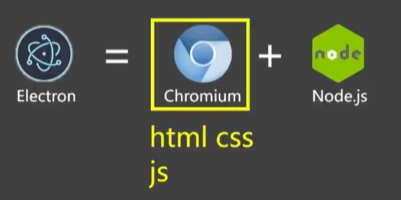
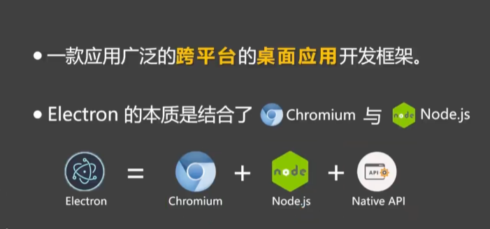
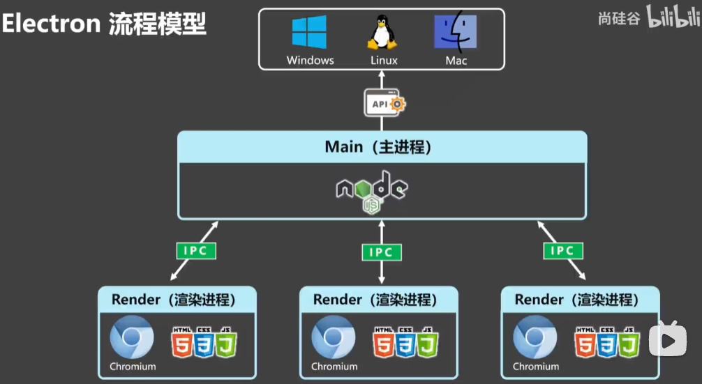

## Electron

使用浏览器前端，来构建跨平台的桌面级应用程序。

Electron的本质是结合了chromium和Node.js



Native API负责系统工具。



### Electron流程模型




#### 进程间通信（IPC）

主进程和渲染进程是**相互隔离的操作系统进程**，地址空间各自独立，不能直接调用对方的函数、也不能读对方的变量。两边的一切通信都依靠 **IPC（Inter-Process Communication，进程间通信）**，由 `ipcMain`（主进程侧）与 `ipcRenderer`（渲染进程侧）两个模块承担。

**三种通信形态**

| 场景 | 渲染进程侧 | 主进程侧 | 特点 |
|---|---|---|---|
| 渲染 → 主（单向通知） | `ipcRenderer.send(channel, ...args)` | `ipcMain.on(channel, (e, ...args) => {})` | 发完即走，不等返回值 |
| 渲染 → 主（请求-响应） | `await ipcRenderer.invoke(channel, ...args)` | `ipcMain.handle(channel, async (e, ...args) => {})` | 返回 Promise，现代写法首选 |
| 主 → 渲染（主动推送） | `ipcRenderer.on(channel, (e, ...args) => {})` | `win.webContents.send(channel, ...args)` | 主进程需先拿到 `webContents` |

另外还有 `ipcRenderer.sendSync()` + `event.returnValue`，它会**阻塞渲染进程**直到主进程回值，官方明确建议避免。

**为什么必须经过 preload**

Electron 20 之后默认开启 `contextIsolation: true` 与 `nodeIntegration: false`，渲染进程里拿不到 `require`，`ipcRenderer` 也不在全局作用域上。因此要在 preload 脚本里用 `contextBridge` 做**白名单式暴露**：

```js
// main.js —— 主进程：注册处理器
const { ipcMain } = require('electron')
ipcMain.handle('read-file', async (event, filePath) => {
  return fs.promises.readFile(filePath, 'utf-8')   // 返回值直接送回渲染进程
})
```

```js
// preload.js —— 桥接层：只暴露允许的方法
const { contextBridge, ipcRenderer } = require('electron')
contextBridge.exposeInMainWorld('api', {
  readFile: (path) => ipcRenderer.invoke('read-file', path)
})
```

```js
// renderer.js —— 渲染进程：像调普通函数一样用
const text = await window.api.readFile('C:/notes/a.md')
```

这样一来，渲染进程的 JS 执行环境被切成两个「世界」：**隔离世界**（preload，独立 V8 Context，能 `require('electron')`）和**主世界**（网页代码，只有标准 Web API，没有 `process` 对象）。`contextBridge` 是两者之间唯一的通道。

#### 工程骨架：三种模式怎么写

**目录结构**

```
electron-ipc-demo/
├── package.json      # main 字段指向主进程入口
├── main.js           # 主进程：Node 环境，注册所有 IPC 处理器
├── preload.js        # 桥接层：隔离世界，白名单式暴露 API
├── index.html        # 页面结构
└── renderer.js       # 页面逻辑：只能调 window.api.xxx()
```

注意 `preload` 必须在 `webPreferences` 里**显式指定**，写错路径或漏写，`window.api` 就整个不存在：

```js
new BrowserWindow({
  webPreferences: {
    preload: path.join(__dirname, 'preload.js'),
    contextIsolation: true,   // 默认值，写出来更清楚
    nodeIntegration: false    // 默认值
  }
})
```

**四个文件的分工**

| 文件 | 运行环境 | 能访问什么 | 职责 |
|---|---|---|---|
| `main.js` | Node 完整环境 | 全部 Node API + `ipcMain` | 干重活：文件、系统、原生模块 |
| `preload.js` | 隔离世界（独立 V8 Context） | `require('electron')`、`ipcRenderer` | 只做转发，不写业务 |
| `index.html` | 主世界（网页环境） | 只有 DOM + `window.api` | 界面结构 |
| `renderer.js` | 主世界（网页环境） | 只有 DOM + `window.api` | 界面逻辑 |

**模式一：invoke ↔ handle（请求-响应）**

```js
// main.js —— 返回什么，渲染进程就 await 到什么
ipcMain.handle('file:pick-and-read', async () => {
  const { canceled, filePaths } = await dialog.showOpenDialog(mainWindow, {
    properties: ['openFile']
  })
  if (canceled) return { ok: false, canceled: true }   // 业务错误用普通对象自己传
  const raw = await fs.promises.readFile(filePaths[0], 'utf-8')
  return { ok: true, path: filePaths[0], preview: raw.slice(0, 1500) }
})
```

```js
// preload.js
pickAndReadFile: () => ipcRenderer.invoke('file:pick-and-read')
```

```js
// renderer.js
const res = await window.api.pickAndReadFile()
```

**模式二：send ↔ on（单向通知，回执另发）**

```js
// main.js
ipcMain.on('log:write', (event, msg) => {
  console.log('[renderer]', msg)
  event.reply('log:ack', { echo: msg })   // 单独再发一条，只回到发起方
})
```

```js
// preload.js
sendLog: (msg) => ipcRenderer.send('log:write', msg),
onLogAck: (cb) => ipcRenderer.on('log:ack', (_e, payload) => cb(payload))
```

```js
// renderer.js
window.api.sendLog('hello')             // 发完即走，本次调用结束
window.api.onLogAck(({ echo }) => {})   // 回执是后来才到的另一条消息
```

**模式三：webContents.send ↔ on（主进程主动推送）**

```js
// main.js —— 收件人由主进程指定，所以必须持有 webContents
setInterval(() => {
  mainWindow?.webContents.send('tick:push', { count: ++tickCount })
}, 1000)
```

```js
// preload.js
onTick: (cb) => ipcRenderer.on('tick:push', (_e, payload) => cb(payload))
```

```js
// renderer.js
window.api.onTick(({ count }) => {
  document.getElementById('tick-count').textContent = count
})
```

**三种模式的骨架对照**

| | 模式一 | 模式二 | 模式三 |
|---|---|---|---|
| 发起方 | 渲染进程 | 渲染进程 | **主进程** |
| 主进程 API | `handle` | `on` | `webContents.send` |
| 渲染进程 API | `invoke` | `send` | `on` |
| 有返回值 | 有（Promise） | 无，要回执得加 `event.reply` | —— |
| 典型场景 | 读文件、查数据库 | 打日志、上报埋点 | 下载进度、实时状态 |

**订阅时务必包一层，别把 event 透出去**

```js
// 反例：event 对象会泄漏 Electron 内部接口
contextBridge.exposeInMainWorld('api', {
  onTick: (cb) => ipcRenderer.on('tick:push', cb)
})

// 正解：剥掉 event，顺便返回取消订阅的函数
const subscribe = (channel, cb) => {
  const listener = (_event, payload) => cb(payload)
  ipcRenderer.on(channel, listener)
  return () => ipcRenderer.off(channel, listener)   // 组件卸载时调它
}
```

**通道命名建议**：统一 `模块:动作` 格式，如 `file:pick-and-read`、`log:write`、`tick:push`，避免不同模块撞名。

> 本机有一份可直接运行的实现：`tmp/electron-ipc-demo`（`npm start` 即跑），三种模式各有独立界面区域，日志面板会按方向给每条 IPC 消息标色。

#### 底层实现：消息队列，不是内存共享

`ipcMain` / `ipcRenderer` 只是 JS 层封装，真正负责跨进程传输的是 **Chromium 的 Mojo**。完整链路是：

```
ipcRenderer (JS) → C++ 序列化 → Mojo IPC Channel → C++ 反序列化 → ipcMain (JS)
```

结论：**是消息传递（消息队列语义），不是内存共享。** 三条佐证：

1. **参数必须序列化** —— 走 Structured Clone 算法，函数、Promise、原型链都过不去，这本身就排除了「共享同一块内存」的可能
2. **传的是值拷贝而非引用** —— 对面拿到的是一份副本，改动不影响原进程
3. **天然异步且带队列** —— 渲染进程事件循环卡住时消息会积压，消息洪水会导致内存上涨

不过**传输介质是平台相关**的，Mojo 会按情况选择：

| 平台 | Mojo 传输层实现 |
|---|---|
| Windows | 命名管道（named pipe） |
| macOS | Mach ports |
| Linux | channel / 共享内存（视情况） |

大块数据（如 `ArrayBuffer`）Mojo 会**切换到共享内存 + 传递句柄**的方式，避免整块拷贝。但这属于**传输层的性能优化**，上层语义依然是「发消息、传值」，不是共享内存通信模型。

> 类比：像两个人在不同房间打电话。声音被编码成信号送过去、再解码出来——不是把脑子共享了。就算改用快递送一个大箱子（共享内存优化），那也还是「寄过去」，而不是「共用同一个箱子」。


