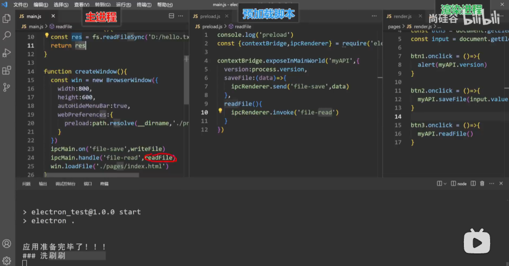

## Electron

使用浏览器前端，来构建跨平台的桌面级应用程序。

Electron的本质是结合了chromium和Node.js


Native API负责系统工具。


### Electron流程模型


#### 进程间通信（IPC）

主进程和渲染进程是**相互隔离的操作系统进程**，地址空间各自独立，不能直接调用对方的函数、也不能读对方的变量。两边的一切通信都依靠 **IPC（Inter-Process Communication，进程间通信）**，由 `ipcMain`（主进程侧）与 `ipcRenderer`（渲染进程侧）两个模块承担。

**三种通信形态**

| 场景 | 渲染进程侧 | 主进程侧 | 特点 |
|---|---|---|---|
| 渲染 → 主（单向通知） | `ipcRenderer.send(channel, ...args)` | `ipcMain.on(channel, (e, ...args) => {})` | 发完即走，不等返回值 |
| 渲染 → 主（请求-响应） | `await ipcRenderer.invoke(channel, ...args)` | `ipcMain.handle(channel, async (e, ...args) => {})` | 返回 Promise，现代写法首选 |
| 主 → 渲染（主动推送） | `ipcRenderer.on(channel, (e, ...args) => {})` | `win.webContents.send(channel, ...args)` | 主进程需先拿到 `webContents` |

**两条先记住的规矩**

- **channel 名两边必须完全一致**——它就是个普通字符串，Electron 不会帮你校验拼写。建议统一用 `域:动作` 命名（`dialog:openFile`、`window:setTitle`），别让 `getFile` / `get-file` / `getfile` 三种写法在同一个项目里共存。
- **`on` 和 `handle` 是两套独立的注册表**：`ipcMain` 继承自 `EventEmitter`（`on` 走它），而 `handle` 的处理器存在内部一个单独的 `Map` 里。所以同一个 channel 名可以既 `on` 又 `handle`、互不干扰；但**同一个 channel 只能 `handle` 一次**，注册第二次直接抛 `Attempted to register a second handler for 'xxx'`。

另外还有 `ipcRenderer.sendSync()` + `event.returnValue`，它会**阻塞渲染进程**直到主进程回值，官方明确建议避免。

**为什么必须经过 preload**

Electron 20 之后默认开启 `contextIsolation: true` 与 `nodeIntegration: false`，渲染进程里拿不到 `require`，`ipcRenderer` 也不在全局作用域上。因此要在 preload 脚本里用 `contextBridge` 做**白名单式暴露**：

```js
// main.js —— 主进程：注册处理器
const { ipcMain } = require('electron')
const fs = require('node:fs')
ipcMain.handle('read-file', async (event, filePath) => {
  return fs.promises.readFile(filePath, 'utf-8')   // 返回值直接送回渲染进程
})
```

```js
// preload.js —— 桥接层：只暴露允许的方法
const { contextBridge, ipcRenderer } = require('electron')
contextBridge.exposeInMainWorld('api', {
  readFile: (path) => ipcRenderer.invoke('read-file', path)
})
```

```js
// renderer.js —— 渲染进程：像调普通函数一样用
const text = await window.api.readFile('C:/notes/a.md')
```

这样一来，渲染进程的 JS 执行环境被切成两个「世界」：**隔离世界**（preload，独立 V8 Context，能 `require('electron')`）和**主世界**（网页代码，只有标准 Web API，没有 `process` 对象）。`contextBridge` 是两者之间唯一的通道。

**桥的入口：`contextBridge.exposeInMainWorld` 怎么用**

签名有三个，日常只用得上第一个：

| API | 参数 | 作用 |
|---|---|---|
| `exposeInMainWorld(apiKey, api)` | `apiKey: string`、`api: any` | 挂成主世界的 `window[apiKey]` |
| `exposeInIsolatedWorld(worldId, apiKey, api)` | 多一个 `worldId: number` | 注入到指定编号的隔离世界；`0` 是主世界、`999` 是 contextIsolation 用的那个世界，自定义世界建议从 `1000` 起 |
| `executeInMainWorld(executionScript)` | 实验性 | 在主世界执行一次函数；函数会被序列化，**绑定参数和执行上下文都会丢** |

三个必须记住的行为：

1. **api 是类型白名单制的**。顶层只能是 `Function` / `string` / `number` / `boolean` / `Array`，或者一个「key 全是字符串、value 仍然合格」的嵌套对象（可以无限套娃）。想塞 `Symbol`、想整体传一个 `class` 实例，都不行。
2. **函数被「代理」，其他值被「复制 + 冻结」**。函数是活的代理，每次调用真的跨世界执行；而 `data` 这类普通值只是克隆一份过去并被 `Object.freeze`。所以在主世界里写 `window.api.data.myFlags.push('c')`，**隔离世界那边看不到**——它是快照，不是共享内存。
3. **绝对不要整体暴露 `ipcRenderer`**。`exposeInMainWorld('electron', ipcRenderer)` 的结果是渲染进程收到一个**空对象**；就算能成，也等于把「往任意 channel 发任意消息」的权力交出去，是个安全口子。永远只暴露包装好的具体方法。





**跨桥传递的类型支持**（参数与返回值通用）

| 类型 | 能否传 | 限制 |
|---|---|---|
| `string` / `number` / `boolean` | ✅ | — |
| `Object` | ✅ | key 与 value 都必须落在本表内；**原型修改被丢弃**，自定义类只复制值、不复制原型 |
| `Array` | ✅ | 同 `Object` |
| `Function` | ✅ | 原型修改被丢弃，`class` / 构造函数传不过去 |
| `Promise` | ✅ | — |
| `Error` | ✅ | 抛出时会被复制，message / stack 可能略微变样，自定义属性会丢 |
| `Element` / `Blob` / `VideoFrame` | ✅ | 原型修改被丢弃 |
| `Symbol` | ❌ | 无法跨上下文复制，直接丢弃 |

一句话：**能结构化克隆的类型就能过桥**，不在表里的基本没戏。

**① `ipcRenderer.send` + `ipcMain.on`：单向通知**

渲染进程喊一嗓子，主进程听完干活，**没有返回值**。

| 位置 | API | 要点 |
|---|---|---|
| 渲染进程 | `ipcRenderer.send(channel, ...args)` | 参数走结构化克隆，返回 `void`（拿不到结果） |
| 主进程 | `ipcMain.on(channel, (event, ...args) => {})` | 就是个 EventEmitter，同一 channel 可以挂多个监听，会依次全部执行 |

主进程想在收到后回一句、但又不阻塞渲染进程，可以用 `event.reply(channel, ...)`——它会自动处理来自 iframe 的消息，比裸用 `event.sender.send()` 稳：

```js
// main.js
ipcMain.on('window:set-title', (event, title) => {
  // event.sender 是这条消息来源的 webContents，拿它反查窗口最省事
  BrowserWindow.fromWebContents(event.sender).setTitle(title)
})
```

```js
// preload.js
contextBridge.exposeInMainWorld('api', {
  setTitle: (title) => ipcRenderer.send('window:set-title', title)
})
```

```js
// renderer.js —— 发完就走，没有 await
window.api.setTitle('我的窗口')
```

坑：**主进程里抛错，调用方一无所知**（单向就是单向）。另外参数不能带 `Function` / `Promise` / `Symbol` / `WeakMap`、也不能带 `ImageBitmap` / `File` / `DOMMatrix` 这类 DOM 对象——主进程没有 DOM 环境，解不了码，直接抛异常。

**② `ipcRenderer.invoke` + `ipcMain.handle`：请求-响应**

Electron 7 之后的正统写法，用起来就是「跨进程的 async 函数调用」。

| 位置 | API | 要点 |
|---|---|---|
| 渲染进程 | `await ipcRenderer.invoke(channel, ...args)` | 返回 `Promise<any>` |
| 主进程 | `ipcMain.handle(channel, async (event, ...args) => {})` | listener 返回普通值或 Promise 都行，最终值即 reply |

```js
// main.js
ipcMain.handle('dialog:openFile', async () => {
  const { canceled, filePaths } = await dialog.showOpenDialog({})
  return canceled ? null : filePaths[0]
})
```

```js
// preload.js
contextBridge.exposeInMainWorld('api', {
  openFile: () => ipcRenderer.invoke('dialog:openFile')
})
```

```js
// renderer.js
const filePath = await window.api.openFile()
```

**四个必须知道的行为**

1. **一个 channel 只能 `handle` 一次**。重复注册抛 `Attempted to register a second handler for 'xxx'`；清理用 `ipcMain.removeHandler(channel)`，只想处理一次用 `ipcMain.handleOnce`。常见翻车点：热重载、模块被多次 `require`，处理器注册了两遍。
2. **主进程抛错 → 渲染进程的 Promise reject**，但**不是同一个 Error 对象**。错误会被序列化，只有 `message` 传得回来，渲染侧拿到的是形如 `Error invoking remote method 'file:read': Error: ENOENT...` 的新错误，stack 和自定义属性全丢。所以想让渲染层区分错误类型，**别靠 error 对象，靠返回值里的 `{ ok: false, code }` 之类的约定**。
3. **返回值同样走结构化克隆**，不能返回 `Function`、`class` 实例（原型会丢）等。
4. **`async` 不等于真并行**。主进程只有一个线程，handler 里塞一段长耗时的同步计算，照样把整个应用（含窗口响应）卡死——要真并行得开 worker 或子进程。

安全上补一句：handler 里应该校验 `event.senderFrame` / `event.sender`，别让被注入的 iframe 也能调你的特权接口。

**③ `webContents.send` + `ipcRenderer.on`：主进程主动推送**

前两种都是「渲染进程先开口」，这种是**主进程先说话**（菜单点击、下载进度、定时器……）。

| 位置 | API | 要点 |
|---|---|---|
| 主进程 | `win.webContents.send(channel, ...args)` | 必须先拿到目标窗口的 `webContents`（自己存的 `win` 变量，或某次 IPC 事件里的 `event.sender`） |
| 渲染进程 | `ipcRenderer.on(channel, (event, ...args) => {})` | 常驻监听，不会自己消失 |

```js
// main.js —— 每秒推一个时间戳给渲染进程
setInterval(() => win.webContents.send('timer:tick', Date.now()), 1000)
```

```js
// preload.js —— 关键：不要把 callback 直接交给 ipcRenderer.on
contextBridge.exposeInMainWorld('api', {
  onTick: (callback) => ipcRenderer.on('timer:tick', (_event, ts) => callback(ts))
})
```

```js
// renderer.js
window.api.onTick((ts) => console.log('tick', ts))
```

**这里的坑最多，两个都极容易踩：**

- **别把裸 callback 直接交给 `ipcRenderer.on`**。`ipcRenderer.on(channel, callback)` 会把 `event` 对象作为第一个参数一并送进渲染进程，而 `event.sender` 是个危险的 Electron 对象——官方安全指南明确要求包一层，只把业务参数转出去（也就是上面 `(_event, ts) => callback(ts)` 那一句的全部意义）。
- **`on` 注册的监听是常驻的，不会自己消失**。组件反复挂载（React 热更新、路由来回切）会让监听一层层叠加，最后 `MaxListenersExceededWarning` + 回调被触发多次。收尾靠 `ipcRenderer.off` / `removeListener`（或用 `once`）；更省心的做法是在 preload 里把**退订函数**一并返回：

```js
// preload.js —— 订阅即返回退订函数，渲染层完全不用碰 ipcRenderer
onTick: (callback) => {
  const listener = (_event, ts) => callback(ts)
  ipcRenderer.on('timer:tick', listener)
  return () => ipcRenderer.off('timer:tick', listener)
}
```

```js
// renderer.js —— 订阅与退订对称，React 里正好塞进 useEffect 的 cleanup
const unsubscribe = window.api.onTick((ts) => console.log(ts))
// 组件卸载时：unsubscribe()
```

另外，需要传 `MessagePort`（比如在两边之间另开一条独立双向通道）时，用 `ipcRenderer.postMessage(channel, message, [port])` 发送，主进程从事件的 `event.ports` 里取。

**一句话选型**：只通知 → `send` / `on`；要结果 → `invoke` / `handle`；主进程主动说话 → `webContents.send` / `ipcRenderer.on`；`sendSync` 除非万不得已别碰。


#### 工程骨架：三种模式怎么写

**目录结构**

```
electron-ipc-demo/
├── package.json      # main 字段指向主进程入口
├── main.js           # 主进程：Node 环境，注册所有 IPC 处理器
├── preload.js        # 桥接层：隔离世界，白名单式暴露 API
├── index.html        # 页面结构
└── renderer.js       # 页面逻辑：只能调 window.api.xxx()
```

注意 `preload` 必须在 `webPreferences` 里**显式指定**，写错路径或漏写，`window.api` 就整个不存在：

```js
new BrowserWindow({
  webPreferences: {
    preload: path.join(__dirname, 'preload.js'),
    contextIsolation: true,   // 默认值，写出来更清楚
    nodeIntegration: false    // 默认值
  }
})
```

**三份文件里各写什么**

把三种模式凑成一个能跑的最小例子，对照着看最清楚：

```js
// main.js —— 主进程：Node 环境，所有 IPC 的另一端都在这里注册
const { app, BrowserWindow, ipcMain, dialog } = require('electron')
const path = require('node:path')
const fs = require('node:fs')

let win

function createWindow () {
  win = new BrowserWindow({
    webPreferences: {
      preload: path.join(__dirname, 'preload.js'),
      contextIsolation: true,
      nodeIntegration: false
    }
  })
  win.loadFile('index.html')
}

// ① 单向通知：渲染 → 主，不等结果
ipcMain.on('window:set-title', (event, title) => {
  BrowserWindow.fromWebContents(event.sender).setTitle(title)
})

// ② 请求-响应：渲染 → 主，要返回值（抛错会自动变成渲染侧的 reject）
ipcMain.handle('dialog:openFile', async () => {
  const { canceled, filePaths } = await dialog.showOpenDialog(win)
  return canceled ? null : filePaths[0]
})

ipcMain.handle('file:read', async (event, filePath) => {
  return fs.promises.readFile(filePath, 'utf-8')
})

app.whenReady().then(() => {
  createWindow()

  // ③ 主 → 渲染主动推送：必须先拿到 webContents
  setInterval(() => win.webContents.send('timer:tick', Date.now()), 1000)
})
```

```js
// preload.js —— 桥接层：白名单式暴露，每个函数都只是 ipcRenderer 的包装
const { contextBridge, ipcRenderer } = require('electron')

contextBridge.exposeInMainWorld('api', {
  // ① send：发完即走
  setTitle: (title) => ipcRenderer.send('window:set-title', title),

  // ② invoke：拿到 Promise
  openFile: () => ipcRenderer.invoke('dialog:openFile'),
  readFile: (filePath) => ipcRenderer.invoke('file:read', filePath),

  // ③ on：只把业务参数转出去，顺手把退订函数一起交出去
  onTick: (callback) => {
    const listener = (_event, ts) => callback(ts)
    ipcRenderer.on('timer:tick', listener)
    return () => ipcRenderer.off('timer:tick', listener)
  }
})
```

```js
// renderer.js —— 主世界：只能看见 window.api，看不见 ipcRenderer
document.querySelector('#pick').addEventListener('click', async () => {
  const filePath = await window.api.openFile()
  if (!filePath) return
  try {
    document.querySelector('#out').textContent = await window.api.readFile(filePath)
  } catch (err) {
    console.error('读取失败：', err.message)   // Error invoking remote method 'file:read': ...
  }
})

window.api.setTitle('演示窗口')

const unsubscribe = window.api.onTick((ts) => console.log('tick', ts))
```

三份文件的分工可以压成一句话：**主进程注册（`on` / `handle`）→ preload 包装（`send` / `invoke` / `on`）→ 渲染进程只调 `window.api.xxx()`**。渲染进程里永远不出现 `ipcRenderer` 这个词，就是这个骨架想要的效果。


