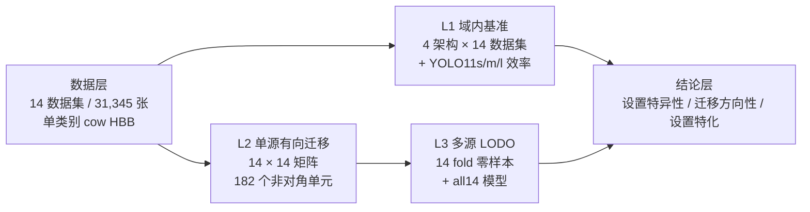

# 牛只数据集工作进展与计划

---

## 一、汇报速览

研究目标： 构建 CowCV 多源牛只视觉数据资源与跨数据集泛化基准，回答"牛只检测模型能否在未见场景下稳定工作"。

已经完成：14 个数据集 / 31,345 张图像的统一整理与标注标准化；四种架构域内的基准测试；YOLO11s/m/l 效率测试；14×14 单源有向迁移测试14 fold 多源 LODO 零样本迁移；CowCV 门户开发。

当前瓶颈：实验口径尚未完全统一，需后续再进行几次不同随机种子实验。

下一步计划：外部数据集零样本测试 → LODO 与单源基线对比与分层分析 → 统一重训复核与多种子 → 平台部署与论文收敛。

---

## 二、研究背景与问题定位

牛只目标检测是个体识别、行为分析、健康监测和精准养殖的上游基础任务。但现有公开数据资源存在三重分散：

1. **来源分散**：数据分别发布在机构网站、通用数据平台或论文附件中，难以快速发现和比较。
2. **标注异构**：VOC XML、COCO JSON、CVAT XML、CSV、旋转框、关键点、多版本 YOLO 格式并存；类别体系混用整牛、身体部位、行为与个体身份。
3. **评测不可比**：多数研究仅在单一数据集的随机划分上报告结果；连续视频帧、同一牛只多视图或同源增强样本跨越训练/测试集时，容易高估泛化能力。

本阶段工作的主线，是把"数据整理"和"模型泛化评估"连成一条闭环：**统一数据资源 → 统一评测协议 → 可解释的跨域结论**，而不是停留在数据收集本身。

---

## 三、数据资源建设进展

### 3.1 基准工作集

当前 CowCV 已收集或构建 **20 项候选资源**，经纳入原则筛选后形成 **14 个数据集的基准工作集**，共 **31,345 张图像**（train 25,079 / val 3,142 / test 3,124），全部按域内设置分组重新切分为 train/val/test 三部分。

> 口径说明：基准工作的权威数据源为服务器 `data/` 目录，原始收集规模为 31,373 张，经 SHA-256 同图同标去重并剔除划分清理副本后为 **31,345 张**（train 25,079 / val 3,142 / test 3,124）。划分口径统一重建：多数数据集 train 保持不动、原 val 对半切出独立 test；8-calves 与 Cows2021 为全池严格 8:1:1 重切；Dairy Cow、NWAFU、XGain 在清理同图同标副本后重切。此表与更早版本"val 沿用原作者划分、无独立 test"的口径不同。

| 数据集 | train | val | test | 合计 | 主要场景（当前子集） |
| --- | ---: | ---: | ---: | ---: | --- |
| 8-calves | 720 | 90 | 90 | 900 | 室内犊牛，严重遮挡 |
| animals_10 | 1,293 | 162 | 161 | 1,616 | 互联网多样化背景 |
| Cattle Body Parts（CBPD_ODD） | 292 | 37 | 36 | 365 | 混合来源，无统一机位 |
| CID | 1,645 | 206 | 205 | 2,056 | 受控半开放测量区，单牛多视角 |
| Cow-images（CImage） | 141 | 18 | 17 | 176 | 开放网络图像 |
| COCO cow subset | 1,376 | 172 | 172 | 1,720 | 通用场景，尺度背景差异大 |
| COLO | 803 | 101 | 100 | 1,004 | 室内 free-stall barn，顶视+斜俯视 |
| Cows2021 | 8,322 | 1,040 | 1,040 | 10,402 | 室内挤奶走道，4 m 固定垂直俯视 |
| Dairy Cow | 3,282 | 410 | 408 | 4,100 | 半开放牛场，昼夜混合成像 |
| Google Open Images cow subset | 2,333 | 292 | 291 | 2,916 | 开放互联网图像 |
| Holstein Cattle Recognition（HCRD） | 851 | 106 | 106 | 1,063 | 挤奶通道受控单牛侧视 RGB |
| MooTrack360 | 1,200 | 150 | 150 | 1,500 | 顶装鱼眼，强畸变、超密集牛群 |
| NWAFU Cattle Dataset | 1,498 | 190 | 185 | 1,873 | 半开放牛舍与院落，多品种 |
| XGain | 1,323 | 168 | 163 | 1,654 | 户外草场，高位广角，小目标 |
| **合计** | **25,079** | **3,142** | **3,124** | **31,345** | 多源异构场景 |

### 3.2 标注标准化

统一为**单类别 `cow` + 水平边界框（HBB）+ YOLO 归一化格式**（`class_id x_center y_center width height`）。原始标签按处理路线分为四类，并在清单中逐项记录来源与语义边界：

| 处理路线             | 涉及数据集                                                            | 语义边界                     |
| ---------------- | ---------------------------------------------------------------- | ------------------------ |
| 原生整牛 HBB 转换/类别合并 | 8-calves、COLO、MooTrack360、XGain、Dairy Cow、COCO、Google Open Image | 保留原始框范围政策，不宣称已成为同一套人工整牛框 |
| 旋转框转水平外接框        | Cows2021                                                         | 继承原始躯干范围，不等于重绘全身框        |
| 新增人工整牛 HBB       | HCRD、CID、NWAFU、CBPD_ODD、CImage、animals_10                        | 按统一规则绘制并复核               |
| 模型辅助候选框          | 当前基准中无仅依赖模型输出的最终标签                                               | 仅用于待整理资源的候选框，须人工确认后可用    |

### 3.3 数据质量控制

- 图片-标签一一对应检查；缺失、冗余标签与失效软链接识别。
- 类别编号、字段数、非数值、负值、零面积框、越界坐标检查。
- 按牛只身份、视频、相机或原始来源**分组划分**，降低同源样本跨集合泄漏。
- 保留原始数据与原始标注，只在独立训练视图中清理转换，保证可追溯。
- **近重复审计**：31,373 张图像全部计算 SHA-256（未发现跨数据集字节级重复），另用 64 位 DCT 感知哈希检测重压缩/缩放近重复，确认 COCO 与 Google Open Images 之间存在 **9 张跨源训练→验证近重复**（7 张 COCO→Google OI，2 张反向），已通过版本化评测视图排除并重评。

### 3.4 统一域标签体系与设置特异性分组

不把"一个数据集"等同于"一个域"。为图像建立**多标签域描述**（养殖环境 / 拍摄视角 / 光照与成像 / 目标结构 / 数据来源 / 牛只属性），再按"数据获取方式 + 场景约束强度"归为三个一级组：

| 一级组 | 设置特异性 | 数据集 |
| --- | --- | --- |
| G1 结构化养殖监控 | 高：固定/近固定机位、背景重复 | Cows2021、8-calves、COLO、MooTrack360、XGain、Dairy Cow |
| G2 受控或现场采集 | 中：场地受限，机位与密度更灵活 | CID、HCRD、NWAFU Cattle Dataset |
| G3 开放及混合来源 | 低/混合：无统一场地和机位 | animals_10、CImage、COCO cow subset、Google OI cow subset、CBPD_ODD |

该理论框架直接借鉴跨数据集目标检测泛化研究中的**设置特异性（setting specificity）**视角（arXiv:2601.09497），用于解释"为什么固定机位数据的高精度无法外推"。

---

## 四、基准实验进展

实验设计由三层互补证据构成：

### 4.1 域内检测基准（四架构 × 14 数据集）

四个代表性检测器：YOLO11m（单阶段）、RT-DETR-L（端到端 Transformer）、Faster R-CNN R50-FPN（两阶段）、RetinaNet R50-FPN（单阶段）。全部 28 个域内 run 在同一块 A100-PCIE-40GB 单卡完成。

数据集等权宏平均（K=14，每项指标先在各数据集独立计算再等权平均）：

| 检测器 | mAP@0.5:0.95 | mAP@0.5 | F1@0.25 | 最佳 F1 工作点 F1 |
| --- | ---: | ---: | ---: | ---: |
| YOLO11m | 0.739 | 0.933 | 0.893 | 0.908 |
| RT-DETR-L | **0.744** | 0.929 | 0.807 | 0.906 |
| Faster R-CNN R50-FPN | 0.702 | 0.922 | 0.869 | 0.911 |
| RetinaNet R50-FPN | 0.700 | 0.903 | 0.839 | 0.894 |

**要点**：

- RT-DETR-L 与 YOLO11m 属**并列领先**而非明确第一、第二：宏平均仅差 0.0047，RT-DETR-L 在 9/14 数据集上更高，12/14 的差距不超过 0.02。缺多随机种子与置信区间时，不能断言差异稳定。
- **数据集间差异远大于模型间差异**：四模型均值从 Google OI 的 0.4464 到 CBPD_ODD 的 0.9413（跨度 0.4949），而四种检测器宏平均跨度仅 0.0435；两两 Spearman 秩相关 0.974–0.991，说明四个架构识别出了一致的"数据集难度次序"。
- **困难类型可区分**：8-calves / MooTrack360 / COLO 的 mAP@0.5 高但 mAP@0.5:0.95 明显下降（差值 0.31–0.39），属**定位精度问题**；COCO / Google OI 在宽松 IoU 下也困难，属**检出问题**。
- **固定阈值不能单独用于架构排名**：从 conf=0.25 切到各自最佳 F1 工作点后，RT-DETR-L 的 F1 宏平均提升 0.0990（0.807→0.906），阈值敏感性最强。固定阈值结果依赖分数校准，必须与 mAP 共同解读。

### 4.2 精度—效率与部署选择（YOLO11s/m/l）

| 模型 | mAP@0.5:0.95 宏平均 | 参数量 | GFLOPs | GPU 纯前向 P50 | 权重大小 | 100 epoch 总训练时间 |
| --- | ---: | ---: | ---: | ---: | ---: | ---: |
| YOLO11s | 0.7406 | 9.41 M | 21.3 | 12.68 ms | 19.31 MB | 20,516 s ≈ 5.7 h |
| YOLO11m | 0.7390 | 20.03 M | 67.6 | 13.36 ms | 40.68 MB | 29,573 s ≈ 8.2 h |
| YOLO11l | 0.7448 | 25.28 M | 86.6 | 20.40 ms | 51.39 MB | 38,693 s ≈ 10.7 h |

精度宏平均差异（≤0.006）远小于延迟与训练成本差异。注意：YOLO11m 与 s/l 分属不同软件环境与批大小设置，当前仅为**阶段性记录**；三者均完成 100 epoch 完整训练，阈值可达率 13/14（仅 CImage 未达标，属"训练完整但未达标"）。部署选择不做人工加权总分，改用 mAP–延迟 Pareto 前沿结合显存、参数量与收敛成本。

### 4.3 单源跨数据集有向迁移（14 × 14 矩阵）

固定 YOLO11m 作为统一测量器，每个源数据集独立训练一个模型，直接在其他目标数据集上零样本测试，共 **196 个单元**（14 个域内参照 + **182 个跨域单元**）。

| 源数据集 | 域内 mAP@0.5:0.95 | 13 域 OOD 宏平均 |
| --- | ---: | ---: |
| CImage | 0.7587 | **0.4783** |
| Google Open Images | 0.4534 | 0.4204 |
| COCO cow subset | 0.5204 | 0.4160 |
| animals_10 | 0.6814 | 0.3546 |
| NWAFU Cattle Dataset | 0.7379 | 0.1963 |
| Dairy Cow | 0.8750 | 0.1485 |
| CBPD_ODD | 0.9404 | 0.1075 |
| CID | 0.8734 | 0.0428 |
| HCRD | 0.9310 | 0.0055 |
| Cows2021 | 0.8629 | **0.0025** |

182 个非对角单元的**整体均值仅 0.1756、中位数 0.0697**。

**分组方向性（G1-G3）**：

| 源组 → 目标组 | G1 结构化监控 | G2 受控/现场 | G3 开放/混合 |
| --- | ---: | ---: | ---: |
| G1 结构化监控 | 0.1031 | 0.0300 | 0.0684 |
| G2 受控/现场 | 0.0275 | 0.0781 | 0.1477 |
| G3 开放/混合 | **0.2050** | **0.4099** | 0.5400 |

G3→G1 平均 mAP 约为反向的 **3.0 倍**，G3→G2 约为反向的 **2.8 倍**；而 G1 与 G2 之间双向都极低（0.0300 / 0.0275）——**"同属牛只养殖场景"并不意味着域间距离小且对称**。排除混合来源 CBPD_ODD 后的敏感性分析中方向性反而更强，说明该结论不由单一数据集的分组选择造成。

### 4.4 多源留一域零样本泛化（LODO，9 月新增）

**设计**：每次完整留出一个数据集作为目标域，用其余 13 个数据集等权联合训练 YOLO11m（每源每 epoch 配额 q=500，池 6,500 张），在目标域 **test 冻结视图**上零样本推理。协议全部预先冻结，未看结果后调整。

**执行**：2026-09-24 生成 15 fold 目录与 1,500 份抽样清单（md5 幂等验证）→ 09-26 至 09-27 串行训练 **15/15 全部完成、退出码全 0**，总耗时约 **43.6 小时** → 逐一执行 checkpoint 选择与目标域零样本评测（28 次推理）。

| 目标域 | 冻结评测图像数 | mAP@0.5 | mAP@0.5:0.95 |
| --- | ---: | ---: | ---: |
| CBPD_ODD | 36 | 0.974 | **0.919** |
| CID | 205 | 0.876 | 0.742 |
| CImage | 17 | 0.905 | 0.692 |
| animals_10 | 161 | 0.845 | 0.658 |
| Dairy Cow | 408 | 0.945 | 0.623 |
| XGain | 163 | 0.810 | 0.561 |
| NWAFU Cattle Dataset | 185 | 0.670 | 0.509 |
| COCO cow subset | 172 | 0.721 | 0.495 |
| Google Open Images | 291 | 0.712 | 0.429 |
| COLO | 100 | 0.665 | 0.391 |
| 8-calves | 90 | 0.766 | 0.353 |
| HCRD | 106 | 0.574 | 0.290 |
| Cows2021 | 1,040 | 0.733 | 0.275 |
| MooTrack360 | 150 | 0.306 | **0.141** |
| **14 域等权宏平均** | — | **0.750** | **0.506** |

**要点**：

- 14 域等权宏平均 **mAP@0.5:0.95 ≈ 0.506**（中位数 0.502，IQR [0.337, 0.666]），最好与最差目标域相差约 **6.5 倍**。
- MooTrack360（顶视鱼眼追踪域）最难，且**召回率仅 0.241**，说明检测头难以迁移到该域的目标外观。
- Dairy Cow、Cows2021 呈"**找得到、框不准**"模式（mAP@0.5 高、mAP@0.5:0.95 低），跨域退化更多体现在**定位精度**而非检出能力。
- 稳健性核验：15 个 fold 的最佳 epoch 集中在 94–100 轮（100 epoch 预算基本充分）；`selected.pt` 与固定第 100 轮 checkpoint 在 14 个目标域上平均绝对差仅 **0.0004**，说明结论不依赖 checkpoint 选择规则。
- 工程侧额外完成的质量保证：每 epoch 断言 `optimizer.step()` 次数 == ⌈池/16⌉（末批 4 张图从未被丢弃）、`accumulate==1`、**目标域路径零出现（零泄漏）**、清单 md5 可审计。

另训练了一个**全 14 源模型 `all14`**（源域宏平均 0.751，epoch 99），其用途是后续**外部数据集 E 零样本测试**，在 E 的实际评测完成前不写成外部泛化结果。

### 4.5 原始预训练参照

未经牛只微调的原始 `yolo11m.pt` 在 14 个目标域取得宏平均 **0.5208**。

在 182 个非对角定向单元中，**仅 5 个**单域微调结果超过同目标域上的原始预训练基线（animals_10→CImage +0.0289、CImage→CBPD_ODD +0.0013、COLO→Cows2021 +0.0667、Dairy Cow→Cows2021 +0.0127、MooTrack360→8-calves +0.1119），其余 **177 个均低于**。

这表明固定相机、连续帧和单一背景上的微调，在提高域内性能的同时会加强对特定设置的依赖，收窄原始通用表征的适用范围——即**设置特化（setting specificity）**现象。该基线是"微调前通用参照"，不是严格意义的外部未见域模型（其 COCO 预训练与开放网络数据可能共享来源特征）。

---

## 五、CowCV 数据门户进展

**技术栈**：React + Vite + React Router 前端；FastAPI + Uvicorn 后端；关系型数据库管理元信息；前端 Nginx 提供静态资源。

**已完成功能**：首页关键词检索与资源统计 → 数据集发现与条件筛选（CV 任务 / 品种 / 图像模态 / 拍摄视角 / 潜在任务 / 关键词）→ 数据集详情（说明、样例、标注数、来源、许可）→ 模型检测与图像预处理工具 → ZIP 下载与数据提交。

**构建验证**：后端 `cowcv_web-backend:latest`（约 776 MB）与前端 `cowcv_web-frontend:latest`（约 92.8 MB）镜像均已构建成功；后端改为读取环境变量配置、修正路径解析兼容 `storage/` 结构、启动命令改为 `uvicorn app.main:app`、前端改用 `npm ci`。

## 六、当前核心发现

1. **域内精度不能代表跨域泛化**。多数数据集可训练出 0.86–0.94 的域内 mAP@0.5:0.95，但同一模型离开自身数据域后，182 个跨域单元的中位数仅 0.0697。域内表现与跨域泛化能力不一致（如 HCRD 域内 0.9310，跨域宏平均仅 0.0055）。
2. **迁移具有明确方向性且不对称**。G3 开放/混合来源 → G1/G2 明显强于反向（3.0 倍 / 2.8 倍），G1↔G2 之间双向都极低。迁移方向必须作为显式分析对象，不能默认域间距离对称。
3. **单域微调普遍造成设置特化**。182 个单元中仅 5 个单域微调超过原始预训练基线，说明视觉多样性、来源亲缘性与设置特化共同影响泛化。
4. **多源联合训练能覆盖未见域，但落差仍大**。LODO 宏平均 0.506，最差目标域 0.141；跨域退化更多出现在定位精度而非检出能力。
5. **模型容量不是解决 domain gap 的关键**。YOLO11l 相对 YOLO11s 精度宏平均仅高 0.0042，而延迟与训练成本成倍放大；架构间宏平均跨度（0.0435）远小于数据集间跨度（0.4949）。
6. **数据资源的标准化价值已可验证**。统一类别、标注转换、质量检查与来源感知划分，使跨数据集公平比较第一次在牛只视觉领域成为可能。

---

## 七、下一步工作计划

### 近期（10 月，优先级从高到低）

| 序号 | 任务 | 说明 |
| ---: | --- | --- |
| 1 | **外部数据集 E 零样本测试** | 使用 `all14` fold 的 `selected.pt`（源域宏平均 0.751），在从未参与实验的新数据集上直接推理；对比多源模型 / 原始 `yolo11m.pt` / 14 个单源模型。训练成本最低、外部有效性证据最强。 |
| 2 | **LODO 与单源基线对比** | 计算各目标域的 `R_target^LODO = M_{-t→t} / M_{t→t}` 与相对单源均值的增益 `Δ_multi(t)`，并报告单源迁移中位数 |
| 3 | **文档与材料整理** | 将 LODO 结论写入文章 4.5.2；整理汇报图表（14 域样本拼图、处理流程图、14×14 热图、方向性结果图） |

### 中期（10–11 月）

| 序号 | 任务 | 说明 |
| ---: | --- | --- |
| 4 | **不确定性统计** | LODO 代表 fold 补多随机种子（机制已就绪）；跨域结果补 cluster bootstrap（按视频/牛只/来源簇） |
| 5 | **许可与元数据核验** | 逐项核对 14 个数据集的许可证、再分发范围与引用要求；补齐相机参数与来源序列信息 |
| 6 | **多模型跨域扩展** | 条件允许时扩展 RT-DETR / Faster R-CNN 的 14×14 矩阵，检验方向性结论的模型无关性 |

### 长期（投稿前）

| 序号 | 任务 | 说明 |
| ---: | --- | --- |
| 7 | **CowCV 生产部署** | 修正媒体挂载路径、数据库配置、反向代理与 HTTPS；完成下载申请流程验证；替换演示截图 |
| 8 | **论文收敛** | 明确主线定位（建议：面向设置特异性牛只检测的多源数据标准化与跨数据集泛化基准）；重写摘要、贡献与图表；统一表格编号与引用 |
| 9 | **数据与代码可用性** | 冻结数据版本、划分清单、评测脚本与 checkpoint 规则，整理公开地址 |

### 明确暂缓的事项

- **受控因素迁移**（Top/Side、Day/Night、RGB/NIR 双向实验）：仅在同一牛群、相机、背景和采集序列能充分控制时才开展；否则一律表述为混合因素迁移，不追单因素因果。
- **多随机种子全量重复**：机制已就绪，按当前决定先用单种子完成全量结论，再对代表性 G1/G2/G3 目标域补充。

---

