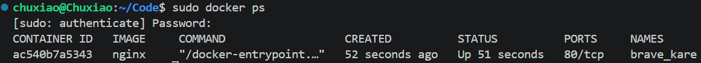
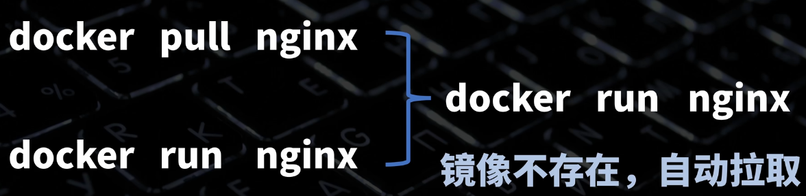
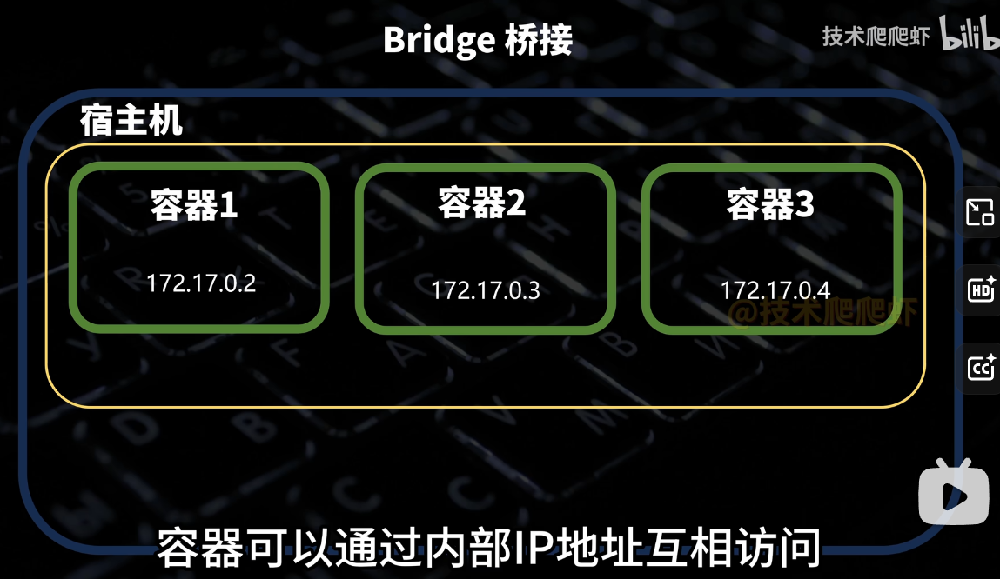
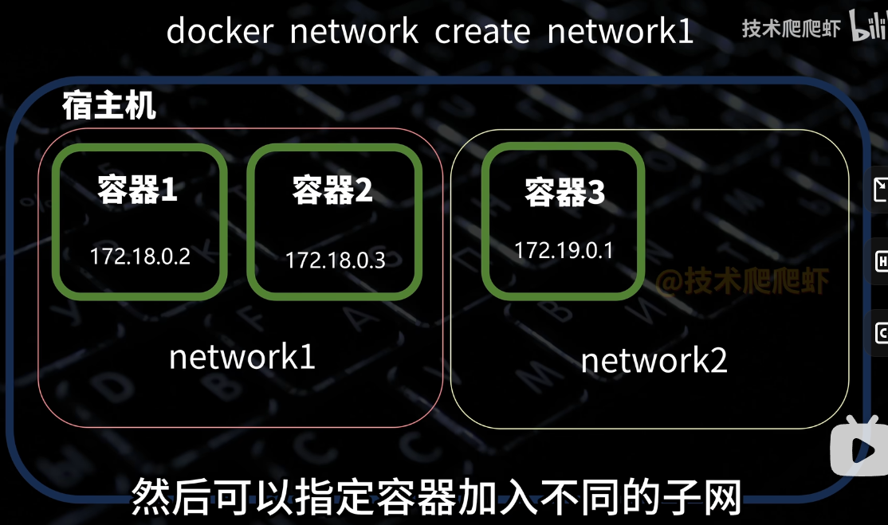

## Docker


### Docker 常用命令

docker images      列出已有镜像

docker rmi name  删除某镜像

docker rm 删除容器 -f强制删除


基于linux的容器化技术。

运行在docker容器上的程序直接使用的都是实际物理机的硬件资源。所以docker效率比虚拟机效率高。

docker容器与虚拟机最大的区别是，docker容器之间公用同一个系统内核，而每个虚拟机都包含一个完整内核，

所有doker容器比虚拟机更轻，更小。

Docker用于应用程序时是最有用的，但并不包含数据。日志、数据库等通常放在Docker容器外。存储可以通过外部挂载等方式使用。

**总之，docker只用于计算，存储交给别人。**

**镜像类似于软件安装包，容器就是安装出来的软件。**

docker仓库就是用来存放镜像的地方，官方仓库`Docker Hub`。


### Docker特性

- 文件系统隔离：每个进程容器运行在一个完全独立的根文件系统里。
- 资源隔离：系统资源，像CPU和内存等可以分配到不同的容器中，使用cgroup。
- 网络隔离：每个进程容器运行在自己的网路空间，虚拟接口和IP地址。
- 日志记录：Docker将收集到和记录的每个进程容器的标准流（stdout/stderr/stdin），用于实时检索或者批量检索
- 变更管理：容器文件系统的变更可以提交到新的镜像中，并可重复使用以创建更多的容器。无需使用模板或者手动配置。
- 交互式shell：Docker可以分配一个虚拟终端并且关联到任何容器的标准输出上，例如运行一个一次性交互shell。


### docker安装

```cmd
1、yum -y install docker
2、yum -y install docker-engine
3、yum -y install docker-ce
```


```cmd
sudo apt remove -y docker.io docker-compose docker-compose-v2 docker-doc podman-docker containerd runc || true

sudo apt update
sudo apt install -y ca-certificates curl

sudo install -m 0755 -d /etc/apt/keyrings
sudo curl -fsSL https://download.docker.com/linux/ubuntu/gpg -o /etc/apt/keyrings/docker.asc
sudo chmod a+r /etc/apt/keyrings/docker.asc

sudo tee /etc/apt/sources.list.d/docker.sources > /dev/null <<EOF
Types: deb
URIs: https://download.docker.com/linux/ubuntu
Suites: $(. /etc/os-release && echo "${UBUNTU_CODENAME:-$VERSION_CODENAME}")
Components: stable
Architectures: $(dpkg --print-architecture)
Signed-By: /etc/apt/keyrings/docker.asc
EOF

sudo apt update
sudo apt install -y docker-ce docker-ce-cli containerd.io docker-buildx-plugin docker-compose-plugin
sudo systemctl enable --now docker

sudo docker run hello-world

## docker安装过程

```


### dockers pull


官方仓库可以省略仓库地址

library是命名空间，因为dockerhub是公共仓库，要加作者名字。

如果是官方命名空间可以省略（library）

：latest是版本号


pull时可能因为网络问题报错，我们需要设置**镜像站**

```cmd
sudo vi /etc/docker/daemon.json


{
    "registry-mirrors": [
        "https://docker.m.daocloud.io",
        "https://docker.1panel.live",
        "https://hub.rat.dev"
    ]
}

## 然后sudo service docker restart
```


### docker run  创建并运行容器

后面可以接镜像的名字或者id

**sudo docker run nginx** 启动容器

docker creat 仅创建不启动容器

**sudo docker ps** 查看运行中容器



- id就是容器的id
- image是基于哪个镜像创建的
- names是容器的名字，系统可以自动分配


**sudo docker run -d nginx ** 分离模式后台执行




-p进行端口映射，**容器的网络与宿主机是隔离的**

宿主机端口：容器端口	


 ###  -v 把宿主机跟容器的文件进行绑定


宿主机目录：容器目录

这种目录也叫挂载卷，可以进行数据的持久化保存

否则删除容器，数据会同时删除

使用绑定挂载时，宿主机的目录会覆盖掉容器内的目录。

> docker run -d -p80:80 -vD:/docker/nginx:usr/share/nginx/html 5aca99593157 **绑定挂载**


**创建挂载卷**

**docker volume creat name**

docker volume inspect name 查看挂载卷

挂载卷绑定不会出现覆盖情况


### 传递参数

-e MONGO_INITDB = TECH\

-e ..........


### 原有容器的启用和停止


docker stop name 

docker ps -a 查看所有容器（包括已经停用）

docker start 

docker inspect name 查看容器所有信息（**丢给ai看**）

docker logs name -f (滚动查看日志)

docker exec name [linux 命令] 可以在容器内执行命令

docker exec -it name /bin/sh 进入容器内部执行命令


### 容器内安装软件

cat /etc/os-release (看看系统是什么版本的，一般安装使用apt)

apt update 先更新一下apt索引

apt install vim 安装vim


## Dockerfile 里面详细列出来容器是如何制作的

FROM  选择一个基础镜像

workdir 有点像cd 切换到镜像一个工作目录

COPY . . 把代码文件拷贝到镜像目录

RUN pip install -r requirment.txt 表示这个命令要到镜像里面执行

EXPOSE 声明一个使用端口，不写没有影响。

CMD【”python“ ， “main.py”】一个dockerfile只有一个cmd，run时运行。

docker build -t name  . 点代表在当前文件夹构建

 

**推送镜像**

docker login

要推送镜像时必须带上自己的用户名

docker build -t space:name  .

docker push space:name


### Docker网络




但容器网络和宿主机网络是隔离的


docker network creat name 创建子网



同一个子网可以互相访问，且可以使用名字，而不必使用内部IP

docker run --network name 加入子网

借助docker DNS机制，只用名字就可以通信。

docker network list

run**`--network host`**

### DOCKER COMPOSE

一个compose文件里的所有容器都会加入一个子网，

compose可以自定义容器启动顺序。

docker compose up  -d  （自动识别当前目录下docker-compose）

docker compose stop start  down(停止且删除)