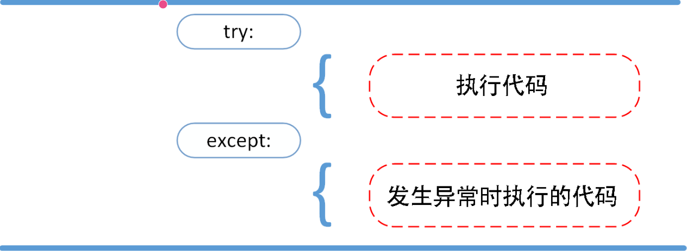

## python包的自定义、导入与引用

**自定义一个包有多种方法面对实际的应用场景，这里介绍两种方法。一种是特定工程内包的定义与引用，另一种是定义一个可供所有工程使用的包**。

**特定工程内包的定义与导入**
- 新建一个存放包的文件夹，如E:\PY_PRACTICE\packdemo
- 在包下建立了__init__.py，包的初始化文件
- 使用时在该工程下，创建py脚本。直接导入模块 import 包.子包.模块
- 直接导入函数 from 包.子包.模块 import 函数

定义一个可供所有工程使用的包

- 定义包同上

- 将包的路径加入sys.path首先需要将包的路径加入sys.path的list中（搜索路径）。有两种方法，一种是动态修改sys.path，一种是静态修改sys.path：

```python
import sys
import os
pack_path = os.path.dirname(os.path.abspath(sys.argv[0]))
sys.path.insert(0,os.path.join(pack_path,'E:\PY_PRACTICE\packdemo'))
print(sys.path)#可查看搜索列表


import sys
print(sys.path)

```

```python
# __init__.py
# my_package/__init__.py
print("初始化 my_package 包")
 
# 包级别的变量
VERSION = "1.0.0"
AUTHOR = "Your Name"
 
# 导入子模块，简化外部调用
from .core import CoreClass
from .utils import helper_function
import utils # 在同一个包下
```

在 Python 中导入上层目录或不同目录下的自定义函数，主要依赖于模块搜索路径（`sys.path`）。你提供的代码片段中使用了 `sys.path.append("./chapter_linear-networks")`，这是在运行时将当前工作目录下的 `chapter_linear-networks` 文件夹添加到模块搜索路径，从而可以直接导入该文件夹下的模块（如 `utils`）。

```python
import sys
import os

# 获取当前脚本所在目录
current_dir = os.path.dirname(os.path.abspath(__file__))
# 获取父目录
parent_dir = os.path.dirname(current_dir)
# 将父目录添加到 sys.path
sys.path.append(parent_dir)

# 现在可以导入父目录下的模块
from parent_module import some_function
```

- `sys.path` 中的每一个条目都是 Python 搜索模块的**根目录**。
- 当你添加 `"./chapter_linear_networks"` 后，Python 会在该目录下查找 **模块或包**。


## setuptools import find_packages, setup

**打包分发工具，一般打包的结果是zip文件，可以是二进制或者源码包的形式发布**

```powershell
$ python setup.py sdist --formats=gztar
# 打包命令

$ pip install  xxx.zip 
# 安装
```

上面我们讲述了python打包分发的方法，很容易发现整个打包过程最重要的就是`setup.py`，它`指定了重要的配置信息`。setup.py的内容如下：

```python
from setuptools import setup

def readme():
    with open('README.md', encoding='utf-8') as f:
        content = f.read()
    return content

setup(
    name = 'myapp', # 包名称
    version = '1.0', # 版本
    author = 'xxx', # 作者
    author_email = 'xxx@163.com', # 作者邮箱
    description='a example for pack python', # 描述
    long_description=readme(), # 长文描述
    long_description_content_type='text/markdown', # 长文描述的文本格式
    keywords='pack', # 关键词
    url='https://github.com/lihua/myapp', # 项目主页
    classifiers=[ # 包的分类信息，见https://pypi.org/pypi?%3Aaction=list_classifiers
            'Development Status :: 5 - Production/Stable',
            'License :: OSI Approved :: Apache Software License',
            'Operating System :: OS Independent',
            'Programming Language :: Python :: 3',
            'Programming Language :: Python :: 3.6',
            'Programming Language :: Python :: 3.7',
            'Programming Language :: Python :: 3.8',
            'Programming Language :: Python :: 3.9',
        ],
    packages=find_packages(), # packages参数就是用来指示打包分发时需要包含的package，type为list[str]。
    include_package_data=True,
    license='Apache License 2.0', # 许可证
)

```

setuptools提供了两个函数`find_namespace_packages`, `find_packages`来**快速找到所有的package**。

首先明白一点，python中的packages有两种，

- 一种是`包含__init__.py的文件夹`（姑且叫做`普通package`），
- 一种是`不含__init__.py的文件夹`（这是python3引入的`Namespace Packages命名空间包`）。

针对**依赖包安装与版本管理**这项功能，setup函数提供了一些参数`install_requires`、 `setup_requires`、`tests_require` 、`extras_require` 。


## f-string

**f-string** 格式化字符串以 **f** 开头，后面跟着字符串，字符串中的表达式用大括号 {} 包起来，它会将变量或表达式计算后的值替换进去，实例如下：

```python
>>> name = 'Runoob'
>>> f'Hello {name}'  # 替换变量
'Hello Runoob'
>>> f'{1+2}'         # 使用表达式
'3'
print("")
```

## 列表推导式

列表推导式格式为：

```
[表达式 for 变量 in 列表] 
[out_exp_res for out_exp in input_list]

或者 

[表达式 for 变量 in 列表 if 条件]
[out_exp_res for out_exp in input_list if condition]
```

## 字典推导式

字典推导基本格式：

```
{ key_expr: value_expr for value in collection }

或

{ key_expr: value_expr for value in collection if condition }

listdemo = ['Google','Runoob', 'Taobao']
# 将列表中各字符串值为键，各字符串的长度为值，组成键值对
>>> newdict = {key:len(key) for key in listdemo}
>>> newdict
{'Google': 6, 'Runoob': 6, 'Taobao': 6}
```

## 函数

 以下是调用函数时可使用的正式参数类型：

- 必需参数
- 关键字参数
- 默认参数
- 不定长参数

必需参数须以正确的顺序传入函数。调用时的数量必须和声明时的一样。

使用关键字参数允许函数调用时参数的顺序与声明时不一致，因为 Python 解释器能够用参数名匹配参数值。

**printme( str = "菜鸟教程")**

调用函数时，如果没有传递参数，则会使用默认参数。

**def printinfo( name, age = 35 ):**

你可能需要一个函数能处理比当初声明时更多的参数。这些参数叫做不定长参数，和上述 2 种参数不同，声明时不会命名。基本语法如下：

**def printinfo( arg1, *vartuple )**

加了星号 ***** 的参数会以元组(tuple)的形式导入，存放所有未命名的变量参数。加了两个星号 ***\*** 的参数会以字典的形式导入。

**printinfo(1, a=2,b=3)**

Python 使用 **lambda** 来创建匿名函数。

所谓匿名，意即不再使用 **def** 语句这样标准的形式定义一个函数。

```python
sum = lambda arg1, arg2: arg1 + arg2
```

## yield介绍

yield关键字主要用于生成器函数（generator functions）中，其目的是使函数能够像迭代器一样工作，即可以被遍历，但不会一次性将所有结果都加载到内存中。

```python
def simple_generator():
    yield 1
    yield 2
    yield 3

gen = simple_generator()
print(next(gen))  # 输出: 1
print(next(gen))  # 输出: 2
print(next(gen))  # 输出: 3
```

 `yield` —— 返回一个生成器，支持多次产出

- **作用**：用于定义**生成器函数**。它可以让函数在运行过程中“暂停”并产出一个值，下次调用时从暂停处继续执行。
- **性质**：包含 `yield` 的函数调用后不会直接执行代码，而是返回一个**生成器对象**。
- **执行流**：`yield` 不会结束函数，它只是暂时挂起状态。通过循环或 `next()` 可以依次获取 `yield` 产出的值，直到函数自然结束或遇到 `return`。

## map函数

-------


**map()** 会根据提供的函数对指定序列做映射。

第一个参数 function 以参数序列中的每一个元素调用 function 函数，返回包含每次 function 函数返回值的新列表。

```python
map(function, iterable, ...)
```

- function -- 函数
- iterable -- 一个或多个序列


## python 压缩与解压使用`zipfile`

---------


```python
import zipfile
import os
def un_zip(file_name):
    """unzip zip file"""
    zip_file = zipfile.ZipFile(file_name)
    if os.path.isdir(file_name + "_files"):
        pass
    else:
        os.mkdir(file_name + "_files")
    for names in zip_file.namelist():
        zip_file.extract(names,file_name + "_files/")
    zip_file.close()
```


## self 代表类的实例，而非类

在类的内部，使用 **def** 关键字来定义一个方法，与一般函数定义不同，类方法必须包含参数 self, 且为第一个参数，self 代表的是类的实例。

**super()** 函数是用于调用父类(超类)的一个方法。

**super()** 是用来解决多重继承问题的，直接用类名调用父类方法在使用单继承的时候没问题，但是如果使用多继承，会涉及到查找顺序（MRO）、重复调用（钻石继承）等种种问题。


## nn.functional.conv2d 和 nn.Conv2d

```python
import torch

input = torch.tensor(
    [[1,2,3,4,5],
    [2,3,4,5,6],
    [3,4,5,6,7],
    [4,5,6,7,8],
    [5,6,7,8,9]]
)

kernel = torch.tensor(
    [[1,2,3],
    [2,3,4],
    [3,4,5]]
)

input = torch.reshape(input, (1,1,5,5))
kernel = torch.reshape(kernel, (1,1,3,3))
print(input.shape)
print(kernel.shape)
output = torch.nn.functional.conv2d(input, kernel, stride=1)

print(output)

class Tudui(nn.Module):
    def __init__(self):
        super(Tudui, self).__init__()
        self.conv1 = nn.Conv2d(3, 6, 3,stride=1, padding=0)
        self.pool = nn.MaxPool2d(2, 2)

    def forward(self, x):
        x = self.conv1(x)
        return x
'''
- input – input tensor of shape
- weight – filters of shape
- bias – optional bias tensor of shape
- stride – the stride of the convolving kernel
- padding –implicit paddings on both sides of the input.
'''
'''
Maxpool
kernel_size (int | tuple[int, int]) – the size of the window to take a max over
stride (int | tuple[int, int]) – the stride of the window.
padding (int | tuple[int, int]) – Implicit negative infinity padding to be added on both sides
dilation (int | tuple[int, int]) – a parameter that controls the stride of elements in the window
dilation参数在池化操作中用于控制窗口之间的间距。当dilation大于1时，池化窗口会变得“稀疏”，即窗口中的元素不再是连续的。
ceil_mode (bool) – when True, will use ceil instead of floor to compute the output shape 为TRUE则保留边缘
'''
```

## 装饰器

**装饰器**（decorators）是 Python 中的一种高级功能，它允许你动态地修改函数或类的行为。

函数也可以作为函数的参数进行传递的。

装饰器是一种函数，它接受一个函数作为参数，并返回一个新的函数或修改原来的函数。
装饰器的语法使用 @decorator_name 来应用在函数或方法上。
Python 还提供了一些内置的装饰器，比如 @staticmethod 和 @classmethod，用于定义静态方法和类方法。
Python 装饰允许在不修改原有函数代码的基础上，动态地增加或修改函数的功能，装饰器本质上是一个接收函数作为输入并返回一个新的包装过后的函数的对象。

```python
def decorator_function(original_function):
    def wrapper(*args, **kwargs):
        # 这里是在调用原始函数前添加的新功能
        before_call_code()
        
        result = original_function(*args, **kwargs)
        
        # 这里是在调用原始函数后添加的新功能
        after_call_code()
        
        return result
    return wrapper

# 使用装饰器
@decorator_function
def target_function(arg1, arg2):
    pass  # 原始函数的实现
```

**解析：**decorator 是一个装饰器函数，它接受一个函数 function 作为参数，并返回一个内部函数 wrapper，在 wrapper 函数内部，你可以执行一些额外的操作，然后调用原始函数 function，并返回其结果。

- `decorator_function` 是装饰器，它接收一个函数 `original_function` 作为参数。
- `wrapper` 是内部函数，它是实际会被调用的新函数，它包裹了原始函数的调用，并在其前后增加了额外的行为。
- 当我们使用 `@decorator_function` 前缀在 `target_function` 定义前，Python会自动将 `target_function` 作为参数传递给 `decorator_function`，然后将返回的 `wrapper` 函数替换掉原来的 `target_function`。

```python
#使用
@time_logger
def target_function():
    pass
#等同于：
def target_function():
    pass
target_function = time_logger(target_function)

#如果原函数需要参数，可以在装饰器的 wrapper 函数中传递参数：
def my_decorator(func):
    def wrapper(*args, **kwargs):
        print("在原函数之前执行")
        func(*args, **kwargs) 
        print("在原函数之后执行")
    return wrapper

@my_decorator
def greet(name):
    print(f"Hello, {name}!")

greet("Alice")
#如果需要带参修饰器，需要在修饰器定义前再加一层
```


## Python 类型提示模块 typing 详解
**变量类型标注**
```python
from typing import List, Dict

name: str = "Alice"
age: int = 18
scores: List[int] = [95, 88, 76]
info: Dict[str, int] = {"math": 95, "english": 88}
```
**函数类型标注**
```python
from typing import List

def add(x: int, y: int) -> int:
    return x + y

def average(nums: List[int]) -> float:
    return sum(nums) / len(nums)
```
**可选类型（Optional）**
```python
from typing import Optional

def greet(name: Optional[str]) -> str:
    if name:
        return f"Hello, {name}"
    return "Hello, stranger"
#这里 Optional[str] 等价于 Union[str, None]。
#如果你不确定类型，可以用 Any
```
**Type用于表示一个类（class）本身的类型，而不是该类的实例。**
```python

class Vehicle:
    def start_engine(self) -> str:
        raise NotImplementedError
        
class VehicleFactory:
    registry: Dict[str, Type[Vehicle]] = {}
    
    @classmethod
    def register(cls, name: str, vehicle_type: Type[Vehicle]):
        cls.registry[name] = vehicle_type
```
## 异常

即便 Python 程序的语法是正确的，在运行它的时候，也有可能发生错误。运行期检测到的错误被称为异常。

大多数的异常都不会被程序处理，都以错误信息的形式展现在这里:

```python
>>> 10 * (1/0)             # 0 不能作为除数，触发异常
Traceback (most recent call last):
  File "<stdin>", line 1, in ?
ZeroDivisionError: division by zero
>>> 4 + spam*3             # spam 未定义，触发异常
Traceback (most recent call last):
  File "<stdin>", line 1, in ?
NameError: name 'spam' is not defined
>>> '2' + 2               # int 不能与 str 相加，触发异常
Traceback (most recent call last):
  File "<stdin>", line 1, in <module>
TypeError: can only concatenate str (not "int") to str
```

异常捕捉可以使用 **try/except** 语句。



```python
while True:
    try:
        x = int(input("请输入一个数字: "))
        break
    except ValueError:
        print("您输入的不是数字，请再次尝试输入！")
    except:
    	print("Unexpected error:", sys.exc_info()[0])
'''
如果没有异常发生，忽略 except 子句，try 子句执行后结束。
如果在执行 try 子句的过程中发生了异常，那么 try 子句余下的部分将被忽略。如果异常的类型和 except 之后的名称相符，那么对应的 except 子句将被执行。
最后一个except子句可以忽略异常的名称，它将被当作通配符使用。你可以使用这种方法打印一个错误信息，然后再次把异常抛出。
try/except 语句还有一个可选的 else 子句，如果使用这个子句，那么必须放在所有的 except 子句之后。

else 子句将在 try 子句没有发生任何异常的时候执行。
try-finally 语句无论是否发生异常都将执行最后的代码。

Python 使用 raise 语句抛出一个指定的异常。

raise Exception('x 不能大于 5。x 的值为: {}'.format(x))
'''
```


### `raise` —— 抛出异常

- **作用**：主动抛出一个异常。如果异常没有被 `try...except` 捕获，程序将会中断并打印错误信息。
- **性质**：用于处理错误或特殊状态，改变程序的控制流。
- **执行流**：当 `raise` 执行时，当前代码块会停止执行，Python 会寻找最近的 `except` 块；如果没有找到，程序会崩溃（抛出未捕获的异常）


## Python `asyncio` 模块

`asyncio` 是 Python 标准库中的一个模块，用于编写异步 I/O 操作的代码。

`asyncio` 提供了一种高效的方式来处理并发任务，特别适用于 I/O 密集型操作，如网络请求、文件读写等。

通过使用 `asyncio`，你可以在单线程中同时处理多个任务，而无需使用多线程或多进程。

在传统的同步编程中，当一个任务需要等待 I/O 操作（如网络请求）完成时，程序会阻塞，直到操作完成。这会导致程序的效率低下，尤其是在需要处理大量 I/O 操作时。

`asyncio` 通过引入异步编程模型，允许程序在等待 I/O 操作时继续执行其他任务，从而提高了程序的并发性和效率。

```python
async def：定义了协程函数 fetch_url_async 和 main_async。
await：在 fetch_url_async 中，我们 await session.get() 和 await response.text()，这告诉事件循环："这个网络请求需要时间，你先去执行其他就绪的任务吧"。
asyncio.create_task()：将 fetch_url_async 协程包装成 Task，使其被事件循环调度，实现并发。
asyncio.gather(*tasks)：一个非常实用的函数，它并发运行所有传入的协程/任务，并等待它们全部完成，最后收集所有结果。
asyncio.run(main_async())：Python 3.7+ 推荐的方式，它负责创建事件循环、运行协程并关闭循环。
```


### 协程（Coroutine）

协程是由程序自身调度的函数，可以在执行过程中暂停和恢复，协程的切换由程序自身完成，而不是依赖操作系统。与传统的函数不同，协程可以在执行过程中暂停，以便其他协程可以运行。Python 使用 async def 声明协程函数，使用 await 暂停协程的执行。

任务是协程的高级抽象，用于调度协程的执行。Future 是表示异步操作结果的低级抽象，可以与任务一起使用。

```python
import asyncio
#它是一个特殊的函数，可以在执行过程中暂停，并在稍后恢复执行。协程通过 `async def` 关键字定义，并通过 `await` 关键字暂停执行，等待异步操作完成。
async def say_hello():
    print("Hello")
    await asyncio.sleep(1)
    print("World")
    # 运行异步函数
asyncio.run(say_hello())
#async声明后，不能直接say_hello运行函数
#协程本质上是事件循环。不是说你用了async await就会成异步，是需要程序员自己定义任务有哪些协程的。
```

### 事件循环（Event Loop）

```python
#事件循环是 asyncio 的核心组件，负责调度和执行协程。它不断地检查是否有任务需要执行，并在任务完成后调用相应的回调函数。
async def main():
    await say_hello()

asyncio.run(main())
```

###  任务（Task）

```python
async def greet(name):
    print(f"Hello, {name}")
    await asyncio.sleep(1)
    print(f"Goodbye, {name}")

async def main():
    task1 = asyncio.create_task(greet("Alice"))
    task2 = asyncio.create_task(greet("Bob"))

    await task1
    await task2

asyncio.run(main())
```

### Future

```python
async def main():
    future = asyncio.Future()
    await future
```


## `Torch.Tensor`


## `numpy`


## 细粒度与粗粒度

细粒度（fine-grained）：粒度似乎根据项目模块划分的细致程度区分的，一个项目模块（或子模块）分得越多，每个模块（或子模块）越小，负责的工作越细，就说是细粒度。

粗粒度（coarse-grained）：相对于细粒度而言，一个项目模块（或子模块）分得越少，每个模块（或子模块）越大，负责的工作越泛，就说是粗粒度。

粗粒度和细粒度是一个相对的概念，定义这个概念主要是出于重用的目的，比如：类 的设计，为尽可能的重用则采用细粒度的设计模式，将一个复杂的类拆分成高度重用的细化的类。
