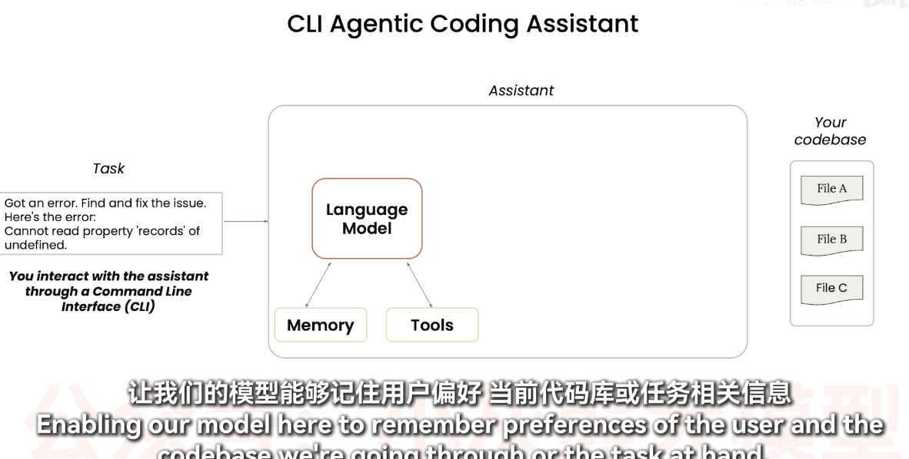
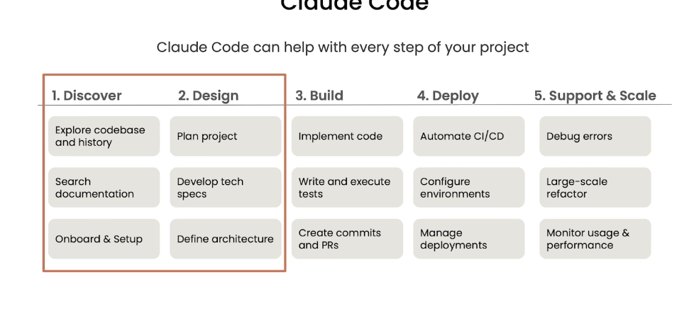
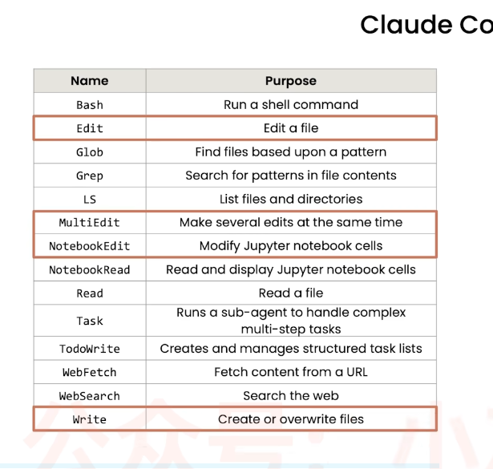
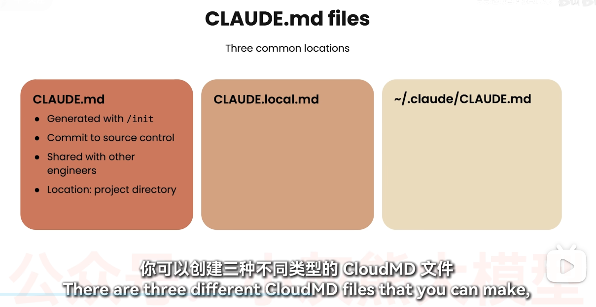

## 一、环境准备


### CC SWITCH

可以把自己的模型**Deep seek**接入到claude code

**每次启动Claude之前记得启动**


### 安装claude

```cmd
npm install -g @anthropic-ai/claude-code
```

输入以下命令查看是否安装成功

```cmd
claude -version
```

输入命令启动

```cmd
claude
```

对话框中输入/model 可以查看使用的模型


## 二、快速入门

### 常用命令

**/rewind：**	可以让你回退到对话的某个历史点，撤销之后的所有操作。

运行后会弹出一个对话历史列表，你可以选择回退到哪个时刻。选定后，那个点之后的所有对话和操作都会被永久删除。

典型场景

- 发现 AI 被带偏了，想回退到走偏之前的节点
- 一个任务试了好几种方案都不行，想回到最初重新来
- 对话太长，想截掉后面无用的部分
### **使用Claude 的关键是提供清晰的上下文**

- 指明相关文件的位置
- 清楚描述你所需要的功能和特性
- 正确使用mcp服务器，和工具






**这些工具让Claude能够收集所需的上下文信息**

除了内置工具，还可以使用mcp服务器（能让数据与ai通信）来添加更多工具。

### 权限

Claude Code 内置了6种权限模式，每种模式的自主操作权限、适用场景都不一样，大家可以按需选择，不用盲目全开最高权限。

权限模式	核心能力（无需手动询问）	适用场景
**default（默认模式）**	仅支持读取文件、查看代码，所有编辑、命令操作都需手动批准	初次上手、陌生代码库、生产环境敏感操作，安全性最高
**plan（规划模式）**	仅读取、分析代码，只会输出优化/开发方案，不会改动任何代码	需求梳理、代码重构规划、方案评估，只看结果不改动项目
**acceptEdits（编辑自动批准**）	自动执行文件读取、代码编辑、基础文件操作（mkdir、touch、mv、cp等），Shell命令仍需确认	日常开发首选，信任AI代码编辑能力，同时规避高危命令风险
**auto（智能自动模式）**	支持全部操作，自带后台安全校验机制，自动拦截高危违规操作	长时间迭代开发、批量重构，大幅减少弹窗，兼顾效率与安全
**dontAsk（严格受限模式）**	仅允许提前手动配置、预先批准的工具操作，其余全部拦截	CI自动化流程、受限开发环境，极致安全管控
**bypassPermissions（全权放行模式）**	跳过所有权限校验和安全检查，几乎所有操作自动执行	仅适合隔离沙箱、本地测试环境，生产环境严禁使用
**shift+tab进行切换**

`plan mode` 先制定计划，让cc详细规划方案，如果我们认可这个方案，再让cc对项目进行修改。


**可以在settings.json中配置allow和deny规则**

```json
{
  "permissions": {
    "allow": [
      "Bash(npm run test:*)",
      "Bash(npm run lint:*)",
      "Bash(git diff:*)",
      "Bash(git status:*)",
      "Edit",
      "Read"
    ],
    "deny": [
      "Bash(git push --force:*)",
      "Bash(rm -rf:*)",
      "Bash(sudo:*)",
      "Bash(chmod:*)"
    ]
  }
}

```

**规则优先级**：项目本地配置（`.claude/settings.local.json`）> 项目配置（`.claude/settings.json`）> 全局配置（`~/.claude/settings.json`）。


你可以这样跟它说：“请在当前项目根目录下创建 .claude/settings.json 配置文件，采用 allow/ask/deny 的权限配置模式，先扫描分析项目的技术栈，然后自动允许安全的常用命令。

```cmd
# 查看当前 Claude Code 版本
claude --version

# 查看帮助
claude --help

# 配置权限（在会话中使用）
/permissions

# 启用 Auto Mode（需 Team 计划）
claude --enable-auto-mode

# 查看 Auto Mode 默认规则
claude auto-mode defaults

# 非交互模式一次性执行任务
claude -p "你的任务描述"

# 恢复之前的会话
claude --resume
```


### 代码库理解

/init这个命令可以帮助代码库初始化一个Claude.md文件

Claude.md文件对于cc引入记忆至关重要

/ide 可以在IED工具中连接cc




## 三、记忆与上下文

### Memory

Claude Code 有两套记忆机制，本质区别一句话：**CLAUDE.md 是指令（告诉 Claude 怎么做），Memory 是事实（记录发生过什么）。**

打个比方：CLAUDE.md 像**员工手册**，写的是规则和偏好；Memory 像**工作日志**，记的是进展和事件。前者稳定、手动编辑；后者持续增长、对话中随时可加。

---

#### 全景图：4 个来源，新会话自动加载

```
                    指令（CLAUDE.md）              事实（Memory 文件）
                    ────────────────              ──────────────────

  全局              ~/.claude/CLAUDE.md           ~/.claude/memory/
  (跨项目)          一个文件，放个人偏好             ├─ MEMORY.md（索引）
                                                   ├─ xxx.md（可以有很多条）
                                                   └─ ...

  项目级            ./CLAUDE.md                   ~/.claude/projects/
  (仅本项目)        一个文件，放项目约定              <项目路径>/memory/
                                                   ├─ MEMORY.md（索引）
                                                   └─ xxx.md（可以有很多条）
```

**每次新会话启动时，4 个来源全部自动加载。** 优先级：项目级覆盖全局级。

---

#### CLAUDE.md（指令）

| 位置 | 范围 | 放什么 |
|------|------|--------|
| `~/.claude/CLAUDE.md` | 全局 | 个人偏好、语言习惯、全局配置 |
| `./CLAUDE.md` | 本项目 | 架构、技术栈、构建命令、项目约定 |

- **一个文件**管全部指令，不是每条指令一个文件
- 跨会话自动生效（磁盘文件，每次启动重读）
- 用 `/init` 初始化项目级 CLAUDE.md

---

#### Memory 文件（事实）

Memory 分两层，各自有独立的 `MEMORY.md` 做索引：

| 位置 | 范围 | 示例 |
|------|------|------|
| `~/.claude/memory/` | 全局 | “笔记文件在 `python/claude.md`” |
| `~/.claude/projects/<路径>/memory/` | 本项目 | “数据集下载到 80%，标注格式是 COCO” |

- **每条记忆一个 `.md` 文件**，通过 `MEMORY.md` 索引
- 按工作目录隔离，同目录所有会话共享
- Memory 之间用 `[[other-name]]` 互相引用

每条 memory 通过 `metadata.type` 分四种：

| 类型 | 用途 | 示例 |
|------|------|------|
| `user` | 你是谁——角色、技能水平、偏好 | “擅长 Python，不熟悉前端” |
| `feedback` | 你给的纠正和确认的做法 | “上次你说用 MCP 而非 Bash 操作 GitHub” |
| `project` | 进展、目标、约束（代码能推的不记） | “标注格式是 COCO” |
| `reference` | 外部资源指针 | “部署文档：https://xxx” |

---

#### 如何写入

| 方式 | 写入哪里 | 示例 |
|------|----------|------|
| `# 内容` 或 `/memory 内容` | Memory（事实） | `# 数据集已下载到 80%` |
| 手动编辑文件 | CLAUDE.md（指令） | 打开编辑器修改 `./CLAUDE.md` |
| `! 命令` | 终端执行（不记任何东西） | `! npm run test` |


### Context（上下文）

`/context` 命令查看当前会话的 token 消耗分布。新会话基础开销约 2 万 Token，剩余用于具体改动——长对话中很快会被占满。

#### Compact（压缩）

当 token 接近上限时，**harness（系统运行时）自动触发**压缩，不由 AI 模型控制：

```
┌─────────────────────────────────────────────┐
│              Compaction 流程                 │
│                                              │
│  1. 检测 token 超标                          │
│       ↓                                      │
│  2. 提取最早的对话轮次                       │
│       ↓                                      │
│  3. 调小模型生成摘要                         │
│       ↓                                      │
│  4. 旧对话替换为压缩摘要                     │
│       ↓                                      │
│  5. 新消息追加到摘要后面                     │
│                                              │
│  结果：早期细节丢失，核心信息保留，无法撤销   │
└─────────────────────────────────────────────┘
```

**AI 能决定保留什么吗？不能。** 选择哪些轮次被压缩、摘要长什么样，完全由 harness 决定。AI 只会在压缩后收到 `<system-reminder>` 告知"某段对话已被总结"。

**用户对策：**
- 及时运行 `/context` 关注 token 水位
- 长任务中途主动让 AI 总结关键进展（显式写入对话，压缩后保留在摘要中）
- 把真正重要的信息写入 CLAUDE.md 或 Memory（持久化到磁盘，不依赖对话上下文）

### 保留会话-保留对话

  ┌────────────┬─────────────────────────────────────────────────┐
   │    方式    │                      操作                       │
  ├────────────┼─────────────────────────────────────────────────┤
  │ --resume   │ 下次启动时加 --resume，会恢复上次的会话继续对话 │
  ├────────────┼─────────────────────────────────────────────────┤
  │ --continue │ 类似 resume，加载最近一次会话                   │
  └────────────┴─────────────────────────────────────────────────┘


## 四、自动化

### Hook（钩子/hooks）

钩子非常重要。个人项目用得不多，但在复杂企业仓库中，它们对引导 Claude 至关重要——钩子与 CLAUDE.md 的"建议"互补，是"必须执行"的确定性规则。

**两类钩子：**

| 类型 | 行为 | 用途 |
|------|------|------|
| 阻断钩子（PreToolUse） | **拦截**操作，阻止 Claude 继续 | 强制执行检查，如提交前必须通过测试 |
| 提示钩子 | **不阻断**，仅发出提醒 | 轻量反馈，"发射后不管" |

**提交阶段阻断钩子（实战案例）：**

一个包裹 `Bash(git commit)` 的 PreToolUse 钩子会检查 `/tmp/agent-pre-commit-pass` 文件——该文件只有在所有测试通过时由测试脚本创建。若文件缺失，钩子就阻断提交，迫使 Claude 进入"测试→修复"循环，直到构建变绿。

**建议在编码过程中至少运行一次 `/context`**，观察你的 20 万 Token 上下文窗口是如何被使用的。新会话的基础开销约 2 万 Token（约 10%），剩余约 18 万用于具体改动——很快就会被占满。


## 五、版本管理

### Git Worktree

一句话：**分支是 git 里的逻辑指针，worktree 是磁盘上的物理目录。**

```
分支（Branch）   →  "这个代码版本叫什么名字"
Worktree         →  "这个代码版本放在哪个文件夹里"
```

#### 为什么需要 Worktree

没有 worktree 时，只有一个文件夹，切分支就得 `git checkout`：

```
master ──→ 唯一的工作目录
           切到 copyMD → 未保存改动得先 commit/stash
```

有了 worktree 后，每个分支有独立文件夹，**永远不用切换**：

```
master    ──→ 主目录（始终在 master）
copyMD    ──→ .claude/worktrees/copyMD/
remindMD  ──→ .claude/worktrees/remindMD/
modifyMD  ──→ .claude/worktrees/modifyMD/
```

三个目录同时存在，各管各分支，互不干扰。

#### 常用命令

```bash
git worktree add <路径> -b <分支名>    # 创建新 worktree
git worktree list                       # 列出所有 worktree
git worktree remove <路径>              # 删除 worktree
```

#### 在 Claude Code 中的用法

Claude Code 里有三种方式用 worktree：

| 方式 | 谁创建 | 工作目录切换 | 适用 |
|------|--------|--------------|------|
| 自带工具（EnterWorktree） | 我自动 | ✅ 自动切到 worktree | 单人新功能开发 |
| Agent `isolation: "worktree"` | 子代理自动 | ❌ 代理隔离 | 多任务并行重构 |
| 纯 git 命令 | 手动 | ❌ 需手动 cd | 完全掌控 |

**方式一：自带工具**

```
"帮我开个 worktree 开发 X"
-> EnterWorktree(name="X")        自动创建目录+分支，会话切过去
"改完了，退出"
-> ExitWorktree(action="keep" | "remove")
```

**方式二：Agent isolation**

派多个子代理并行改代码，每个在独立 worktree，互不覆盖：

```
Agent(description="重构登录", prompt="...", isolation="worktree")
Agent(description="重构注册", prompt="...", isolation="worktree")
```

**方式三：纯 git 命令（本次演示使用）**

当会话所在目录不是 git 仓库时，自带工具用不了，用 git 命令同样能完成：

```bash
git worktree add .claude/worktrees/<名> -b <分支>   # 1. 创建
# 2. 在 worktree 目录里改代码、commit
git merge <分支>                                      # 3. 回主分支合并
git worktree remove .claude/worktrees/<名>            # 4. 清理
```

**实战流程**：开 worktree -> 隔离目录改代码 -> commit -> 回主分支 merge -> 删 worktree。

## 六、子代理与工作流

### 子代理执行过程拆解

 **第一步：我发起两个独立调用**

  Agent(description="搜索京东...", prompt="...", subagent_type="general-purpose")
  Agent(description="搜索淘宝...", prompt="...", subagent_type="general-purpose")

  我在同一条消息里同时发送了两个 Agent 调用，所以它们是并行执行的，不是先等京东完成再跑淘宝。

**第二步：每个子代理独立工作**

  每个子代理拥有：
  - 独立的上下文窗口——京东代理看不到淘宝代理在做什么，也看不到你的主会话
  - 完整的工具集——因为是 general-purpose 类型，它们能用 WebSearch、WebFetch 等全部工具
  - 独立的任务描述——description 是给人看的标签，prompt 是给代理的实际指令

 **第三步：结果返回给我（主会话）**

  子代理完成后，它的最终文本作为 Agent
  工具的结果返回给我。我看到的就是那两个大表格。这些内容没有直接显示给你——我需要把它们转述/汇总后再给你。

  **第四步：我汇总并呈现给你**

  现在两个平台的结果我都拿到了，就可以对比分析：

  根据两个平台的数据综合来看，排名最高的性价比之选是狼蛛 F87 Pro
  V2——京东榜第1名（9.98分，259元起），淘宝榜第4名（销量登顶，269元起），是唯一横跨两个平台榜单且价格最低的型号。

**关键概念**

-  并行执行              │ 同一轮发多个 Agent，互不阻塞，总耗时=最慢的那个
- 独立上下文            │ 每个 agent 有自己干净的工具调用记录，互相隔离 
- 最终文本即返回值      │ agent 的回复直接返回给我，我负责加工呈现给你
- subagent_type         │ 不指定时默认 general-purpose（全工具）；Explore 是只读搜索专用
-  后台运行              │ 加 run_in_background: true 可以异步执行，完成后通知你

**什么时候该用子代理？**

 - ✅ 需要并行搜索/查看多个独立的东西
  - ✅ 任务很复杂，不想污染主会话的上下文
  - ✅ 需要不同 agent 从不同角度分析同一问题
  - ❌ 单个简单文件读取——直接用 Read 就行
  - ❌ agent 之间需要互相依赖——那得用 Workflow


### splsh agents 与 tasks

 /agents，它弹出了一个对话框。这个命令是子代理管理器——一个可视化的仪表盘：
     
  /agents 做什么

  当你用 Agent 工具启动了子代理（比如上次同时跑京东、淘宝搜索），/agents 会列出：

  ┌─ Agents ──────────────────────────────────────┐
  │                                                │
  │  🔄 搜索京东机械键盘好评榜        [运行中...]   │
  │  ✅ 搜索淘宝机械键盘好评榜        [已完成]      │
  │                                                │
  │  按 Enter 查看详情 / d 删除 / c 取消           │
  └────────────────────────────────────────────────┘

  你可以在这里：
  - 查看进度 — 每个子代理跑了多久、调用了多少次工具
  - 取消某个 — 发现跑偏了直接停掉
  - 看结果 — 已完成的子代理，查看它的最终输出
  - 批量管理 — 一键清理已完成的

**/tasks**  查看正在执行的后台命令

```cmd
 Shell details

  Status:   running
  Runtime:  16m 14s
  Command:  cd "F:/ZCOW/pig-cow-sheep_dataset" && rm -rf MooTrack360/images MooTrack360/labels && mkdir -p
            MooTrack360/images MooTrack360/labels MooTrack360/labels_behavior && echo "=== Copy images ===" && find
            MooTrack360_extract -type f \( -name "*.jpg" -o -name "*.jpeg" \) -exec cp {} Mo…
```


#### /agents：创建自定义 Agent

`/agents` 不仅是子代理管理仪表盘，还能**创建自定义 agent 类型**，给 Claude Code 扩展专属助手。

**创建流程**

1. 输入 `/agents` 打开面板
2. 选择"创建"（Create）
3. 给新 agent 起名字（如 `code-reviewer`）
4. 写描述（description），在描述中用 `examples` 说明什么场景下调用此 agent

**调用方式**

创建后，在 `Agent` 工具中指定 `subagent_type: "你的agent名称"` 即可调用：

```
Agent(description="审查代码", prompt="...", subagent_type="code-reviewer")
```

**本质**

不用写代码，只需描述清楚"什么时候用它、它擅长什么"，就能定义一个专属子代理类型。这和 MCP 扩展工具的思路一致，区别在于 MCP 扩展的是**工具**，自定义 agent 扩展的是**助手**。


### Workflow


## 七、扩展能力

### MCP

**/mcp 管理mcp服务器**


问得好，这确实是个核心问题。理论上完全可以用 Bash 跑 gh 命令来操作 GitHub，但实际上两者有本质区别：

对比：Bash + gh CLI vs MCP GitHub


│   操作   │                Bash 方式                │                    MCP 方式                    │     

│ 搜代码   │ gh search code "xxx" --limit 50         │ mcp__plugin_github_github__search_code         │

│ 创建 PR  │ gh pr create --title "..." --body "..." │ mcp__plugin_github_github__create_pull_request │

│ 读 Issue │ gh issue view 42 --json body            │ mcp__plugin_github_github__issue_read          │

 功能确实重叠，但 MCP 赢了这几个方面：

---
  1. 结构化输入输出

   Bash：传 JSON 字符串，容易写错引号
  gh pr create --title "fix: bug" --body "a long\nmulti-line\nbody"

  #MCP：参数有明确类型，自动校验
  owner: "myorg", repo: "myrepo", title: "fix: bug", body: "..."

  Bash 里拼 JSON、转义引号是噩梦，MCP 工具的参数是强类型的，传错了直接报错。

  2. 返回值是解析好的数据

   Bash 返回：原始文本流（stdout），需要我手动解析
  {"id":"xxx","title":"..."}  ← 一堆混杂了 ANSI 颜色的文本

  #MCP 返回：已经结构化好的对象
  { id: "xxx", title: "...", state: "open" }

  我用 MCP 拿到的是已解析的数据结构，不需要再写正则去提取字段，准确性和效率都更高。

  3. 不需要本地安装和认证

   Bash 需要：
  - 安装 gh CLI
  - 运行 gh auth login
  - token 存在本地

  MCP 需要：
  - 配好 MCP server 就行

  换一台机器、换个环境，MCP 不需要重新配置 GitHub CLI。

```cmd
MCP 确实更"重"，但重在哪里？

  1. 工具定义本身（一次性成本）

  MCP 工具定义比内置工具冗长得多。同样搜代码：

  # Bash 工具定义（精简）：
  Bash: 执行 Shell 命令
    参数: command(string), timeout(number), description(string)

  # MCP GitHub 工具定义（冗长）：
  mcp__plugin_github_github__search_code: 搜索代码
    参数:
      query(string): 搜索语法，支持这些限定符 repo: org: language:...
      order(enum: "asc" | "desc"): 排序方向
      page(number, min 1): 页码
      perPage(number, min 1, max 100): 每页数量
      sort(enum: "indexed"): 排序字段

  MCP 工具的 参数枚举、校验规则、默认值、描述文本 全部塞在系统提示词里，每多一个 MCP 插件就多一份固定开销。

  2. 但调用结果可能更省

  # Bash 方式：gh issue list 返回原始 JSON 文本
  # 可能几百行，带了很多我不需要的字段
  {
    "id": "...",
    "number": 42,
    "title": "...",
    "body": "一大段 markdown...",
    "comments": [...],
    ...50 行我不需要的字段
  }
```
#### MCP 与 GUI 应用：没有 SDK 也能写 MCP Server

**核心结论**：MCP Server 的本质是一个翻译层——不需要目标 GUI 提供 SDK，只需要能找到**某种程序化操控它的方式**。

```
GUI 应用 ←──某种操控手段──→ MCP Server ←──MCP 协议──→ Claude
           ↑
    可以是 SDK，也可以完全不是
```

**不需要 SDK 的操控手段**：

| 方式 | 原理 | 技术栈 |
|------|------|--------|
| OS 辅助功能 API | 操作系统提供的无障碍接口，能读取任何 GUI 的控件树 | Windows UIA、macOS NSAccessibility、Linux AT-SPI |
| 窗口消息 | 向窗口发送按键/点击事件 | Win32 `SendMessage`/`PostMessage` |
| 键鼠模拟 | 纯模拟键盘鼠标输入 | PyAutoGUI、xdotool、AppleScript |
| 图像识别 | 截图 + OCR/模板匹配，连控件树都不用 | OpenCV + Tesseract，适用于任何能显示在屏幕上的应用 |
| 应用自带的内部接口 | 很多 GUI 应用偷偷开了本地 HTTP 端口或 IPC | VS Code 本地 API（:52340）、Chrome DevTools Protocol（:9222）、Obsidian 本地服务 |

**真实案例：Chrome DevTools MCP**

以大家最熟悉的浏览器操控为例，它的工作流程是：

```
Chrome 浏览器 ←──CDP 协议 (localhost:9222)──→ MCP Server ←──MCP──→ Claude
               ✅ DOM 查询/操作
               ✅ JS 代码执行
               ✅ 网络请求拦截
               ✅ 页面截图
```

截图的真正作用是**给 Claude 提供"视觉"**（让 AI "看到"页面长什么样），但实际点击/填表/读数据走的是 CDP 协议操作 DOM，比纯粹图像识别精准得多：

| 操作 | CDP 实际做法 | 不是这样做的 |
|------|-------------|-------------|
| 点击按钮 | `document.querySelector('#btn').click()` | ~~截图→OCR→找坐标→模拟鼠标~~ |
| 读取价格 | `document.querySelector('.price').innerText` | ~~截图→OCR→提取文字~~ |
| 填写表单 | `input.value = 'hello'` | ~~模拟键盘逐字输入~~ |

CDP 是 Chrome 浏览器**自带的调试接口**（启动时加 `--remote-debugging-port=9222` 即开启），不需要安装任何浏览器插件或 SDK——这正是"应用自带内部接口"这条路径的典型案例。

**MCP Server 代码示例**（用 Windows UIA 操控一个没有任何 SDK 的记账软件）：

```python
import uiautomation as auto  # Windows 辅助功能 API，不需要目标软件提供任何东西

@server.tool()
def click_button(name: str) -> str:
    window = auto.WindowControl(Name="记账软件标题")
    button = window.ButtonControl(Name=name)
    button.Click()
    return f"已点击按钮: {name}"

@server.call_tool()
def read_report() -> dict:
    window = auto.WindowControl(Name="记账软件标题")
    data_grid = window.DataGridControl()
    return {"total": ..., "items": [...]}
```

**一句话**：MCP Server 需要的是「任何能程序化操控目标应用的方式」，SDK 只是其中最方便的一种，而不是唯一的一种。


**Claude Code 有时找不到 MCP 服务器**，因为它只从项目目录读取 .mcp.json，而你的 MCP 配置在 ~/.mcp.json。

操作：把 C:\Users\LYX10\.mcp.json 复制一份到 D:\autodl\.mcp.json。

用 PowerShell 执行：

Copy-Item C:\Users\LYX10\.mcp.json D:\autodl\.mcp.json

然后重启 Claude Code 即可加载 ssh-server 和 playwriter 的 MCP 工具。


### 安装skills

您可以通过在 Claude Code 中执行以下命令，将本仓库注册为 Claude Code 插件市场：

```python
/plugin marketplace add anthropics/skills
```

然后，安装一套特定的技能：

或者，可以通过以下方式直接安装任意一个插件：

```cmd
/plugin install document-skills@anthropic-agent-skills
/plugin install example-skills@anthropic-agent-skills
```

安装插件后，你只需提及这个技能即可使用。


### 常用插件

**如何安装**

第一步：全局安装

  npm install -g @playwright/mcp

  ▎ 确保 Node.js 已装（你笔记开头就写了"优先配置 node.js"，应该已就绪）

  第二步：安装浏览器

  npx playwright install chromium

  会下载一个独立的 Chromium 浏览器，不依赖系统已安装的 Chrome/Edge。

  第三步：注册到 Claude Code

  claude mcp add playwright -- npx @playwright/mcp

  或者在 Claude Code 对话框里直接输入：

  /mcp add playwright -- npx @playwright/mcp

  这两条命令等价，都会在 settings.json 里自动写入配置。

  第四步：验证

  重启 Claude Code 后，/context 应该能看到 MCP tools 里新增了类似这些工具：

  mcp__playwright__navigate
  mcp__playwright__click
  mcp__playwright__screenshot
  mcp__playwright__fill


**只有新对话才能使用新加载的插件**

**Playwright** 常用浏览器插件

**Playwright vs WebSearch**

本质区别：WebSearch 是搜索引擎 API，Playwright 是真浏览器。

| | WebSearch | Playwright MCP |
|------|-----------|----------------|
| **后端** | 调用搜索引擎 API | 打开真实 Chromium 浏览器 |
| **能力** | 搜索 → 返回标题+链接 | 搜索 + 点击 + 填表 + 截屏 + 读 DOM |
| **结果** | 纯文本（URL + 摘要） | 截图 + 页面内容 + 可交互 |
| **适合** | "帮我搜一下 xxx" | "打开京东搜机械键盘，把前5个加购物车" |

```
WebSearch ──→ 搜索引擎 API ──→ ["链接1", "链接2", ...]
               没有浏览器，只有结果列表

Playwright ──→ 打开 Chromium ──→ 加载页面 ──→ 截图/点击/读取
               真浏览器窗口      真 DOM      真交互
```

搜东西用 WebSearch 更轻量，但要看真实页面、交互操作就得 Playwright。


