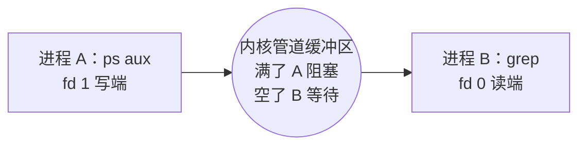
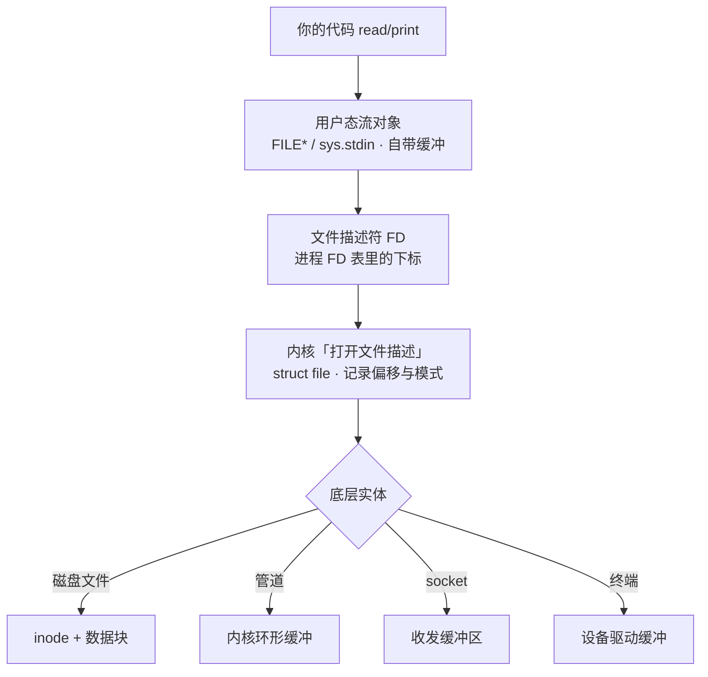

# CLI 应用的输入输出

> 整理自 2026-09-14 与小0的对话。一句话版本：**CLI 的 I/O 通信 = 三个固定编号的通道（FD 0/1/2）+ shell 负责换接头 + 内核负责缓冲**。用法层面的内容（重定向速查、命令坑）见上一篇《[标准管道](./标准管道.md)》，这篇补的是"它们到底是什么"——顺着三轮追问：管道是虚拟文件吗？流是真实的文件吗？stdin/stdout 是真实的文件吗？

## 一、三个标准流：进程的固定接口

每个 CLI 进程启动时，shell 自动塞给它三个已打开的文件描述符（File Descriptor, FD）：

| 通道 | FD | 方向 | 默认连接 | 用途 |
|---|---|---|---|---|
| stdin（标准输入） | 0 | 进程 ← 外界 | 键盘/终端 | 读入数据 |
| stdout（标准输出） | 1 | 进程 → 外界 | 屏幕/终端 | 正常结果（行缓冲） |
| stderr（标准错误） | 2 | 进程 → 外界 | 屏幕/终端 | 报错、日志（不缓冲） |

**关键认知**：进程不知道也不关心通道另一头是什么，只管往 FD 1 写字节、从 FD 0 读字节。另一头是终端、文件还是别的进程，由 shell 在**进程诞生之前**（fork 之后、exec 之前）决定。

类比：进程像一台只有三个固定插口的机器——进料口、成品口、废料口。传送带另一端接的是人、仓库还是下一台机器，它管不着。

## 二、管道与重定向：shell 换接头

| 语法 | 作用 | 例子 |
|---|---|---|
| `>` | stdout 重定向到文件 | `ls > list.txt` |
| `2>` | stderr 重定向到文件 | `python train.py 2> err.log` |
| `2>&1` | stderr 并入 stdout | `make 2>&1 \| tee build.log` |
| `<` | stdin 改从文件读 | `python script.py < input.txt` |
| `\|` | A 的 stdout 接到 B 的 stdin | `ps aux \| grep python` |

管道的连接结构：



两个独立进程靠这根"水管"完成生产者-消费者协作，**全程零自定义协议**——这是 Unix"小工具组合成大工具"的物质基础。

## 三、缓冲：为什么输出"不出现"

| 缓冲模式 | 条件 | 刷新时机 | 翻车现场 |
|---|---|---|---|
| 行缓冲 | stdout 连**终端** | 遇 `\n` 或缓冲满 | `printf` 没加 `\n`，程序崩了输出也丢 |
| 全缓冲 | stdout 被**重定向到文件/管道** | 缓冲满（约 4-8KB）或正常退出 | `./a.out` 能看到输出，`./a.out \| less` 看不到 |
| 无缓冲 | stderr | 立刻 | ——（设计意图：报错必须立刻可见） |

**实战**：想实时看训练日志——`fflush(stdout)` / `print(..., flush=True)` / 环境变量 `PYTHONUNBUFFERED=1` 三选一。tqdm 进度条故意走 stderr，就是蹭"无缓冲"加"不污染数据流"两个好处。

## 四、isatty：程序知道自己连的是什么

`isatty(fd)` 检测另一头是不是真终端，很多程序据此**切换行为**：

| 程序 | 连终端时 | 连管道时 |
|---|---|---|
| `ls` | 按列排版 | 一行一个文件名（方便下游处理） |
| `grep` | 高亮匹配 | 纯文本输出 |
| `git` / `pip` | 进度条动画 | 自动关动画 |

"同一个命令，眼睛看和管道接，输出长得不一样"不是 bug，是程序主动的礼貌。

## 五、键盘那一侧：两种终端模式

内核的**行规程（line discipline）**默认工作在**规范模式（canonical mode）**：敲的键先存内核缓冲，按回车才整行交给程序，期间退格、Ctrl+C、Ctrl+D（EOF）由终端层处理。

vim、htop 这类全屏程序需要每个按键立即响应，就切到**原始模式（raw mode）**——关掉行缓冲和信号处理，自己接管一切。这是"CLI 工具"和"交互式 TUI 工具"的分水岭。

## 六、各语言怎么操作三条流

| 语言 | 读 stdin | 写 stdout | 写 stderr |
|---|---|---|---|
| C | `read(0, ...)` / `fgets(stdin)` | `printf` / `write(1, ...)` | `fprintf(stderr, ...)` |
| Python | `sys.stdin` / `input()` | `sys.stdout` / `print()` | `sys.stderr` |
| Node.js | `process.stdin` | `process.stdout.write()` | `process.stderr.write()` |
| Go | `os.Stdin` / `bufio.Scanner` | `fmt.Print*` | `os.Stderr` |

三种通信方式串起来的最小例子：

```python
import sys

for line in sys.stdin:              # 1. 从 stdin 逐行读（可被 < 或 | 喂入）
    print(line.strip().upper())     # 2. 结果走 stdout（行缓冲）
    print("warn: processed",        # 3. 日志走 stderr（无缓冲，不污染数据流）
          file=sys.stderr, flush=True)
```

```bash
python upper.py < input.txt > output.txt 2> run.log   # 文件喂入、结果进文件、日志单独走
```

## 七、三轮概念辨析（本篇核心）

### 第一轮：管道是虚拟的文件对吧？

**对了一半——接口是文件的，实体是内核内存。**

- 缓冲区由 `pipe()` 系统调用时在**内核内存**里分配（Linux 默认上限 64KB）
- `write()` 把数据拷进内核缓冲，`read()` 再拷出来，全程不碰磁盘
- 所以管道**快**（纯内存拷贝）且**易逝**（读端全关就没了）

但"虚拟文件"要分两类说：

| | 文件系统里有名字吗 | 数据在哪 |
|---|---|---|
| 匿名管道 | 没有（只在 FD 表里） | 内核内存 |
| FIFO（命名管道） | 有（`ls` 权限位前是 `p`，大小恒 0） | **仍然是内核内存** |

FIFO 那个名字**只是路牌**，本身不存数据。FIFO = 匿名管道 + 可寻址的名字。注意 FIFO 的 `open` 默认阻塞到另一端也有进程打开——它是"会合点"语义，像电话不像邮箱。

和真文件的另一个本质区别：文件**可寻址可再生**（有 offset，可 seek 回去重读）；管道**流式一次性**（读过就没，不可回退）。这也是 `cat | grep` 里 grep 崩了、cat 会收到 SIGPIPE 被连带终止的原因——水管下游没了，上游继续灌就是错误。

### 第二轮：流是真实的文件吗？

**不是——流是"访问方式"，文件只是流可以附着的东西之一，两个概念正交。**

"流"是**顺序的、单向的、读过就过去的字节序列视角**。一次 `sys.stdin.read()` 背后真实的层次栈：



每层都真实存在，但**没有一层是磁盘上的"文件"**——连内核里那个"打开的文件"（struct file）都只是内核内存里的一条记录。最铁的证据是 Python 的 `io.StringIO` / `io.BytesIO`：不涉及任何 FD、任何内核对象的纯用户态流。

正确的关系是"交叉"不是"等同"：文件可以以流的方式访问（也可以 seek 随机访问）；流可以附着在文件、管道、socket、内存上。

类比：**文件 = 仓库里的货；流 = 传送带这个"运输视角"。** 货可以上传送带也可以叉车随机搬；传送带上也不一定非得是仓库的货——可以是生产线刚产出的（管道）、别处运来的（socket）、甚至工人手里现捏的（StringIO）。

### 第三轮：stdin/stdout 是真实的文件吗？

**也不是——它们本质是两个数字（0 和 1），进程 FD 表里的下标。**

同一个 stdout，三种启动方式，三种真实实体：

```mermaid
flowchart LR
    P[进程<br/>只认 FD 1 这个口] -->|直接运行| T[终端设备 tty/pty<br/>不是文件]
    P -->|./a.out > a.log| F[磁盘文件<br/>inode + 数据块]
    P -->|./a.out | grep| K[管道缓冲区<br/>内核内存]
```

进程代码一行没改，FD 1 底下的实体换了三个——shell 在 fork+exec **之前**换好的。程序一睁眼 0/1/2 已就位，想知道连的是什么只能 `isatty()` 探。

默认情况连的是 **tty/pty 设备**（内核字符设备驱动，管行编辑、回显、Ctrl+C 信号），不是文件。现代终端模拟器底下基本是 **pty（伪终端）**：一主一从两条通道，模拟器握主端、shell 和 CLI 程序握从端——本质又是一组管道式内存通道。绕一圈还是"内存里的传送带"。

### 三轮拼图

| 问题 | 结论 |
|---|---|
| 管道是虚拟文件吗 | 接口像文件，本体是内核内存缓冲 ✓ |
| 流是真实的文件吗 | ✗ 流是顺序访问的抽象视角，可附着于任何实体 |
| stdin/stdout 是真实的文件吗 | ✗ 是 FD 编号 + 内核里的打开记录，底层实体由启动方式决定，默认是终端 |

**完整图景**：磁盘文件、管道、终端、socket 都是"实体"；FD 和流是访问它们的"把手"和"姿势"；stdin/stdout 只是三个预留给你的固定编号。Unix 的聪明之处是让三个层次彻底解耦——所以同一个 `cat`，今天对着磁盘、明天对着管道、后天对着键盘，代码一个字不用改。

## 八、"一切皆文件"的精确含义

容易滑成"所有进程都该用管道通信"——错。它说的是**接口层面的统一**：很多东西都暴露 `open/read/write/close` 这一套，管道只是这个家族的成员之一（普通文件、终端、socket、`/dev/random`、`/proc/cpuinfo` 都是）。

管道作为 IPC 手段有两个硬限制：

1. **亲缘关系**：匿名管道只在 fork 出的父子/兄弟间传递 FD，两个无关进程默认根本没有彼此的管道口（要跨亲缘得用 FIFO 约定路径名）
2. **单向字节流**：没有消息边界、没有请求-应答、没有随机访问——A 写 "abc" 再写 "def"，B 读到的是 "abcdef"，切不开

什么时候该换别的 IPC：

| 需求 | 管道的问题 | 更合适的机制 |
|---|---|---|
| 双向对话 | 单向，搭两根别扭 | socketpair / Unix domain socket |
| 跨机器 | 只在本机内核 | TCP socket |
| 传结构化消息 | 无边界，得自己切包 | 消息队列 / socket + 协议 |
| 高频大量数据 | 每次读写都陷内核，慢 | 共享内存 + 信号量 |
| 只通知"事件发生了" | 传数据太重 | 信号（SIGUSR1） |

类比收尾：**"一切皆文件"统一的是插座形状，不是规定所有电器都用延长线。** 管道是延长线，socket 是网线，共享内存是把两台设备焊在同一块主板上——插座标准统一，所以各种线都能即插即用。

## 九、关联牛只检测研究场景

- **训练日志**：`nohup python train.py 2>&1 | tee train.log` 的本质——stderr 并进 stdout，管道把混合流同时送到屏幕（tee 的 stdout）和文件（tee 自己写的文件）。看懂了层次栈，这就不再是咒语
- **DataLoader 多进程**：`num_workers>0` 时主进程和 worker 之间传序列化 batch，用的就是**匿名管道**——亲缘进程 + 单向流 + 生产者消费者，正好是管道的主场
- **评测脚本串联**：`python infer.py < val_list.txt | python eval.py` 这类流水线，数据不落盘直接流过去，7 个数据集批量推理时省大量中间 IO

## 一句话带走

**磁盘文件、管道、终端、socket 是"实体"；FD 是"把手"；流是"姿势"；stdin/stdout 是三个固定编号。** Unix 把这三层彻底解耦，才换来工具的随意组合。

---

