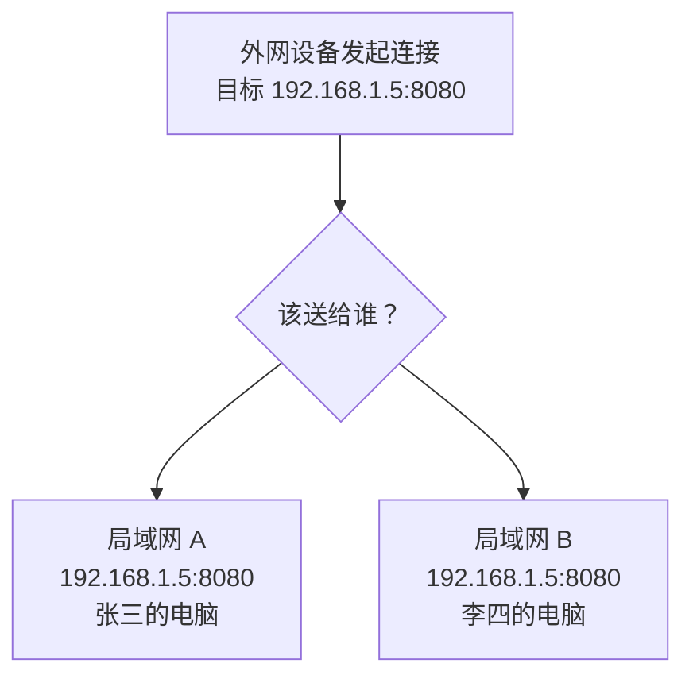
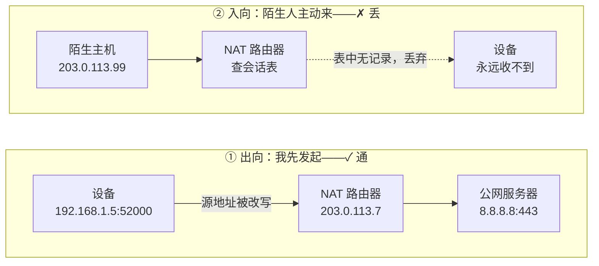
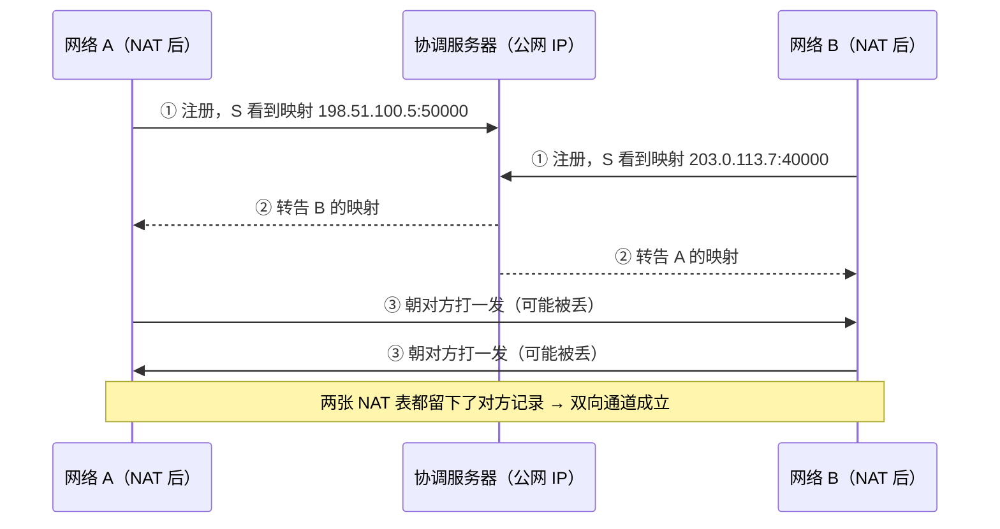

# 套接字、NAT 与打洞

> 核心一句话：**套接字回答的是「送给哪台机器的哪个进程」，公网 IP 回答的是「这个包能不能被送到」——前者是端点标识，后者是可路由性，两者根本不在一个层面上。**
>
> 起点是一个很自然的疑问：套接字里明明已经有 IP 了，为什么还要单独强调公网 IP？

## 一、套接字解决了什么，没解决什么

**套接字（socket）= IP 地址 + 端口号**。两部分各管一件事：

| 组成 | 回答的问题 | 层次 |
|---|---|---|
| IP 地址 | 送给**哪台**机器 | 主机寻址 |
| 端口号 | 送给**哪个**进程 | 进程寻址 |
| 公网 IP | 这个包**能不能**跨网络被送到 | 路由 / 可达性 |

关键在于：**套接字只描述端点，不描述路径。** 一个 `bind()` 成功、`listen()` 挂着的套接字，在自己网络里畅通无阻，但从外网看它可能等于不存在。

而套接字里的那个 IP，绝大多数时候并不是公网 IP。

## 二、私网 IP 与地址复用

RFC 1918 划出三段地址专供内网反复使用：

| 地址段 | 范围 | 用途 |
|---|---|---|
| `10.0.0.0/8` | 10.0.0.0 – 10.255.255.255 | 大型内网 |
| `172.16.0.0/12` | 172.16.0.0 – 172.31.255.255 | 中型内网 |
| `192.168.0.0/16` | 192.168.0.0 – 192.168.255.255 | 家用 / 小型网络 |
| `100.64.0.0/10` | 100.64.0.0 – 100.127.255.255 | **CGNAT 专用共享地址（RFC 6598）** |

最后一段值得单独记住：它专门留给运营商级 NAT 用。看到 `100.x.x.x` 这个地址，基本可以断定自己在运营商的大内网里（Tailscale 也借用了这个段做虚拟网段）。

后果是：**`192.168.1.5:8080` 这个套接字在全世界同时存在几千万个。**



> **类比**：套接字写的是「3 号楼 502 室」。在你自己小区里这地址完全够用；但从外地寄件就废了——全国有几百万个 3 号楼，必须前面加一段「武汉市××区××路××号」才全球唯一。那段，就是公网 IP 的角色。

## 三、NAT 的非对称性

NAT（网络地址转换）站在内网与外网之间，做的是**改写 + 记账**：包出去时把源地址换成公网地址，同时在会话表里记一笔；回包进来时查表翻译回去。

Linux 上这张表由 netfilter 的 **conntrack** 机制维护。以一次典型出向为例：

```
设备 192.168.1.5:52000  →  NAT 改写  →  203.0.113.7:34567  →  8.8.8.8:443
会话表新增：192.168.1.5:52000  ↔  203.0.113.7:34567  ↔  8.8.8.8:443
```



于是入向包有三种命运：

| 入向包的身份 | NAT 的反应 |
|---|---|
| 你刚联系过的对端（回包） | ✅ 查表命中，放行 |
| 从未出现过的陌生 IP | ❌ 表中无记录，丢弃 |
| 通过 UPnP / NAT-PMP 主动申请过的映射 | ✅ 长期放行（人为开的洞） |

### 常见误解修正（重要）

**不能说「NAT 只能出不能进」。** 打开网页、收到响应，那些数据就是服务器主动推回给你的——这本身就是被动接收。

准确表述是：

> **NAT 只放行「它登记过的那个对端」发来的包，而不是「谁都不放行」。**

这也意味着：**出向能力可以兑换成入向能力**——前提是对方也朝你兑换一次。这就引出了第五节。

## 四、出口 IP 不等于入口可达

一个常见的推理是：「既然设备能访问公网，那它一定有一个出口 IP，所以别人应该能连上它。」

前半句对，后半句推不出来。有三个隐藏前提：

| 前提 | 说明 | 不满足时的后果 |
|---|---|---|
| **入站可达** | NAT 放行回包 ≠ 放行陌生人 | 外部 TCP SYN 根本到不了机器，本机无感知 |
| **独占** | 家宽大量上了 CGNAT，整栋楼上千户共享一个公网 IP，靠端口段切分 | 自家路由器上做端口映射也没用——那个公网 IP 不在你家路由器上 |
| **稳定** | 家宽出口 IP 动态分配，重拨 / 断电 / 运营商回收都会变 | 需要 DDNS 追着它跑 |

**判断是否在 CGNAT 里**：对比路由器 WAN 口显示的 IP 和外部看到的 IP。

```bash
curl ifconfig.me          # 外网看到的出口 IP
# 与路由器管理页面 WAN 口 IP 比对，不一致 → 你在 CGNAT 后面
```

另一层容易被忽略的事实：**出口 IP 是「别人眼中的你」，不是「你自己的地址」。** 设备本身从头到尾只知道自己是 `192.168.1.5`，那个公网地址是 NAT 在包出去的一瞬间贴上、并写进会话表的临时标签。这也是为什么大多数人根本不知道自己的出口 IP 是什么。

> **收口**：出口 IP 是「你有资格当客户端」，独占公网 IP + 映射是「你有资格当服务器」。用的是同一个地址，但 NAT 只兑现了前一个承诺。

## 五、打洞与协调服务器

既然出向永远合法，那就反过来用它——**让两台都在 NAT 后面的机器，各自主动向对方发一次包**。

打洞三步：



第 ③ 步里，**第一个包大概率被对方 NAT 丢掉，但没关系**——发包方自己的 NAT 已经把对方写进了会话表。此后双方在彼此 NAT 眼里都是「登记过的对端」。

严格来说不需要精确「同时」，只要两边都发过至少一次即可；但实践中要快，因为 UDP 映射表项超时通常只有几十秒。

### 为什么 UDP 好打、TCP 难打

UDP 无连接，只要源端口对上就行；TCP 的 SYN 需要控制序列号，且很多 NAT 对 TCP 映射更保守。所以 P2P 场景基本都退守 UDP，WebRTC 就用 STUN / ICE 这套。

### 什么时候打洞会失败

取决于 NAT 类型（RFC 3489 的经典分类）：

| NAT 类型 | 行为 | 打洞难度 |
|---|---|---|
| Full Cone | 映射与目标无关 | 最容易 |
| Restricted Cone | 只放行我联系过的 **IP** | 容易 |
| Port Restricted Cone | 只放行我联系过的 **IP:端口** | 一般 |
| **Symmetric** | **每个不同目标分配不同源端口** | 最难，常直接失败 |

对称型 NAT 是打洞杀手：它告诉协调服务器的「对方的地址」，从对方视角压根不是同一个口，洞打不穿。

## 六、协调服务器的两张面孔

注意区分——协调服务器**只负责介绍，不负责搬运**：

| | **介绍**（STUN） | **搬运**（TURN） |
|---|---|---|
| C 做什么 | 只交换双方公网地址 | 亲自中转每个数据包 |
| 数据走哪 | A ↔ B 直连，绕过 C | A → C → B，必过 C |
| C 的带宽开销 | 几乎为零 | 全量流量都压在它身上 |
| 什么时候用 | 打洞成功 | 打洞失败（对称型 NAT） |
| 延迟 | 最低 | 多一跳，受 C 带宽限制 |

**介绍几乎不花成本，搬运极贵。** 所以所有 P2P 框架的第一反应都是「能不能直连」，只有直连彻底没戏才退到中继。**ICE**（WebRTC 用的协商框架）就是干这个决策的：先试直连，失败降级到 TURN。

业界经验数据：**约 20~30% 的连接在对称型 NAT 下不靠 TURN 就会失败**——所以 TURN 是保险，不是可选项。

> **类比**：协调服务器是那个「共同的朋友」。正常情况朋友帮着引荐一下，之后你俩自己约，朋友不占带宽。但要是一个在沙漠、一个在孤岛实在见不着面，朋友就只能亲自当传话筒，每句话都经他转，成本也全落他头上。

**自建选型**（如果你要写 P2P / WebRTC 应用）：

| 方案 | 定位 | 备注 |
|---|---|---|
| **Coturn** | 事实标准 | Jitsi Meet、Nextcloud Talk、Matrix 的默认选择；C 写的，功能最全 |
| **Eturnal** | 现代轻量替代 | Erlang 写的，配置比 coturn 清爽 |
| **Pion TURN** | Go 库 | 想嵌进自己的 Go 程序就用它 |
| **Metered / Twilio** | 托管 | 不想运维就买，按流量计费 |

顺带一个细节：**STUN 很廉价**——`stun.l.google.com:19302` 白嫖就够，它只回答「我的公网地址是什么」。真正费钱费事的是 **TURN**，因为要双向搬运全量流量（一份数据耗两份带宽）。标准端口：`3478`（STUN/TURN）、`5349`（TURN over TLS）。

## 七、落到实操：组网工具怎么选

如果目标不是「写应用」，而是「在外地访问实验室的机器」，那需要的不是 STUN/TURN，而是 Mesh VPN（异地组网）：

| 工具 | 底层 | 国内友好度 | 可自建 | 适合谁 |
|---|---|---|---|---|
| **EasyTier** | 自研 | ★★★ 最好，NAT4 都能打 | ✅ 全开源 | 国内多设备、NAS、软路由 |
| **NetBird** | WireGuard | ★★ | ✅ 全开源 | 要 Web 后台 + 细粒度 ACL |
| **Tailscale** | WireGuard | ★ 中继在海外，国内易卡 | Headscale | 设备少、想零折腾 |
| **ZeroTier** | 自研二层 | ★ 公共节点常被限速 | ZTNet | 游戏联机、需二层广播 |
| **Nebula** | 自研 | — | ✅ | 上百台服务器集群 |

**利用好已有资源**：手上如果有独占公网 IP 的机器，它就是天然的公共节点 / 中继 / 控制端，能省掉境外中继那笔账。EasyTier 尤其适合这种打法——把公网机器配成公共节点，国内打洞成功率最高、延迟最低。

**部署前先踩一个坑**：校园网 / 单位网络经常限制对外开端口。动手前先确认目标机器能监听新端口（不只是 22），很多学校只放行常见端口，或者直接封了 UDP。这一步不通，后面全白搭。

### 与深度学习工作的关联

这类知识和日常训练工作直接相关：

- **远程开发**：宿舍 / 外地 SSH 到实验室 A100 工作站，靠的就是那台机器有独占静态公网 IP；换台只有出口 IP 的家宽机器，同样的命令就连不上
- **多机分布式训练**：PyTorch DDP / NCCL 要求各 rank 之间双向可达（rank 0 监听端口，其余节点连它）。如果节点分处不同校园网，光有套接字互相够不着，必须先组网
- **标注平台远程访问**：Label Studio 部署在内网，要从外网访问，同样绕不开这个链条

## 八、较真环节（智识诚实）

几个容易说过头的地方：

1. **「NAT 不能被动接收」不准确**——回包就是被动接收。准确说是「不放行未登记的对端」。
2. **「打洞需要精确同时」不准确**——只需要双方都主动发过一次；同时只是提高成功率、对抗映射超时。
3. **「有公网 IP 就能被访问」不准确**——还要独占、稳定，且没有被上游防火墙拦。
4. **NAT 类型分类在实践中比 RFC 3489 的四分类复杂**，现实中还有 RFC 5780 的行为发现方法，很多 NAT 是混合行为，不能简单贴标签。

## 总结

整条链是一层层递进的：

| 层 | 提供的能力 | 缺失的部分 |
|---|---|---|
| 套接字 | 标识端点 | 不保证可达 |
| 私网 IP | 网内唯一 | 不可路由 |
| NAT 出向 | 可当客户端 | 只兑换给联系过的对端 |
| 公网 IP（独占 + 映射） | 可当服务器 | 稀缺、可能要钱 |
| 打洞 / 中继 | 两者兼得 | 需协调服务器，依赖 NAT 类型 |

> 一句话带走：**NAT 不允许「无中生有」的入向连接，但允许你把出向能力「兑换」成入向能力——前提是这张网里也得有人朝你兑换一次。**

---

*整理自 2026-09-14 与小0的对话*

## 延伸阅读

| 文档 | 内容 |
|---|---|
| RFC 1918 | 私网地址分配 |
| RFC 6598 | CGNAT 共享地址空间（100.64.0.0/10） |
| RFC 5389 | STUN |
| RFC 8656 | TURN（取代 RFC 5766） |
| RFC 8445 | ICE |
| RFC 3489 | NAT 行为分类（经典四分类，已被 RFC 5780 补充） |
