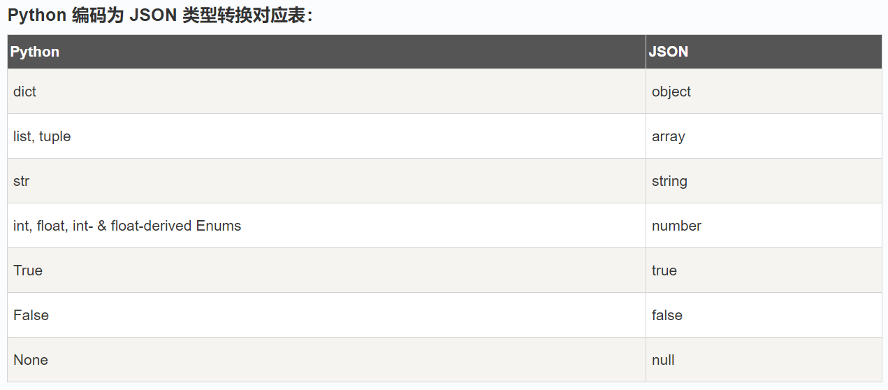

## Animal-Pose Dataset

**coco格式的含关键点标注转yolo**

参数:

- coco_json_path: COCO JSON文件的路径 
- output_dir: 输出YOLO标签的目录
- class_id_map: (可选) 自定义类别ID映射字典，如果不提供则使用原始ID-1

 \# 1. 加载COCO JSON文件

JSON (JavaScript Object Notation) 是一种轻量级的数据交换格式。

Python3 中可以使用 json 模块来对 JSON 数据进行编解码，它包含了两个函数：

- **json.dumps():** 对数据进行编码。
- **json.loads():** 对数据进行解码。



```python
#!/usr/bin/python3
 
import json
 
# Python 字典类型转换为 JSON 对象
data = {
    'no' : 1,
    'name' : 'Runoob',
    'url' : 'https://www.runoob.com'
}
 
json_str = json.dumps(data)
print ("Python 原始数据：", repr(data))
print ("JSON 对象：", json_str)
#如果你要处理的是文件而不是字符串，你可以使用 **json.dump()** 和 **json.load()** 来编码和解码JSON数据
# 写入 JSON 数据
with open('data.json', 'w') as f:
    json.dump(data, f)
 
# 读取数据
with open('data.json', 'r') as f:
    data = json.load(f)
```

## Python3 File(文件) 方法

Python **open()** 方法用于打开一个文件，并返回文件对象。使用 **open()** 方法一定要保证关闭文件对象，即调用 **close()** 方法。

**open()** 函数常用形式是接收两个参数：文件名(file)和模式(mode)。

```python
with open ("D://test.json", 'r', encoding='utf-8') as f:
    print(f.read())
```

## Python3 OS 文件/目录方法

`os` 模块是 Python 标准库中的一个重要模块，它提供了与操作系统交互的功能。

通过 `os` 模块，你可以执行文件操作、目录操作、环境变量管理、进程管理等任务。

`os` 模块是跨平台的，这意味着你可以在不同的操作系统（如 Windows、Linux、macOS）上使用相同的代码

`os.chdir(path)` 函数用于改变当前工作目录。`path` 是你想要切换到的目录路径。

`os.getcwd()` 函数用于获取当前工作目录的路径。当前工作目录是 Python 脚本执行时所在的目录。

**`os.listdir(path)` 函数用于列出指定目录中的所有文件和子目录。如果不提供 `path` 参数，则默认列出当前工作目录的内容。**

```python
# 2. 创建输出目录
    os.makedirs(output_dir, exist_ok=True)
```

[pathlib](https://so.csdn.net/so/search?q=pathlib&spm=1001.2101.3001.7020) 模块提供了表示文件系统路径的类，可适用于不同的操作系统。使用 pathlib 模块，相比于 os 模块可以写出更简洁，易读的代码

- Path.cwd()，返回文件当前所在目录。
- Path.home()，返回用户的主目录。

**建立映射**

```python
images = coco_data['images']
    image_id_to_info = {}
    for img_id, img_name in images.items():
    image_id_to_info[int(img_id)] = {
            'file_name': img_name,
            'width': None,  # 需要实际获取
            'height': None  # 需要实际获取
        }
   print(f"{name}")  #printf是格式化的输出方式
```

## 正则表达式

**re.match()必须从字符串开头匹配！**match方法尝试从字符串的起始位置匹配一个模式，如果不是起始位置匹配成功的话，**match()就返回none。**

```python

import re
re.match(pattern, string, flags=0)

print(re.match('test','atestasdtest'))  #返回None
print(a.span())           #返回匹配结果的位置，左闭右开区间
'''
. 匹配任意一个字符
\d 匹配数字
\D 匹配非数字
\s 匹配特殊字符，如空白，空格，tab等
\S 匹配非空白
\w 匹配单词、字符，如大小写字母，数字，_ 下划线
[ ] 匹配[ ]中列举的字符
[^2345] 不匹配2345中的任意一个
[a-z3-5] 匹配a-z或者3-5中的字符
 * 出现0次或无数次
 + 至少出现一次
 ? 1次或则0次
 {m}指定出现m次
 {m,n} 指定从m-n次的范围
 $ 匹配结尾字符
 ^ 匹配开头字符
 \b 匹配一个单词的边界
 对于Python字符串，前面加’r’的解释较为简单，就是决定一个字符串是否为原生字符串,转意
```

```

```

## YAML

YAML (YAML Ain't Markup Language) 是一种人类可读的数据序列化格式，主要用于以下目的：

- 作为配置文件格式：  许多编程语言和框架采用 YAML 作为配置文件的格式。

- 作为应用程序之间的数据交换格式：  YAML 常和 JSON 一起被用作数据交换格式。

- 描述结构化数据：  YAML 可用于描述文档、产品信息、各种元数据等。

- 数据可以以人类易读易写的格式进行书写。
- 比 JSON 更简洁的语法。
- 空白字符（空格和制表符）具有特殊意义，因此缩进很重要。
- 能够包含注释。
- 能够表示数据类型，例如字符串、数字、数组和对象。

在 YAML 中，数据主要通过键值对来表示，这样的键值对以冒号 (`:`) 分隔。

当存在数据层级时，使用缩进（通常为两个空格）来继续描述下级对象。

```yaml
key: value


parent:
  child: value
  
# 数组使用短划线（-）来书写。如果有多个条目，每个条目必须以短划线开头。

fruits:
  - apple
  - orange
  - banana
  
#对象也使用键值对，但需要使用缩进。

user:
  name: Taro
  age: 23
  
  #遵循这些规则，您可以轻松编写 YAML 文件。与json相比，主要区别在于缩进和空白字符在 YAML 中是有意义的。因此，如果您熟悉 JSON，在使用 YAML 进行编写时需要特别注意这些差异。
```


```python

# 样本 YAML文件
 
# 字典（映射）
book:
  title: Introduction to YAML
  author:
    # 嵌套的映射
    name: Yamada Taro
    age: 38
  year: 2023
  pages: 120
  chapters:
    # 列表
    - Introduction
    - Basics
    - Advanced Techniques
 
# 列表
fruits:
  - apple
  - orange
  - banana
 
# 字符串
description: |
  YAML 是一个人类友好的数据序列化标准。
  它通常用于配置文件和 API 中。
 
# 数值
price: 9.99
 
# 布尔值
published: true
 
# 空值
score: ~
一键获取完整项目代码
```


```PYTHON
yaml_content = " "
with open(yaml_path, 'w', encoding='utf-8') as f:
        f.write(yaml_content)
    
    print(f"数据集配置文件已生成: {yaml_path}")
    
```

Python 读取yaml常见的有两种方式，一种是使用`pyyaml`，另一种是`ruamel.yaml`

```python
# coding=utf-8

import yaml


def read_yaml(file_path):
    with open(file_path, "r") as f:
        return yaml.safe_load(f)


data = read_yaml("test.yaml")
print(data)  # {'age': 45, 'name': 'zhangsan'}


with open(file_path, 'w') as f:
        yaml.safe_dump(date, f, allow_unicode=True)
```

在PyYAML库中，yaml.safe_load()和yaml.load()都可以用来解析YAML文件，但是有一些区别：

- 安全性: yaml.safe_load()可以安全地从YAML文档中加载数据，而不会执行任何可疑的Python代码。这使得它非常适合处理来自不受信任的源的YAML文档。yaml.load()则不提供此安全功能，因此不建议使用它来加载未知或不受信任的YAML文档。

- 数据类型:yaml.safe_load()只能加载基本的Python数据类型，例如字符串、数字、列表和字典等。而yaml.load()可以加载任何Python对象，包括自定义类实例和Python内置类型的子类。

## XML

xml.etree.ElementTree 是 Python 标准库中用于处理 XML 的模块，它提供了简单而高效的 API，用于解析和生成 XML 文档。

ElementTree 和 Element 对象:

- **ElementTree**： ElementTree 类是 XML 文档的树形表示。它包含一个或多个 Element 对象，代表整个 XML 文档。
- **Element**： Element 对象是 XML 文档中元素的表示。每个元素都有一个标签、一组属性和零个或多个子元素。

**fromstring() 方法**： 使用 fromstring() 方法可以将包含XML数据的字符串转换为 Element 对象：

**parse() 方法**： 如果XML数据存储在文件中，可以使用 parse() 方法来解析整个 XML 文档：

```PYTHON
tree = ET.parse('example.xml')
root = tree.getroot()
```

**find() 方法**： 使用 find() 方法可以查找具有指定标签的第一个子元素：

```
title_element = root.find('title')
```

**findall() 方法**： 使用 findall() 方法可以查找具有指定标签的所有子元素：

```
book_elements = root.findall('book')
```

**attrib** 属性： 通过 attrib 属性可以访问元素的属性：

```
price = book_element.attrib['price']
```

**text** 属性： 通过 text 属性可以访问元素的文本内容：

```
title_text = title_element.text
```

**Element() 构造函数**： 使用 Element() 构造函数可以创建新的元素：

```
new_element = ET.Element('new_element')
```

**SubElement() 函数**： 使用 SubElement() 函数可以创建具有指定标签的子元素：

```
new_sub_element = ET.SubElement(root, 'new_sub_element')
```

修改元素的属性和文本内容： 直接修改元素的 attrib 和 text 属性。

删除元素： 使用 remove() 方法可以删除元素：

```
root.remove(title_element)
```

## glob

glob是python中的内置模块，该模块主要是用来查找文件与目录的。glob模块是按照 Unix shell 所使用的规则找出所有匹配特定模式的路径名称。我们只需要了解该模块的匹配规则与常用函数，就会使文件查找，路径匹配变得非常快捷简单。

##### 1.1 通配符

- `*`：匹配0个或多个字符；
- `**`：匹配所有文件、目录、子目录和子目录里的文件（3.5版本新增）；
- `?`：代匹配一个字符；
- `[]`：匹配指定范围内的字符，如[0-9]匹配数字，[a-z]匹配小写字母；

- `glob.glob()`：返回符合匹配条件的所有文件的路径；
- `glob.iglob()`：返回一个迭代器对象，需要循环遍历获取每个元素，得到的也是符合匹配条件的所有文件的路径；
- `glob.escape()`：escape可以忽略所有的特殊字符，就是星号、问号、中括号；

`recursive=False`：代表递归调用，与特殊通配符`“**”`一同使用，默认为False，False表示不递归调用，True表示递归调用；

##### 匹配当前目录下后缀为jpg的文件，包括子目录

```python
path = r'D:\picture\**\*.jpg'
files = glob.glob(path, recursive=True)
print(files)
```

## argparse

**argparse**是一个用来解析命令行参数的 Python 库，它是 Python 标准库的一部分。基于 python 2.7 的stdlib 代码。

**argparse**模块使编写用户友好的命令行界面变得容易。

一般未使用到终端命令，对于一些需要变量赋值的程序，我们往往：

- 1、直接在程序中（或配置文件）写死。
- 2、或者利用input在命令行多次输入 这样不易多次调试及修改运行。

使用argparse的主要步骤：

- 导入**argparse**包；
- 创建**ArgumentParser()**参数对象；
- 调用**add_argument()**方法往参数对象中添加参数；
- 使用**parse_args()**解析添加参数的参数对象，获得解析对象；程序的其他部分需要使用命令行参数时，用解析对象.参数获取。

```python
import argparse  # 1、导入argpase包


def parse_args():
    parse = argparse.ArgumentParser(description='Calculate cylinder volume')  # 2、创建参数对象
    parse.add_argument('radius', type=int, help='Radius of Cylinder')  # 3、往参数对象添加参数
    parse.add_argument('height', type=int, help='height of Cylinder')
    args = parse.parse_args()  # 4、解析参数对象获得解析对象
    return args

# 计算圆柱体积
def cal_vol(radius, height):
    vol = math.pi * pow(radius, 2) * height
    return vol

if __name__ == '__main__':
    args = parse_args()
    print(cal_vol(args.radius, args.height))  # 5、使用解析对象.参数获取使用命令行参数

if len(sys.argv) == 1:
        print("使用快速开始模式...")
        quick_start()
    else:
        main()
```

sys.argv变量是一个字符串的列表。特别地，sys.argv包含了命令行参数 的列表，即使用命令行传递给你的程序的参数。

sys.argv[]是用来获取命令行参数的，sys.argv[0]表示代码本身文件路径;比如在CMD命令行输入 “python test.py -help”，那么sys.argv[0]就代表“test.py”。

## CSV

要读取 CSV 文件，可以使用 `csv.reader` 对象。以下是一个简单的示例：

要写入 CSV 文件，可以使用 `csv.writer` 对象。以下是一个示例：

```python
import csv

# 打开 CSV 文件
with open('data.csv', mode='r', encoding='utf-8') as file:
    # 创建 csv.reader 对象
    csv_reader = csv.reader(file)
    
    # 逐行读取数据
    for row in csv_reader:
        print(row)
        
# 要写入的数据
data = [
    ['Name', 'Age', 'City'],
    ['Alice', '30', 'New York'],
    ['Bob', '25', 'Los Angeles']
]

# 打开 CSV 文件
with open('output.csv', mode='w', encoding='utf-8', newline='') as file:
    # 创建 csv.writer 对象
    csv_writer = csv.writer(file)
   
    # 写入数据
    for row in data:
        csv_writer.writerow(row)
```

`csv` 模块还提供了 `DictReader` 和 `DictWriter` 类，它们可以将 CSV 文件的每一行解析为字典，或者将字典写入 CSV 文件。

```python
with open('data.csv', mode='r', encoding='utf-8') as file:
    csv_dict_reader = csv.DictReader(file)
   
    for row in csv_dict_reader:
        print(row)
        
data = [
    {'Name': 'Alice', 'Age': '30', 'City': 'New York'},
    {'Name': 'Bob', 'Age': '25', 'City': 'Los Angeles'}
]

with open('output.csv', mode='w', encoding='utf-8', newline='') as file:
    fieldnames = ['Name', 'Age', 'City']
    csv_dict_writer = csv.DictWriter(file, fieldnames=fieldnames)
   
    # 写入表头
    csv_dict_writer.writeheader()
   
    # 写入数据
    for row in data:
        csv_dict_writer.writerow(row)
```

## pathlib

#### 获取目录

- Path.cwd()，返回文件当前所在目录。
- Path.home()，返回用户的主目录。

#### 目录拼接

斜杠 / 操作符用于拼接路径，比如创建子路径。

```python
from pathlib import Path
currentPath = Path.cwd()
newPath = currentPath / 'python-100'
print("新目录为:%s" %(newPath))
```

#### 创建、删除目录

- Path.mkdir()，创建给定路径的目录。
- Path.rmdir()，删除该目录，目录文件夹必须为空。

- Path.name，可以获取文件的名字，包含后缀名。
- Path.parent，返回文件所在文件夹的名字。
- Path.stem，获取文件名不包含后缀名。
- Path.suffix，获取文件的后缀名。

## opencv

OpenCv-Python是一个用于解决计算机视觉问题的Python绑定库。

OpenCV-Python使用**Numpy**，它是一个高度优化的库，用于使用**matlab**风格的语法进行数值操作。

所有的OpenCV数组结构都被转换为Numpy,和从Numpy数组转换而来。这也使得与其他使用Numpy(如SciPy和**Matplotlib**)的库集成更加容易。

#### **pip 安装**

```python
pip3 install opencv-python
```

### **OpenCV 的基本用法**

#### 读取和显示图像

```python
import cv2
# 读取图像
image = cv2.imread('image.jpg') #cv2.imread 函数用于读取图像。
# 显示图像
cv2.imshow('Image', image)   #cv2.imshow 函数用于显示图像。
cv2.waitKey(0) #cv2.waitKey(0) 使得窗口等待直到用户按下任意键
cv2.destroyAllWindows()  #cv2.destroyAllWindows 关闭所有OpenCV创建的窗口
```

####  使用 Matplotlib展示图片

```python
import numpy as np
import cv2 as cv
from matplotlib import pyplot as plt
img = cv.imread('example.jpg',0)
plt.imshow(img, cmap = 'gray', interpolation = 'bicubic')
plt.xticks([]), plt.yticks([])  # to hide tick values on X and Y axis
plt.show()
```

彩色图像使用 OpenCV 加载时是 BGR 模式。但是 Matplotib 是 RGB 模式。所以彩色图像如果已经被 OpenCV 读取,那它将不会被 Matplotib 正 确显示。

1. img = cv2.imread('example.jpg')
2. b,g,r = cv2.split(img)
3. img2 = cv2.merge([r,g,b])

cv2.rectangle(img, (x_min, y_min), (x_max, y_max), color, 2) # 绘制矩形框

cv2.putText()

#### 对cv2.getTextSize的返回值的详细介绍

返回的格式如下,(是以putText的坐标做为基准点)(width,height),bottom

cv2.imwrite(output_path, img)

**字体**

| 常量名 | 字体样式 | 特点 |
| ------ | -------- | ---- |
|cv2.FONT_HERSHEY_SIMPLEX|无衬线字体|最常用、清晰|
|cv2.FONT_HERSHEY_PLAIN|简单小字体|小尺寸显示|
|cv2.FONT_HERSHEY_DUPLEX|双线条字体|更平滑|
|cv2.FONT_HERSHEY_COMPLEX|复杂字体|较大、曲线更自然|
|cv2.FONT_HERSHEY_TRIPLEX|三线条字体|更醒目|
|cv2.FONT_HERSHEY_COMPLEX_SMALL|复杂小字体|小尺寸文字|
|cv2.FONT_HERSHEY_SCRIPT_SIMPLEX|手写体|花体风格|
|cv2.FONT_HERSHEY_SCRIPT_COMPLEX|手写复杂体|更艺术化|
|cv2.FONT_ITALIC|倾斜样式|与其他字体组合使用|


