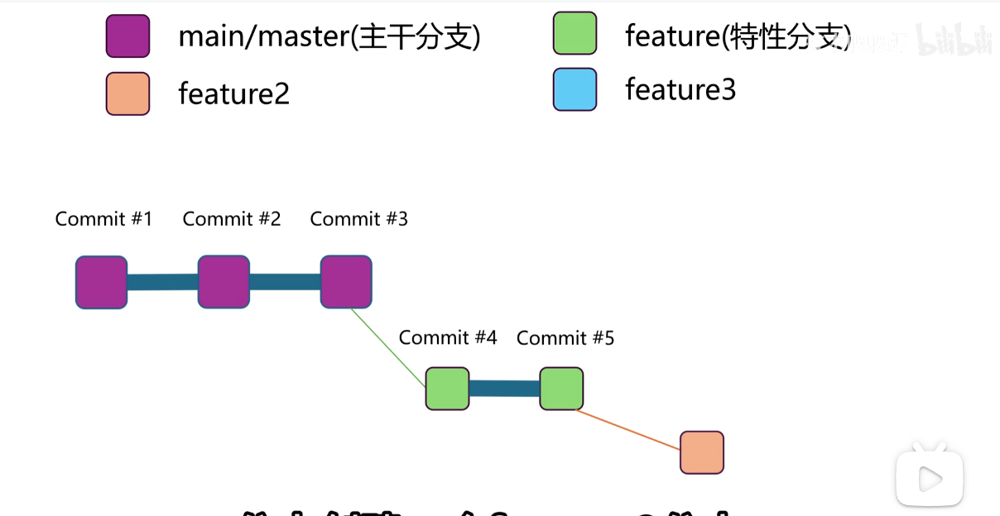

## 集成git

通过git官网下载git，选择自己的系统下载即可

若是第一次使用 git 的话，请先配置全局的用户名和邮箱

```python
git config --global user.name "Your Name"
git config --global user.email "youremail@yourdomain.com"

git config --list
user.name=Your Name
user.email=youremail@yourdomain.com


# 初始化仓库
git init

# 克隆远程仓库
git clone <repo_url>

# 查看当前状态
git status

# 添加全部修改到暂存区
git add .

# 提交到本地仓库
git commit -m "提交说明"

# 查看提交历史（精简版）
git log --oneline

# 查看文件修改差异
git diff


# 添加远程仓库
git remote add <remote_name> <repo_url>

# 推送本地分支到远程
git push -u <remote_name> <branch_name>
git push [远程仓库名] [本地分支名]:[远程分支名]


# 强制推送（慎用！）
git push -f

# 拉取远程更新
git pull <remote_name> <branch_name>

# 获取远程分支但不合并
git fetch

# 删除远程分支
git push <remote_name> --delete <branch_name>


# 图形化提交历史
git log --graph --all

# 按作者搜索提交
git log --author="name"

# 搜索提交内容
git log -S "keyword"

# 显示某文件的修改历史
git blame <file>

# 忽略文件权限变更
git config core.fileMode false

# 生成.gitignore模板
curl https://gitignore.io/api/<语言/工具>

# 查看仓库大小
git count-objects -vH

# 克隆指定分支（浅克隆）
git clone --branch <branch_name> --depth 1 <repo_url>

```

## Git 的三个主要区域

```cmd
Working Directory
        ↓ git add
Staging Area
        ↓ git commit
Repository
```


| 区域              | 中文   | 作用                 |
| ----------------- | ------ | -------------------- |
| Working Directory | 工作区 | 你正在修改的文件     |
| Staging Area      | 暂存区 | 准备提交的内容       |
| Repository        | 仓库区 | Git 已保存的历史版本 |

### 工作区特点

工作区中的内容：

- 可以随意修改
- 可以删除
- 可以新增
- Git 尚未正式记录

此时 Git 只是知道：“你改了东西”,但还没有进入版本历史。


仓库区：这里保存：

- commit 历史
- branch
- tag（给特定的commit打标签）
- Git 对象
- 版本快照

### commit 后会发生什么

Git 会：

- 生成 commit SHA
- 保存文件快照
- 建立历史链
- 更新当前 branch

| 命令         | 本质            |
| ------------ | --------------- |
| git add      | 工作区 → 暂存区 |
| git commit   | 暂存区 → 仓库   |
| git reset    | 仓库 → 暂存区   |
| git restore  | 暂存区 → 工作区 |
| git checkout | 仓库 → 工作区   |


### 暂存区

你想知道 Git 中「暂存区」存在的意义，这是理解 Git 核心设计的关键，这里通俗的语言解释清楚暂存区的价值，以及它能解决哪些实际问题。

一、先理解：暂存区到底是什么？
可以把 Git 的工作流程想象成「整理快递并寄出」：

工作区：你家里堆满快递的桌子（所有修改的文件都在这里，杂乱无章）；
暂存区：你打包好的快递箱（只放你确定要寄出的东西，分类清晰）；
本地仓库：快递公司的仓库（一旦寄出，就永久记录，不能随便改）。
暂存区就是「待提交修改的缓冲区」，是工作区和本地仓库之间的 “中间站”。

二、为什么需要暂存区？核心价值
没有暂存区的话，你只能 “一次性把工作区所有修改都提交”，而暂存区的存在，让 Git 具备了精细化提交的能力，这也是它和其他版本控制系统（如 SVN）的核心区别之一。

1. 解决「部分提交」的需求（最核心）
实际开发中，你可能同时改了多个文件（比如改了功能代码、修复了 bug、还改了注释），但这些修改属于不同的逻辑：

例：你改了 user.py（用户功能）、order.py（订单 bug）、README.md（文档），但只想先提交「订单 bug 修复」，把「用户功能」和「文档修改」留在本地继续完善。
如果没有暂存区，你只能全提交或全不提交；有了暂存区，你可以精准选择要提交的文件：

##### 2. 兼容「分批提交」的开发习惯

开发者通常不会写一行代码就提交一次，而是先集中写一段逻辑，再整理提交。暂存区允许你：

- 边开发边把 “完成的小模块” 加入暂存区；
- 等所有相关模块都整理好，再一次性提交（保证提交记录是一个完整的功能 / 修复，而非碎片化的修改）。

### 几种后悔药


### 分支





**origin/main 是指远端仓库，而mian是本地仓库。**


### 变基 Rebase

`git rebase` 是 Git 版本控制系统中的一个高级命令，用于**重新应用提交（reapply commits）**，其核心目标是**整合来自一个分支的修改到另一个分支上，并生成一个线性的、整洁的提交历史**。与 `git merge` 不同，`rebase` 通过“变基”操作，将当前分支的“基底”从一个提交切换到另一个提交，从而重写项目历史。

为了更清晰地理解其作用，我们可以将其与 `git merge` 进行对比：

| 特性           | `git rebase` (变基)                                          | `git merge` (合并)                                           |
| :------------- | :----------------------------------------------------------- | :----------------------------------------------------------- |
| **提交历史**   | 生成**线性、整洁**的提交历史，仿佛所有修改都是按顺序进行的。 | 生成**非线性的、有分叉**的提交历史，会保留分支的合并记录。   |
| **操作本质**   | **重新设置基底**：将当前分支的提交“移动”到目标分支的最新提交之后。 | **创建新的合并提交**：将两个分支的最新提交及其共同祖先进行三方合并，生成一个新的提交。 |
| **提交 SHA-1** | 被变基的提交其 **SHA-1 标识符会发生改变**，因为提交历史被重写了。 | 原有提交的 **SHA-1 标识符保持不变**，只是新增一个合并提交。  |
| **使用场景**   | 常用于**整理本地分支的提交历史**，使其更清晰易读；在将特性分支合并到主分支前，先变基以简化合并过程。 | 常用于**合并公共分支**（如 `main`, `develop`）或记录明确的分支合并事件，保留完整的历史脉络。 |
| **黄金法则**   | **不要对已经推送到远程仓库的提交执行变基**，因为这会导致协作历史混乱，需要强制推送 (`git push --force`)，可能影响其他协作者。 | 没有此限制，合并操作是安全的，不会重写历史。                 |

```cmd
# 1. 切换到特性分支
git checkout feature/awesome-feature

# 2. 变基到主分支（整合最新改动并线性化历史）
git rebase main

# 3. 解决可能出现的冲突...

# 4. 切换回主分支并进行快速合并（Fast-forward merge）
git checkout main
git merge feature/awesome-feature

```

由于变基后，`feature/awesome-feature` 的所有提交都直接位于 `main` 分支最新提交的“之后”，`main` 分支可以直接进行快速向前合并，历史保持一条直线。

1. 重要注意事项与最佳实践
2. 
3. **黄金法则再强调**：**永远不要对已经推送到共享远程分支的提交进行变基**。 变基重写了提交历史，会改变提交的 SHA-1 值。如果你强行推送 (`git push --force`)，会覆盖远程历史，给基于旧历史工作的队友带来灾难。这只适用于你**个人、本地的特性分支**。
4. **处理冲突**：变基过程中遇到冲突是常见的。Git 会暂停并提示你解决。解决后，使用 `git add <file>` 标记冲突已解决，然后执行 `git rebase --continue` 继续。如果想放弃整个变基操作，使用 `git rebase --abort`。


## worktree


Git Worktree 详解：高效管理多分支的终极方案
在日常 Git 开发中，你是否遇到过这些痛点：开发新功能时需要临时修复线上 bug，切换分支会打乱当前工作区的修改；需要同时查看多个分支的代码对比，反复克隆仓库浪费磁盘空间；多分支并行开发，频繁 checkout 导致文件切换繁琐。

Git 从 2.5 版本（2015 年发布）开始提供了 git worktree 功能，完美解决了以上问题。它允许一个 Git 仓库关联多个工作区，每个工作区对应不同的分支，所有工作区共享同一个仓库的提交记录、分支、标签等元数据，既节省空间，又能实现多分支的无干扰并行开发。

本文将从核心概念、基本使用、高级用法、注意事项、最佳实践五个维度，全面讲解 git worktree，让你彻底掌握这个高效的 Git 工具。

**一、核心概念**
在使用 git worktree 前，先理清两个核心概念，避免理解混淆：

1. 主工作区（Main Working Tree）
就是你最初通过 git clone 创建的仓库目录，也是 Git 仓库的主目录，包含完整的 .git 目录（仓库的核心元数据，存储所有提交、分支、标签等信息）。

2. 链接工作区（Linked Working Tree）
通过 git worktree add 创建的额外工作区，是轻量级的目录，内部没有完整的 .git 目录，只有一个**.git 纯文本文件**，内容是指向主工作区 .git 目录的路径（如 gitdir: /Users/xxx/project/.git），表示该工作区关联的主仓库位置。

核心特性
所有工作区共享同一个 Git 仓库（主工作区的 .git），分支、提交、推送/拉取操作在任意工作区执行都互通；
每个工作区独立对应一个分支，工作区的文件修改、暂存、提交互不干扰；
链接工作区是轻量级的，仅存储当前分支的文件，无需重复克隆仓库，大幅节省磁盘空间。


**二、注意事项**
不能在同一分支上创建多个 worktree（Git 会报错）。
不能删除当前正在使用的工作树。
git worktree add 如果指定的分支不存在，会自动基于当前 HEAD 新建。
所有 worktree 共享配置（如 git config），但可以单独设置局部配置（在各自目录下使用 git config 会写入共享 .git/config，建议谨慎）。

**三、典型使用场景**
并行处理多个分支：比如同时修复 bug（hotfix）和开发新功能（feature）。
CI/CD 脚本中快速切换分支构建，避免重复 clone。
文档构建：主分支写代码，gh-pages 分支生成文档，用 worktree 同时维护。
