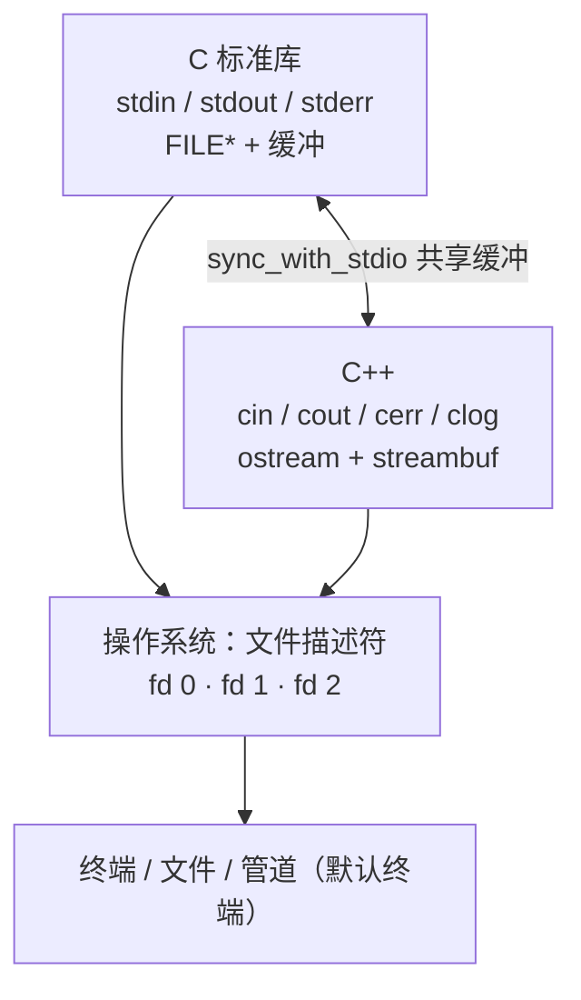

# 标准管道（stdin / stdout / stderr）

> 核心一句话：**每个进程一启动，操作系统就自动给它打开三个"文件"，编号 0、1、2**——这是重定向和管道能存在的全部原因。

## 一、三个流对照表

| fd | 名字 | 默认连接 | 干什么用 | C 语言 | C++ |
|---|---|---|---|---|---|
| 0 | stdin 标准输入 | 键盘 | 程序读数据进来 | `stdin` | `cin` |
| 1 | stdout 标准输出 | 屏幕 | 输出**正常结果** | `stdout` | `cout` |
| 2 | stderr 标准错误 | 屏幕 | 输出**错误 / 警告 / 诊断** | `stderr` | `cerr`（不缓冲）/ `clog`（缓冲） |

```mermaid
flowchart LR
    subgraph 输入源
        A[键盘 / 终端]
        B[文件]
        C[管道（前一程序）]
    end
    A & B & C -->|stdin · fd 0| P
    P[程序（进程）] -->|stdout · fd 1| D[屏幕 / 终端]
    P -->|stdout · fd 1| E[文件（&gt; 重定向）]
    P -->|stdout · fd 1| F[管道（下一程序）]
    P -->|stderr · fd 2| G[屏幕 —— 不受 &gt; 和 | 影响]
```

## 二、三个关键理解点

**1. 为什么输出要分两条通道？**
"正常结果"和"报错信息"受众不同。`ls 找不到的文件` 的报错走 stderr，文件列表走 stdout——可以把结果存文件、错误留屏幕，互不污染。Unix 设计里很漂亮的一笔。

**2. 缓冲行为不一样**
- stdout：**行缓冲 / 全缓冲**（先攒一批再输出）
- stderr：**不缓冲**（立刻输出）

所以混着看时，报错经常比 print 先蹦出来，顺序"乱了"——不是 bug。

**3. `>` 和 `|` 只动 stdout，不动 stderr**
想让 stderr 跟着走，必须显式操作（见命令速查）。

## 三、命令速查

| 命令 | 效果 |
|---|---|
| `cmd > out.txt` | stdout 写入文件（覆盖） |
| `cmd >> out.txt` | stdout 追加 |
| `cmd < in.txt` | 用文件喂 stdin |
| `cmd 2> err.log` | 只把 stderr 写文件 |
| `cmd > out.txt 2>&1` | 两条都进 out.txt（**顺序不能反**，`2>&1` 必须在后） |
| `cmd1 \| cmd2` | cmd1 的 stdout 接到 cmd2 的 stdin |
| `cmd 2>/dev/null` | 报错扔进"黑洞" |

### 实战例子（DL 常踩的坑）

```bash
python train.py > train.log
```

log 里有 print 的 loss，但**没有 tqdm 进度条、没有 warning**——`print()` 走 stdout 进了文件，而 **tqdm 和 warnings 都走 stderr**，留在终端上。想全收：`> train.log 2>&1`。

## 四、适用范围

### 对每个应用都适用吗？
**接口层面：是。使用层面：不一定。** Unix-like 系统上只要是进程，内核在 exec 时都会准备好 fd 0/1/2，无一例外。但"给你开了门"不等于"你会走这扇门"：

- **GUI 程序**：通常不读 stdin 不写 stdout，交流靠窗口（macOS 双击启动的 .app，stdout 直接丢弃）
- **守护进程**（sshd / nginx）：启动后主动把三个流接到 `/dev/null` 或日志文件
- **Windows GUI 子系统程序**（`WinMain` 入口）：默认连控制台都没有，`printf` 输出无声消失

准确说法：**标准流是"命令行风格程序"的通信约定，不是所有程序的生活方式**。

### 对所有操作系统都适用吗？

| 环境 | 支持情况 |
|---|---|
| Linux / macOS / Android / iOS | ✅ 原生（Unix 发明，POSIX 标准规定） |
| Windows | ✅ 等价物：NT 内核没有 fd 概念（用 HANDLE），C 运行时库做了一层模拟，`>` 和 `\|` 体验几乎一样 |
| PowerShell | ⚠️ 变体：内部有 **6 条流**（output/error/warning/verbose/debug/information），管道传对象不传文本 |
| 裸机 / 单片机 | ❌ 没有。`printf` 要自己 retarget 到 UART |

语言层面跨语言通用：Python `sys.stdin/stdout/stderr`、Java `System.out` 都是这三个 fd 的包装。

## 五、cin / cout 是对它们的封装吗？

**精神上是，实现上不是**——cin/cout 内部并没有包着 `FILE*`。C stdio 和 C++ iostream 是**平行**的两套库，各自直接建在操作系统 fd 之上：



关键细节：

- **`sync_with_stdio`**：默认开启，C++ 流和 C stdio 共享缓冲，`printf` / `cout` 混用顺序不乱但慢；关掉后 C++ 流用自己的缓冲，快一大截但混用可能乱序
- **`cin.tie(&cout)`**：默认绑定，每次 `cin >>` 前自动 flush cout（交互提示先显示）
- **`cerr` 不缓冲、`clog` 缓冲**：同一个 fd 2 的两种策略，cerr 对齐 stderr"立刻报错"的语义
- 竞赛祖传咒语：

```cpp
ios::sync_with_stdio(false);
cin.tie(nullptr);
```

- 重定向照常生效（因为底下就是同一个 fd）：

```bash
./a.out > result.txt   # cout 的内容进文件
./a.out 2> debug.log   # cerr 的内容进文件，cout 照常上屏
```

用 `cerr << "debug..."` 打调试信息，就是利用"正常输出和调试输出分通道，重定向互不干扰"——和 tqdm 走 stderr 同一个套路。

## 六、三个流有对应的文件吗？

**有，两层含义。**

**第一层：fd 指向的那个文件（真正在读写的东西）**

```bash
ls -l /proc/self/fd/
# 实测（Git Bash，命令本身跑在管道里时）：
# 0 -> /dev/null      ← stdin 接到"黑洞"
# 1 -> pipe:[0]       ← stdout 是内核管道
# 2 -> pipe:[0]       ← stderr 同上
```

在终端里直接跑，三个都会指向 `/dev/pts/1` 这样的设备文件——**终端本身就是文件**。fd 指向的"文件"可以是：终端设备（`/dev/pts/N`）、普通文件、内核管道（`pipe:[1085]`）、黑洞（`/dev/null`），对进程来说接口完全一样。这就是"一切皆文件"。

**第二层：系统给三个流起的名字（符号链接）**

```
/dev/stdin  ->  /proc/self/fd/0
/dev/stdout ->  /proc/self/fd/1
/dev/stderr ->  /proc/self/fd/2
```

于是这些操作合法：

```bash
cat /dev/stdin          # 从自己的标准输入读
echo hi > /dev/stdout   # 往自己的标准输出写
```

### 附：实用技巧

- 排查"进程输出到底去哪了"：`ls -l /proc/<pid>/fd/`，看 fd 1 指向哪里
- **抢救被删的日志**：文件被删但进程还握着 fd，可从 `/proc/<pid>/fd/N` 拷回内容（经典运维技巧）
- Windows 对应物：`CON`（控制台）、`CONIN$` / `CONOUT$`、`NUL`（等价 /dev/null），如 `dir > NUL`

## 七、管道的真实结构

**管道是内核里的一段字节缓冲区**，一头连着写端的 fd，一头连着读端的 fd：


五大核心特征：

| 特性 | 含义 |
|---|---|
| **不在磁盘上** | 数据全程在内存里转一圈，0 字节落盘 |
| **单向** | half-duplex，数据只能从写端流向读端 |
| **字节流** | 没有"消息边界"，`read` 出的可能不是对方一次 `write` 的内容（网络编程经典坑） |
| **有大小** | Linux 默认 64KB，写满时写端阻塞，读空时读端阻塞 |
| **同步 + 背压** | 内核帮你自然协调生产者/消费者速度 |

读端已死还继续写 → 收到 **SIGPIPE** 信号（`yes | head -1` 那种 "Broken pipe" 就是它）；所有写端关闭 → 读端 `read` 返回 0（EOF），这是 `while read line` 能正常结束的根本原因。

## 八、管道是"流文件"吗？

**严格说不是，但被伪装成文件的接口。** 取决于"管道"指的是哪一类：

| | 匿名管道 `cmd1 \| cmd2` | 命名管道 FIFO | 真正磁盘文件 |
|---|---|---|---|
| 创建 | `\|` 符号 / `pipe()` | `mkfifo` | `touch` |
| 有路径名吗 | ❌ 无名 | ✅ 有 | ✅ 有 |
| `ls` 第一个字符 | N/A | **`p`** | `-` |
| `ls` 大小 | N/A | **0 字节** | 文件实际大小 |
| 数据落盘吗 | 不落 | 不落 | 落盘 |
| 用途 | 父子/兄弟进程临时接 | 任意不相关进程通信 | 持久化数据 |

实弹验证：

```bash
$ cd /tmp && mkfifo demo_pipe && ls -l demo_pipe
prw-rw-rw- 1 LYX10 197609 0 Sep  9 20:00 demo_pipe
```

注意那个 **`p`** 是文件类型标记——"这是个管道"；size 永远是 0——内容在内存里。等所有 fd 关闭，路径还在但再打开会阻塞到下次有人写。

> 一句话：**匿名管道不是文件（连名字都没有），FIFO 是个"假文件"——长得像文件，本质是内核的内存队列**。"一切皆文件"是接口的胜利，不是实现的胜利。

## 九、IPC 全家福

管道只是 IPC 的一种。Linux 的进程间通信是个大家族，按"数据交换"维度分三大代表：


| 维度 | 管道 | 消息队列 | 共享内存 |
|---|---|---|---|
| 数据形式 | 字节流 | 离散消息（带类型） | 任意内存结构 |
| 同步 | 内核负责（阻塞） | 内核负责（可异步） | **自己写**（信号量） |
| 速度 | 较慢（4 次拷贝） | 较慢（4 次拷贝） | **最快**（0 次拷贝） |
| 适合数据量 | 小到中 | 小 | **大** |
| 跨不相关进程 | 仅 FIFO | ✅ | ✅ |
| 生命周期 | 随进程 | 随内核（需显式删） | 随内核（需显式删） |

还有几个常碰到的 IPC 成员：

- **信号 Signal**：最轻量，只"通知"不"传数据"（`kill -USR1 pid` 让进程打印状态）
- **Socket**：最强通用，本机用 Unix domain socket（双向、能传 fd 本身），跨机用 TCP/UDP
- **文件锁 flock / fcntl**：把文件当"会面点"协调（早期数据库这么做）
- **mmap（共享文件映射）**：本质是共享内存的一种，背后有个文件做"锚点"

### 选型速查

> - 跨机器 → TCP socket
> - 大量数据 + 同一台机 → 共享内存
> - 结构化消息分发 → 消息队列
> - 简单流水线 → 管道最省事
> - 只是通知一下 → 信号

### 与三个流的关系

stdin/stdout/stderr 用的是管道吗？——**是的**。Shell 在你敲 `cmd1 | cmd2` 时调 `pipe()` 创建一根匿名管道，把 cmd1 的 stdout（fd 1）接到管道写端，把 cmd2 的 stdin（fd 0）接到管道读端。所以：

> **三个标准流就是"管道思想"的实例化**：进程天然有两个固定出口（stdout/stderr）和一个固定入口（stdin），shell 可以任意接上管道、重定向——这就是 Unix "小工具 + 管道"哲学的全部基础。

## 总结

> 三个标准流是 **Unix 的发明 + 行业的公约**，不是物理定律。Linux/macOS 里是内核级承诺（POSIX），Windows 里是运行时库的"仿真品"（用起来无感），没有 OS 的地方得自己从零搭。
>
> 它们不是抽象概念，是三个实打实的文件描述符，指向实打实的文件——这是重定向（`>` `<`）和管道（`|`）能存在的全部基础。
>
> 管道本身是内核里的内存队列（匿名管道连名字都没有，FIFO 是"假文件"）；把它放在更大的 IPC 全景里看，是"字节流 + 内核同步"这一档的代表，比它快的有共享内存，比它结构化的有消息队列，比它通用的有 socket。

---

*整理自 2026-09-09 与小0的对话*
