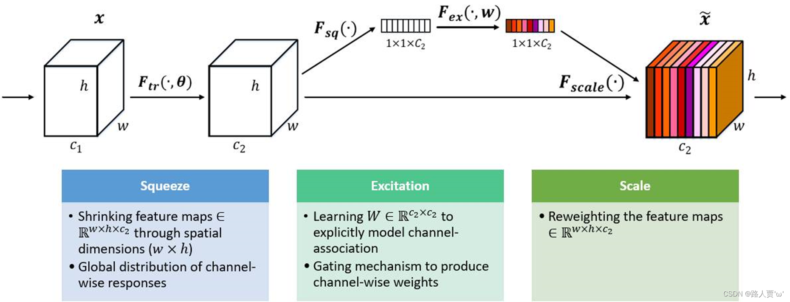
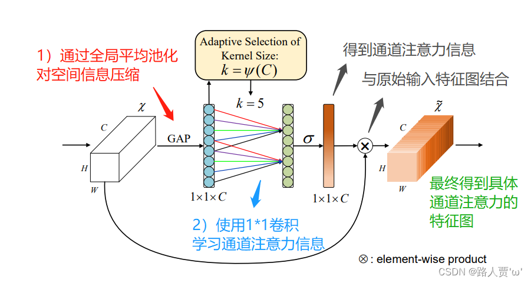
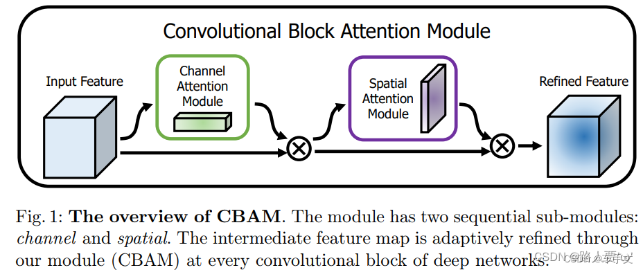

## 通道注意力机制：Channel Attention

对于输入2维图像的CNN来说，一个维度是图像的尺度空间，即长宽，另一个维度就是**通道**

**通道注意力**旨在显示的建模出不同通道之间的相关性，通过网络学习的方式来自动获取到每个特征通道的重要程度，最后再为每个通道赋予不同的权重系数，从而来强化重要的特征抑制非重要的特征。

使用通道注意力机制的目的：为了让输入的图像更有意义，大概理解就是，通过网络计算出输入图像**各个通道的重要性（权重）**，也就是哪些通道包含关键信息就多加关注，少关注没什么重要信息的通道

**SE注意力机制**在通道维度增加注意力机制，关键操作是**squeeze**和**excitation**。

通过自动学习的方式，即使用另外一个新的神经网络，获取到特征图的每个通道的重要程度，然后用这个重要程度去给每个特征赋予一个权重值，从而让神经网络重点关注某些特征通道。

如下图所示，在输入SE注意力机制之前（左侧白图C2），特征图的每个通道的重要程度都是一样的，通过SENet之后（右侧彩图C2），不同颜色代表不同的权重，使每个特征通道的重要性变得不一样了

ECA在SE模块的基础上，把SE中使用全连接层FC学习通道注意信息，改为1*1卷积学习通道注意信息；使用1*1卷积捕获不同通道之间的信息，避免在学习通道注意力信息时，通道维度减缩；降低参数量；（FC具有较大参数量；1*1卷积只有较小的参数量）

CBAM全称Convolutional Block Attention Module，这是一种用于前馈卷积神经网络的简单而有效的注意模块。是传统的通道注意力机制+空间注意力机制，是 channel(通道) + spatial(空间) 的统一。即对两个Attention进行串联，channel 在前，spatial在后。

给定一个中间特征图，我们的模块会沿着两个独立的维度（通道和空间）依次推断注意力图，然后将注意力图乘以输入特征图以进行自适应特征修饰。 由于CBAM是轻量级的通用模块，因此可以以可忽略的开销将其无缝集成到任何CNN架构中，并且可以与基础CNN一起进行端到端训练。

**不是图像中所有的区域对任务的贡献都是同样重要的，只有任务相关的区域才是需要关心的**，比如分类任务的主体，空间注意力模型就是寻找网络中最重要的部位进行处理。**空间注意力**旨在提升关键区域的特征表达，本质上是将原始图片中的空间信息通过空间转换模块，变换到另一个空间中并保留关键信息