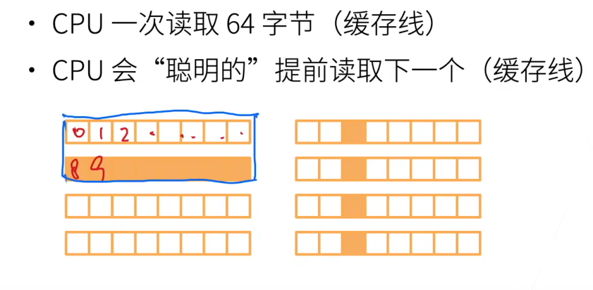
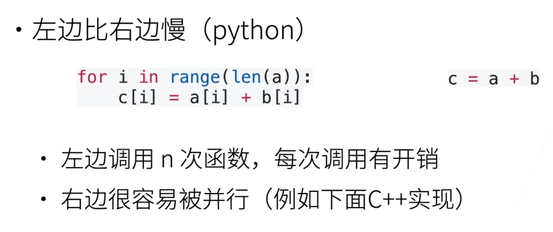
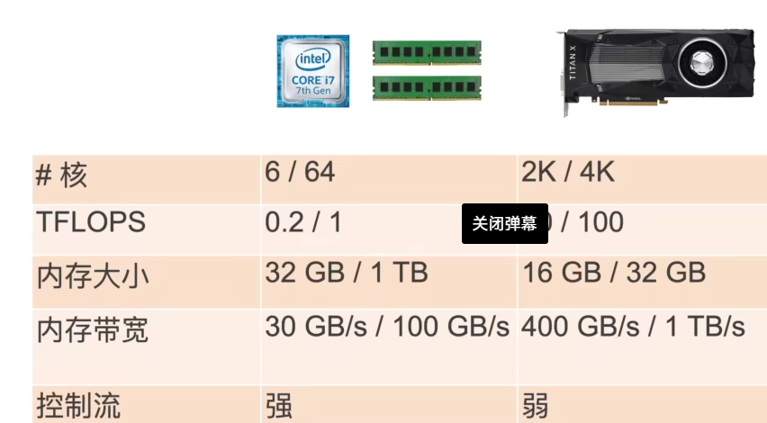

## 提升CPU利用率

在计算a+b之前

主内存-L3-L2-L1-Cache-寄存器

提升空间（**按序读写**）和时间（**重用数据**）的内存本地性

如果一个矩阵是按行存储，访问一行要比访问一列要快

提升CPU利用率也可以依靠并行，高端的CPU有几十个核心

超线程不一定可以提升性能，因为它们共享寄存器

​                                                                                          