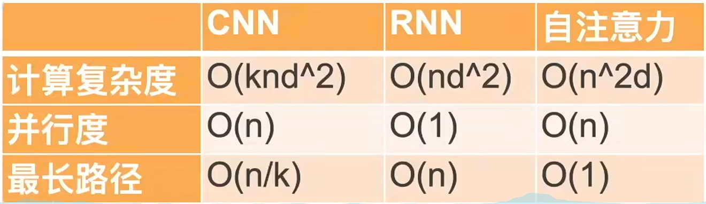
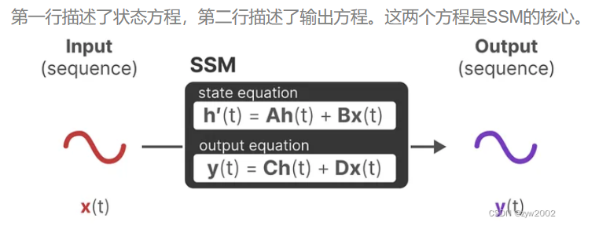
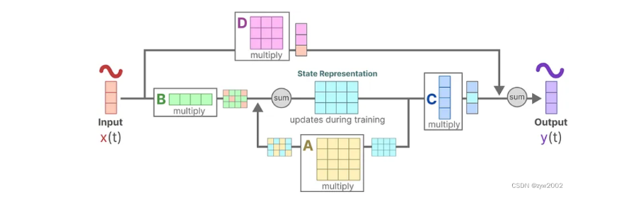
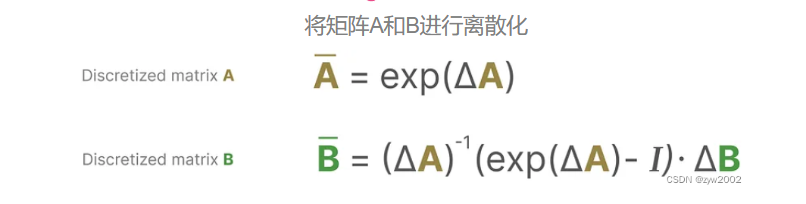
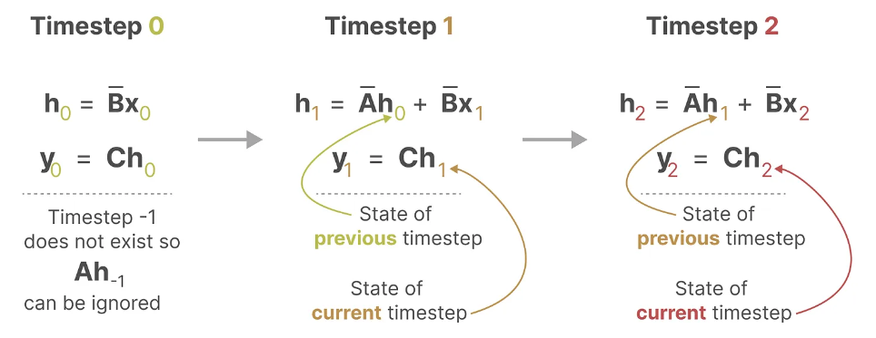
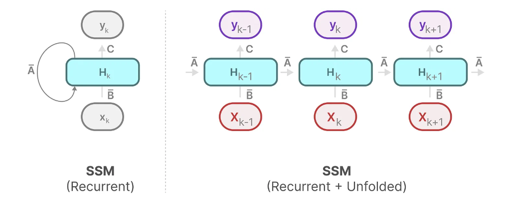

## Mamba 基础讲解【SSM,LSSL,S4,S5,Mamba】

**Mamba的提出动机**

最近非常火的语言模型都是Transformer模型。举几个例子，OpenAI的ChatGPT、谷歌的Gemini和GitHub的Copilot都是由Transformers驱动的。


  

Mamba比差不多大小的Transformer性能要更好。

在推理过程中，每生成一个新的token，都需要重新为整个序列计算一个新的attention map，导致推理性能很慢。对于一个长度为L 的序列，大约需要L 2 的计算，如果序列长度增加，计算量会更大。

**Transformer的性能总结：训练快，推理慢。**

RNN的优点：在生成当前的输出时，RNN只需要考虑当前的输入和上一时刻的隐藏状态。 和Transform相比，RNN不需要重新计算先前所有的隐藏状态。换句话说，RNN可以**快速进行推理**，因为它的计算量与序列长度呈线性扩展。理论上，它甚至可以拥有无限长的上下文长度。

RNN的缺点：**训练不能并行进行**，因为它需要按照时间顺序地完成每个步骤。RNN的性能总结：训练慢，但是推理快 （和Transformer恰恰相反~）

## **什么是状态空间 (State Space)？**

SSM 最初设计用于预测连续序列（如电信号、天气模式或运动轨迹）在给定输入下的下一*状态*。从概念与数学层面，它们与 2017 年 Transformer 出现前主导自然语言处理 (NLP) 的[循环神经网络 (RNN)](https://www.ibm.com/cn-zh/think/topics/recurrent-neural-networks) 相关，也与[卷积神经网络 (CNN)](https://www.ibm.com/cn-zh/think/topics/convolutional-neural-networks) 和隐马尔可夫模型 (HMM) 等算法存在关联。

举个例子，假如我们在走迷宫，那么状态空间（state space）就是我们在地图中所有可能的状态(states)， 包含{ 我们正在哪里？下一步可以往哪个方向走走？下一步我们可能在哪里？}

描述状态的变量，在我们的例子中是X和Y坐标，以及到出口的距离，可以表示为“状态向量”。

ssm是用于描述这些状态表示的模型，并根据某些输入预测其下一个状态可能是什么。

在时刻t, SSMs为:

- 映射输入序列`x(t)` -(例如，在迷宫中向左和向下移动)
- 到隐藏状态表示`h(t)` -(例如，到出口的距离和x/y坐标)
- 并推导出预测的输出序列`y(t)` -(例如，再次向左移动以更快地到达出口)

SSM不是使用离散序列(如向左移动一次)，而是将*连续序列作为输入*，并预测输出序列。



将上述的两个方程整合在一起，得到了如下的结构：

*输出方程*描述了当前状态如何通过矩阵 C 影响输出，以及输入如何通过矩阵 D 直接影响输出。由于矩阵 D 本质上独立于h(t)自身的建模过程，在 SSM 的图示和讨论中通常被省略，以聚焦于核心矩阵 A、B 和 C。



## 线性状态空间层 (Linear State-Space Layer, LSSL)

LSSL[[a.2\]](https://maartengrootendorst.substack.com/p/a-visual-guide-to-mamba-and-state)的核心思想是把连续时间的SSM进行离散化，得到两种离散化的表示（循环形式和卷积形式）

通常而言，我们的输入是离散的，例如一个文本序列。为了将离散的输入变成SSM可用的连续信号，我们使用零阶保持技术

零阶保持技术的原理：每次我们接收到一个离散信号时，我们都保持它的值，直到我们接收到一个新的离散信号。我们保存该值的时间由一个新的可学习参数表示，称为步长∆。

现在我们有了一个连续的信号作为输入，我们可以生成一个连续的输出，并且只根据输入的时间步长对值进行采样。这个采样的值就是我们离散化的输出。

有几种有效的离散化方法，如欧拉方法、零阶保持器(Zero-order Hold, ZOH)方法或双线性方法。欧拉方法是最弱的，但在后两种方法之间的选择是微妙的。事实上，S4论文采用的是双线性方法，但Mamba使用的是ZOH。

从数学的角度而言，我们可以按照如下的方式应用零阶保持技术



离散化 SSM 使其能像 RNN 一样用于序列到序列任务。离散化 SSM 的参数和方程通常经过改写，采用 RNN 常用的下标表示法以区别于连续时间模型。该表示法中，*ht* 代表模型将生成的新状态空间，*h*t-1 则代表前一时刻的状态——即当前的状态空间。

**接下来我们看一下离散化SSM的两种表示形式**

**循环表示（Recurrent Representation）**

在每个时间步长，我们计算当前输入如何影响前一个状态然后计算预测输出



我们可以发现这种循环的SSM结构和RNN非常的类似。



**卷积表示（Convolution Representation）**

在经典的图像识别任务中，我们使用卷积核来聚集特征。

类似的，因为我们处理的是文本而不是图像，所以我们需要一维卷积:


而用来表示这个“过滤器”的内核源自 SSM 公式


将SSM表示为卷积的一个主要好处是，它可以像卷积神经网络(CNN)一样并行训练。然而，由于核大小固定，它们的推理不像RNN那样快速。

**LSSL的设计思路**

SSM的三种表示：连续时间（Continuous-time），循环(recurrent)，卷积(convolutional)

                                                                                                                                                                                                                                                                                                                                                                                                                                                                                                                                                                                                                                                                                                                                                                                                                                                                                                                                                                                                                                                                                                                                                                                                                                                                                                                                                                                                                                                                                                                                                                                                                                                                                                                                                                                                                                                                                                                                                                                                                                                                                                                                                                                                                                                                                                                                                                                                                                                                                                                                                                                                                                                                                                                                                                                                                                                                                                                                                                                                                                                                                                                                                                                                                                                                                                                                                                                                                                                                                                                                                                                                                                                                                                                                                                                                                                                                                                                                                                                                                                                                                                                                                                                                                                                                                                                                                                                                                                                                                                                                                                                                                                                                                                                                                                                                                                                                                                                                                                                                                                                                                                                                                                                                                                                                                                                                                                                                                                                                                                                                                                                                                                                                                                                                                                                                                                                                                                                                                                                                                                                                                                                                                                                                                                                                                           

有了这些表示，我们可以使用一个巧妙的技巧，即根据任务选择一种表示。在训练过程中，我们使用可以并行化的卷积表示，在推理过程中，我们使用高效的循环表示。这种混合表示就被称为LSSL。(**并行的训练与高效的推理**)


LSSL的一个重要特性是**线性时间不变（Linear Time Invariance, LTI）**
LTI声明SSM参数A、B和C对于所有时间步都是固定的。这意味着矩阵A、B和C对于SSM生成的每个token都是相同的。

**Mamb的模型是基于S4模型构建的，所以我们先介绍下S4模型 结构化序列空间模型**

S4主要包括以下三个部分：

- 状态空间模型

- HiPPO用于处理远程依赖

- 用于创建循环和卷积表示的离散化

  

如何创建矩阵A，使其可以保留更多的上下文信息呢？HiPPO试图将它迄今为止看到的所有输入信号压缩为一个系数向量。

HiPPO使用矩阵A来构建状态表示，可以很好地捕获最近的token并衰减旧的token。其公式可以表示为:


使用HiPPO构建矩阵A比初始化为随机矩阵要好得多。因此，与旧信号(初始token)相比，它可以更准确地重建较新的信号(最近的token)。
HiPPO矩阵背后的想法是，它产生一个隐藏状态来记忆其历史。

然后将HiPPO应用于我们之前看到的递归和卷积表示，以处理长程依赖关系。

## Mamba的介绍

Mamba是一种状态空间模型(SSM)架构，它改进了S4架构。它有时也被称为S6，它对S4进行了两项重要修改

- `选择性扫描算法(selective scan algorithm）`，允许模型过滤相关或者不相关的信息

- `硬件感知的算法(hardware-aware algorithm)`，允许通过并行扫描(parallel scan)、核融合(kernel fusion)和重计算(recomputation)有效地存储(中间)结果。
- Mamba = 有选择处理信息 + 硬件感知算法 + 更简单的SSM架构

**Mamba 要解决什么问题？**
SSM和S4无法选择性的关注指定的输入

在选择性复制任务中，SSM的目标是复制输入的一部分并按顺序输出.然而，(循环/卷积)SSM在这项任务中表现不佳，因为它是线性时间不变（Linear Time Invariant）的。正如我们之前看到的，矩阵A、B和C对于SSM生成的每个token都是相同的。因此，SSM无法进行内容感知推理（`content-aware reasoning`），因为它将每个token视为固定的A、B和C矩阵的结果。这是一个问题，因为我们希望SSM对输入(提示)进行推理。

相比之下，这些任务对transformer来说相对容易，因为它们根据输入序列动态改变注意力。他们可以选择性地“看”或“关注”序列的不同部分。SSM在这些任务上的糟糕表现说明了time-invariant SSM的潜在问题，矩阵A、B和C的静态性质导致了其无法进行内容感知（content-awareness）。

### Mamba的特性一： 选择性的保留信息（Selective Retain Information）

Mamba 致力于保留一个小的且有用的状态信息， 兼顾性能和效率。

序列模型的效率与效果的权衡点在于它们对状态的压缩程度，它通过有**选择地将数据压缩到状态**中来实现这一点。（当有一个输入句子时，通常会有一些信息，比如标点，没有太多意义。这些无意义的信息就可以被忽略掉。）
为了有选择地压缩信息，我们需要**参数依赖于输入**。
而mamba为了兼顾效率和效果，选择性的关注必须关注的、过滤掉可以忽略的。为此，让我们首先探究下在训练过程中SSM的输入和输出维度:

SSM中Input和Output的维度：B表示batch size, L表示序列长度，D表示输入张量的大小。


在结构化状态空间模型(S4)中，矩阵A、B和C与输入无关，因为它们的维数N和D是静态的，不会改变。


相反，Mamba通过合并输入的序列长度和批次大小，使矩阵B和C，甚至步长∆依赖于输入，这意味着对于每个输入标记，我们现在有不同的B和C矩阵，这解决了内容感知的问题。这样就可以依赖于输入，选择什么保持在隐藏状态，什么要忽略。矩阵A保持不变，因为我们希望状态本身保持静态，但它被影响的方式(通过B和C)是动态的。


当步长较小（即∆较小）时，模型更倾向于忽略特定的单词，而更多地依赖前一个上下文。这意味着模型更注重前面的单词对当前单词的影响，而忽略了较远距离的单词。相反，当步长较大（即∆较大）时，模型更多地关注当前输入单词而不是上下文。这意味着模型更多地考虑当前输入单词对上下文的影响，而不是依赖于前一个上下文来决定当前单词的特征。


### Mamba的特性二： 扫描操作（The Scan Operation）

由于这些矩阵(B,C,∆)现在是动态的，它们不能使用卷积表示进行计算，因为它假设一个固定的核。我们只能使用递归表示，而失去了卷积提供的并行化。为了实现并行化，让我们先来看看如何使用递归计算输出:


每个状态是前一个状态(乘以A)加上当前输入(乘以B)的和。这称为扫描操作，可以用for循环轻松计算。相比之下，并行化似乎是不可能的，因为只有在我们拥有前一个状态的情况下，每个状态才能计算出来。然而，Mamba通过并行扫描算法使这成为可能。

可以分段计算序列并迭代地组合它们，即动态矩阵B和C以及并行扫描算法一起创建：选择性扫描算法(selective scan algorithm)

### Mamba基础块的设计（Mamba Block）

在Transformer中，用Decoder block来实现self-attention。与此类似，在Mamba中，也使用Mamba Block 来实现 selective SSM。

和解码器一样，我们可以将多个Mamba块堆叠起来，并将它们的输出作为下一个Mamba块的输入:


它首先用一个线性投影（linear projection）得到我们的输入嵌入（input embedding）。然后，在应用选择性SSM之前进行卷积，以防止独立token计算。卷积层通过一个滑动窗口（如大小=4），将当前token与其相邻的d个token进行混合，生成一个**包含局部上下文的表示**，然后再送入SSM。

总结：Mamba 即可以进行并行化训练，也可以按照线性缩放的复杂度进行推理，同时可以处理无限的上下文信息。


```python
#这块我也不是很了解，一笔带过吧
GPU的一个缺点是它们在小型但高效的SRAM和大型但略低效率的DRAM之间的传输(IO)速度有限。频繁地在SRAM和DRAM之间复制信息成为瓶颈。
与Flash Attention一样，Mamba试图限制从DRAM切换到SRAM的次数，反之亦然。它通过核融合来实现这一点，核融合允许模型防止写入中间结果，并持续执行计算，直到完成。
我们可以通过可视化Mamba的基本架构来查看DRAM和SRAM分配的具体实例:
    这里将下列代码融合到一个内核中:

用∆离散化步长
选择性扫描算法
与C相乘
硬件感知算法的最后一部分是重计算 (recomputation)。
中间状态不保存，但对于反向传递计算梯度是必要的。相反，作者在反向传递期间重新计算这些中间状态。虽然这看起来效率不高，但与从相对较慢的DRAM读取所有中间状态相比，它的开销要小得多。

首先，输入Xt通过选择性机制映射得到Bt，∆，Ct
然后使用∆，用零阶保持技术对A和Bt进行离散化
离散化后的B和输入Xt相乘，离散化后的A和原始状态h t − 1 h_{t-1}h t−1​ 相乘，将这两项相加得到新的状态h t h_th t​ 。新状态和Ct相乘，得到输出y t y_ty t​

```

