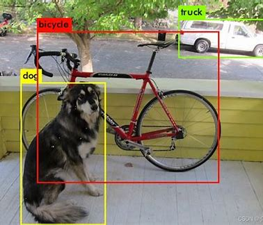
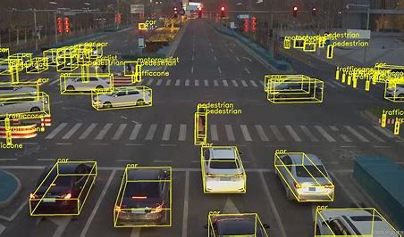
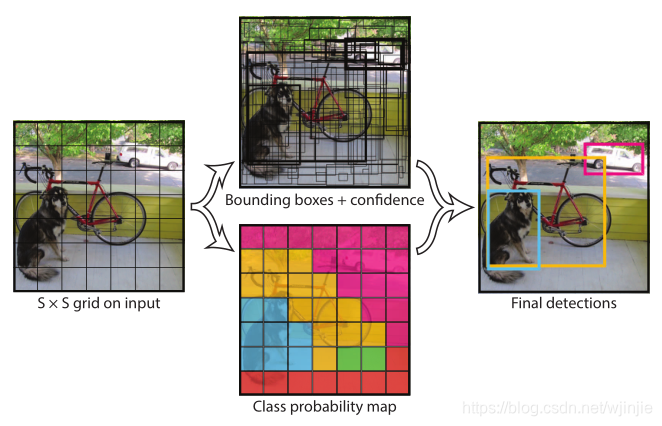

## Object Detecting

------

- **What is Object Detection**

  - **Task**: Locate and classify all objects of interest in an image/video, outputting bounding boxes and class labels.

  **Core Outputs**:

  - Coordinates: ((x_1, y_1, x_2, y_2)) (top-left + bottom-right) or ((x, y, w, h)) (center + width/height).
  - Class: Discrete labels (e.g., "car", "pedestrian").
  - Confidence: Probability of the object's presence (used for post-processing filtering).

- #### Key Challenges

  - **Multi-scale Variation**: Significant differences in object sizes (e.g., distant vehicles vs. nearby pedestrians).
  - **Occlusion and Blur**: Partial obstruction of objects or poor imaging quality.
  - **Class Imbalance**: Scarce samples for minority classes in datasets.
  - **Real-time Requirement**: Applications like autonomous driving demand millisecond-level response times.

- ### Evolution: From Traditional Methods to Deep Learning

  - **Handcrafted Feature Era**
    - **HOG + SVM (2005)**: Used Histogram of Oriented Gradients to extract edge features, with SVM for classification.
    - **DPM (Deformable Part Model) (2008)**: Operated via sliding windows and combined part-based template matching to handle object deformation.
  - **Limitations**: Relied on manually designed features, had weak generalization capabilities, and suffered from low computational efficiency.

  #### Early Deep Learning Era (2014-2017: Dominance of Two-Stage Detectors)

  **R-CNN Series**:

  - **R-CNN (2014)**: First to introduce CNNs into object detection. Pipeline: Generate ~2k region proposals via Selective Search → Extract features using a CNN → Classify with SVMs → Refine bounding boxes via regression. **Drawback**: Extremely slow (47 seconds per image) due to repeated computation.
  - **Fast R-CNN (2015)**: Introduced ROI Pooling to share feature computation, and jointly optimized classification and bounding box regression, improving speed to ~2 seconds per image.
  - **Faster R-CNN (2015)**: Proposed the Region Proposal Network (RPN) to replace Selective Search, enabling end-to-end training and achieving real-time detection for the first time (17 FPS).

- **Milestone**: Demonstrated the overwhelming advantage of deep learning in object detection and established the two-stage framework (region proposal generation + classification & regression).

  **YOLO Series:**

  - **YOLOv1 (2016)**: Revolutionized the paradigm by replacing the two-stage approach. It directly divides the image into an S×S grid, with each grid cell predicting bounding boxes and class probabilities. Achieved a remarkable speed of 45 FPS (with some trade-off in accuracy).
  - **SSD (2016)**: Performed predictions on feature maps at multiple scales, striking a strong balance between speed (59 FPS) and accuracy. It was the first model truly viable for mobile applications.
  - **YOLOv2-v3 (2017)**: Introduced anchor box clustering, multi-scale training, and FPN-like feature fusion. This significantly improved accuracy, bringing it close to that of two-stage detectors while maintaining leading inference speed.

- ### Detailed Explanation of Core Technical Modules

  #### Region Proposal Generation (Two-stage Detectors)

  - **Region Proposal Network (RPN)**

    - **Principle**: Slides a window over the feature map to generate anchor

       boxes (pre-set with different scales/aspect ratios). It classifies each 

      anchor as "foreground/background" and regresses offsets for the 

      anchor boxes.

    - **Advantage**: Replaces traditional selective search, increasing the 

      speed of generating region proposals by 100 times.

  - **Anchor Box Design**

    - **Hyperparameters**: Scales (e.g., 32×32, 64×64) and aspect ratios 

      (e.g., 1:1, 1:2, 2:1). These are typically determined by applying 

      K-means clustering to the ground-truth bounding boxes in the dataset.

    - **Issue**: The large number of anchor boxes leads to a severe 

      foreground-background class imbalance (e.g., ~99% are background),

      which motivated optimization techniques like Focal Loss.

