## 何为决策树

决策树（Decision Tree）是一种分类 和回归方法，是基于各种情况发生的所需条件构成决策树，以实现期望最大化的一种图解法。由于这种决策分支画成图形很像一棵树的枝干，故称决策树。

**决策树的每个特征只能取固定的几个离散的值**

**学习（决策）过程**

- 根节点使用什么特征（信息增益最大的特征）
- 选择熵最小（或者别的条件熵，信息增益等等）的方案
- 然后继续分割（选择特征），直到产出叶节点（是否满足停止分裂标准）
- 超过最大深度停止分裂，纯度达标停止分裂。
- 过深过大会造成过拟合
- one-hot编码可以处理每个特征多个值的情况

**连续值特征**

考虑特征是否大于或者小于某个值，来分割数据。（多次测试不同的值来确保更好的分割结果）


**回归树**

这里不使用信息增益进行计算而使用方差

选择可以最多减少方差的特征

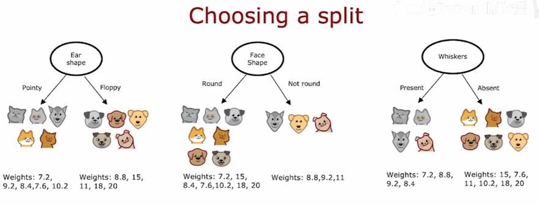

使用多个回归树, 综合多个回归树的结果

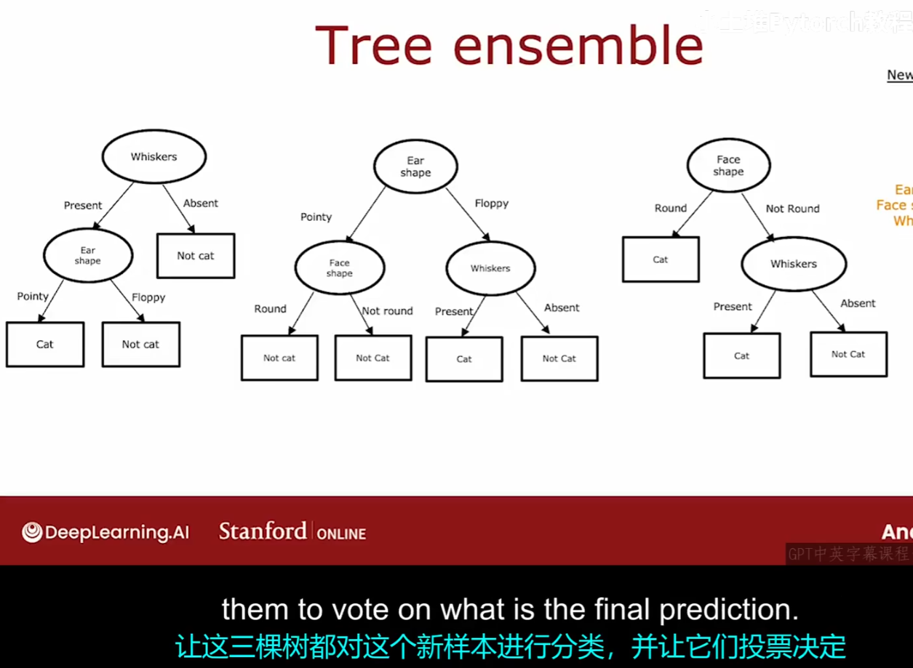

有放回的抽样，来构建一个新的与原数据集不同的数据集。

**随机森林**

多次有放回抽样，每次构建一个随机树，最终构建128个（左右），让这些树进行投票预测。

算法有一个修改版本，进一步尝试在每个节点上，随机化特征选择。（从全部的n个特征中取出k个，让树从k个中进行构建。）


**XGBoost**

更多的关注那些没有做好分类的样本

查看原始数据集（不是抽样数据集）的结果是否正确，后续抽样时更多的选择这些结果出错的数据集。

当数据像一个电子表格（结构化数据时）更适合使用决策树，而神经网络通常在非结构化数据上表现更好。


接下来，当我们拿到某个数据时，就能做出对应预测。

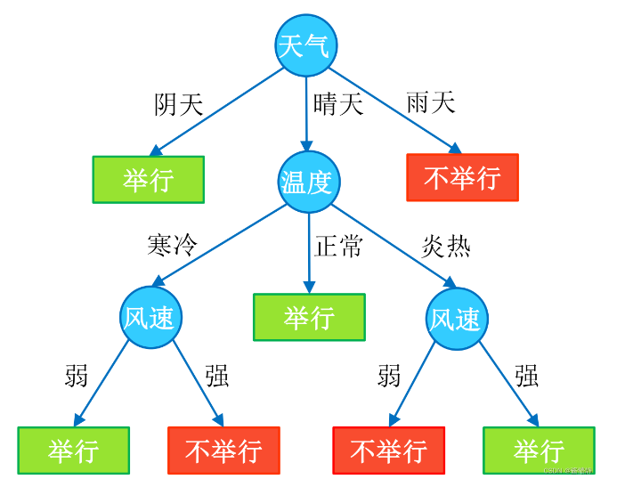

决策树由结点和有向边组成。结点有两种类型：内部结点（圆）和叶结点（矩形）。其中，内部结点表示一个特征（属性）；叶结点表示一个类别。而有向边则对应其所属内部结点的可选项（属性的取值范围）。

在决策树中，若把每个内部结点视为一个条件，每对结点之间的有向边视为一个选项，则从根结点到叶结点的每一条路径都可以看做是一个规则，而叶结点则对应着在指定规则下的结论。这样的规则具有互斥性和完备性，从根结点到叶结点的每一条路径代表了一类实例，并且这个实例只能在这条路径上。

## 决策树的构建

决策树的本质是从训练集中归纳出一套分类规则，使其尽量符合以下要求：

1. 具有较好的泛化能力；
2. 在 1 的基础上尽量不出现过拟合现象。

注意到一件事：当目标数据的特征较多时，构建的具有不同规则的决策树也相当庞大（成长复杂度为 𝑂(𝑛!) ）。如当仅考虑 5 个特征时，就能构建出 5×4×3×2×1=120 种。在这么多树中，选择哪一棵才能达到最好的分类效果呢？

如，在前面的例子中，为什么要先对“天气”进行划分，然后再是“温度”和“风速”呢（下图1）？可不可以先对“风速”进行划分，然后再是“温度”和“天气”呢（下图2）？

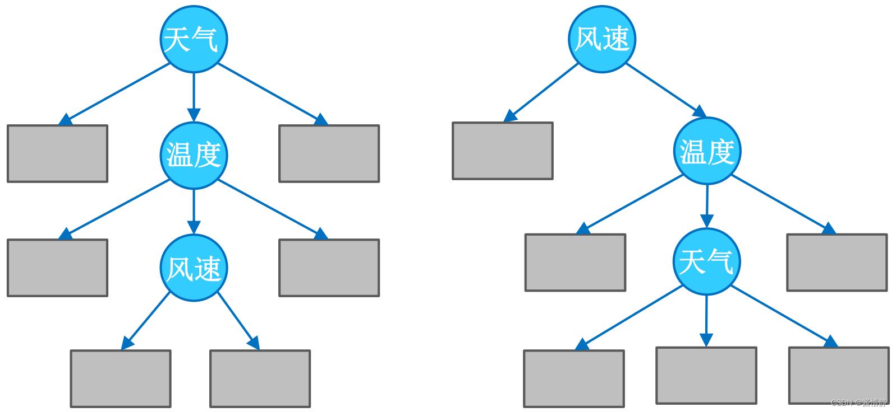

一种很直观的思路是：如果按照某个特征对数据进行划分时，它能最大程度地将原本混乱的结果尽可能划分为几个有序的大类，则就应该先以这个特征为决策树中的根结点。接着，不断重复这一过程，直到整棵决策树被构建完成为止。

基于此，引入信息论中的“熵”。

## 熵

熵（Entropy)是表示随机变量不确定性的度量。说简单点就是物体内部的混乱程度。

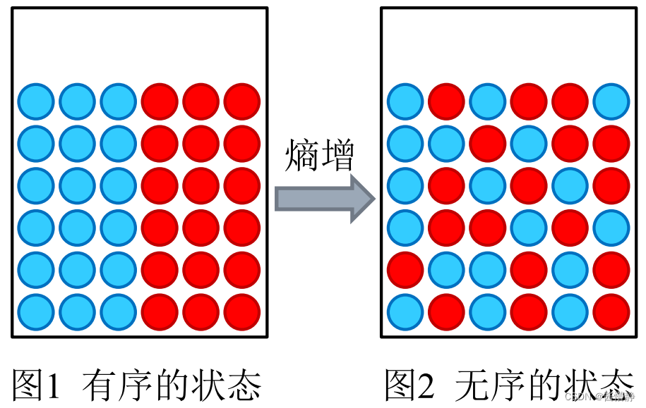

现在假设有这样一个待分类数据（如下图所示），若分类器 1 选择特征 𝑥1、分类器 2 选择特征 𝑥2 分别为根构建了一棵决策树，其效果如下：

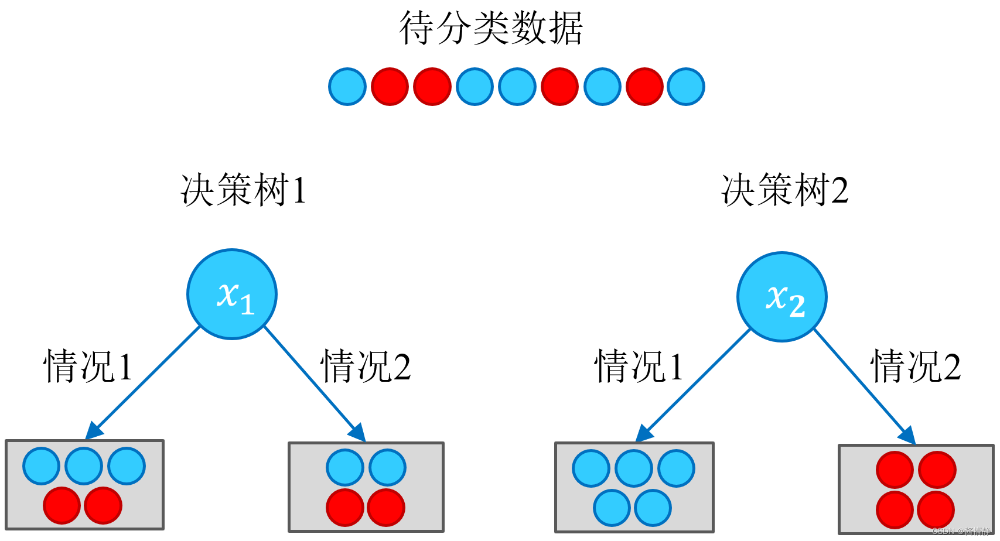

则根据以上结果，从熵的角度看，可以很直观地认为，决策树 2 的分类效果优于决策树 1 。

故此，可以这样认为：构建决策树的实质是对特征进行层次选择，而衡量特征选择的合理性指标，则是熵。为便于说明，下面先给出熵的定义：设 𝑋 是取值在有限范围内的一个离散随机变量，其概率密度为：

***P*(*X*=x**i*)=*p**i , *i*=1,2,…,*n***

则随机变量 𝑋 的熵定义为：

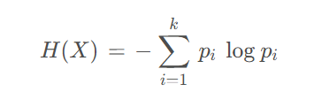

**从该式的定义可以看出，熵仅仅依赖于 𝑋 的分布而与其取值无关，所以也可以将 𝑋 的熵记为 𝐻(𝑝) 。**

当某个集合含有多个类别时，此时 𝑘 较大， 𝑝𝑖 的数量过多；且整体的 𝑝𝑖 都会因 𝑘 的过大而普遍较小，从而使得 𝐻(X) 的值过大。这正好符合“熵值越大，事物越混乱”的定义。


**条件熵的引入**
根据熵的定义，在构建决策树时我们可采用一种很简单的思路来进行“熵减”：每当要选出一个内部结点时，考虑样本中的所有“尚未被使用”特征，并基于该特征的取值对样本数据进行划分。

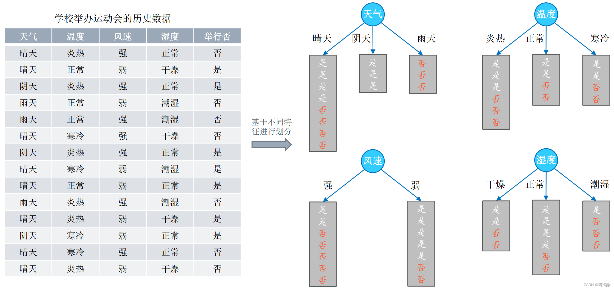

对于每个特征，都可以算出“该特征各项取值对运动会举办与否”的影响（而衡量各特征谁最合适的准则，即是熵）。为此，引入条件熵。首先看原始数据集 𝐷 （共14天）的熵，该数据的标签只有两个（“举办”与“不举办”），且各占一半，故可算出该数据集的初始熵为：

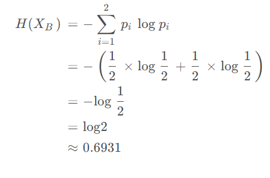

对于每个特征，我们逐个分析，先从“天气”开始：

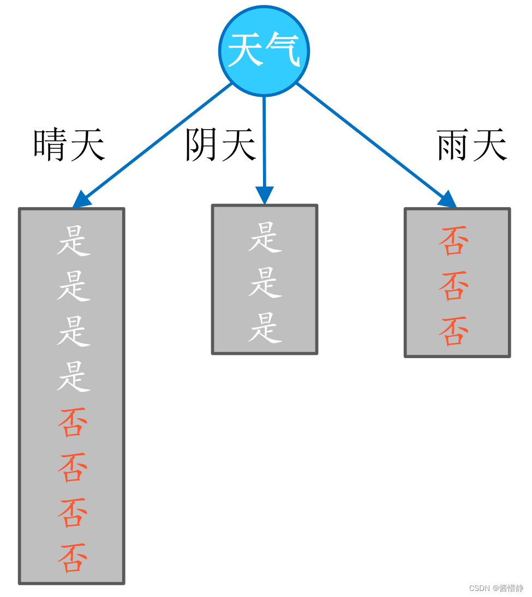

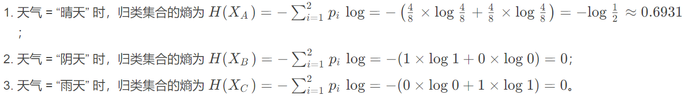


在上面的计算中，我们将“天气”特征展开，以分别求解各取值对应集合的熵。实际上，该式的计算正是在求条件熵。条件熵 𝐻(𝑌 | 𝑋) 表示在已知随机变量 𝑋 的条件下随机变量 𝑌 的不确定性。它的数学定义是：若设随机变量 (𝑋, 𝑌) ，其联合概率密度为

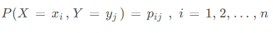

则定义条件熵 𝐻(𝑌 | 𝑋) ：在给定 𝑋 的条件下 𝑌 的条件概率分布对 𝑋 的数学期望，即


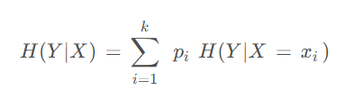

按照这样的定义，可算出其余各特征的条件熵分别为：

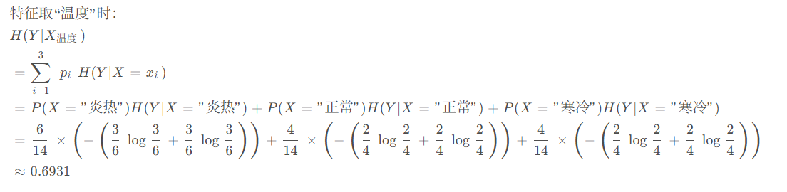

从前面的讨论可以知道，决策树学习的关键在于：如何选择最优划分属性。一般而言，随着划分过程的不断进行，我们自然希望决策树各分支结点所包含的样本尽可能属于同一类别，即结点的 “纯度” (purity) 越来越高。下面介绍几类较为主流的评选算法

### 信息增益ID3 算法选用的评估标准

信息增益 𝑔(𝐷, 𝑋) ：表示某特征 𝑋 使得数据集 𝐷 的不确定性减少程度，定义为集合 𝐷 的熵与在给定特征 𝑋 的条件下 𝐷 的条件熵 𝐻(𝐷 | 𝑋) 之差，即

`*g*(*D*,*X*)=*H*(*D*)−*H*(*D*∣*X*)`

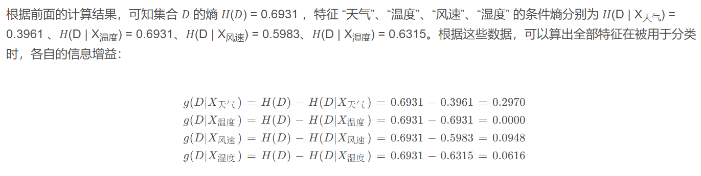

上面各特征求得的信息增益中，“天气” 特征对应的是最大的。也就是说，如果将 “天气” 作为决策树的第一个划分特征，系统整体的熵值将降低 0.297，是所有备选特征中效果最好的。因此，根据 “学校举办运动会的历史数据” 构建决策树时，根节点最好取 “天气” 特征。

### 信息增益率（ C4.5 算法选用的评估标准）

以信息增益作为划分数据集的特征时，其偏向于选择取值较多的特征。比如，当在学校举办运动会的历史数据中加入一个新特征 “编号” 时，该特征将成为最优特征。因为给定 “编号” 就一定知道那天是否举行过运动会，因此 “编号” 的信息增益很高

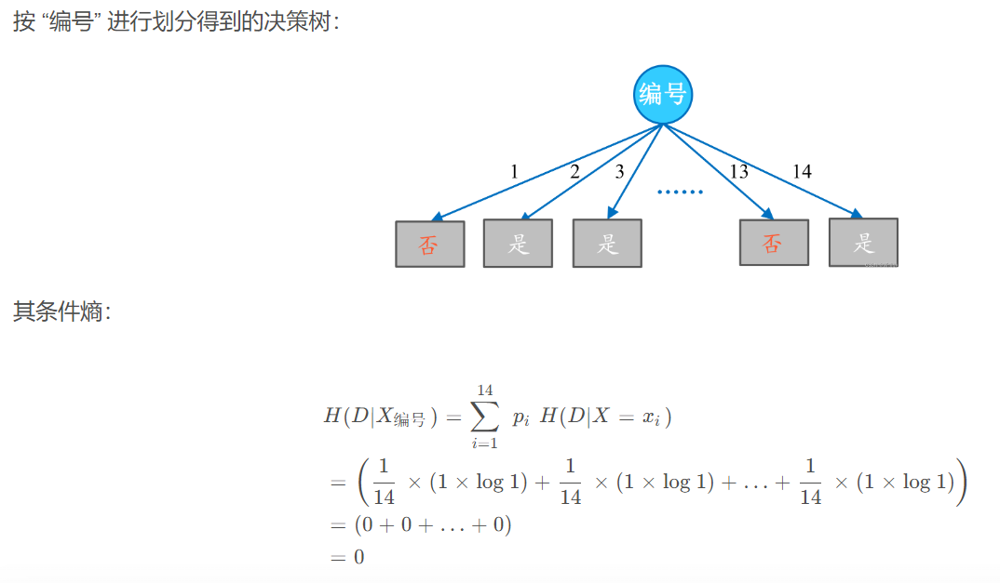

```python
import xgboost as xgb

# 转换为 DMatrix 格式
dtrain = xgb.DMatrix(X_train, label=y_train)
dtest = xgb.DMatrix(X_test)

# 设置参数
params = {
    'objective': 'multi:softmax',  # 多分类问题
    'num_class': 3,  # 类别数量
    'max_depth': 4,  # 树的最大深度
    'eta': 0.3,  # 学习率
    'seed': 42
}

# 训练模型
num_round = 10  # 迭代次数
bst = xgb.train(params, dtrain, num_boost_round=num_round)

# 预测
preds = bst.predict(dtest)
print(preds)
```

