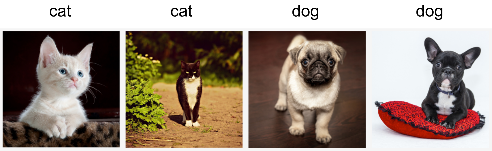

## 分布偏移

 **分布偏移（Distribution Shift）是指模型在训练和测试数据集之间的数据分布不匹配的情况。这种不匹配可能导致模型在测试集上的表现下降，因为模型在训练时学习到的特征在测试时可能不再适用。**

在许多情况下，**训练集和测试集并不来自同一个分布。这就是所谓的分布偏移。**分布偏移可能由多种因素引起，包括**数据采样方法的不同、环境变化、数据集的不平衡**等。解决分布偏移的方法可以从数据层面和模型层面进行考虑。
**数据层面解决方法：**

领域自适应（Domain Adaptation）：通过在源域和目标域之间学习**特征映射**来适应不同的数据分布。
数据增强（Data Augmentation）：在训练数据上引入一些变化，使模型更加鲁棒，能够适应不同的数据分布。
重采样（Resampling）：调整数据集中不同类别或样本的比例，以减轻数据分布不平衡带来的影响。
**模型层面解决方法：**

迁移学习（Transfer Learning）：通过在一个任务上学习到的知识来改善在另一个相关任务上的泛化性能。
集成学习（Ensemble Learning）：结合多个模型的预测结果，以减少模型在测试时的方差，提高泛化能力。
对抗训练（Adversarial Training）：通过引入对抗样本来训练模型，使其对输入数据的微小扰动更加鲁棒。

一、分布偏移的类型
考虑数据分布可能发生变化的各种方式，以及为挽救模型性能可能采取的措施。 在一个经典的情景中，假设训练数据是从某个分布 𝑝𝑆(𝐱,𝑦) 中采样的， 但是测试数据将包含从不同分布 𝑝𝑇(𝐱,𝑦) 中抽取的未标记样本。 一个清醒的现实是：如果没有任何关于 𝑝𝑆 和 𝑝𝑇 之间相互关系的假设， 学习到一个分类器是不可能的。

**1.协变量偏移**
在不同分布偏移中，协变量偏移可能是最为广泛研究的。 这里假设：虽然输入的分布可能随时间而改变， 但标签函数（即条件分布 𝑃(𝑦∣𝐱) ）没有改变。 统计学家称之为协变量偏移（covariate shift），因为这个问题是由于协变量（特征）分布的变化而产生的。 虽然有时我们可以在不引用因果关系的情况下对分布偏移进行推断， 但在认为 𝐱 导致 𝑦的情况下，协变量偏移是一种自然假设。

考虑一下区分猫和狗的问题：

但是在测试时，被要求对卡通图片的猫狗进行分类：

训练集由真实照片组成，而测试集只包含卡通图片。 假设在一个与测试集（卡通图片）的特征有着本质不同的数据集（真实照片）上进行训练， 如果没有方法来适应新的领域（即卡通），可能会有麻烦，导致分类器无法区分开。

**2.标签偏移**
标签偏移（label shift）描述了与协变量偏移相反的问题。 这里假设标签边缘概率 𝑃(𝑦)可以改变， 但是类别条件分布 𝑃(𝐱∣𝑦)
在不同的领域之间保持不变。【意思就是标签改变，但是特征保持不变 的情况下】

当认为 𝑦导致 𝐱 时，标签偏移是一个合理的假设。 例如，预测患者的疾病，我们可能根据症状来判断， 即使疾病的相对流行率随着时间的推移而变化。 标签偏移在这里是恰当的假设，因为疾病会引起症状。

**3.概念偏移**
概念偏移（concept shift）： 当标签的定义发生变化时，就会出现这种问题。 这听起来很奇怪——一只猫就是一只猫，不是吗？ 然而，其他类别会随着不同时间的用法而发生变化。 精神疾病的诊断标准、所谓的时髦、以及工作头衔等等，都是概念偏移的日常映射。

当你看到“分布发生了偏移（Distribution Shift）”时，在数学和统计学上，它指的是**训练集数据分布 $P_{\text{train}}(X, Y)$ 不等于 测试集数据分布 $P_{\text{test}}(X, Y)$**（其中 $X$ 是输入特征/数据， $Y$ 是输出标签/结果）。

根据概率联合分布的分解公式 $P(X, Y) = P(X) \cdot P(Y\vert{}X) = P(Y) \cdot P(X\vert{}Y)$，这种“偏移”在 OOD（Out-of-Distribution）场景中主要可以分为以下 **三种核心偏移** 以及 **一种特定领域的子偏移**：

### 协变量偏移（Covariate Shift）—— 最常见

- **定义**：输入数据 $X$ 的分布变了（$P_{\text{train}}(X) \neq P_{\text{test}}(X)$），但是给定特征推导结果的概率关系 $P(Y\vert{}X)$ **保持不变**。
- **直观理解**：**“规则没变，但长相变了”**。
- **例子**：
  - **图像识别**：训练集里的猫狗都是**真实的照片**（Style A），而测试集里的猫狗变成了**卡通画或线稿**（Style B）。猫还是那个猫、狗还是那个狗（分类映射关系 $P(Y\vert{}X)$ 没变），但图片的风格和光影（特征 $X$ 的分布）彻底变了。
  - **医疗诊断**：训练集的数据来自 20 岁 ~ 40 岁的青年患者，测试集的数据来自 70 岁以上的老年患者。

###  概念偏移（Concept Shift / Concept Drift）

- **定义**：输入数据 $X$ 的分布没变（$P_{\text{train}}(X) \approx P_{\text{test}}(X)$），但是输入与标签之间的映射/因果关系变了（$P_{\text{train}}(Y\vert{}X) \neq P_{\text{test}}(Y\vert{}X)$）。
- **直观理解**：**“数据长得一样，但世界的规则改变了”**。
- **例子**：
  - **文本语义**：五年前输入词汇 $X = \text{“破防了”}$，预测的感情色彩 $Y$ 可能是“破除防御（中性/物理描述）”；而如今在网络流行语下，$Y$ 变成了“情绪失控/极度感动或难过（情感倾向）”。输入词汇本身没变，但它的底层概念和实际含义变了。
  - **房价预测**：同样的房屋面积和地段（特征 $X$），在遭遇经济危机或政策调整前后的真实成交价格（标签 $Y$）完全不同。

### 标签偏移 / 先验概率偏移（Label Shift / Prior Shift）

- **定义**：测试集中各个类别标签 $Y$ 的出现比例变了（$P_{\text{train}}(Y) \neq P_{\text{test}}(Y)$），但在给定某个具体类别时，它的特征展现概率 $P(X\vert{}Y)$ 没变。
- **直观理解**：**“物种特征没变，但比例严重失衡”**。
- **例子**：
  - **疫情诊断模型**：在平时，去医院发热门诊的人里只有 $0.1\%$ 是某种罕见传染病（训练集标签比例 $P(Y)$ 很低）；但在该传染病爆发大流行期间，去检查的人里有 $50\%$ 都是该病（测试集标签比例 $P(Y)$ 激增）。虽然每个患者的 CT 影像特征（$P(X\vert{}Y)$）没有变化，但标签的基础先验分布发生了剧烈偏移。

### 域偏移（Domain Shift）与 子群体偏移（Subpopulation Shift）

在计算机视觉和视觉大模型（如领域泛化 Domain Generalization, DG）的 OOD 研究中，人们还会将它们拆解为更具体的表现形式：

域偏移包含协变量偏移，标签偏移，概念偏移。

- **域偏移（Domain Shift）**：训练和测试发生在完全不同的环境/设备/场景下。
  - *例如：* 晴天传感器画面 $\to$ 暴雪夜间画面；室内摄像头 $\to$ 户外无人机视觉。
- **子群体偏移（Subpopulation Shift / Group Shift）**：某些属性在训练集里占比极低，测试时却成了主流。
  - *例如：* 训练集中 $99\%$ 的“陆地动物”都在草地上，只有 $1\%$ 站在沙滩上；而测试集中要求模型预测大量“站在沙滩上的陆地动物”。模型在训练时容易产生“草地=陆地动物”的伪相关性（Spurious Correlation），从而在测试集上预测失败。

-----------------------

**在实际工程和学术研究（如 Domain Generalization，领域泛化）中，只要数据采集的环境（Domain）变了，通常不会只单独发生某一种偏移，而是这几种偏移交织在一起共同作用。因此，大家统称这种现象为“域偏移（Domain Shift）”。**

### 负迁移

**负迁移（Negative Transfer）**，简单来说就是：**学了旧知识/源任务，不仅没有帮助学好新任务，反而帮了倒忙，导致新任务的性能变差了。**

这个概念最初源于心理学，但在机器学习（尤其是迁移学习与多任务学习）领域是一个非常核心的难题。

在机器学习（Transfer Learning）中，我们通常希望将一个大模型在源域（Source Domain）**上学到的知识迁移到**目标域（Target Domain）上（例如预训练 + 微调）。

- **正迁移（Positive Transfer）**：利用源域的知识，加速了目标域的学习，并提升了准确率（比如用 ImageNet 预训练模型去微调识别医学影像）。
- **负迁移（Negative Transfer）**：模型盲目套用源域学到的模式，导致它在目标域上的表现**甚至还不如“直接从零开始训练（Train from scratch）”**。

负迁移通常由以下几个原因导致：

1. **源域与目标域差异过大（Domain Mismatch）**：
   - *例子*：用一个在“卡通动漫图片”上预训练的模型，去微调做“真实 X 光肺部检测”。动漫图像的特征（夸张线条、鲜艳色彩）与医学影像的特征（灰度、纹理微变）几乎没有任何重叠，强行迁移只会引入噪声。
2. **任务之间的逻辑冲突（Task Divergence）**：
   - 在多任务学习中，如果两个任务的目标是相互对立的（比如一个任务要求忽略背景色彩只看形状，另一个任务极度依赖颜色区分），模型在共享参数时就会发生梯度冲突。
3. **算法强行对齐了不该对齐的特征**：
   - 某些领域自适应（Domain Adaptation）算法在尝试缩小源域和目标域的边缘分布差距时，误将**不相关的噪声特征**强制对齐了。