#  注意力与transformer


- **output_size** ([*Union*](https://docs.python.org/3/library/typing.html#typing.Union)*[*[*int*](https://docs.python.org/3/library/functions.html#int)*,* *None**,* [*tuple*](https://docs.python.org/3/library/stdtypes.html#tuple)*[*[*Optional*](https://docs.python.org/3/library/typing.html#typing.Optional)*[*[*int*](https://docs.python.org/3/library/functions.html#int)*]**,* [*Optional*](https://docs.python.org/3/library/typing.html#typing.Optional)*[*[*int*](https://docs.python.org/3/library/functions.html#int)*]**]**]*) – the target output size of the image of the form H x W. Can be a tuple (H, W) or a single H for a square image H x H. H and W can be either a , or which means the size will be the same as that of the input.

```python
#class torch.nn.AdaptiveAvgPool2d(output_size)[source]

# target output size of 5x7
m = nn.AdaptiveAvgPool2d((5, 7))
input = torch.randn(1, 64, 8, 9)
output = m(input)
# target output size of 7x7 (square)
m = nn.AdaptiveAvgPool2d(7)
input = torch.randn(1, 64, 10, 9)
output = m(input)
# target output size of 10x7
m = nn.AdaptiveAvgPool2d((None, 7))
input = torch.randn(1, 64, 10, 9)
output = m(input)
```

## 全局平均池化实现

```python
import torch.nn as nn
 
model = nn.Sequential(
    nn.Conv2d(3, 64, kernel_size=3),
    nn.AdaptiveAvgPool2d(1),  # 全局平均池化
    nn.Flatten(),
    nn.Linear(64, 10)          # 直接连接分类层
)
```

+

- 深层网络为何会出现比浅层网络更大的误差 

  这是网络退化问题，理论上深层网络会比浅层网络有更好的精度，实际上SGD优化器很难为深层网络找到具有很好精度的参数

- 加入残差连接后很模型会更快收敛吗

  是的，加入残差链接后训练时的梯度会更大，模型会更容易优化

- 残差链接在实际使用时是在通道层整合吗

​       不是的，残差链接在实际使用时是对通道中具体的数字进行相加，当然，残差链接需要求和双方具有相同的通道数和大小。

- 加入残差链接会对模型有损失吗

  是的，如果残差部分学习不足，模型可能过度依赖捷径，性能会停滞在浅层网络水平。然而，ResNet通过一系列巧妙的设计，在实践中成功地激励网络去关注和学习残差部分。


## 注意力机制

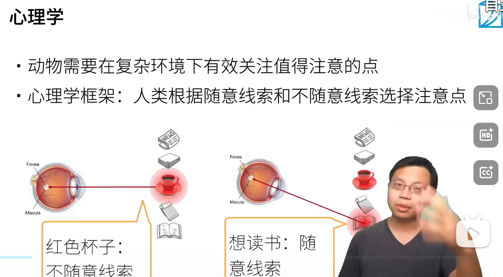


**卷积全连接和池化只考虑不随意线索**

**注意力机制显示的考虑随意线索**

- 随意线索称为查询
- 每个输入是一个值（value）和不随意线索（key）的对
- 通过注意力池化来有偏向的选择某些输入

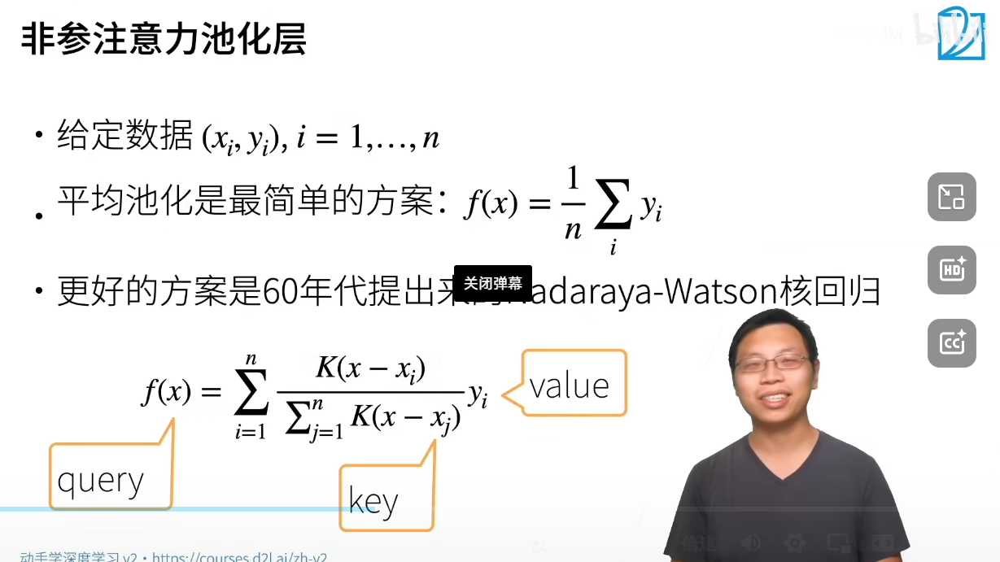


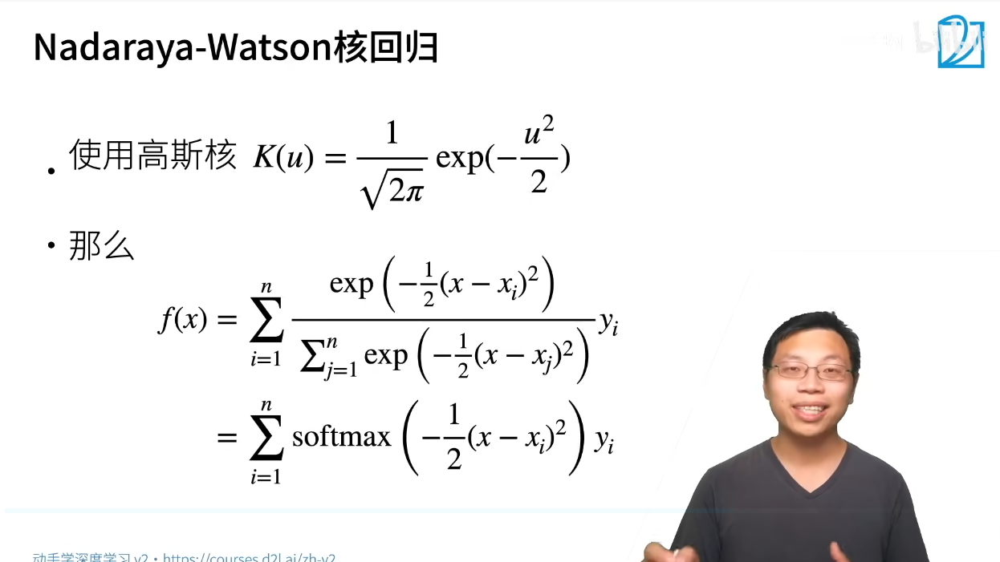


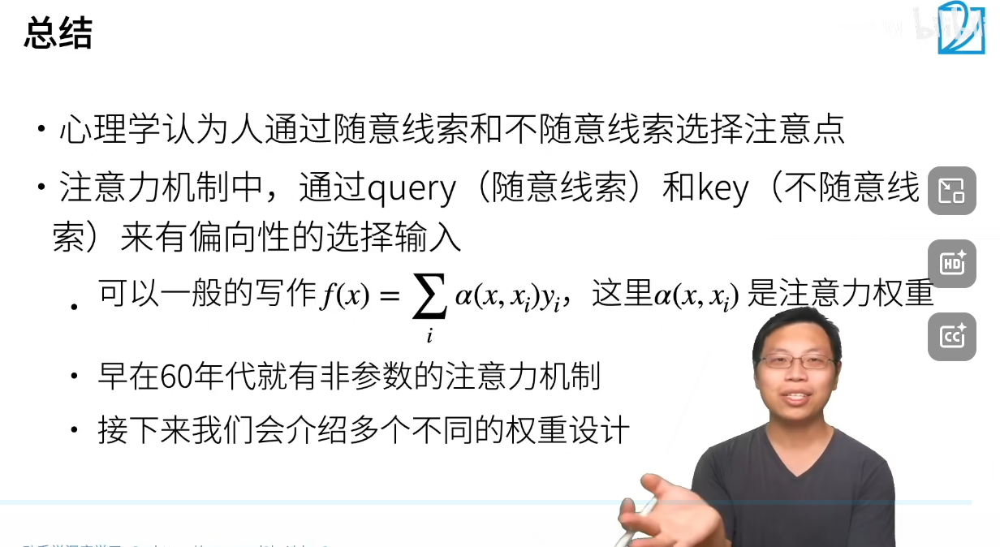


```PYTHON
X = torch.ones((2, 1, 4))
Y = torch.ones((2, 4, 6))
torch.bmm(X, Y).shape


#bmm 对通道矩阵做乘法， 通道数要相同， 对应的通道的矩阵相乘
```


## 注意力分数

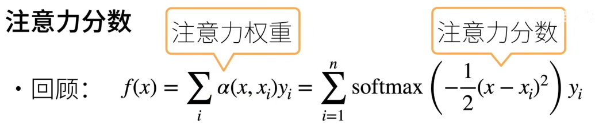

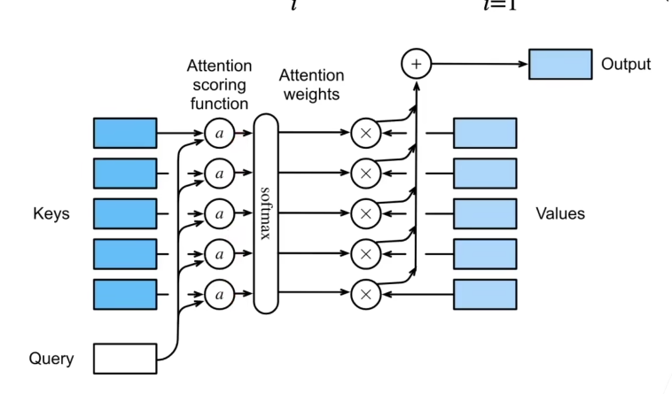

将key，value拓展到高维度

Q,K,V可以长得不一样

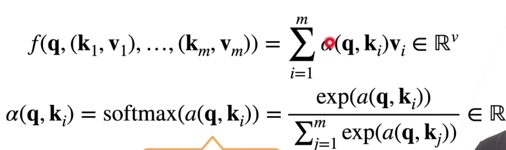

a()怎样设计

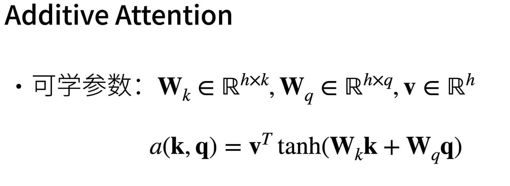

等价于将key，query合并起来放入一个隐藏大小为h，输出为1的MLP. 这里H是一个超参数


内积注意力这里除d，使得对长度没有那么敏感。

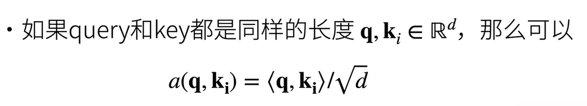

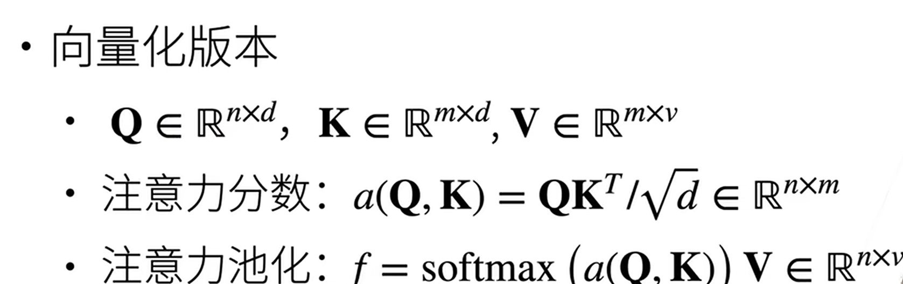

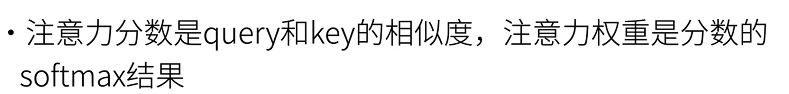

两种常见的分数计算

- 直接query key做内积 除以根号D，使其对长度没有那么敏感
- 将query和key合并起来进入一个单输出的MLP

```python
import torch
import torch.nn as nn
 
class AttentionSeq2Seq(nn.Module):
    def __init__(self, input_dim, hidden_dim, output_dim):
        super(AttentionSeq2Seq, self).__init__()
        self.encoder = nn.LSTM(input_dim, hidden_dim)
        self.decoder = nn.LSTM(hidden_dim, hidden_dim)
        self.attention = nn.Linear(hidden_dim * 2, 1)
        self.output_layer = nn.Linear(hidden_dim, output_dim)
 
    def forward(self, src, tgt):
        # Encoder
        encoder_output, (hidden, cell) = self.encoder(src)
 
        # Decoder with Attention
        output = []
        for i in range(tgt.size(0)):
            # 计算注意力权重
            attention_weights = torch.tanh(self.attention(torch.cat((hidden, encoder_output), dim=2)))
            attention_weights = torch.softmax(attention_weights, dim=1)
 			#这个好像没有query
            # 注意力加权和
            weighted = torch.sum(encoder_output * attention_weights, dim=1)
 
            # Decoder
            out, (hidden, cell) = self.decoder(weighted.unsqueeze(0), (hidden, cell))
            out = self.output_layer(out)
            output.append(out)
 
        return torch.stack(output)
```

我们来看它们升维后的形状变化：

- `queries.unsqueeze(2)`：在第 2 维（从 0 开始算）插入一个维度，形状变成 **`(batch_size, num_queries, 1, num_hiddens)`**
- `keys.unsqueeze(1)`：在第 1 维插入一个维度，形状变成 **`(batch_size, 1, num_keys, num_hiddens)`**


现在我们要让**每一个** Query 去和**每一个** Key 相加。如果不升维，两个矩阵的维度不匹配，没办法直接相加。

当这两个 4D 张量相加时，PyTorch 的**广播机制**会自动把维度里的 `1` 进行复制和扩展：

- `queries` 会在第 2 维复制 `num_keys` 次。
- `keys` 会在第 1 维复制 `num_queries` 次。

相加后的 `features` 形状华丽地变成了：

$$
\text{features.shape} = (\text{batch\_size}, \text{num\_queries}, \text{num\_keys}, \text{num\_hiddens})
$$


**一句话总结这么做的目的**：它用一种极其高效的并行方式，把空间撑开，让第 $i$ 个 Query 和第 $j$ 个 Key 的特征在隐藏层维度上完成了“合体”（相加）。


1. **`self.w_v(features)`**：`self.w_v` 是一个线性层，把最后的 `num_hiddens` 维度映射到 `1`。

   此时形状变为：`(batch_size, num_queries, num_keys, 1)`。

2. **`.squeeze(-1)`**：把最后一个大小为 1 的维度消除掉。

   此时 `scores` 形状变为：**`(batch_size, num_queries, num_keys)`**。

这个 `scores` 矩阵的含义非常完美：第 $(i, j)$ 个元素，就代表第 $i$ 个 Query 和第 $j$ 个 Key 之间的原始注意力分数。


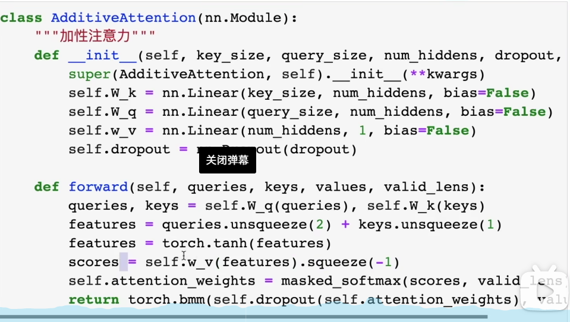

**加性attention**

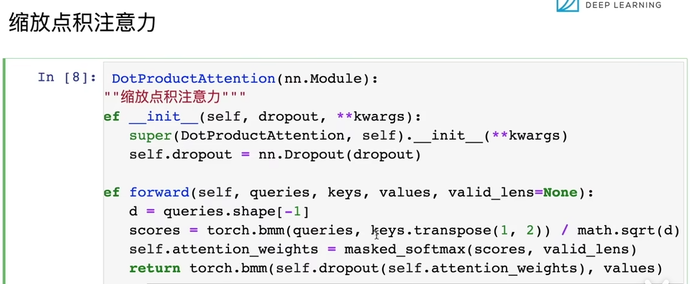

## **使用注意力机制的seq2seq**

机器翻译中，每个生成的词可能相关与原句子中不同的词

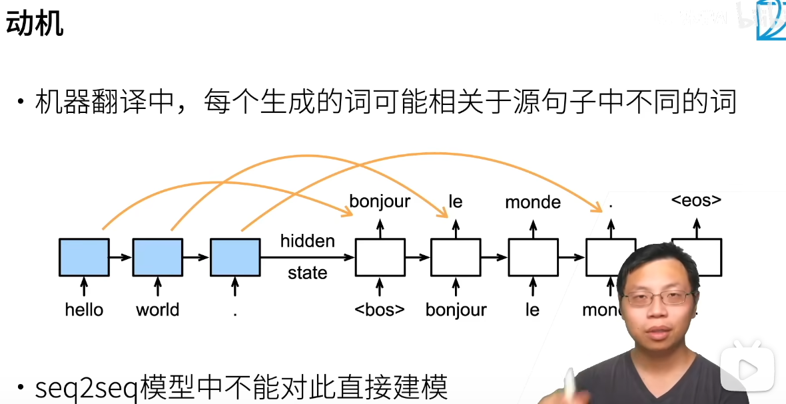


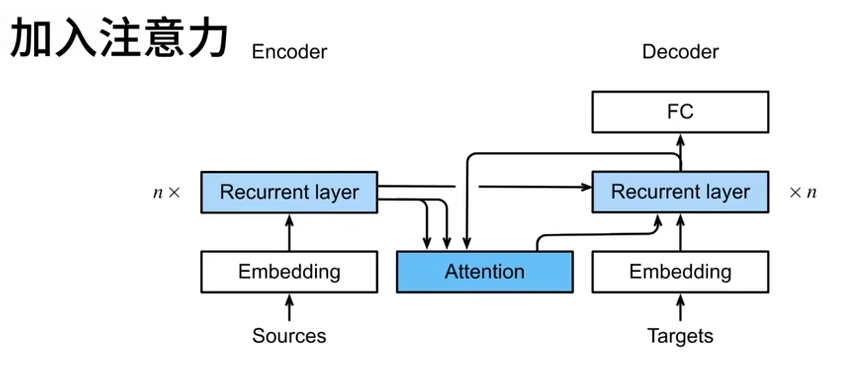

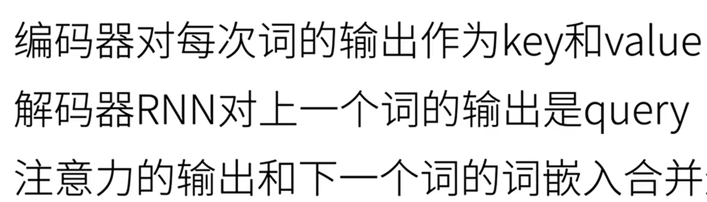

​	用最好一个时刻的状态不好（RNN）, 应该根据此时要预测的值选状态。

​	**编码器** 假设英语原句子长为n，就有n个k，v键值对。k和v是一个东*西（该时间步rnn的输出）。


seq2seq加入Attention机制的动机，在于seq2seq本身的缺陷：回忆一下，Encoder 一方面对Decoder输出RNN的hidden state作为Decoder的RNN的初始化hidden state；另一方面，Encoder只把一个句子中的最后一个时刻（word）的最后一层 当做context（上下文），与Decoder的Input之一 Embedding进行拼接，作为Decoder的另一个输入。但是最后一个时刻（word）的最后一层这一context，尽管包含了之前的time_step的信息，但也是间接的信息，而且失去了位置信息。

​	

把最后一个时刻（word）的最后一层作为[context](https://search.bilibili.com/all?from_source=webcommentline_search&keyword=context&seid=6683849144198507888&from_avid=974654755&from_comid=182743828912)，是不合适的，因为从道理上讲，Encoder（源语言）和Decoder（目标翻译语言）的位置最好一一对应，而不是统一拿Encoder 的 RNN的最后一个time_step的最后一层当做Decoder的RNN的输入的一部分。举个例子，在Decoder第一个位置预测[bonjour](https://search.bilibili.com/all?from_source=webcommentline_search&keyword=bonjour&seid=6683849144198507888&from_avid=974654755&from_comid=182743828912)的时候，不应该拿Encoder的最后一个位置的句号的输出作为context，而是应该拿第一个位置的hello的输出作为context。

 

​	具体来说，假设Encoder的RNN中，一个英文句子的长度（time_step）为3，则有3对key value pair（键值对），其中key=value，第i个key 或者value就是第i个word的RNN的hidden state这一输出。把它们放入Attention中，此时h_t = 第t个key 或者value。与此同时，在Decoder的RNN中，**对上一个词的hidden state输出就是query**，即s_(t'-1) = query。之所以在Decoder使用RNN的输出，而不是input即[Embedding](https://search.bilibili.com/all?from_source=webcommentline_search&keyword=Embedding&seid=6683849144198507888&from_avid=974654755&from_comid=182777268832)，是因为这样可以与Encoder 的RNN的输出 处于同一个语义空间，方便用query对key value pair进行查询。Attention的结果f(x)即c_t'，就能替代之前的c（Encoder最后一个时刻的最后一层的输出），与下一个词的[Embeding](https://search.bilibili.com/all?from_source=webcommentline_search&keyword=Embeding&seid=6683849144198507888&from_avid=974654755&from_comid=182777268832)进行concat，作为Decoder的输入。

**比起普通Decoder 多了 attention 其他层都一样**

每次decoder的输入都重新计算context（隐藏状态）

**seq2seq过程中加入的attention只需要对隐藏状态进行操作，让q（上次的输出）对k过往所有隐藏状态进行求注意力分数操作，然后融合过往所有隐藏状态。简单来说，在seq2seq过程中，只作用于encoder的输出。**

```python
class Seq2SeqAttentionDecoder(AttentionDecoder):
    def __init__(self, vocab_size, embed_size, num_hiddens, num_layers,
                 dropout=0, **kwargs):
        super(Seq2SeqAttentionDecoder, self).__init__(**kwargs)
        self.attention = d2l.AdditiveAttention(
            num_hiddens, num_hiddens, num_hiddens, dropout)
        self.embedding = nn.Embedding(vocab_size, embed_size)
        self.rnn = nn.GRU(
            embed_size + num_hiddens, num_hiddens, num_layers,
            dropout=dropout)
        self.dense = nn.Linear(num_hiddens, vocab_size)

    def init_state(self, enc_outputs, enc_valid_lens, *args):
        # outputs的形状为(batch_size，num_steps，num_hiddens).
        # hidden_state的形状为(num_layers，batch_size，num_hiddens)
        outputs, hidden_state = enc_outputs
        return (outputs.permute(1, 0, 2), hidden_state, enc_valid_lens)

    def forward(self, X, state):
        # enc_outputs的形状为(batch_size,num_steps,num_hiddens).
        # hidden_state的形状为(num_layers,batch_size,
        # num_hiddens)
        enc_outputs, hidden_state, enc_valid_lens = state
        # 输出X的形状为(num_steps,batch_size,embed_size)
        X = self.embedding(X).permute(1, 0, 2)
        outputs, self._attention_weights = [], []
        for x in X:
            # query的形状为(batch_size,1,num_hiddens)
            query = torch.unsqueeze(hidden_state[-1], dim=1)
            # context的形状为(batch_size,1,num_hiddens)
            context = self.attention(
                query, enc_outputs, enc_outputs, enc_valid_lens)
            # 在特征维度上连结
            x = torch.cat((context, torch.unsqueeze(x, dim=1)), dim=-1)
            # 将x变形为(1,batch_size,embed_size+num_hiddens)
            out, hidden_state = self.rnn(x.permute(1, 0, 2), hidden_state)
            outputs.append(out)
            self._attention_weights.append(self.attention.attention_weights)
        # 全连接层变换后，outputs的形状为
        # (num_steps,batch_size,vocab_size)
        outputs = self.dense(torch.cat(outputs, dim=0))
        return outputs.permute(1, 0, 2), [enc_outputs, hidden_state,
                                          enc_valid_lens]

    @property
    def attention_weights(self):
        return self._attention_weights
```

  query的形状为(batch_size,1,num_hiddens)
            query = torch.unsqueeze(hidden_state[-1], dim=1) 因为Encoder，Decoder只有1个q，但是为了使用之前定义的attention层，多加入一个维度。


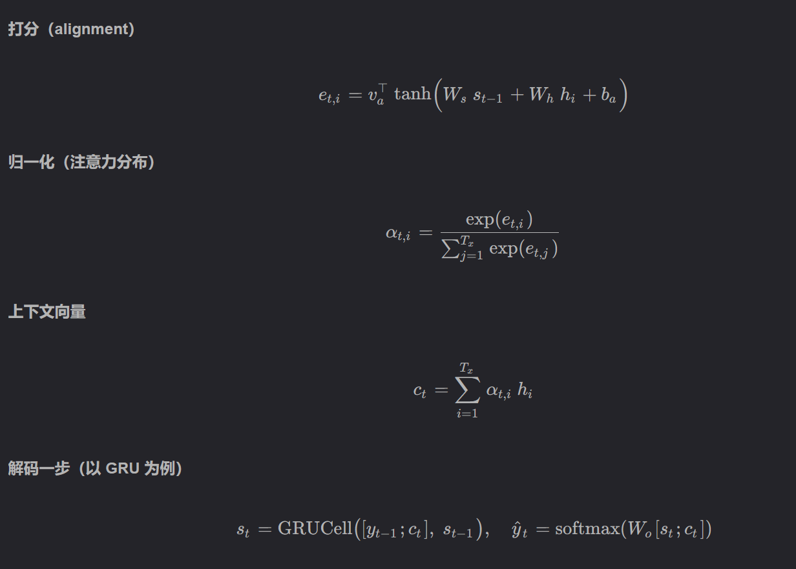

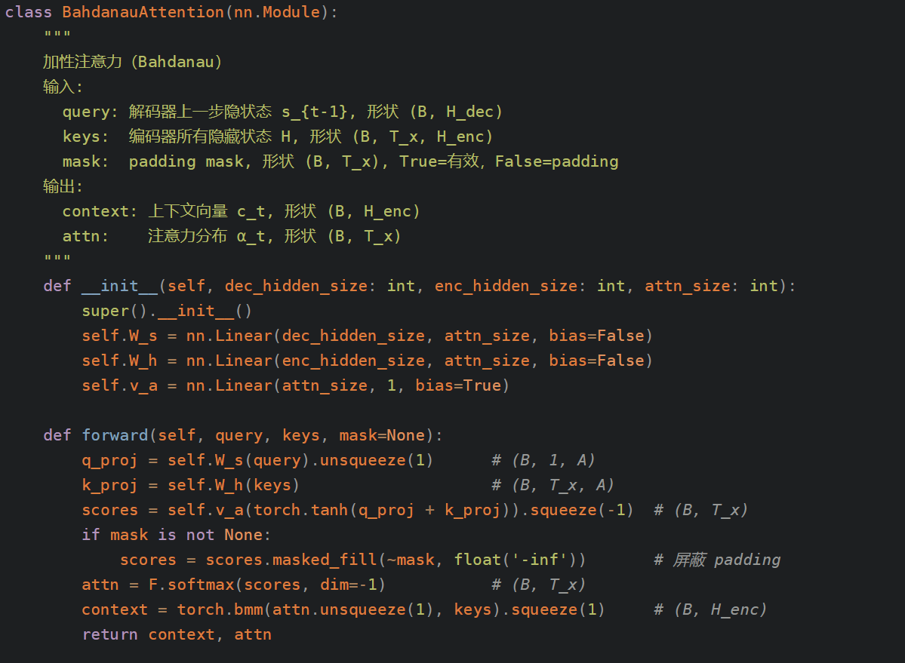

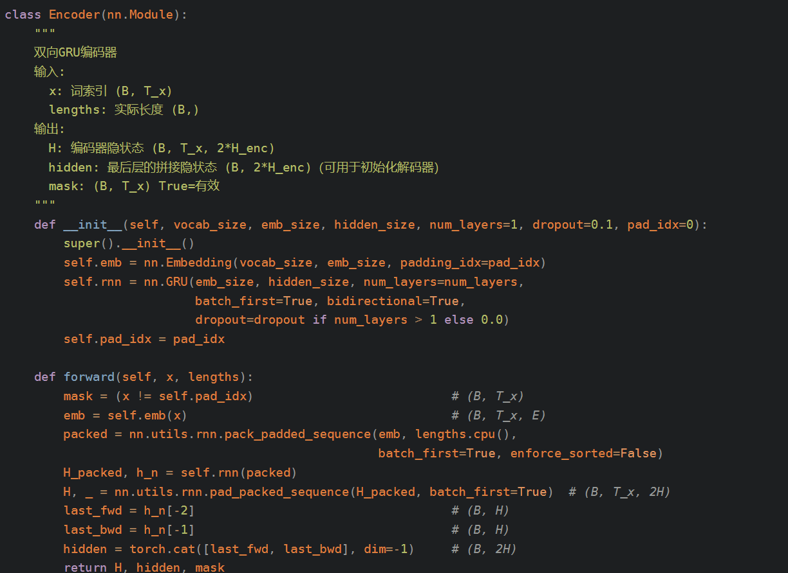

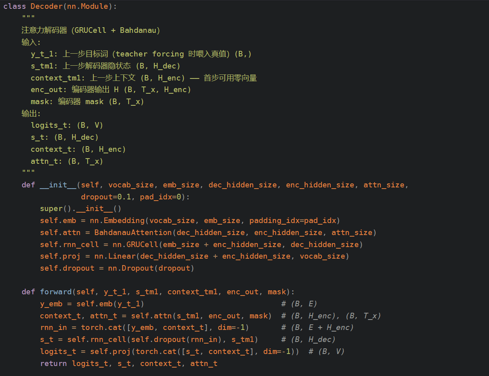

## 自注意力

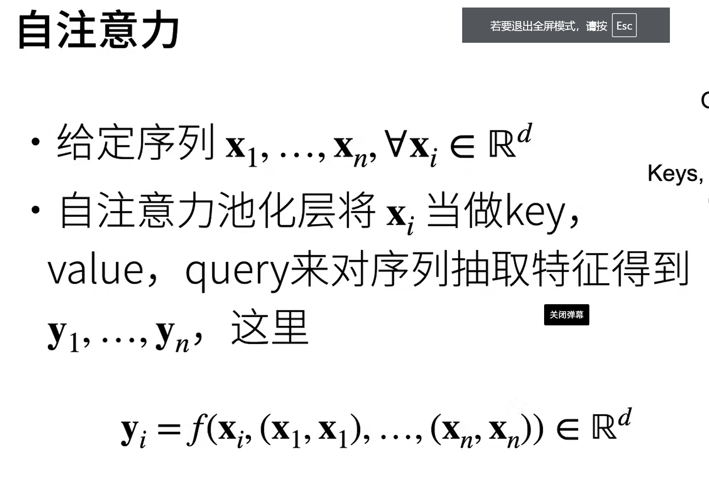

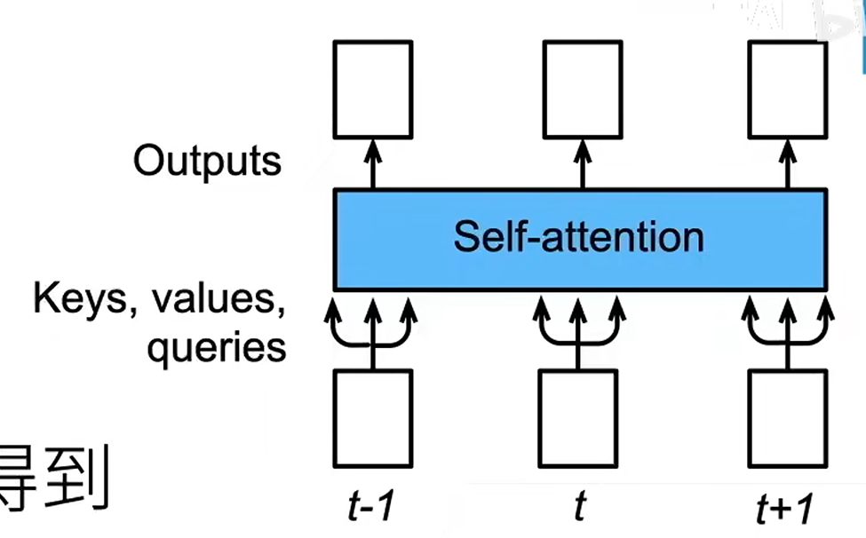

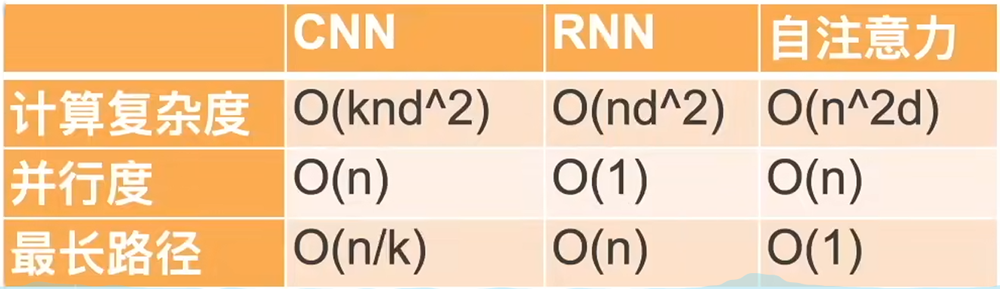

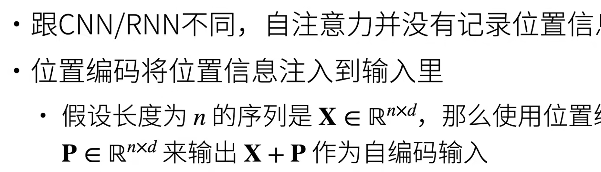

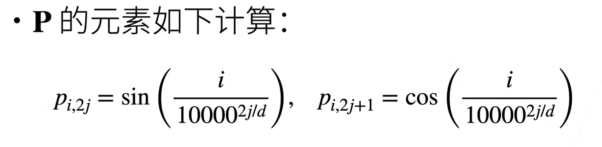

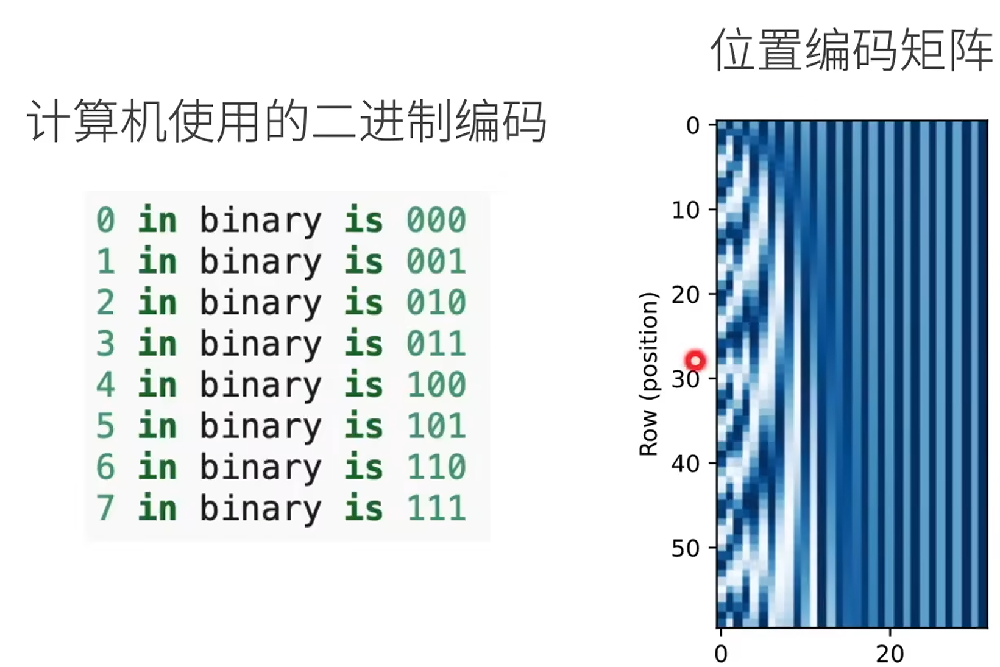

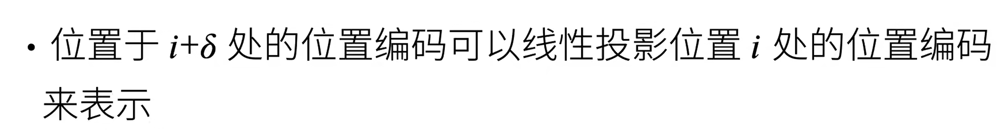

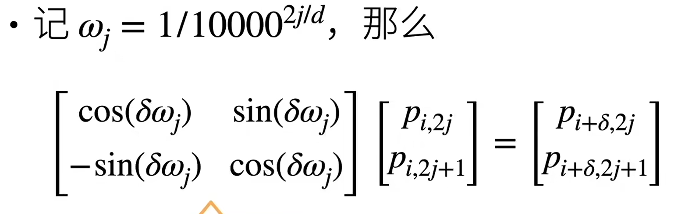

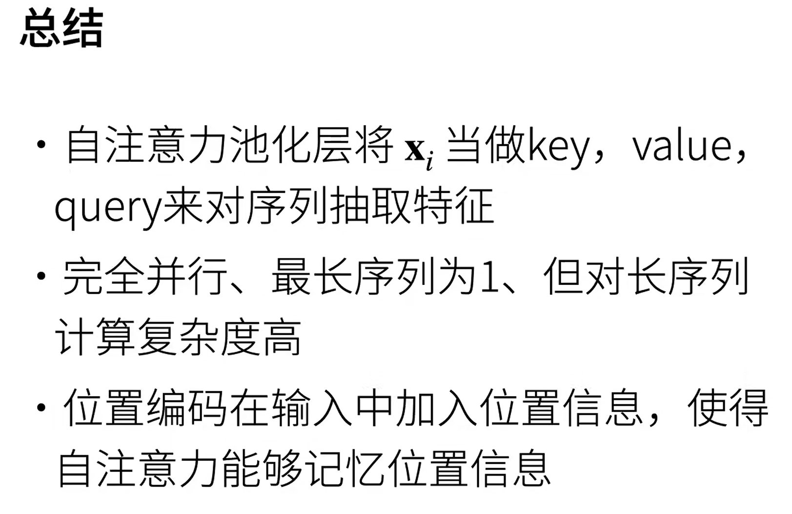

## Transformer与多头注意力机制

Transformer 本质上是一个 Encoder-Decoder 架构。**因此中间部分的 Transformer 可以分为两个部分：编码组件和解码组件。**

Transformer是一个纯基于自注意力的架构。

其中，编码组件由多层编码器（Encoder）组成（在论文中作者使用了 6 层编码器，在实际使用过程中你可以尝试其他层数）。解码组件也是由相同层数的解码器（Decoder）组成（在论文也使用了 6 层）。如图 1.4 所示：

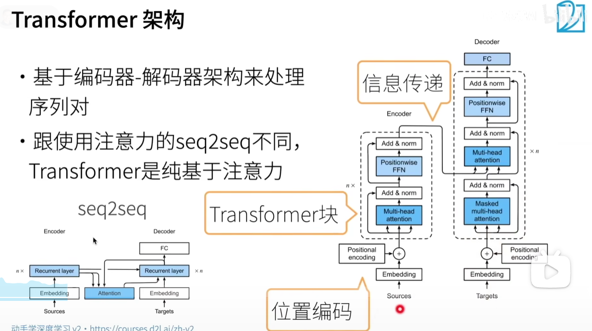

每个编码器由两个子层组成：**Self-Attention 层（自注意力层）和 Position-wise Feed Forward Network**（前馈网络，缩写为 FFN）

每个解码器由两个注意力层（**自注意力层和交叉注意力**）和Position-wise Feed Forward Network 组成，


编码器的输入会先流入 [Self-Attention](https://so.csdn.net/so/search?q=Self-Attention&spm=1001.2101.3001.7020) 层。**它可以让编码器在对特定词进行编码时使用输入句子中的其他词的信息**（可以理解为：当我们翻译一个词时，不仅只关注当前的词，而且还会关注其他词的信息）。

解码器也有编码器中这两层，**但是它们之间还有一个注意力层（即 Encoder-Decoder Attention）**，其用来帮忙解码器关注输入句子的相关部分（类似于 seq2seq 模型中的注意力）。

和通常的 NLP 任务一样，首先，我们使用词嵌入算法（Embedding）将每个词转换为一个词向量。在 Transformer 论文中，词嵌入向量的维度是 512。


## Multi-head Attention

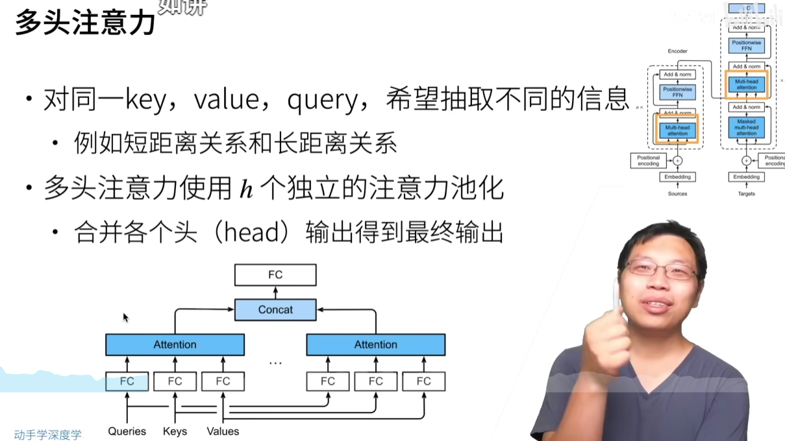

在实践中，当给定相同的查询、键和值的集合时， **我们希望模型可以基于相同的注意力机制学习到不同的行为， 然后将不同的行为作为知识组合起来**， 捕获序列内各种范围的依赖关系 （例如，短距离依赖和长距离依赖关系）。 因此，允许注意力机制组合使用查询、键和值的不同 子空间表示（representation subspaces）可能是有益的。

为此，**与其只使用单独一个注意力汇聚， 我们可以用独立学习得到的h组（一般h=8）不同的线性投影**（linear projections）来变换查询、键和值。 然后，这h组变换后的查询、键和值将并行地送到注意力汇聚中。 最后，将这h个注意力汇聚的输出拼接在一起， 并且通过另一个可以学习的线性投影进行变换， 以产生最终输出。 这种设计被称为多头注意力（multihead attention）。  **这里将输入在dimension维度分层八组，而不是八次同样的操作**

***\*第1步：\*******\*定义多组W，生成多组Q、K、V\****

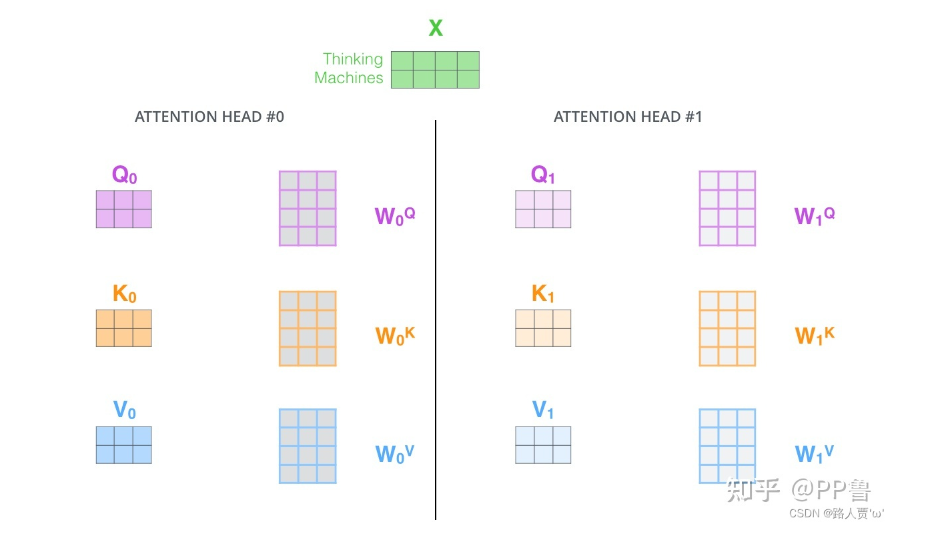

***\*第2步：\*******\*定义8组参数\****


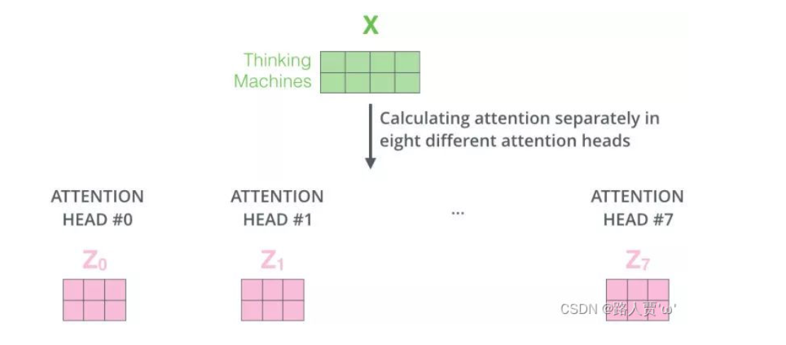


***\*第3步：\*******\*将多组输出拼接后乘以矩阵\**\**以降低维度\****

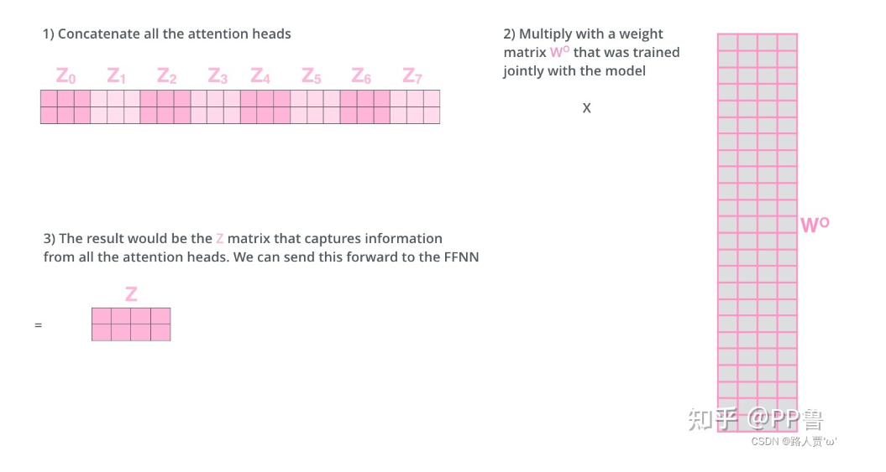


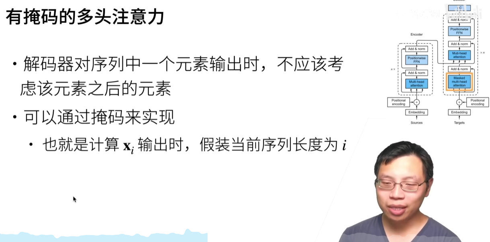

**有掩码的多头注意力在Decoder时使用。**


** 位置前馈网络 **

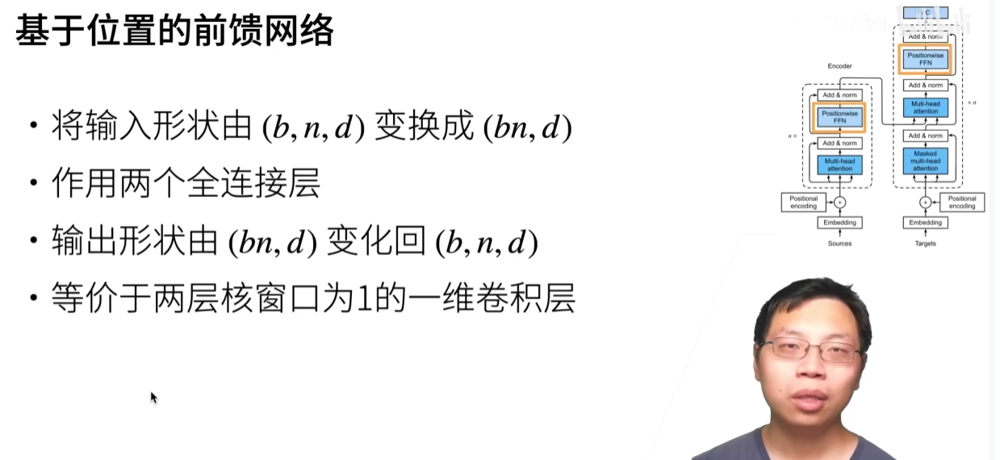

  **位置前馈网络就是一个全连接前馈网络**，（**这就是个三维的MLP，改了个名字**）每个位置的词都单独经过这个完全相同的前馈神经网络。其由**两个线性变换**组成，即两个全连接层组成，第一个全连接层的激活函数为 ReLU 激活函数。可以表示为：

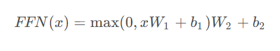

**在 Transformer Block 中，它的标准公式非常简单，就是一个双层线性映射加一个激活函数（通常是 ReLU 或 GELU）**

**作用于每一个词**

**FFN 引入了激活函数（如 ReLU/GELU）**，这就为模型注入了非线性动力。自注意力负责在空间中把特征“聚合”起来，而 FFN 则负责对聚合后的特征进行深度**非线性加工和扭曲**，让模型能够学习到极其复杂的特征模式。


- **$x$ 的维度**：$[d_{model}]$（或者叫 `num_hiddens`，例如 $512$）。它代表这一个单词的特征向量长度。

我们顺着公式推导一遍每一阶段的维度变化：

1. $x \cdot W_1$：$W_1$ 的维度是 $[d_{model}, d_{ff}]$（标准 Transformer 中 $d_{ff} = 2048$）。

   乘完后，$xW_1$ 的维度变成了 **$[d_{ff}]$**（即 $2048$）。

2. $\max(0, \cdot)$：激活函数不改变维度，依然是 **$[d_{ff}]$**。

3. $(\cdot) \cdot W_2$：$W_2$ 的维度是 $[d_{ff}, d_{model}]$（即 $[2048, 512]$）。

   乘完后，维度变回了 **$[d_{model}]$**（即 $512$）。


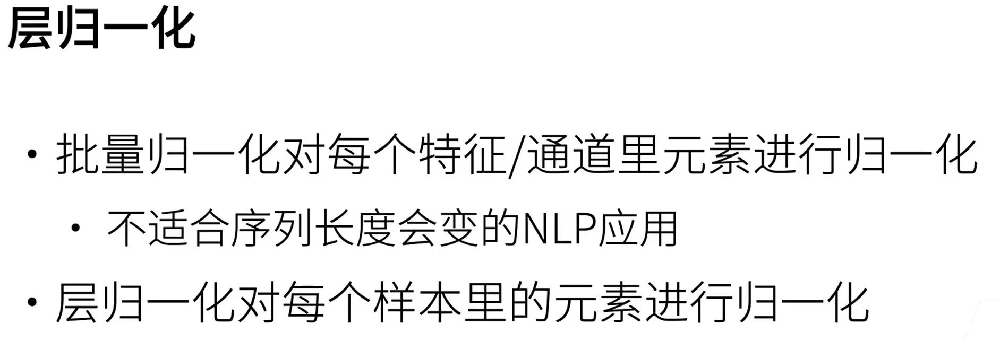 


预测t+1时刻输出时，解码器输入前t个预测，并作为key和value，第t个时刻还作为query

总结 transformer是一个纯使用注意力的encoder-decoder

编码器和解码器都有n块

每个块都使用多头自注意力，基于位置的前馈神经网络，层归一化。

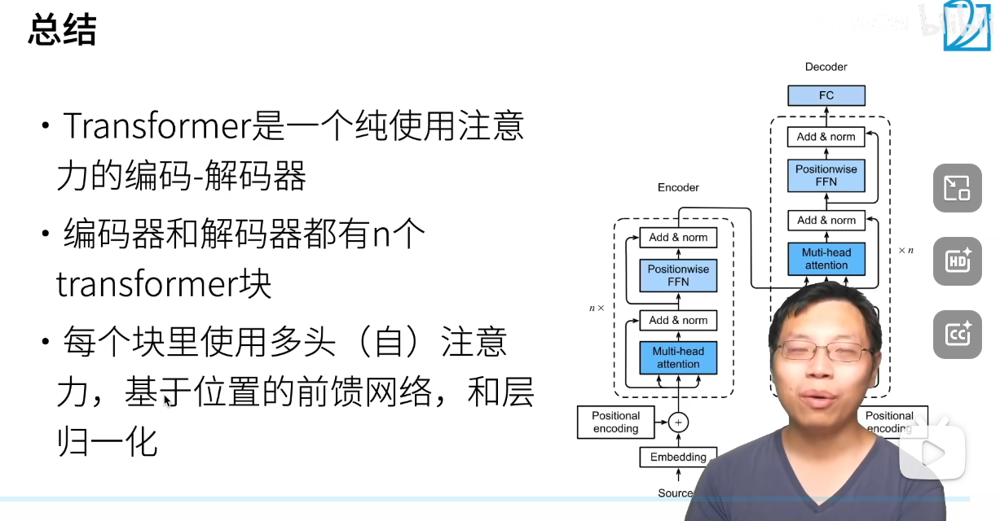

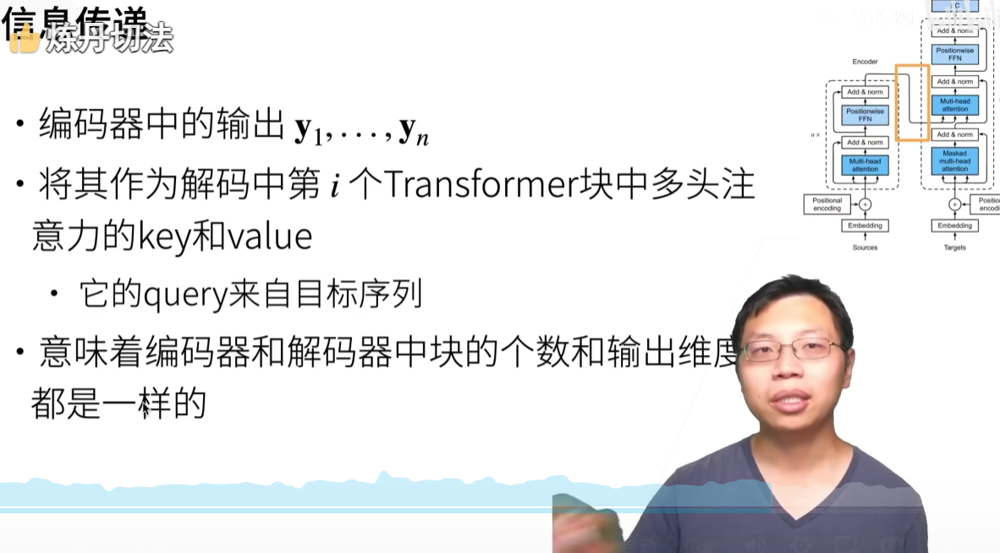


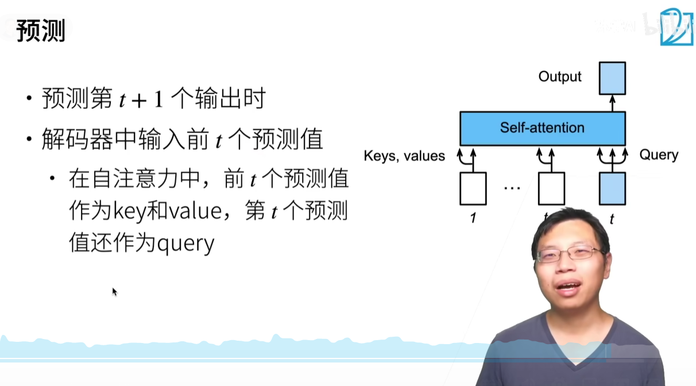


### 代码


**多头注意力中的多头，每一个头是对num_hiddens中的一部分进行操作**

**transpose_qkv** ，**对num_hiddens --> 多个  num_heads**

```python
#@save
class MultiHeadAttention(nn.Module):
    """多头注意力"""
    def __init__(self, key_size, query_size, value_size, num_hiddens,
                 num_heads, dropout, bias=False, **kwargs):
        super(MultiHeadAttention, self).__init__(**kwargs)
        self.num_heads = num_heads
        self.attention = d2l.DotProductAttention(dropout)
        self.W_q = nn.Linear(query_size, num_hiddens, bias=bias)
        self.W_k = nn.Linear(key_size, num_hiddens, bias=bias)
        self.W_v = nn.Linear(value_size, num_hiddens, bias=bias)
        self.W_o = nn.Linear(num_hiddens, num_hiddens, bias=bias)

    def forward(self, queries, keys, values, valid_lens):
        # queries，keys，values的形状:
        # (batch_size，查询或者“键－值”对的个数，num_hiddens)
        # valid_lens　的形状:
        # (batch_size，)或(batch_size，查询的个数)
        # 经过变换后，输出的queries，keys，values　的形状:
        # (batch_size*num_heads，查询或者“键－值”对的个数，
        # num_hiddens/num_heads)
        queries = transpose_qkv(self.W_q(queries), self.num_heads)
        keys = transpose_qkv(self.W_k(keys), self.num_heads)
        values = transpose_qkv(self.W_v(values), self.num_heads)

        if valid_lens is not None:
            # 在轴0，将第一项（标量或者矢量）复制num_heads次，
            # 然后如此复制第二项，然后诸如此类。
            valid_lens = torch.repeat_interleave(
                valid_lens, repeats=self.num_heads, dim=0)

        # output的形状:(batch_size*num_heads，查询的个数，
        # num_hiddens/num_heads)
        output = self.attention(queries, keys, values, valid_lens)

        # output_concat的形状:(batch_size，查询的个数，num_hiddens)
        output_concat = transpose_output(output, self.num_heads)
        return self.W_o(output_concat)
```

当 `queries`、`keys`、`values` 经过 `transpose_qkv` 变换后，进入 `DotProductAttention` 之前，**每一个头**在逻辑上的形状是：
$$
\text{单头的形状 (Query/Key/Value)} = (\mathbf{batch\_size}, \,\, \mathbf{num\_queries}, \,\, \mathbf{d_v})
$$


- 假设 `batch_size = 32`（32句话），每句话有 `50` 个词（`num_queries = 50`）。
- 每个头分到的特征维度 $d_v = 512 / 8 = 64$。
- 那么这 8 个头里的**任意一个头**，此时的形状就是：**`(32, 50, 64)`**。


**encoderBlock不会改变输入形状**

**如果你说 `EncoderBlock` 是标准的两层结构（自注意力 + FFN），那么 `DecoderBlock` 就是一个三层结构。它多出来的那一层，就是为了和 Encoder 进行信息交互。**

在这段代码中，`state[2]` 是整个解码器中最具备工程智慧的设计之一——它就是大模型在**预测（推理）阶段专用的“历史缓存机制”（通常被称为 KV Cache）**。

为了让你彻底看懂 `state[2]` 的妙处，我们必须区分训练（Training）**和**预测（Inference/Prediction）两种完全不同的业务场景来看。

**`state[2]` 存储的是什么？**

`state[2]` 在逻辑上是一个列表（List），它的长度等于 Decoder 的层数（`num_layers`）。

- `state[2][self.i]` 特指**当前第 $i$ 层 Decoder 块专属的历史记忆库**。
- 它里面存的，是**当前层在过去所有时间步里，曾经解码过的所有 Token 的特征表达（Key 和 Value）**。

**预测阶段（Evaluation）：`state[2]` 的动态滚动**

在模型真正生成文本（比如玩 ChatGPT）时，用户给一个开头，大模型必须**一个字一个字地往外蹦**。

- **时间步 $t=1$**：
  - 输入 `X` 只有 1 个词（当前词）。
  - 此时 `state[2][self.i]` 还是 `None`。
  - 运行代码：`key_values = X`。
  - `state[2][self.i]` 被存入了第 1 个词的特征。
- **时间步 $t=2$**：
  - 输入 `X` 依然只有 1 个新生成的词（第 2 个词）。
  - 此时 `state[2][self.i]` 里已经躺着第 1 个词了。
  - 运行代码：`key_values = torch.cat((state[2][self.i], X), axis=1)` —— **把第 1 个词和最新的第 2 个词在序列维度（`axis=1`）上拼起来！**
  - 现在的 `key_values` 包含了 `[词1, 词2]`。
  - 紧接着：`state[2][self.i] = key_values`，把这个更新后的完整记忆更新回 `state[2]`。

### 纵观整个 `DecoderBlock` 的数据流动

由于 `state[2]` 在第一步就为我们拼好了包含历史全景的 `key_values`，Decoder 的三步走策略就非常清晰了：


第一步：遮蔽自注意力（Masked Self-Attention）


```python
X2 = self.attention1(X, key_values, key_values, dec_valid_lens)
当前词 X 带着历史所有的词 key_values 玩自注意力。
```

第二步：交叉注意力（Encoder-Decoder Attention）

```python
Y2 = self.attention2(Y, enc_outputs, enc_outputs, enc_valid_lens)
```

**这是最关键的区别！** 这里的 Query 是 Decoder 刚刚算出来的特征 `Y`，而 Key 和 Value 则是 **Encoder 的输出 `enc_outputs`**。 *它的物理含义是*：Decoder 梳理完自己内部的逻辑后（第一步），伸出触角去翻看 Encoder 的整句大黑板（`enc_outputs`），看源语言里现在哪个词最需要被翻译。

**第三步：FFN 独立消化** 最后通过 FFN 对前两步汇聚的信息做单词位置级别的非线性提炼。


$encoder X$ 的长度永远固定为 1

我们通过 **KV Cache（即 `state[2]`）** 把变长的压力转移给了 Key 和 Value。而真正的输入 $X$（Query）在每一时间步被死死固定为**长度只有 1 的单词张量**

```python
class DecoderBlock(nn.Module):
    """解码器中第i个块"""
    def __init__(self, key_size, query_size, value_size, num_hiddens,
                 norm_shape, ffn_num_input, ffn_num_hiddens, num_heads,
                 dropout, i, **kwargs):
        super(DecoderBlock, self).__init__(**kwargs)
        self.i = i
        self.attention1 = d2l.MultiHeadAttention(
            key_size, query_size, value_size, num_hiddens, num_heads, dropout)
        self.addnorm1 = AddNorm(norm_shape, dropout)
        self.attention2 = d2l.MultiHeadAttention(
            key_size, query_size, value_size, num_hiddens, num_heads, dropout)
        self.addnorm2 = AddNorm(norm_shape, dropout)
        self.ffn = PositionWiseFFN(ffn_num_input, ffn_num_hiddens,
                                   num_hiddens)
        self.addnorm3 = AddNorm(norm_shape, dropout)

    def forward(self, X, state):
        enc_outputs, enc_valid_lens = state[0], state[1]
        # 训练阶段，输出序列的所有词元都在同一时间处理，
        # 因此state[2][self.i]初始化为None。
        # 预测阶段，输出序列是通过词元一个接着一个解码的，
        # 因此state[2][self.i]包含着直到当前时间步第i个块解码的输出表示
        if state[2][self.i] is None:
            key_values = X
        else:
            key_values = torch.cat((state[2][self.i], X), axis=1)
        state[2][self.i] = key_values
        if self.training:
            batch_size, num_steps, _ = X.shape
            # dec_valid_lens的开头:(batch_size,num_steps),
            # 其中每一行是[1,2,...,num_steps]
            dec_valid_lens = torch.arange(
                1, num_steps + 1, device=X.device).repeat(batch_size, 1)
        else:
            dec_valid_lens = None

        # 自注意力
        X2 = self.attention1(X, key_values, key_values, dec_valid_lens)
        Y = self.addnorm1(X, X2)
        # 编码器－解码器注意力。
        # enc_outputs的开头:(batch_size,num_steps,num_hiddens)
        Y2 = self.attention2(Y, enc_outputs, enc_outputs, enc_valid_lens)
        Z = self.addnorm2(Y, Y2)
        return self.addnorm3(Z, self.ffn(Z)), state
```

#### 仔细观察这里的 $Q, K, V$ 维度：

在计算自注意力 `self.attention1(X, key_values, key_values, ...)` 时：

- **Query ($X$)** 的形状：`(batch_size, 1, num_hiddens)` ── **长度永远是 1**。
- **Key / Value (`key_values`)** 的形状：`(batch_size, t, num_hiddens)` ── **长度随着时间步 $t$ 动态增长**（从 1 变 2，变 3……）。


在结构上，**永远只有 1 个真正的 Encoder 最终输出矩阵，但这个矩阵会被同时“广播”传递给全部 6 层 Decoder，因此共发生了 6 次实质性的跨界交叉注意力计算。**

只有当最后一层（第 6 层）Encoder 彻底算完后，才会吐出一个最终的完全体特征矩阵，我们不妨称之为 **`enc_outputs`**。

这个 `enc_outputs` 的形状就是我们之前熟悉的 `(batch_size, num_steps, num_hiddens)`。在这个节点上，**Encoder 的使命就彻底结束了，它只产出了这 1 个终极成果。**

**Decoder 接收的视角（次数是：6）**

当数据流动到 Decoder 侧时，Decoder 的 6 层同样是串行堆叠的。但是，**每一层 Decoder 块内部，都包含一个我们刚刚聊透的“交叉注意力层（Cross Attention）”**。

这 6 层 Decoder 在运行自己的第二层注意力时，都会把触角伸向外面，去读取 Encoder 的成果。这就导致了以下极具画面感的动态过程：


## BERT(只有Encoder的transformer)


### NLP里的迁移学习

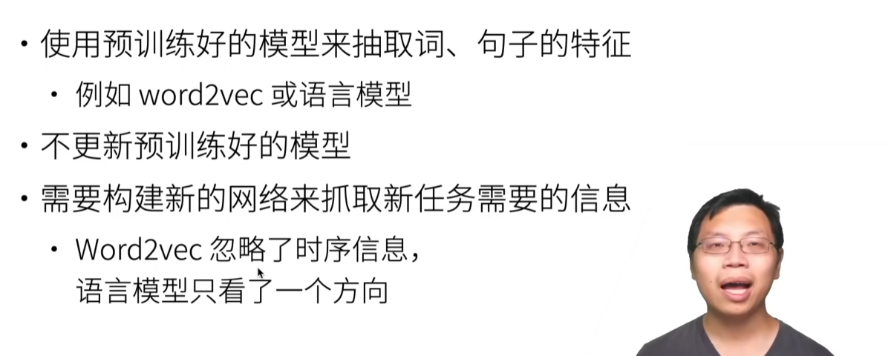


BERT 针对“预训练（Pre-training）”进行设计，意思是 **BERT 的核心创新并不在于怎么去解决某一个具体的任务（比如分类或翻译），而是在于如何让模型通过“做练习题”自学，掌握语言的通用底层规律。**

在 BERT 之前，传统的做法是针对不同任务设计不同的网络结构（比如做情感分析设计一个网络，做文本摘要又设计一个）。而 BERT 的逻辑是：**先用海量无标注文本把模型“培养成一个精通语言的高材生”，然后面对具体任务时，只需要进行简单的微调（Fine-tuning）即可。**

为了实现这个目标，BERT 在架构和训练任务上做了两个最核心的“针对性设计”：

 1. 真正的“双向”上下文设计（架构设计）

在 BERT 之前，像 OpenAI 的 GPT-1 也是基于 Transformer 的预训练模型，但它是**单向**的（从左到右）。这意味着当它理解一个词时，只能看到这个词左边的信息。

- **为什么不直接做成双向？** 因为传统的语言模型是预测下一个词，如果同时看到左边和右边，模型就会直接看到“标准答案”，从而发生**信息泄露**，学不到任何东西。
- **BERT 的解决办法：** 它通过掩码语言模型（Masked Language Model, MLM）完美解决了这个矛盾。

 2. 两个量身定制的预训练任务（任务设计）

为了让模型在预训练阶段不需要人工标注的数据（直接用维基百科等现成文本），BERT 设计了两个完全依靠计算机自己生成的“填空题”和“判断题”：

 任务一：Masked LM（掩码语言模型——完形填空）

BERT 在输入一句话时，会**随机把 15% 的词用 `[MASK]` 这个符号遮挡起来**，然后让模型去猜被挡住的词是什么。

> **输入：** 今天的 `[MASK]` 很好，我想去公园散步。 **目标：** 让模型预测 `[MASK]` 应该是“天气”。

这个设计逼得模型**必须同时结合左边和右边的上下文**去推理。这就是 BERT 的 “B”（Bidirectional，双向）的由来。

 任务二：Next Sentence Prediction（NSP，下一句预测——判断题）

光懂词的意思还不够，模型还得懂句子之间的逻辑关系。所以 BERT 在预训练时，会输入两个句子（句子 A 和句子 B），让模型判断 **B 是不是 A 紧接着的下一句话**。

> **例子 1（正例）：** > [A]: 乔布斯发布了 iPhone。 [B]: 这款手机改变了世界。 **模型需要输出：** IsNext（是的）
>
> **例子 2（反例）：** > [A]: 乔布斯发布了 iPhone。 [B]: 企鹅生活在南极。 **模型需要输出：** NotNext（不是）

 预训练设计的最终效果

通过这两个设计，BERT 可以在不需要人工标注的千亿级文本中疯狂训练。

预训练结束后，BERT 内部的参数就具备了极强的**通用语言理解能力**（它懂语法、懂代词指代、懂上下文语境）。当你需要用它做特定的工作（比如判断邮件是不是垃圾邮件）时，你只需要在 BERT 顶层加一个非常简单的分类输出层，然后用几百条标注数据稍微训练几分钟（这个过程叫**微调**），它就能爆发出惊人的准确度。

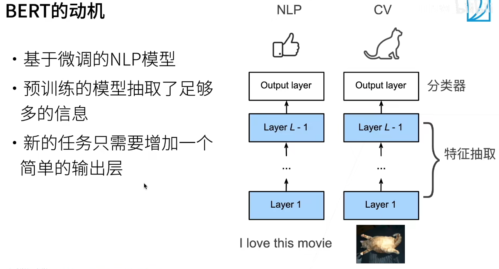


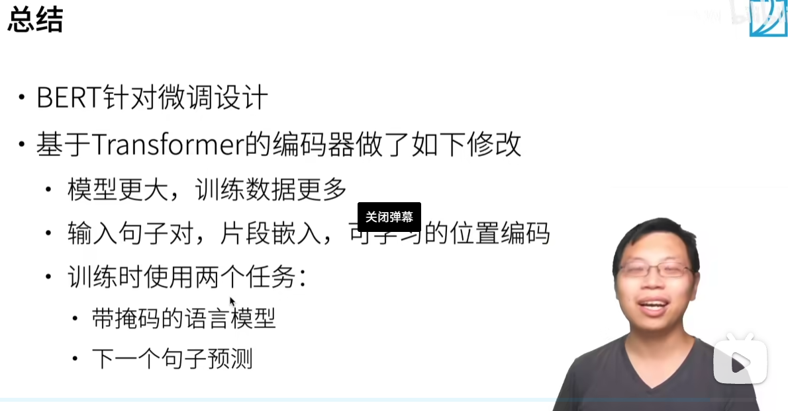


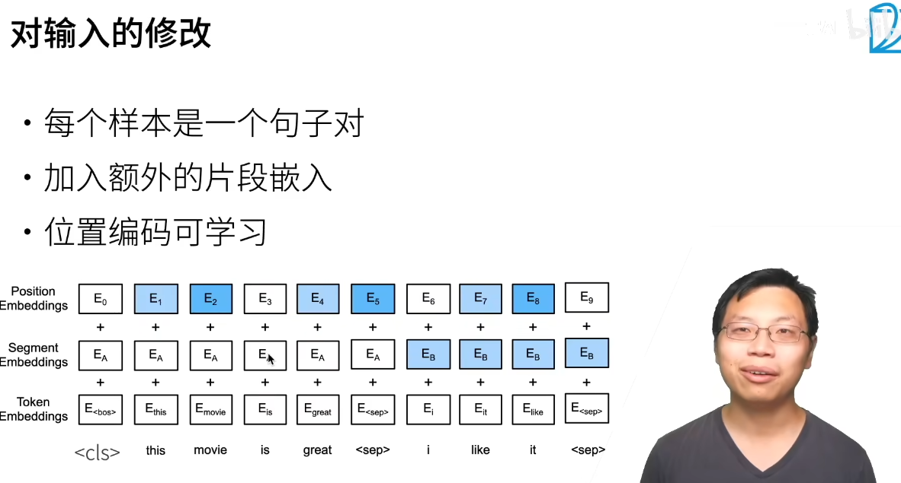

## Segment Embedding（段落/句子嵌入层）

- **核心作用：** 负责区分**当前这个词属于哪一个句子**。这是专门为了服务 BERT 的“下一句预测（NSP）”预训练任务而设计的。
- **工作机制：** BERT 通常一次输入两个句子（句子 A 和句子 B）。
  - 属于**句子 A** 的所有 Token，都会被分配一个相同的 `Sentence A Embedding` 向量（内部通常表示为 0）。
  - 属于**句子 B** 的所有 Token，则会被分配一个 `Sentence B Embedding` 向量（内部通常表示为 1）。
  - 如果任务只有一句话，那么全部分配为 0 即可。通过这种方式，模型就能一眼看出哪些词是一伙的，哪些词是另一句的。


### 任务一：Masked LM（掩码语言模型——完形填空）

BERT 在输入一句话时，会**随机把 15% 的词用 `[MASK]` 这个符号遮挡起来**，然后让模型去猜被挡住的词是什么。

> **输入：** 今天的 `[MASK]` 很好，我想去公园散步。 **目标：** 让模型预测 `[MASK]` 应该是“天气”。

这个设计逼得模型**必须同时结合左边和右边的上下文**去推理。这就是 BERT 的 “B”（Bidirectional，双向）的由来。

### 任务二：Next Sentence Prediction（NSP，下一句预测——判断题）

光懂词的意思还不够，模型还得懂句子之间的逻辑关系。所以 BERT 在预训练时，会输入两个句子（句子 A 和句子 B），让模型判断 **B 是不是 A 紧接着的下一句话**。

> **例子 1（正例）：** > [A]: 乔布斯发布了 iPhone。 [B]: 这款手机改变了世界。 **模型需要输出：** IsNext（是的）
>
> **例子 2（反例）：** > [A]: 乔布斯发布了 iPhone。 [B]: 企鹅生活在南极。 **模型需要输出：** NotNext（不是）

## 预训练设计的最终效果

通过这两个设计，BERT 可以在不需要人工标注的千亿级文本中疯狂训练。

预训练结束后，BERT 内部的参数就具备了极强的**通用语言理解能力**（它懂语法、懂代词指代、懂上下文语境）。当你需要用它做特定的工作（比如判断邮件是不是垃圾邮件）时，你只需要在 BERT 顶层加一个非常简单的分类输出层，然后用几百条标注数据稍微训练几分钟（这个过程叫**微调**），它就能爆发出惊人的准确度。


```python
#@save
class MaskLM(nn.Module):
    """BERT的掩蔽语言模型任务"""
    def __init__(self, vocab_size, num_hiddens, num_inputs=768, **kwargs):
        super(MaskLM, self).__init__(**kwargs)
        self.mlp = nn.Sequential(nn.Linear(num_inputs, num_hiddens),
                                 nn.ReLU(),
                                 nn.LayerNorm(num_hiddens),
                                 nn.Linear(num_hiddens, vocab_size))

    def forward(self, X, pred_positions):
        num_pred_positions = pred_positions.shape[1]
        pred_positions = pred_positions.reshape(-1)
        batch_size = X.shape[0]
        batch_idx = torch.arange(0, batch_size)
        # 假设batch_size=2，num_pred_positions=3
        # 那么batch_idx是np.array（[0,0,0,1,1,1]）
        batch_idx = torch.repeat_interleave(batch_idx, num_pred_positions)
        masked_X = X[batch_idx, pred_positions]
        masked_X = masked_X.reshape((batch_size, num_pred_positions, -1))
        mlm_Y_hat = self.mlp(masked_X)
        return mlm_Y_hat
```

对于每一个被 `[MASK]` 遮住的词，它都给出了一个长度为 `vocab_size` 的向量（包含了词表中每个词的分数）。后面只需要把这个预测结果和真正的标准答案计算 **交叉熵损失（Cross Entropy Loss）**，就可以用来训练 BERT 啦！


```python
class NextSentencePred(nn.Module):
    """BERT的下一句预测任务"""
    def __init__(self, num_inputs, **kwargs):
        super(NextSentencePred, self).__init__(**kwargs)
        self.output = nn.Linear(num_inputs, 2)

    def forward(self, X):
        # X的形状：(batchsize,num_hiddens)
        return self.output(X)
```


## 自监督学习和强化学习

**自监督学习（Self-Supervised）是让模型在“无字天书”里找规律，而强化学习（Reinforcement Learning）是让模型在“游戏/现实环境”里跌跌撞撞地摸索。**

我们可以从以下几个维度来彻底理清它们的区别：

 1. 核心机制不同（怎么学？）

 🟢 自监督学习：自己出题，自己对答案（数据内部挖掘）

它不需要人类给标签，也不需要跟环境互动。它的数据是静态的，模型通过**隐藏一部分数据，然后用剩下的数据去预测隐藏的部分**来学习。

- **核心公式：** 原始数据 = 输入 + 标签。
- **经典例子：** * 文本：“今天天气很好，我想去[MASK]散步。”（BERT 预测 `[MASK]` 是“公园”）
  - 图像：把一张猫的图片切成 9 块并打乱，让模型预测它们的相对位置。

 🔵 强化学习：试错与奖励（环境互动）

它没有现成的静态数据集，只有一个**智能体（Agent）\**和一个\**环境（Environment）**。智能体在环境中做出动作，环境会反馈一个**状态**和一个**奖励/惩罚（Reward）**。

- **核心公式：** 状态 + 动作 $\rightarrow$ 下一个状态 + 奖励。
- **经典例子：**
  - **AlphaGo** 下围棋：下一步棋（动作），赢了获得正奖励，输了获得负奖励。
  - **自动驾驶**：车往前开没撞（正奖励），撞了栏杆（巨大的负奖励）。

 2. 它们的目标不同（学到了什么？）

| **维度**     | **自监督学习 (Self-Supervised)**         | **强化学习 (Reinforcement Learning)**           |
| ------------ | ---------------------------------------- | ----------------------------------------------- |
| **最终目标** | 获得对数据的**通用理解（表征能力）**。   | 获得在特定环境下的**最优决策/策略（Policy）**。 |
| **打个比方** | 苦读诗书、博览群书的**学者**。           | 在商场或战场上摸爬滚打的**实战家**。            |
| **关注点**   | “这句话是什么意思？”、“这张图里有什么？” | “我下一步该怎么做才能赢/得分最高？”             |

 3. 数据来源与互动性

- **自监督学习是“出家修行”：** 它面对的是**死数据**（几百 GB 的文本或图片）。它不需要跟外界互动，只需要在现有的数据里不断玩“填空游戏”即可。
- **强化学习是“入世历练”：** 它必须有一个**动态的环境**（可以是真实的物理世界，也可以是模拟器/游戏）。模型必须亲自去“踩坑”，通过不断的失败（Trial and Error）来积累经验。

 4. 现代大模型（如 ChatGPT）中，它们分别扮演什么角色？

现在的顶尖大模型，其实是**把这两者结合起来了**：

1. **第一阶段：自监督学习（打底子）**

   科学家把整个互联网的文本喂给模型，让它自己跟自己玩“预测下一个词”的游戏（GPT 的预训练）。通过这个阶段，大模型拥有了满腹经纶的知识。

2. **第二阶段：强化学习（立规矩/教做人）**

   空有知识的大模型可能会胡言乱语或说出有害言论。于是科学家引入了 **RLHF（基于人类反馈的强化学习）**。让大模型回答问题，人类（或另一个 AI 考官）来当裁判：回答得好、安全、有礼貌，就给高分（正奖励）；回答得差或有攻击性，就给低分（负奖励）。通过强化学习，大模型学会了如何像一个合格的 AI 助手一样去交流。

总结来说，**自监督学习让 AI 拥有了“智商”和知识，而强化学习让 AI 学会了“行为准则”和如何做决策。**


## BERT 微调

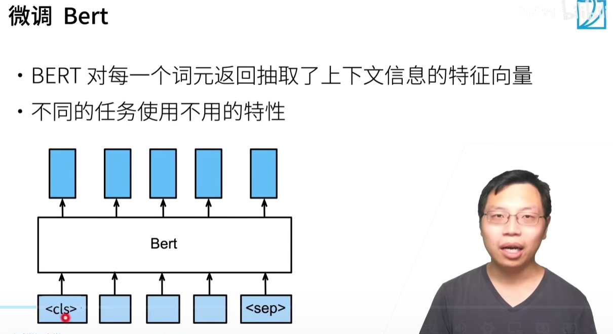

例如：对于句子分类，只使用第一个输出的向量


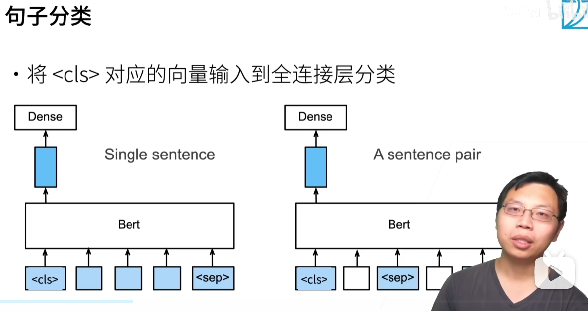


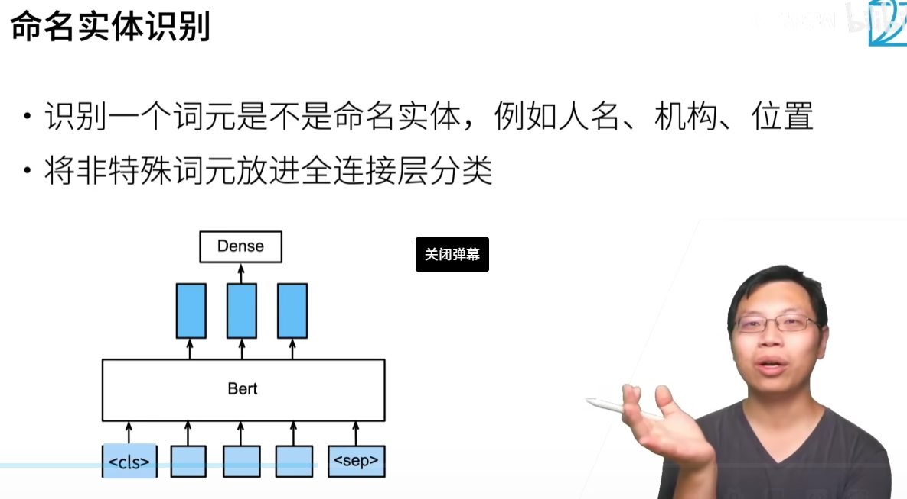


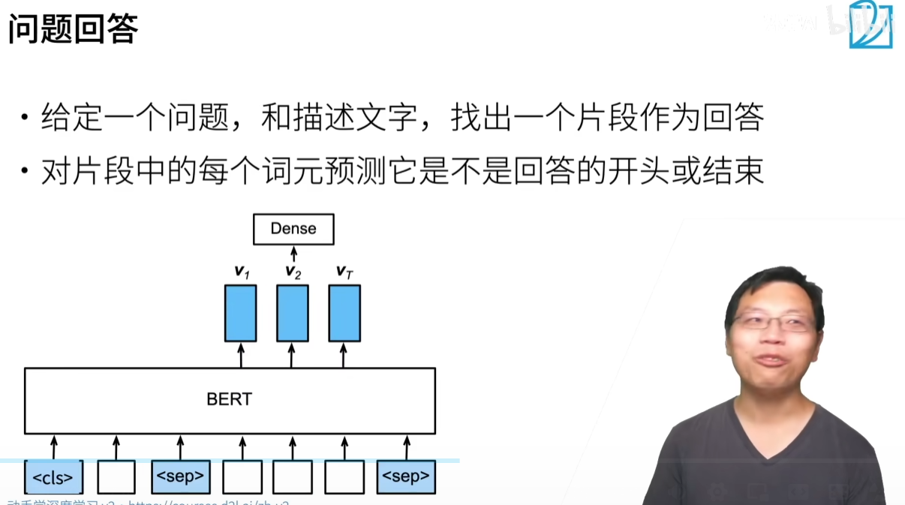


## 目标检测竞赛总结

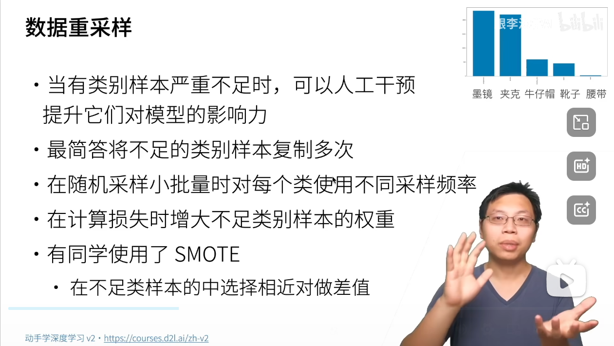


模型

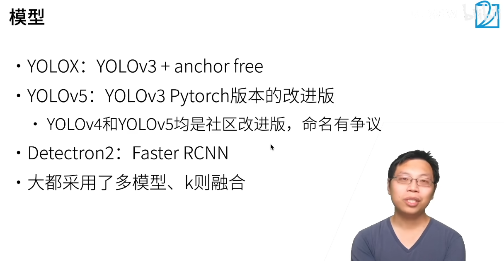


## 优化算法


这里f(x) 在机器学习里是指损失函数，x是所有的超参数。

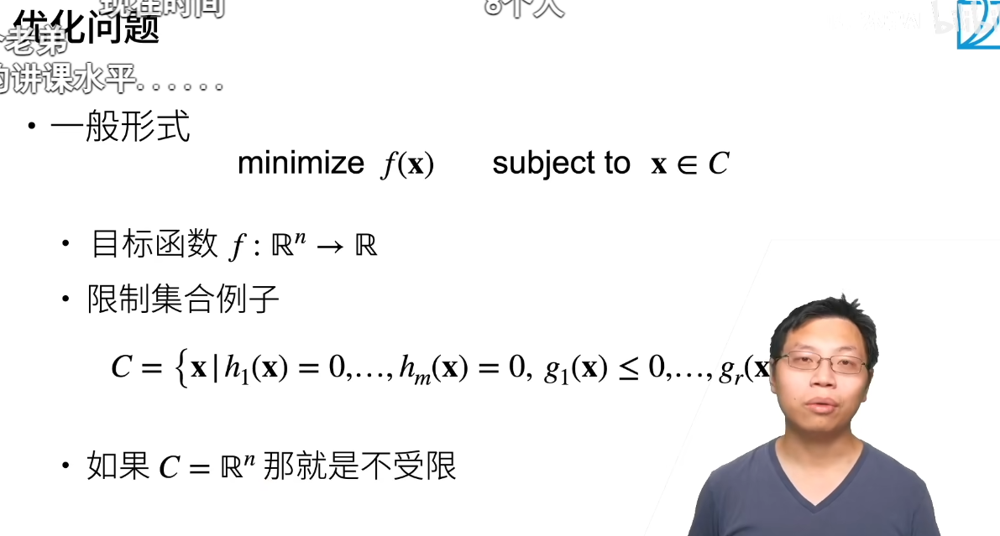


全局最小和局部最小

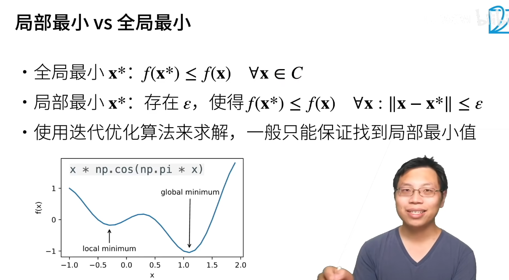

一个特例，凸优化。


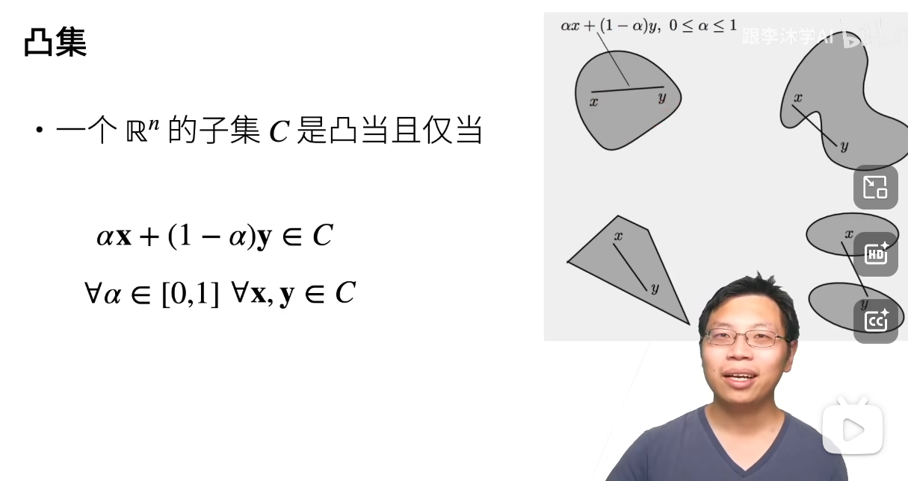

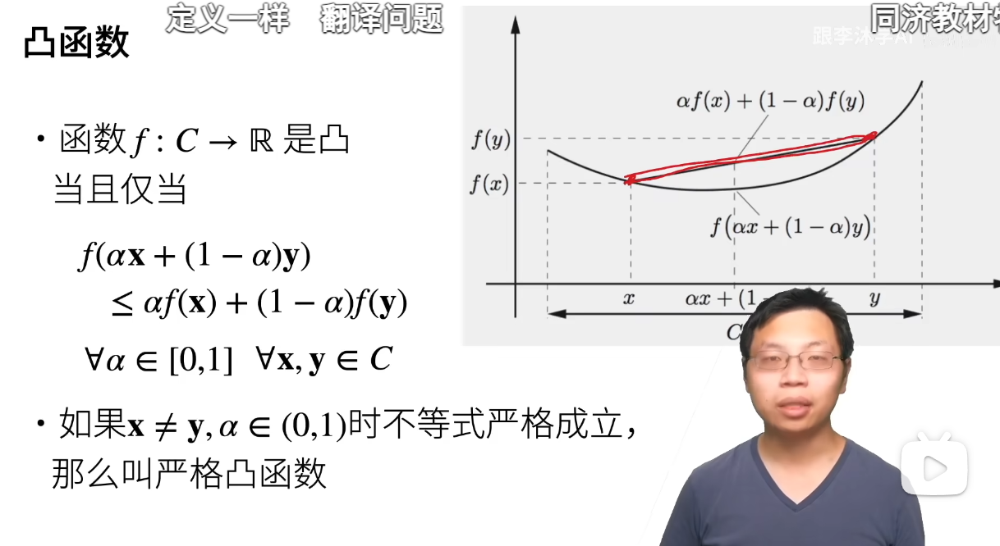

这里国外的定义和我们反过来了。

凸优化一定有全局最小，局部最小就是全局最小。

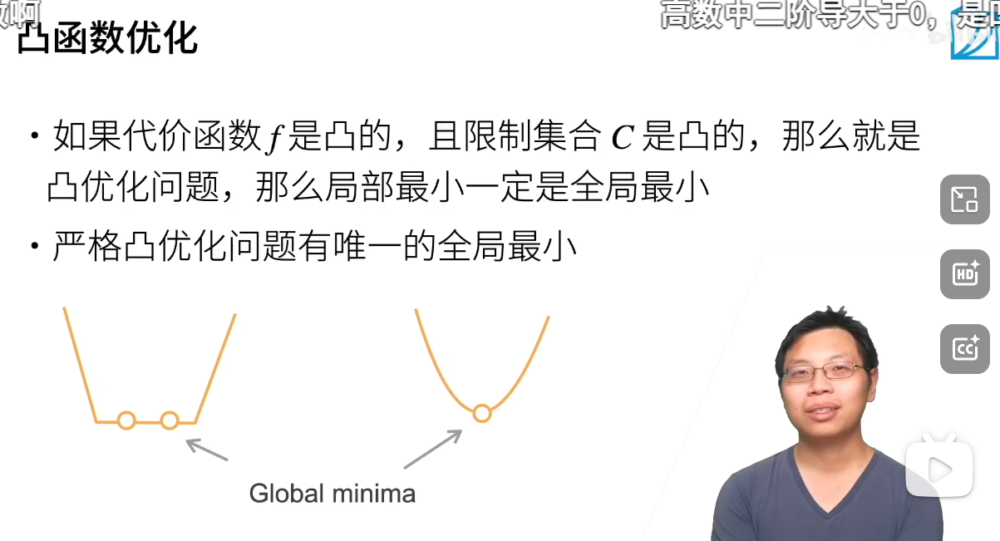

机器学习绝大部分都不是凸函数


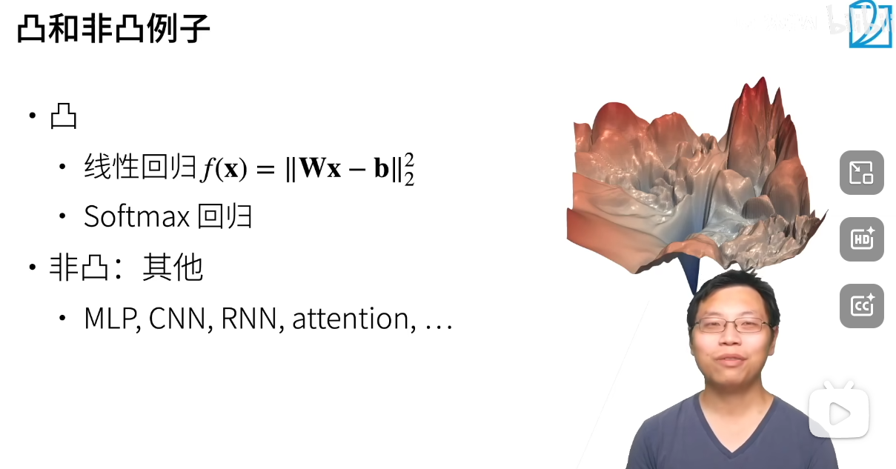

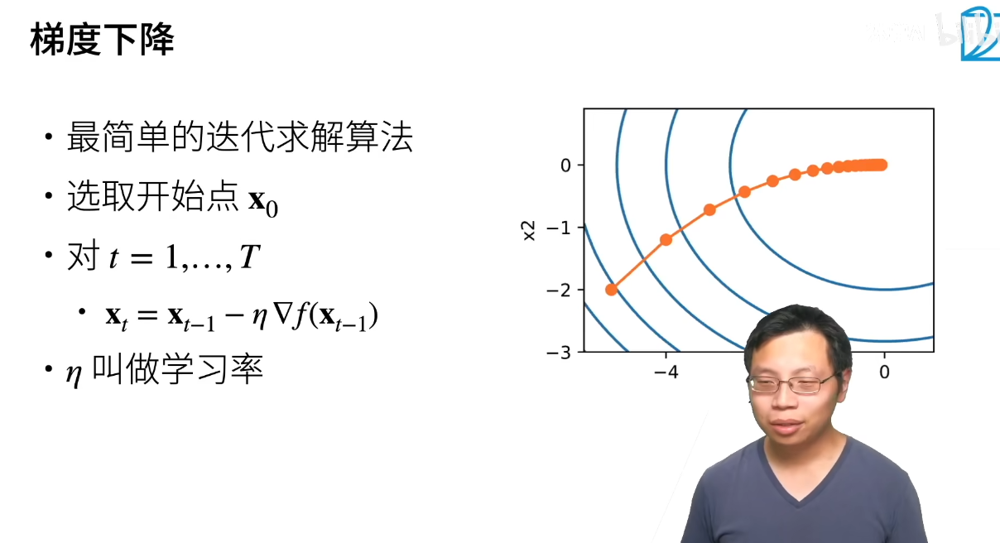

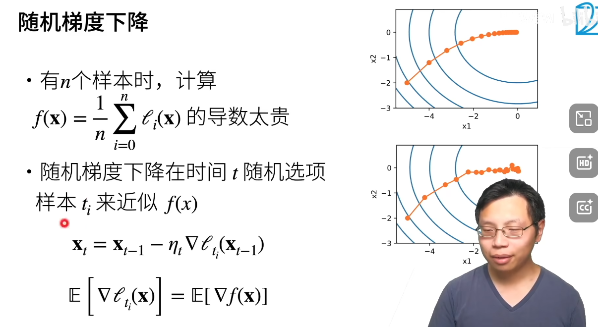


真正用的是小批量随机梯度下降


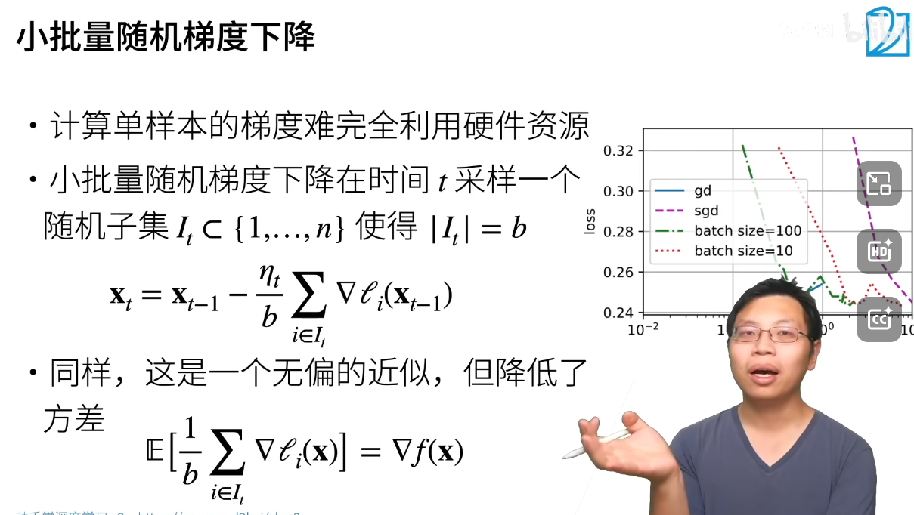

冲量法，使用平滑过的梯度对权重进行更新。

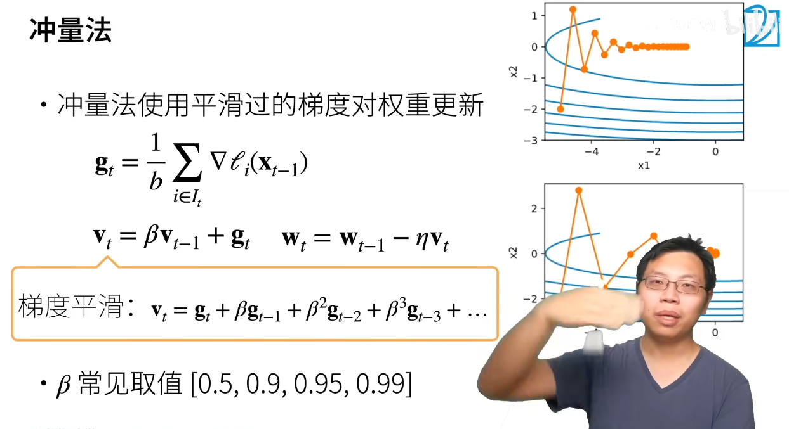


Adam是一个非常平滑的SGD,它对学习率不敏感。如果你很会调参的话，SGD会比Adam好一点。

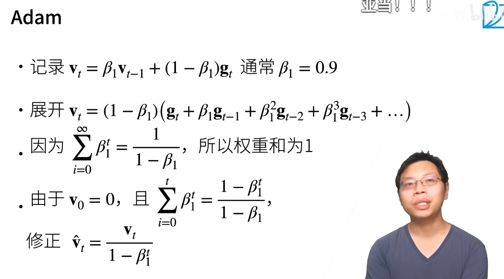

**调参能力强就用SGD吗？**

  确实成立的场景：CV（尤其是图像分类）

  在 ResNet、CNN 图像分类/检测任务上，SGD+momentum 的最终泛化精度通常确实略优于
  Adam，这是有大量实证支持的。主流解释是：

  - SGD 倾向于收敛到 flat minima（平坦极小值），泛化更好
  - Adam 自适应学习率可能落到 sharp minima，训练 loss 低但测试泛化差
  - Adam 的 per-parameter 自适应会"过度迁就"某些参数，破坏了不同参数间的协调更新

  ImageNet 上几乎所有 SOTA 分类模型最终精调都用 SGD+momentum。所以"会调参就用 SGD"在 CV 里是有道理的。

  但在 NLP/Transformer 上完全相反

  Transformer 架构几乎只能用 Adam(W)，SGD 表现很差。原因：

  - Attention/Embedding 参数尺度差异巨大，需要自适应学习率
  - 梯度高度非平稳，SGD 的固定学习率很难驾驭
  - AdamW 已是 BERT/GPT/Llama 全家族的标配，没人用 SGD 训大语言模型

  ┌────────────────────┬─────────────────┬───────────────────────┐
  │      任务类型      │      推荐       │         原因          │
  ├────────────────────┼─────────────────┼───────────────────────┤
  │ 图像分类/检测/分割 │ SGD+momentum ✅ │ 泛化更好，CV 社区共识 │
  ├────────────────────┼─────────────────┼───────────────────────┤
  │ Transformer / LLM  │ AdamW ❌ SGD    │ SGD 根本训不动        │
  ├────────────────────┼─────────────────┼───────────────────────┤
  │ GAN                │ Adam            │ 稳定性需要            │
  ├────────────────────┼─────────────────┼───────────────────────┤
  │ 稀疏特征/推荐      │ Adam            │ 自适应对稀疏友好      │
  ├────────────────────┼─────────────────┼───────────────────────┤
  │ 强化学习           │ Adam            │ 非平稳目标            │
  └────────────────────┴─────────────────┴───────────────────────┘

  "非常会调参"的真实代价

  即使你调参能力强，SGD 也要比 Adam 付出更多：

  1. 学习率极其敏感：Adam 默认 1e-3 往往能用，SGD 要从 0.1 开始精细搜索，差一个数量级就发散或卡死
  2. 学习率调度更关键：SGD 强依赖 warmup + cosine/multistep 衰减，调度没配好精度差很多
  3. 训练时间长：Adam 收敛快，SGD 往往需要更多 epoch 才能追上（虽然最终可能更高）
  4. 对初始化、batch size、weight decay 更敏感，这些都要协同调

  实践中的折中方案

  很多顶级 CV 工作其实用的是两阶段策略：

  阶段1: AdamW 快速收敛（warmup + 前期）
  阶段2: 切换到 SGD+momentum 精调（追求泛化极限）

  这在目标检测、分割的 SOTA 复现里很常见。

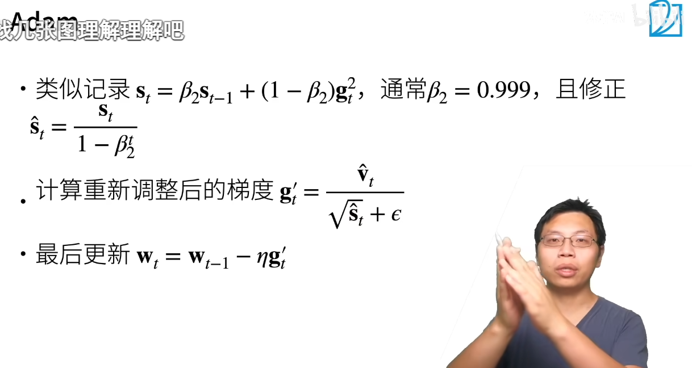

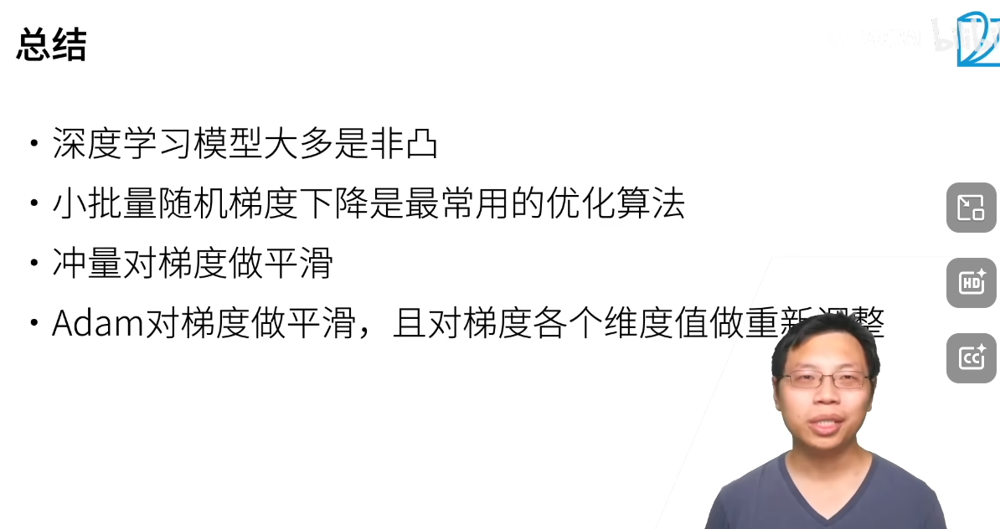


### adam的双重平滑


无论是训练提取局部特征的 CNN，还是捕捉全局依赖的 Transformer，Adam 优化器之所以能提供极具稳定性的收敛体验，核心就在于它的**双重平滑机制**。

Adam 的全称是 Adaptive Moment Estimation（自适应矩估计）。它对更新速率的平滑，本质上是通过**指数移动平均 (Exponential Moving Average, EMA)** 来实现的。它不仅仅平滑梯度的“方向”，还平滑梯度的“波动幅度”。

以下是它的具体平滑过程拆解：

### 1. 一阶动量平滑：稳定更新方向

在每次迭代中，如果直接使用当前小批量（Mini-batch）计算出的梯度 $g_t$ 来更新参数，方向会非常随机和抖动。Adam 通过计算一阶动量 $m_t$（梯度的均值）来平滑这种抖动：
$$
m_t = \beta_1 m_{t-1} + (1 - \beta_1) g_t
$$


- **$\beta_1$ (通常设为 0.9)：** 这是一个衰减系数。你可以把它理解为“惯性”。
- **机制：** 当前的更新方向 $m_t$ 是由 90% 的历史方向 $m_{t-1}$ 和 10% 的当前实际梯度 $g_t$ 混合而成的。这使得模型在优化时，像是一辆带有沉重底盘的汽车，遇到小坑洼（噪声）不会轻易改变航向，而是平稳地向着整体下坡的方向驶去。

### 2. 二阶动量平滑：自适应学习率

不同的参数需要的更新步长是不同的（比如 CNN 中的浅层特征和深层特征）。Adam 通过计算二阶动量 $v_t$（梯度的未减去均值的方差）来平滑梯度的平方值，以此衡量每个参数的剧烈程度：

$$
v_t = \beta_2 v_{t-1} + (1 - \beta_2) g_t^2
$$

- **$\beta_2$ (通常设为 0.999)：** 这个系数比 $\beta_1$ 更大，意味着它对历史波动的记忆更长久。
- **机制：** 如果一个参数在过去的更新中梯度一直很大（$v_t$ 很大），Adam 在最终更新时会把学习率除以 $\sqrt{v_t}$，从而**缩小**它的更新步长，防止震荡；反之，如果一个参数长期得不到更新（$v_t$ 很小），Adam 会**放大**它的步长。

### 3. 极其关键的一步：偏差修正 (Bias Correction)

这是 Adam 平滑机制中最精妙的设计。因为在训练最开始的时候（$t=0$），动量 $m_0$ 和 $v_0$ 都是初始化为 $0$ 的。

这就导致在最开始的几步，计算出的 $m_t$ 和 $v_t$ 会严重偏向于 $0$（因为历史积累全是 $0$）。为了消除这种“冷启动”带来的平滑偏差，Adam 强制进行了修正：

$$
\hat{m}_t = \frac{m_t}{1 - \beta_1^t}
$$

$$
\hat{v}_t = \frac{v_t}{1 - \beta_2^t}
$$

随着时间步 $t$ 的增加，$\beta^t$ 会迅速趋近于 $0$，分母变成 $1$，偏差修正的作用就会自动消失，平滑机制无缝过渡到纯粹的指数移动平均。

**最终的平滑更新公式**

结合上述所有平滑处理，Adam 最终对参数 $\theta$ 的更新公式为：

$$
\theta_t = \theta_{t-1} - \frac{\alpha}{\sqrt{\hat{v}_t} + \epsilon} \hat{m}_t
$$

*(其中 $\alpha$ 是初始学习率，$\epsilon$ 往往设为 $10^{-8}$ 防止分母为零)*


## 课程总结和进阶学习

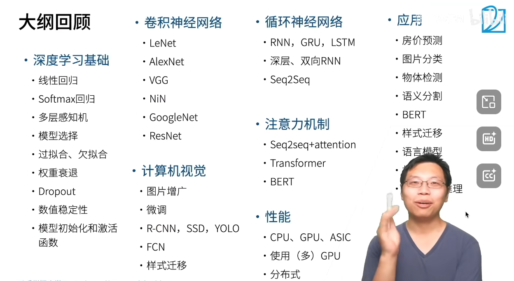


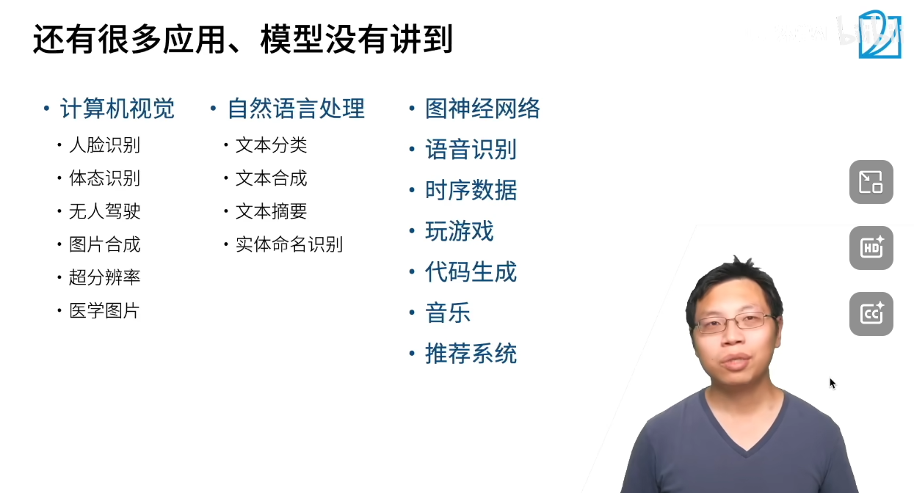

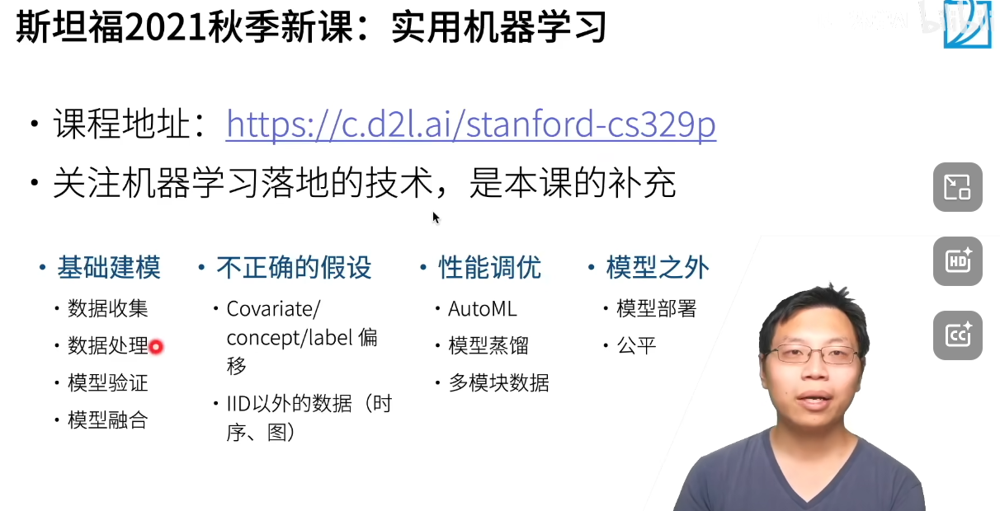
