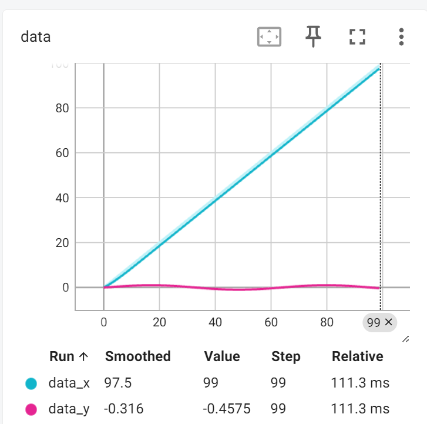
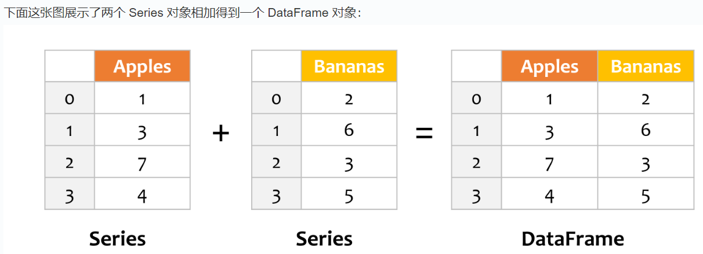
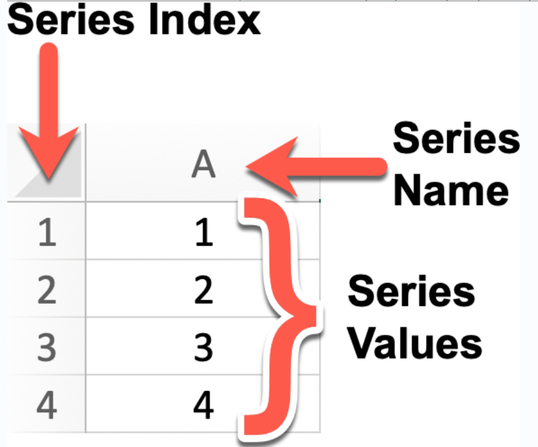
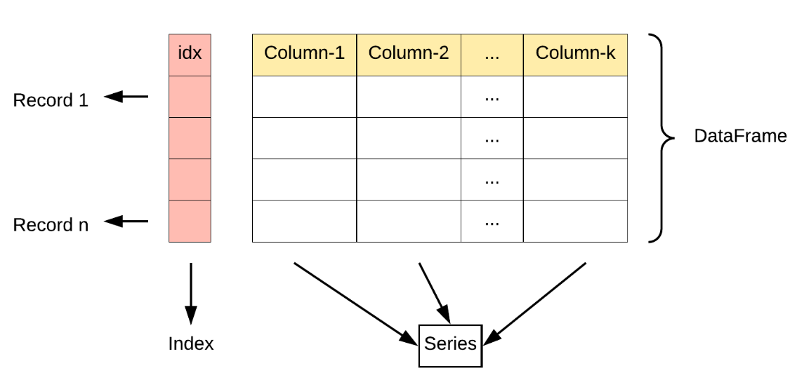

##  Pytroch 快速入门

```python
dir(torch)
['AVG',
 'AggregationType',
 'AliasDb',
 'AnyType',
 'Argument',
 'ArgumentSpec',
 'AwaitType',
 'BFloat16Storage',
 'BFloat16Tensor',
 'BenchmarkConfig',
 'BenchmarkExecutionStats',
 'Block',
 ...] # 可以看到包里面有什么

help(torch.AVG.SUM)

Help on AggregationType in module torch object:

class AggregationType(pybind11_builtins.pybind11_object)
 |  Method resolution order:
 |      AggregationType
 |      pybind11_builtins.pybind11_object
 |      builtins.object
 |  
 |  Methods defined here:
 |  
 |  __eq__(...)
 |      __eq__(self: object, other: object) -> bool
 |  
 |  __getstate__(...)
 |      __getstate__(self: object) -> int
 |  
 |  __hash__(...)
 |      __hash__(self: object) -> int
# 可以看到函数怎么使用
```

## **pytorch加载数据 使用dataset与dataloader**

```python
from torch.utils.data import DataLoader, Dataset  ##简单的dataset 可以获取【index】单个目标和其label

import os
from PIL import Image

class tuidui_dataset(Dataset):
    def __init__(self, root_dir, label_dir):
        self.root_dir = root_dir
        self.label_dir = label_dir
        self.path = os.path.join(self.root_dir,self.label_dir)
        self.image_paths = os.listdir(self.path)

    def __getitem__(self,index):
        image_name = self.image_paths[index]
        image_path = os.path.join(self.root_dir,image_name)
        image = Image.open(image_path)
        label = self.label_dir
        return image, label
    
    def __len__(self):
        return len(self.path)
    ## __getitem__ 被重写了 可以使用[index]进行调用
    ##img,label = Tudui[1]
```

## **DataLoader**

```python
from torch.utils.data import DataLoader, Dataset

traing_data = datasets.CIFAR10(root='./data', train=True, transform=transforms.ToTensor(), download=True)
test_data = datasets.CIFAR10(root='./data', train=False, transform=transforms.ToTensor(), download=True)

train_loader = DataLoader(traing_data, batch_size=64, shuffle=True)
writer = tensorboard.SummaryWriter('runs/cifar10')
step = 0
for datas, labels in train_loader:
    writer.add_images('CIFAR10/images', datas, steps)
    step += 1
writer.close()

```

- **dataset** ([*Dataset*](https://docs.pytorch.org/docs/stable/data.html#torch.utils.data.Dataset)) – dataset from which to load the data.
- **batch_size** ([*int*](https://docs.python.org/3/library/functions.html#int)*,* *optional*) – how many samples per batch to load (default: )
- **shuffle** ([*bool*](https://docs.python.org/3/library/functions.html#bool)*,* *optional*) – set to to have the data reshuffled at every epoch
- **num_workers** ([*int*](https://docs.python.org/3/library/functions.html#int)*,* *optional*) – how many subprocesses to use for data loading
- **drop_last** ([*bool*](https://docs.python.org/3/library/functions.html#bool)*,* *optional*) – set to to drop the last incomplete batch, if the dataset size is not divisible by the batch size.


## TensorBoard

```python
from torch.utils import tensorboard
import torch
import numpy as np

writer = tensorboard.SummaryWriter('logs')

for i in range(100):
    scalars = {
        'x': i,          # 标量名称为 'x'
        'y': np.sin(i/10) # 标量名称为 'y'
    }
    
    # 使用字典作为参数传递给 add_scalars 
    writer.add_scalars('data', scalars, i)
    
tensorboard --logdir =logs  ##这个不能乱加空格
tensorboard --logdir=runs/test windows使用\而命令行中使用/
```



```python
image = Image.open(image_dir)
image = np.array(image)    ## 转为numpy对象
writer.add_image('my_image', image, 0, dataformats="HWC")  ##dataformats="HWC"
```

## Torchvision 中的 Transform

```python
from torchvision import transforms
image_path = r'D:\BaiduNetdiskDownload\20250403134656.jpg'
image = Image.open(image_path)

trans_tensor = transforms.ToTensor()    //构造函数
print(type(trans_tensor))
tensor_img = trans_tensor(image)        ## call 函数


trans_norm = transforms.Normalize([1,1,1],[1,1,1]) #output[channel] = (input[channel] - mean[channel]) / std[channel]

compose = transforms.Compose([trans1,trans2])
```

## Torchvision 的dataset

```python
from torchvision import datasets, transforms
from torch.utils import tensorboard

traing_data = datasets.CIFAR10(root='./data', train=True, transform=transforms.ToTensor(), download=True)
test_data = datasets.CIFAR10(root='./data', train=False, transform=transforms.ToTensor(), download=True)

writer = tensorboard.SummaryWriter('runs/mnist_experiment_1')
for i in range(100):
    image, label = traing_data[i]
    writer.add_image('CIFAR10/image', image, i)
writer.close()
```

## torch.nn

```python
from torchvision import datasets, transforms
from torch.utils import tensorboard
from torch.utils.data import DataLoader, Dataset
from torch import nn

traing_data = datasets.CIFAR10(root='./data', train=True, transform=transforms.ToTensor(), download=True)

train_loader = DataLoader(traing_data, batch_size=64, shuffle=True)

class Tudui(torch.nn.Module):
    def __init__(self):
        super(Tudui, self).__init__()
        self.conv1 = nn.Conv2d(3, 6, 3,stride=1, padding=0)
        self.pool = nn.MaxPool2d(2, 2)
        self.relu1 = nn.ReLU()
        self.linear1 = nn.Linear(6, 2)
        self.linear2 = nn.Linear(2, 1)
        self.dropout = nn.Dropout(0.5)
        self.enbedding = nn.Embedding(10, 3)
        self.flatten = nn.Flatten()
        self.model1 = nn.Sequential(
            nn.Conv2d(3, 6, 3,stride=1, padding=0),
            nn.MaxPool2d(2, 2),
            nn.ReLU(),
            nn.Flatten(),
            nn.Linear(6*6*6, 2),
            nn.Linear(2, 1)
        )

    def forward(self, x):
        x = self.conv1(x)
        x = self.pool(x)
        x = self.relu1(x)

        return x

model = Tudui()
writer = tensorboard.SummaryWriter('runs/cifar')
writer.add_graph(model, next(iter(train_loader))[0]) #add_graph 可以显示模型结构

'''
ceil_mode (bool) – when True, will use ceil instead of floor to compute the output shape
dilation (int | tuple[int, int]) – a parameter that controls the stride of elements in the window

'''
```

## 反向传播与损失函数

```python
import torch
from torch import nn

# Define the model
input = torch.tensor([1, 2, 3], dtype=torch.float32)
output = torch.tensor([4, 5, 6], dtype=torch.float32)

input = torch.reshape(input, (1,1,1,3))
output = torch.reshape(output, (1,1,1,3))

loss = torch.nn.MSELoss()

result = loss(input, output)
result.backward() #传递给module中某一层的grand 在PyTorch中会生成计算图（computational graph）。计算图是用于记录所有张量操作及其依赖关系的图结构，这对于自动求导（autograd）功能至关重要
print(result)
```

## 优化器

**Adam**（Adaptive Moment Estimation）是一种**自适应学习率优化算法**

| 传统方法 | 问题                             |
| :------- | :------------------------------- |
| SGD      | 学习率固定，收敛慢，易震荡       |
| Momentum | 加速但可能过冲                   |
| RMSProp  | 自适应学习率，但初始阶段估计不准 |

```python
optimizer = torch.optim.Adam(model.parameters(), lr=0.001)    #定义优化器 parmaeters

for data, label in train_loader:
    optimizer.zero_grad()
    output = model(data)
    loss = loss(output, label)
    loss.backward()
    optimizer.step()
```


## 现有模型的使用与修改，保存

```python
import torch
import torch.nn as nn
import torchvision
from torch.utils.tensorboard import SummaryWriter
# traing_data = torchvision.datasets.ImageNet(root='./data', split='train', download=True, transforms=torchvision.transforms.ToTensor())
vgg16_false = torchvision.models.vgg16(pretrained=False)


vgg16_false.add_module('fc', nn.Linear(1000, 100))
vgg16_false.add_module('output', nn.Linear(100, 10))
vgg16_false.features[0] = nn.Conv2d(3, 64, kernel_size=3,stride=1, padding=1)
print(vgg16_false)

# 保存方式1
torch.save(vgg16_false.state_dict(), 'vgg16_false.pth')

# 加载方式1
vgg16_false_load = torchvision.models.vgg16(pretrained=False)
vgg16_false_load.add_module('fc', nn.Linear(1000, 100))
vgg16_false_load.add_module('output', nn.Linear(100, 10))
vgg16_false_load.load_state_dict(torch.load('vgg16_false.pth'))
print(torch.load('vgg16_false.pth'))

# 保存方式2
torch.save(vgg16_false, 'vgg16_false.pth')

# 加载方式2
vgg16_false_load = torch.load('vgg16_false.pth')
print(vgg16_false_load)

input = torch.randn(1, 3, 224, 224)
writer = SummaryWriter('runs/vgg16_false')
writer.add_graph(vgg16_false, input)
writer.close()
```

## 完整模型训练过程

```python
import torchvision
from torchvision import transforms
import torch
from torch.utils.data import DataLoader, Dataset
from torch import nn, optim
import tudui as tudui
from torch.utils import tensorboard


train_dataset = torchvision.datasets.CIFAR10(root='./data', train=True, transform=transforms.ToTensor(), download=True)
test_dataset = torchvision.datasets.CIFAR10(root='./data', train=False, transform=transforms.ToTensor(), download=True)
train_loader = DataLoader(dataset=train_dataset, batch_size=64, shuffle=True)
test_loader = DataLoader(dataset=test_dataset, batch_size=64, shuffle=False)

train_datasize = len(train_dataset)
test_datasize = len(test_dataset)


print("训练集大小:", train_datasize)
print("测试集大小:", test_datasize)


train_dataloader = DataLoader(train_dataset, batch_size=64, shuffle=True)
test_dataloader = DataLoader(test_dataset, batch_size=64, shuffle=False)

writer = tensorboard.SummaryWriter("logs/train_tudui")


net = tudui.Net()


loss_func = nn.CrossEntropyLoss()
optimizer = optim.SGD(net.parameters(), lr=0.01)

total_train_step = 0
total_test_step = 0

epoch = 10
net.train()                           #只对部分网络层有作用 比如dropout
for e in range(epoch):
    print("Epoch:", e+1)
    for imgs, labels in train_dataloader:
        outputs = net(imgs)
        loss = loss_func(outputs, labels)
        optimizer.zero_grad()
        loss.backward()
        optimizer.step()
        total_train_step += 1
        writer.add_scalar("train_loss", loss.item(), total_train_step)
    print("训练损失:", loss.item())

print("训练总步数:", total_train_step)
print("测试总步数:", total_test_step)

net.eval()
with torch.no_grad():
    total_test_loss = 0
    for imgs, labels in test_dataloader:
        outputs = net(imgs)
        loss = loss_func(outputs, labels)
        total_test_step += 1
        total_test_loss += loss.item()
        writer.add_scalar("test_loss", loss.item(), total_test_step)
    print("测试损失:", total_test_loss/total_test_step)
    

writer.close()

torch.save(net.state_dict(), "net{i}.pth".format(i=epoch))
```


## 使用GPU进行训练

```python
'''
网络模型，数据（输入，输出），损失函数加入.CUDA()


损失函数继承自nn.module, 对于无参数的损失函数（如 nn.MSELoss、nn.L1Loss 等），严格来说不需要显式执行 .to(device) 操作，因为这类损失函数内部不包含任何需要存储在特定设备上的参数或缓冲区。它们的前向计算完全依赖于输入的 pred 和 target 张量的设备：只要这两个输入已经在同一设备上（例如 GPU），损失函数就能正确计算并返回位于该设备上的结果。
'''


tudui = tudui.Net()
tudui = tudui.cuda()
loss = nn.CrossEntropyLoss()
loss = loss.cuda()
for imgs, labels in train_dataloader:
    imgs = imgs.cuda()
    labels = labels.cuda()
    outputs = tudui(imgs)
    
    
    
#或者
device = torch.device("cuda0")
tudui = tudui.to(device)
imgs = imgs.to(device)
labels = labels.to(device)
loss = 
```


## Numpy


## Tensor

```python
x = torch.tensor(3.0) 标量
x = torch.arange(12)从0到12的向量
len(x)     访问向量的长度
x.shape    访问其维度
A = torch.arange(20).reshape(5, 4)    改变其维度
B = torch.tensor([[1, 2, 3], [2, 0, 4], [3, 4, 5]]) 创建特定的数组
A = torch.arange(20, dtype=torch.float32).reshape(5, 4)   dtype定义其元素类型
x.sum()  计算tensor的和
A.sum(axis=0) 可以降维
A.mean(), A.sum() / A.numel()
y = torch.ones(4, dtype = torch.float32)    元素全为1
torch.dot(x, y)   点积运算
torch.mm(A, B)    矩阵乘法
torch.cat((x,y),dim=0)按行拼接
tensor也有类似numpy的广播机制
A = X.numpy() 转换为numpy变量
a.item() 转换为python标量
A.norm()    A的L2范数
labels.detach().numpy()

X = torch.ones(2, 3, device=try_gpu())//定义在GPU上

x = torch.arange(4)
torch.save(x, 'x-file') //保存张量，不仅模型可以保存，其他数据也可以

mydict = {'x': x, 'y': y}
torch.save(mydict, 'mydict')
mydict2 = torch.load('mydict')//写入以字典形式存储的张量，方便读写模型权重。

print(net[2].bias)
print(net[2].bias.data)
print(net[2].state_dict())//访问权重

nn.init.xavier_uniform_(m.weight)//初始化	

self.weight = nn.Parameter(torch.randn(in_units, units))//另一种初始化
```

`state_dict()` 是一个 Python 字典对象，它将模型的每一层映射到其参数张量。这使得我们可以轻松地保存和加载模型的权重和偏置参数。

- `Tensor`：普通张量
- `Parameter`：一种“会被 Module 自动登记为可训练参数”的特殊 Tensor

## PANDAS

Pandas 可以从各种文件格式比如 CSV、JSON、SQL、Microsoft Excel 导入数据。

Pandas 是数据分析的利器，它不仅提供了高效、灵活的数据结构，还能帮助你以极低的成本完成复杂的数据操作和分析任务

Pandas 的主要数据结构是 Series （一维数据）与 DataFrame（二维数据）。

 Series 类似于一维数组或列表，是由一组数据以及与之相关的数据标签（索引）构成。

DataFrame 由 Index、Key、Value 组成。



### Series 特点：

- **一维数组：**Series 中的每个元素都有一个对应的索引值。
- **索引：** 每个数据元素都可以通过标签（索引）来访问，默认情况下索引是从 0 开始的整数，但你也可以自定义索引。
- **数据类型：** `Series` 可以容纳不同数据类型的元素，包括整数、浮点数、字符串、Python 对象等。
- **缺失数据：**Series 可以包含缺失数据，Pandas 使用NaN（Not a Number）来表示缺失或无值。
- 我们可以使用 Pandas 库来创建一个 Series 对象，并且可以为其指定索引（Index）、名称（Name）以及值（Values）



```python
import pandas as pd

# 创建一个Series对象，指定名称为'A'，值分别为1, 2, 3, 4
# 默认索引为0, 1, 2, 3
series = pd.Series([1, 2, 3, 4], name='A')

# 显示Series对象
print(series)

# 如果你想要显式地设置索引，可以这样做：
custom_index = [1, 2, 3, 4]  # 自定义索引
series_with_index = pd.Series([1, 2, 3, 4], index=custom_index, name='A')

# 显示带有自定义索引的Series对象
print(series_with_index)
# 转为numpy对象
X = torch.tensor(inputs.to_numpy(dtype=float))
y = torch.tensor(outputs.to_numpy(dtype=float))
```

| **方法名称**                 | **功能描述**                                       |
| :--------------------------- | :------------------------------------------------- |
| `index`                      | 获取 Series 的索引                                 |
| `values`                     | 获取 Series 的数据部分（返回 NumPy 数组）          |
| `dtype`                      | 返回 Series 中数据的类型                           |
| `shape`                      | 返回 Series 的形状（行数）                         |
| `describe()`                 | 返回 Series 的统计描述（如均值、标准差、最小值等） |
| `isnull()`                   | 返回一个布尔 Series，表示每个元素是否为 NaN        |
| `notnull()`                  | 返回一个布尔 Series，表示每个元素是否不是 NaN      |
| `unique()`                   | 返回 Series 中的唯一值（去重）                     |
| `value_counts()`             | 返回 Series 中每个唯一值的出现次数                 |
| `astype(dtype)`              | 将 Series 转换为指定的类型                         |
| `sort_values()`              | 对 Series 中的元素进行排序（按值排序）             |
| `sort_index()`               | 对 Series 的索引进行排序                           |
| `dropna()`                   | 删除 Series 中的缺失值（NaN）                      |
| `fillna(value)`              | 填充 Series 中的缺失值（NaN）                      |
| `replace(to_replace, value)` | 替换 Series 中指定的值                             |
| `to_list()`                  | 将 Series 转换为 Python 列表                       |
| `to_frame()`                 | 将 Series 转换为 DataFrame                         |
| `iloc[]`                     | 通过位置索引来选择数据                             |
| `loc[]`                      | 通过标签索引来选择数据                             |

**DataFrame 特点：**

- **二维结构：** `DataFrame` 是一个二维表格，可以被看作是一个 Excel 电子表格或 SQL 表，具有行和列。可以将其视为多个 `Series` 对象组成的字典。

- **列的数据类型：** 不同的列可以包含不同的数据类型，例如整数、浮点数、字符串或 Python 对象等。

- **索引**：`DataFrame` 可以拥有行索引和列索引，类似于 Excel 中的行号和列标。

- **处理缺失数据**：`DataFrame` 可以包含缺失数据，Pandas 使用 `NaN`（Not a Number）来表示。

- **数据操作**：支持数据切片、索引、子集分割等操作。

- **丰富的数据访问功能**：通过 `.loc`、`.iloc` 和 `.query()` 方法，可以灵活地访问和筛选数据。

- **数据可视化**：虽然 `DataFrame` 本身不是可视化工具，但它可以与 Matplotlib 或 Seaborn 等可视化库结合使用，进行数据可视化。



DataFrame 构造方法如下：

`pandas.DataFrame(data=None, index=None, columns=None, dtype=None, copy=False)`

```python

# 使用列表创建-行
import pandas as pd

data = [['Google', 10], ['Runoob', 12], ['Wiki', 13]]

# 创建DataFrame
df = pd.DataFrame(data, columns=['Site', 'Age'])

# 使用astype方法设置每列的数据类型
df['Site'] = df['Site'].astype(str)
df['Age'] = df['Age'].astype(float)

print(df)

#使用字典进行创建-列
import pandas as pd

data = {'Site':['Google', 'Runoob', 'Wiki'], 'Age':[10, 12, 13]}

df = pd.DataFrame(data)

print (df)
```

## DataFrame 方法

| **方法名称**        | **功能描述**                                                |
| :------------------ | :---------------------------------------------------------- |
| `head(n)`           | 返回 DataFrame 的前 n 行数据（默认前 5 行）                 |
| `tail(n)`           | 返回 DataFrame 的后 n 行数据（默认后 5 行）                 |
| `info()`            | 显示 DataFrame 的简要信息，包括列名、数据类型、非空值数量等 |
| `describe()`        | 返回 DataFrame 数值列的统计信息，如均值、标准差、最小值等   |
| `shape`             | 返回 DataFrame 的行数和列数（行数, 列数）                   |
| `columns`           | 返回 DataFrame 的所有列名                                   |
| `index`             | 返回 DataFrame 的行索引                                     |
| `dtypes`            | 返回每一列的数值数据类型                                    |
| `sort_values(by)`   | 按照指定列排序                                              |
| `sort_index()`      | 按行索引排序                                                |
| `dropna()`          | 删除含有缺失值（NaN）的行或列                               |
| `fillna(value)`     | 用指定的值填充缺失值                                        |
| `isnull()`          | 判断缺失值，返回一个布尔值 DataFrame                        |
| `notnull()`         | 判断非缺失值，返回一个布尔值 DataFrame                      |
| `loc[]`             | 按标签索引选择数据                                          |
| `iloc[]`            | 按位置索引选择数据                                          |
| `at[]`              | 访问 DataFrame 中单个元素（比 `loc[]` 更高效）              |
| `iat[]`             | 访问 DataFrame 中单个元素（比 `iloc[]` 更高效）             |
| `apply(func)`       | 对 DataFrame 或 Series 应用一个函数                         |
| `applymap(func)`    | 对 DataFrame 的每个元素应用函数（仅对 DataFrame）           |
| `groupby(by)`       | 分组操作，用于按某一列分组进行汇总统计                      |
| `pivot_table()`     | 创建透视表                                                  |
| `merge()`           | 合并多个 DataFrame（类似 SQL 的 JOIN 操作）                 |
| `concat()`          | 按行或按列连接多个 DataFrame                                |
| `to_csv()`          | 将 DataFrame 导出为 CSV 文件                                |
| `to_excel()`        | 将 DataFrame 导出为 Excel 文件                              |
| `to_json()`         | 将 DataFrame 导出为 JSON 格式                               |
| `to_sql()`          | 将 DataFrame 导出为 SQL 数据库                              |
| `query()`           | 使用 SQL 风格的语法查询 DataFrame                           |
| `duplicated()`      | 返回布尔值 DataFrame，指示每行是否是重复的                  |
| `drop_duplicates()` | 删除重复的行                                                |
| `set_index()`       | 设置 DataFrame 的索引                                       |
| `reset_index()`     | 重置 DataFrame 的索引                                       |
| `transpose()`       | 转置 DataFrame（行列交换）                                  |

### 修改 DataFrame

**修改列数据：**直接对列进行赋值。

```python
df['Column1'] = [10, 11, 12]
```

**添加新列：**给新列赋值。

```python
df['NewColumn'] = [100, 200, 300]
```

```python
# 使用 loc 为特定索引添加新行
df.loc[3] = [13, 14, 15, 16]

# 使用concat添加新行
new_row = pd.DataFrame([[4, 7]], columns=['A', 'B'])  # 创建一个只包含新行的DataFrame
df = pd.concat([df, new_row], ignore_index=True)  # 将新行添加到原始DataFrame
# 纵向合并
pd.concat([df1, df2], ignore_index=True)

# 横向合并
pd.merge(df1, df2, on='Column1')

# 长格式转宽格式
df_pivot = df.pivot(index='Column1', columns='Column2', values='Column3')

# 宽格式转长格式
df_melt = df.melt(id_vars='Column1', value_vars=['Column2', 'Column3'])

# 索引和切片
print(df[['Name', 'Age']])  # 提取多列
print(df[1:3])               # 切片行
print(df.loc[:, 'Name'])     # 提取单列
print(df.loc[1:2, ['Name', 'Age']])  # 标签索引提取指定行列
print(df.iloc[:, 1:])        # 位置索引提取指定列
```

### 删除 DataFrame 元素

**删除列：**使用 drop 方法。

```
df_dropped = df.drop('Column1', axis=1)
```

**删除行：**同样使用 drop 方法。

```
df_dropped = df.drop(0)  # 删除索引为 0 的行
```

# Pandas CSV 文件

CSV（Comma-Separated Values，逗号分隔值，有时也称为字符分隔值，因为分隔字符也可以不是逗号），其文件以纯文本形式存储表格数据（数字和文本）。

CSV 是一种通用的、相对简单的文件格式，被用户、商业和科学广泛应用。

**Pandas 可以很方便的处理 CSV 文件**，常用方法有：

| **方法名称**         | **功能描述**                          | **常用参数**                                                 |
| :------------------- | :------------------------------------ | :----------------------------------------------------------- |
| `pd.read_csv()`      | 从 CSV 文件读取数据并加载为 DataFrame | `filepath_or_buffer` (路径或文件对象)，`sep` (分隔符)，`header` (行标题)，`names` (自定义列名)，`dtype` (数据类型)，`index_col` (索引列) |
| `DataFrame.to_csv()` | 将 DataFrame 写入到 CSV 文件          | `path_or_buffer` (目标路径或文件对象)，`sep` (分隔符)，`index` (是否写入索引)，`columns` (指定列)，`header` (是否写入列名)，`mode` (写入模式) |

# Pandas 数据清洗

数据清洗是对一些没有用的数据进行处理的过程。

很多数据集存在数据缺失、数据格式错误、错误数据或重复数据的情况，如果要使数据分析更加准确，就需要对这些没有用的数据进行处理。

1. **缺失值处理**：识别并填补缺失值，或删除含缺失值的行/列。
2. **重复数据处理**：检查并删除重复数据，确保每条数据唯一。
3. **异常值处理**：识别并处理异常值，如极端值、错误值。
4. **数据格式转换**：转换数据类型或进行单位转换，如日期格式转换。

## Pandas 清洗空值

如果我们要删除包含空字段的行，可以使用 **dropna()** 方法，语法格式如下：

```
DataFrame.dropna(axis=0, how='any', thresh=None, subset=None, inplace=False)
```

- axis：默认为 **0**，表示逢空值剔除整行，如果设置参数 **axis＝1** 表示逢空值去掉整列。
- how：默认为 **'any'** 如果一行（或一列）里任何一个数据有出现 NA 就去掉整行，如果设置 **how='all'** 一行（或列）都是 NA 才去掉这整行。

- thresh：设置需要多少非空值的数据才可以保留下来的。
- subset：设置想要检查的列。如果是多个列，可以使用列名的 list 作为参数。
- inplace：如果设置 True，将计算得到的值直接覆盖之前的值并返回 None，修改的是源数据。

我们也可以 **fillna()** 方法来替换一些空字段：

```python
import pandas as pd

df = pd.read_csv('property-data.csv')

df.fillna(12345, inplace = True)

print(df.to_string())
```

## Pandas 清洗格式错误数据

数据格式错误的单元格会使数据分析变得困难，甚至不可能。

我们可以通过包含空单元格的行，或者将列中的所有单元格转换为相同格式的数据。

以下实例会格式化日期：

```python
**import** pandas **as** pd

\# 第三个日期格式错误
data = {
 "Date": ['2020/12/01', '2020/12/02' , '20201226'],
 "duration": [50, 40, 45]
}

df = pd.DataFrame(data, index = ["day1", "day2", "day3"])

df['Date'] = pd.to_datetime(df['Date'], format='mixed')

**print**(df.to_string())
```


**get_dummies 是利用pandas实现one hot encode的方式。**

```python
pandas.get_dummies(data, prefix=None, prefix_sep='_', dummy_na=False, columns=None, sparse=False, drop_first=False)[source]
dummy_na：是否为缺失值生成虚拟变量，默认为 False。
```


可以构造类别索引，用处更多


```python
# 构造类别索引，而不是 one-hot 标签
labels = sorted(train_data['label'].unique())
label_to_index = {label: idx for idx, label in enumerate(labels)}
index_to_label = {idx: label for label, idx in label_to_index.items()}

all_train_df = train_data.copy()
all_train_df['label_idx'] = all_train_df['label'].map(label_to_index)

val_df = all_train_df.iloc[15000:].reset_index(drop=True)
train_df = all_train_df.iloc[:15000].reset_index(drop=True)
test_df = test_data.copy().reset_index(drop=True)

train_df[['image', 'label', 'label_idx']].head()
```

