## 斯坦福实用机器学习


### 介绍

关于机器学习在工业界的应用


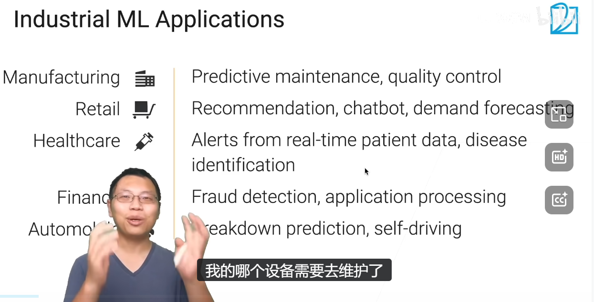


**ML WORKFLOW**

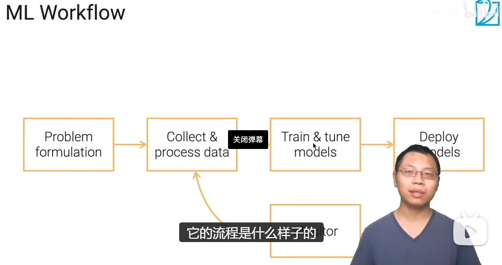


想要获得高质量的数据是很那难的，需要大量的数据标注与清洗。

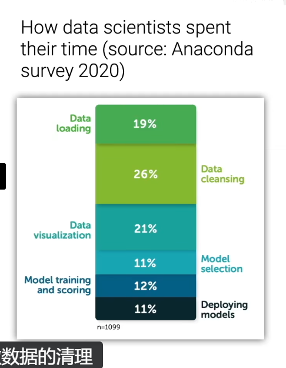

**课程 主题 ： 数据（机器学习的传统假设你的数据是独立同分布，现实中基本没有什么是独立同分布的。）、模型训练（验证和融合，迁移学习，多模态）、部署（蒸馏）、监控。**


### 数据获取


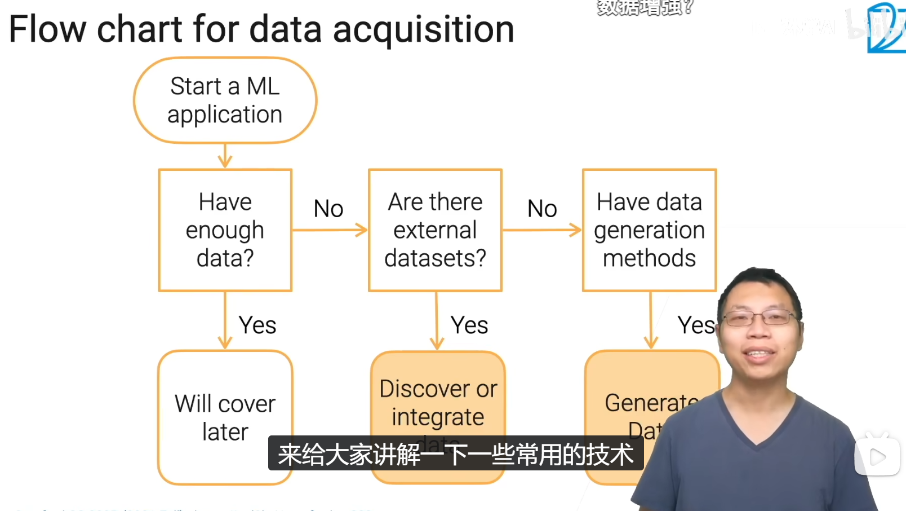  

**去哪里找数据集**


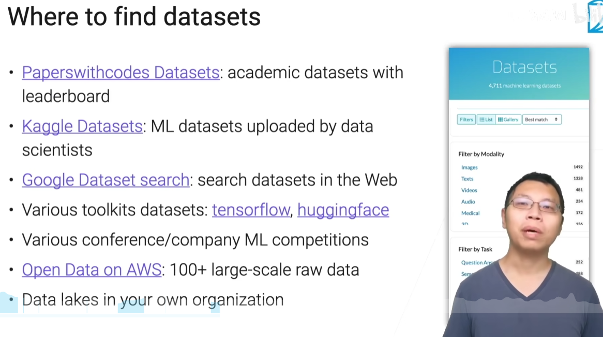

### 网页数据爬取 Selenium


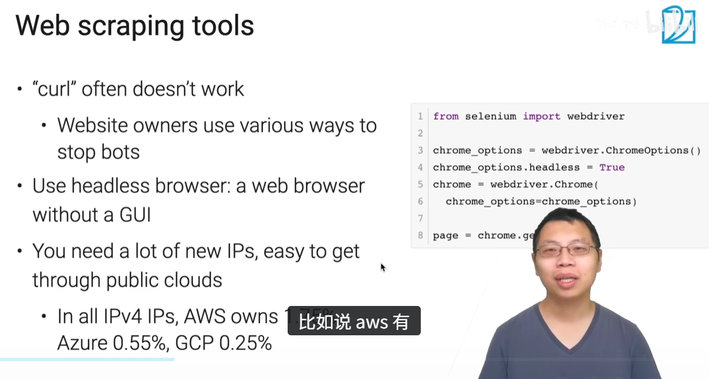

**BeautifulSoup**

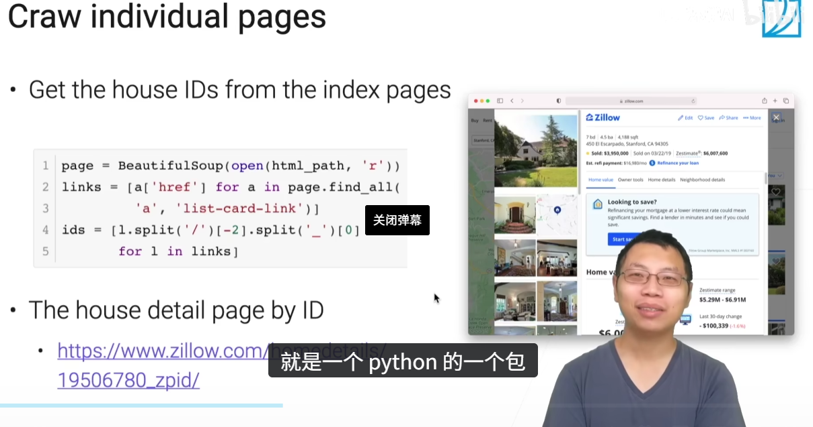

**Python selenium 库**

要开始使用 Selenium，首先需要安装 selenium 库，并下载适用于你浏览器的 WebDriver。

使用 pip 安装 Selenium：
``` python
pip install selenium

pip show selenium

#安装完成后，可以使用以下命令查看 selenium 的版本信息：

```

Selenium 需要一个 WebDriver 来与浏览器进行交互。

不同的浏览器需要不同的 WebDriver，例如 Chrome 浏览器需要 ChromeDriver，你需要根据你使用的浏览器下载相应的 WebDriver，并确保它在你的系统 PATH 中。


选择浏览器并初始化 WebDriver：
```python
from selenium import webdriver

# 使用 Chrome 浏览器
driver = webdriver.Chrome(executable_path='/path/to/chromedriver')

# 或者使用 Firefox 浏览器
# driver = webdriver.Firefox(executable_path='/path/to/geckodriver')

# 或者使用 Edge 浏览器
# driver = webdriver.Edge(executable_path='/path/to/msedgedriver')
```
基本用法

```python

from selenium import webdriver
from selenium.webdriver.chrome.service import Service as ChromeService

# 设置正确的驱动路径
service = ChromeService(executable_path="/RUNOOB/Downloads/chromedriver-mac-arm64/chromedriver") 
options = webdriver.ChromeOptions()
driver = webdriver.Chrome(service=service, options=options)


# 打开一个网站
driver.get("https://cn.bing.com")

# 获取页面标题
print(driver.title)

# 关闭浏览器
driver.quit()
```
获取元素

```python
# 通过 ID 查找元素
search_box = driver.find_element("id", "kw")

# 通过类名查找元素
search_button = driver.find_element("class name", "s_ipt")

# 通过标签名查找元素
links = driver.find_elements("tag name", "a")
```

模拟用户操作


```python
# 在搜索框中输入文本
search_box.send_keys("Selenium Python")

# 点击搜索按钮
search_button.click()
```

可以获取页面元素的属性值或文本内容：

```python
# 获取元素的文本
element_text = search_box.text

# 获取元素的属性值
element_attribute = search_box.get_attribute("placeholder")
```

操作完成后，记得关闭浏览器：

```python
driver.quit()
```

**BeautifulSoup，它是一个用于解析 HTML 和 XML 文档的 Python 库，能够从网页中提取数据，常用于网页抓取和数据挖掘。**

要使用 BeautifulSoup，需要安装 beautifulsoup4 和 lxml 或 html.parser（一个 HTML 解析器）。

我们可以使用 pip 来安装这些依赖：

```python
pip install beautifulsoup4
pip install lxml  # 推荐使用 lxml 作为解析器（速度更快）
```

BeautifulSoup 用于解析 HTML 或 XML 数据，并提供了一些方法来导航、搜索和修改解析树。

BeautifulSoup 常见的操作包括查找标签、获取标签属性、提取文本等。

要使用 BeautifulSoup，需要先导入 BeautifulSoup，并将 HTML 页面加载到 BeautifulSoup 对象中。

```python
from bs4 import BeautifulSoup
import requests

# 指定你想要获取标题的网站
url = 'https://cn.bing.com/' # 抓取bing搜索引擎的网页内容

# 发送HTTP请求获取网页内容
response = requests.get(url)
# 中文乱码问题
response.encoding = 'utf-8' 
# 确保请求成功
if response.status_code == 200:
    # 使用BeautifulSoup解析网页内容
    soup = BeautifulSoup(response.text, 'lxml')
    
    # 查找<title>标签
    title_tag = soup.find('title')
    
    # 打印标题文本
    if title_tag:
        print(title_tag.get_text())
    else:
        print("未找到<title>标签")
else:
    print("请求失败，状态码：", response.status_code)
```

BeautifulSoup 提供了多种方法来查找网页中的标签，最常用的包括 **find()** 和 **find_all()**。

```python
from bs4 import BeautifulSoup
import requests

# 指定你想要获取标题的网站
url = 'https://www.baidu.com/' # 抓取bing搜索引擎的网页内容

# 发送HTTP请求获取网页内容
response = requests.get(url)
# 中文乱码问题
response.encoding = 'utf-8'

soup = BeautifulSoup(response.text, 'lxml')

# 查找第一个 <a> 标签
first_link = soup.find('a')
print(first_link)
print("----------------------------")

# 获取第一个 <a> 标签的 href 属性
first_link_url = first_link.get('href')
print(first_link_url)
print("----------------------------")

# 查找所有 <a> 标签
all_links = soup.find_all('a')
print(all_links)
```

通过 **get_text()** 方法，你可以提取标签中的文本内容：

你可以通过 **parent** 和 **children** 属性访问标签的父标签和子标签：

BeautifulSoup 也支持通过 CSS 选择器来查找标签。

select() 方法允许使用类似 jQuery 的选择器语法来查找标签：


BeautifulSoup 的优势主要是：

1. **批量解析更快**：Selenium 每次查找和读取元素，都可能涉及 Python 与浏览器进程之间的通信。
2. **遍历 HTML 更方便**：父子节点、兄弟节点、文本清洗等操作更自然。
3. **不受页面变化影响**：解析的是固定 HTML，不容易遇到 Selenium 的 `StaleElementReferenceException`。
4. **可以关闭浏览器后继续处理**：适合先抓取 HTML，再离线解析。

但 BeautifulSoup 不能点击按钮、执行 JavaScript，也不会自动看到后续动态加载的内容。

简单判断：

- 页面交互、登录、动态加载：用 **Selenium**
- 大量标签提取、HTML 清洗：用 **BeautifulSoup**
- 页面简单、数据量小：只用 **Selenium** 即可
- 能直接通过 `requests` 获取数据：通常用 **requests + BeautifulSoup** 更轻量，无需 Selenium

所以 BeautifulSoup 的价值不是“让 Selenium 能处理标签”，而是让获取到 HTML 后的批量解析更高效、更方便。


**一个测试脚本**

```python
from pathlib import Path
from urllib.parse import urlparse

import requests
from bs4 import BeautifulSoup
from selenium import webdriver
from selenium.webdriver.chrome.service import Service as ChromeService
from selenium.webdriver.support.ui import WebDriverWait


browser_path = (
    r"C:\Users\LYX10\Downloads\chrome-headless-shell-win64"
    r"\chrome-headless-shell-win64\chrome-headless-shell.exe"
)
driver_path = r"C:\Users\LYX10\Downloads\chrome-headless-shell-win64\chrome-headless-shell-win64\chrome-headless-shell.exe"
save_path = Path(r"C:\Users\LYX10\Downloads\pixiv_images")
page_url = r"https://www.pixiv.net/artworks/122270789"

save_path.mkdir(parents=True, exist_ok=True)

options = webdriver.ChromeOptions()
options.binary_location = browser_path
options.add_argument("--headless=new")
options.add_argument("--disable-gpu")
options.add_argument("--window-size=1920,1080")

driver = webdriver.Chrome(options=options)

try:
    driver.get(page_url)

    WebDriverWait(driver, 20).until(
        lambda current_driver: current_driver.execute_script(
            "return document.readyState"
        ) == "complete"
    )

    html = driver.page_source
    cookies = driver.get_cookies()
finally:
    print(driver.title)
    driver.quit()


soup = BeautifulSoup(html, "lxml")
image_urls = {
    image.get("src")
    for image in soup.find_all("img")
    if image.get("src", "").startswith(("http://", "https://"))
}

session = requests.Session()
session.headers.update({
    "Referer": "https://www.pixiv.net/",
    "User-Agent": (
        "Mozilla/5.0 (Windows NT 10.0; Win64; x64) "
        "AppleWebKit/537.36 Chrome/138.0 Safari/537.36"
    ),
})

for cookie in cookies:
    session.cookies.set(
        cookie["name"],
        cookie["value"],
        domain=cookie.get("domain"),
    )

downloaded_count = 0

for index, image_url in enumerate(image_urls, start=1):
    try:
        response = session.get(image_url, timeout=30)
        response.raise_for_status()

        filename = Path(urlparse(image_url).path).name
        if not filename:
            filename = f"image_{index}.jpg"

        output_path = save_path / filename
        output_path.write_bytes(response.content)

        downloaded_count += 1
        print(f"已下载：{output_path}")
    except requests.RequestException as error:
        print(f"下载失败：{image_url}，原因：{error}")

print(f"发现 {len(image_urls)} 个图片地址，成功下载 {downloaded_count} 张图片。")
```


### 数据标注


一种省钱的标注方法

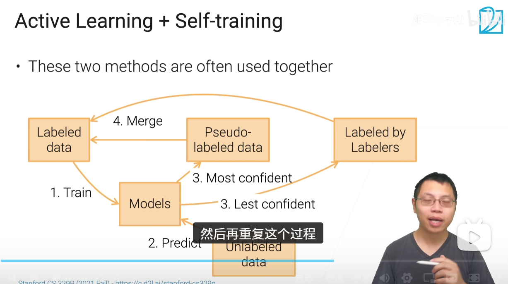


**质量控制**


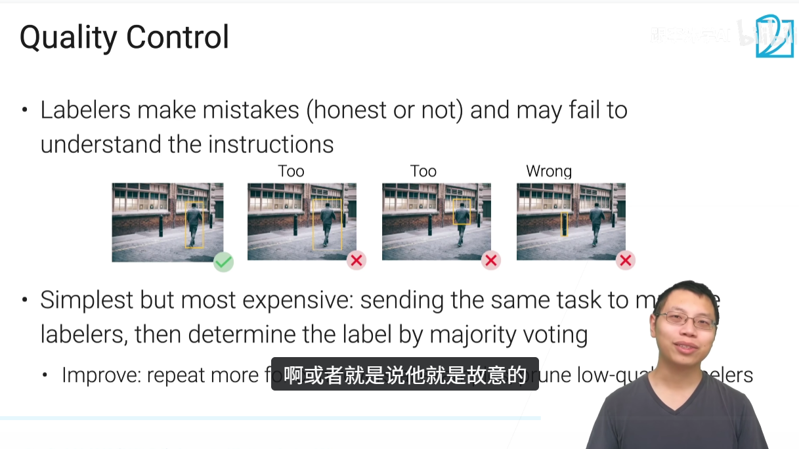


**弱监督学习**

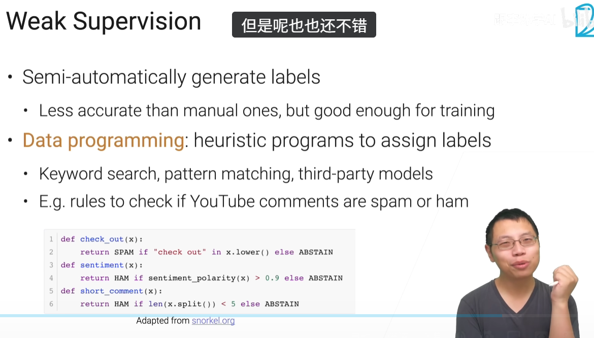


### 数据预处理


数据分析首推pandas

画图matplotlib

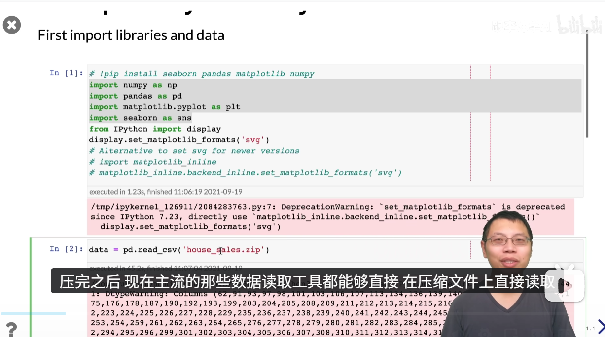

内存解压很肯能比硬盘读取要块一点，如果你是处理图片的话，你压缩就没有太多用了，因为图片这些比较大的数据格式已经做了很好的压缩。

```python
data.shape

data.head

data.drop(columns = data.columns,inplace = True)

data.describe()
```

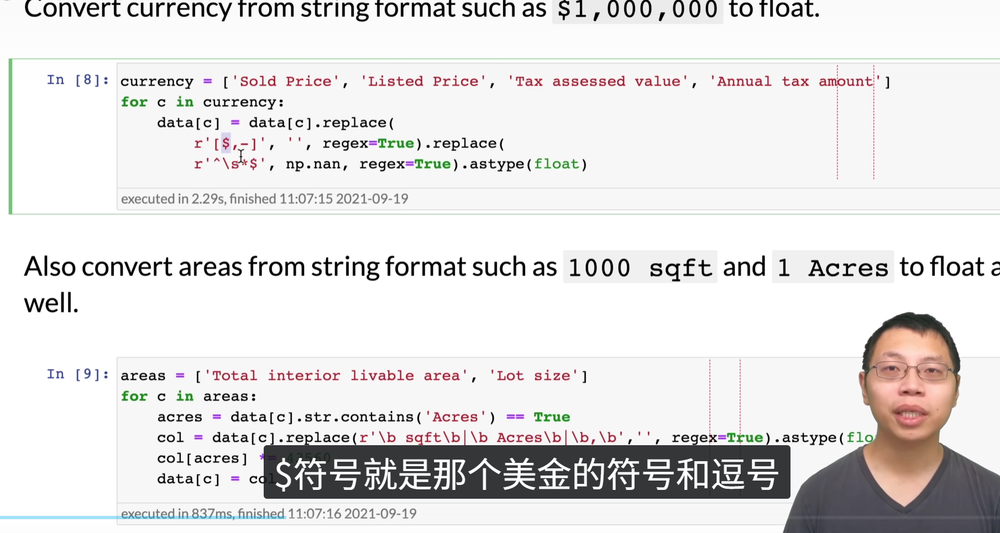


h好用的plot

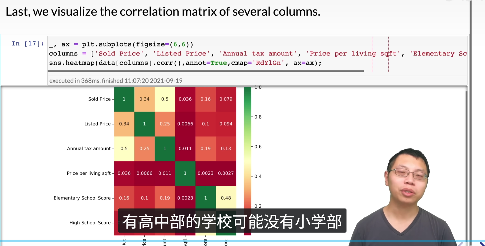


