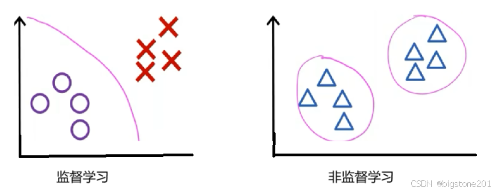
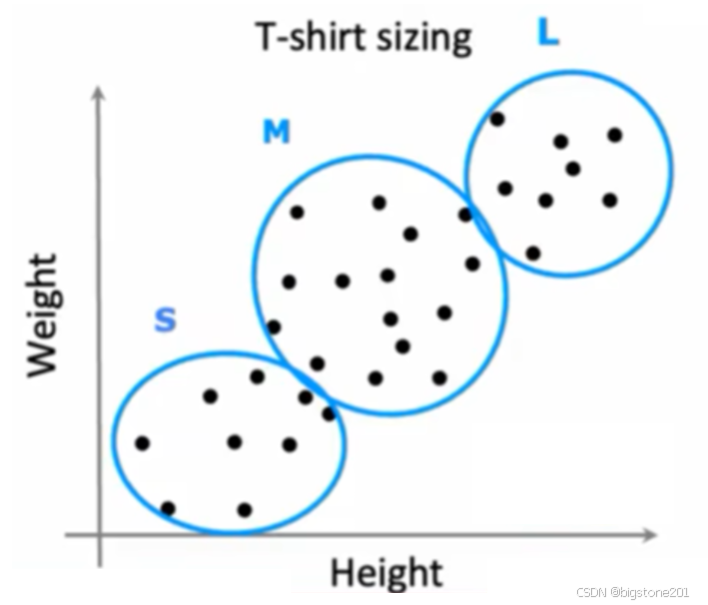
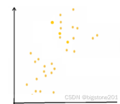
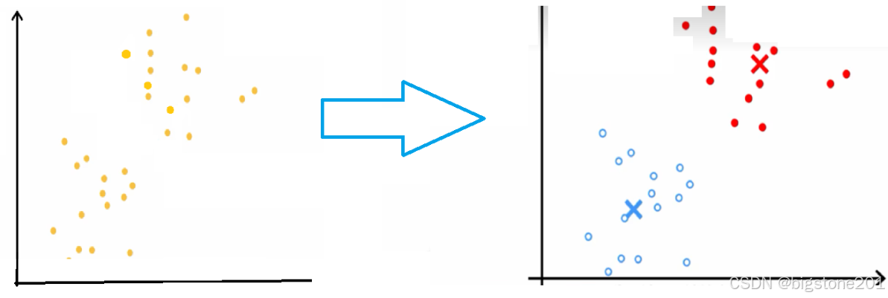
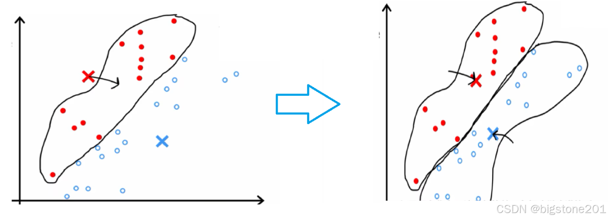

## 聚类

聚类是非监督学习中的常用方法，接下来将逐一讲解

机器学习分为监督学习及非监督学习：

- 监督学习是训练集(下图右表格)给予输入量x**以及**输出量y
- 非监督学习是训练集给予输入量x**但不给**输出量y

也就是说，在非监督学习中操作者并不会指明数据训练将按什么标准或目的，这将由程序自行判断数据的特征。如下图左，数据圆圈或红叉就是数据输入程序后，所应输出的y。而在非监督学习中，输入的数据中，并未指定他应如何输出，而是程序自行根据数据特征来判断

**聚类算法是将给定的数据集，根据数据的分布对其进行分类**

如给出一个班的人的身高，体重数据。程序将能通过身高，体重的分布自行判断出哪些人穿S码，哪些人穿M码和L码的衣服，这就是一个聚类的例子。

## K-Means算法

K-Means算法是聚类问题中常用的算法，本文将主要讲该算法。接下来将假设数据集按照二维分布为如下图。

K-Means算法主要就是要将下方左图分类为右图

**这样的转换将要进行三个步骤**

选取k个集群中心，集群中心即是上图中的红叉，蓝叉。集群中心将会把数据集分割为一个个集群

根据数据离集群中心的距离对数据集进行分类，离红叉集群中心近的将会被分到红色集群，离蓝叉集群中心近的将会被分到蓝色集群。

将集群中心移动到对应集群的中心

K-means算法将会**反复执行**步骤二和步骤三，直到将数据集分到最合理的时候

### 损失函数

如同监督学习中的[线性回归模型](https://blog.csdn.net/bigstone201/article/details/143277250?spm=1001.2014.3001.5501)，我们同样用成本函数(有些地方称失真函数)来解决问题。我们也将建立K-means算法的成本函数并使其最小化。公式如下：

参数的介绍
**x_i是第i个数据的坐标。**

**c_i是第i个数据的索引。**

**u_k是第k个集群中心，而uc_i是i个数据所对应的集群中心。**

## K-Means的优化

在上述中，我们都在随机选择一点作为集群中心的初始位置。但在实际运用中，我们常常会选择数据集中的点作为集群中心。

我们便可以**多次选取集群中心**，并进行K-Means算法，最后将得到的结果的成本函数做比较，最小的结果将是我们最想得到的结果。

当我们得到身高体重的数据时，我们可以设置k=3，这将对应衣服中的s，m，l码。同时也可设置k=5，这将增加xs，xl码。这两种设置方式都是十分好的，我们只需依据我们实际的情况来选择采用哪种方案。故我们选取集群中心数量时应**符合我们实际的要求和情况** 。