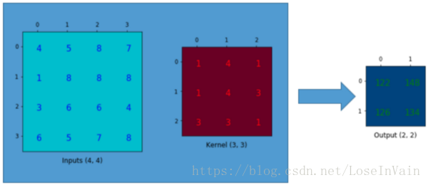
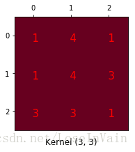
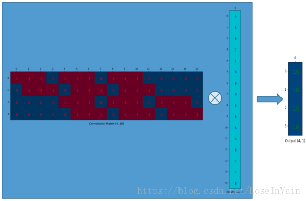
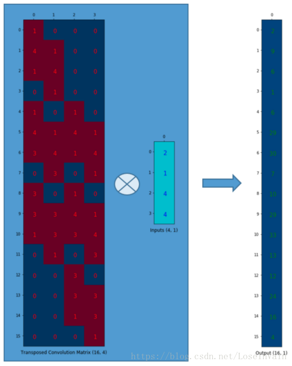
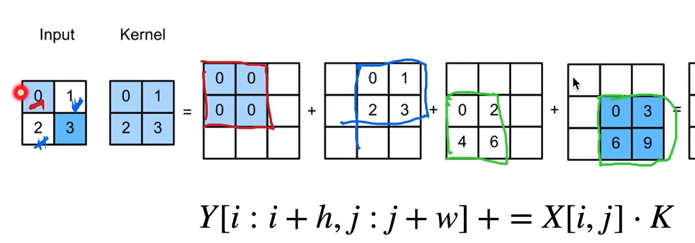
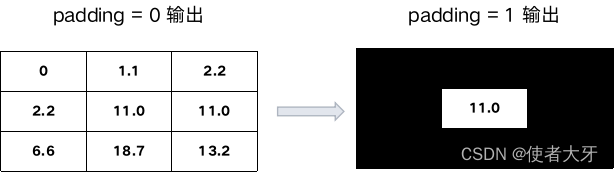
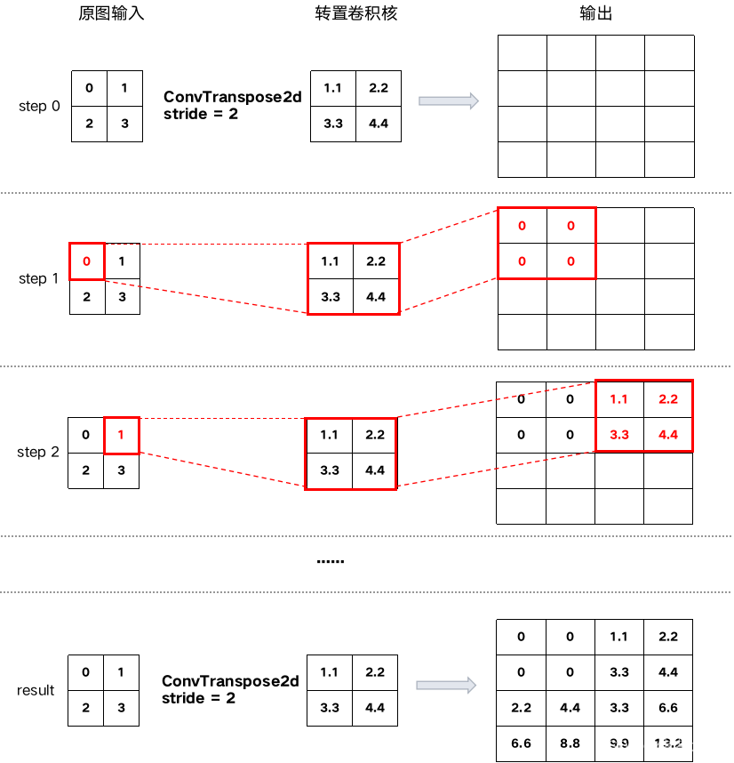
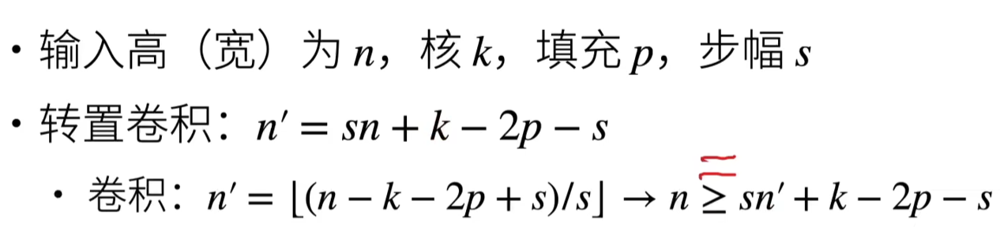

## 用转置卷积进行上采样

卷积通常不会增大输入的**高和宽**，通常不变或者减半。

卷积一般做下采样，转置卷积一般做上采样。

**转置卷积可以增大输入的高和宽**

**可以理解为从语义信息还原为图片信息的过程**

当我们用神经网络生成图片的时候，经常需要将一些低分辨率的图片转换为高分辨率的图片。

对于这种上采样(up-sampling)操作，目前有着一些插值方法进行处理：

- 最近邻插值(Nearest neighbor interpolation)
- 双线性插值(Bi-Linear interpolation)
- 双立方插值(Bi-Cubic interpolation)
- 以上的这些方法都是一些插值方法，需要我们在决定网络结构的时候进行挑选。这些方法就像是人工特征工程一样，并没有给神经网络学习的余地，神经网络不能自己学习如何更好地进行插值，这个显然是不够理想的。
  

转置卷积(Transposed Convolution)常常在一些文献中也称之为反卷积(Deconvolution)和部分跨越卷积(Fractionally-strided Convolution)，因为称之为反卷积容易让人以为和数字信号处理中反卷积混起来，造成不必要的误解。并且建议各位不要采用反卷积这个称呼。
如果我们想要我们的网络可以学习到最好地上采样的方法，我们这个时候就可以采用转置卷积。这个方法不会使用预先定义的插值方法，它具有可以学习的参数。

让我们回顾下卷积操作是怎么工作的，并且我们将会从一个小例子中直观的感受卷积操作。假设我们有一个4 × 4的矩阵，我们将在这个矩阵上应用3 × 3 的卷积核，并且不添加任何填充(padding)，步进参数(stride)设置为1，就像下图所示，输出为一个2 × 2  的矩阵。


**这种卷积操作使得输入值和输出值之间存在有位置上的连接关系**，举例来说，输入矩阵左上方的值将会影响到输出矩阵的左上方的值。更具体而言，3 × 3 的卷积核是用来连接输入矩阵中的9个值，并且将其转变为输出矩阵的一个值的。**一个卷积操作是一个多对一(many-to-one)的映射关系**。
现在，假设我们想要反过来操作。**我们想要将输入矩阵中的一个值映射到输出矩阵的9个值**，**这将是一个一对多(one-to-many)的映射关系**。这个就像是卷积操作的反操作，其核心观点就是用转置卷积。

**因此就结论而言，卷积操作是多对一，而转置卷积操作是一对多**

为了接下来的讨论，我们需要定义一个卷积矩阵(**convolution matrix**)和相应的转置卷积矩阵(**transposed convolution matrix**)。



我们对这个3 × 3的卷积核进行重新排列，得到了下面这个4 × 16 的卷积矩阵：
](images/a5ff520e8fc42eaa5b30e2dd18ebb36e.png)

为了将卷积操作表示为卷积矩阵和输入矩阵的向量乘法，我们将**输入矩阵4 × 4**摊平(flatten)为一个列向量，形状为16 × 1，如下图所示。


这个输出的4 × 1的矩阵可以重新塑性为一个2 × 2的矩阵，而这个矩阵正是和我们一开始通过传统的卷积操作得到的一模一样。
**这个卷积矩阵除了重新排列卷积核的权重之外就没有啥了**，然后卷积操作可以通过表示为卷积矩阵和输入矩阵的列向量形式的矩阵乘积形式进行表达。

`**转置**`假设我们转置这个**卷积矩阵C**    ( 4 × 16 ) **变为C T**    ( 16 × 4 ) 。我们可以对C T 和列向量( 4 × 1 )进行矩阵乘法，从而生成一个16 × 1 的输出矩阵。这个转置矩阵正是将一个元素映射到了9个元素。 `将卷积核转置与输出进行点积`






为什么叫做转置？

```python
tconv = nn.ConvTransposed2d(1,1,ksize,padding,bias)
#填充在卷积中可以增大输出的大小，但是在转置卷积中填充在输出上，使得输出大小变小。具体计算方法也很简单：给输出数据减去padding圈。
```



把stride调整为2后，计算过程如下：

`nn.ConvTranspose2d` 是 PyTorch 中用于实现二维转置卷积的关键模块，它通过逆向的卷积操作实现了特征图的上采样和空间维度的扩大。

**转置卷积**



这里卷积应该是+2p，如果想让高宽成倍增加，k=2p+s。

数学上的反卷积是卷积的逆运算，如果Y=Conv（X,K）,那么X=deConv（Y,K）

反卷积很少在神经网络中使用

```python
tconv = nn.ConvTranspose2d(1, 1, kernel_size=2, bias=False)
tconv.weight.data = K
tconv(X)

# 超参数与conv2d一样
```

