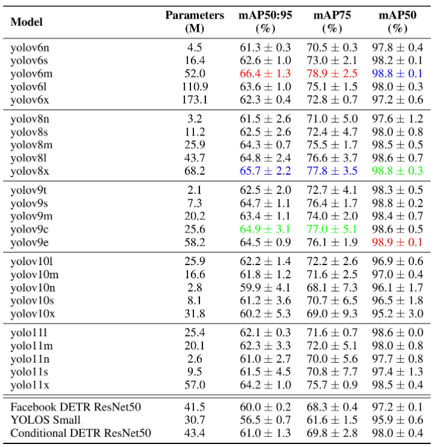

### 新加数据集

新加入...........加上你已有的 BECA、Cows2021、NWAFU_CattleDataset 等，你的 CowCV
  平台在数据集的规模、场景多样性、任务覆盖度上将具备写论文的充分说服力。

### **8-Calves Image dataset**

为解决这一问题，我们引入了8-Calves数据集，这是一个用于多动物检测、跟踪和识别的具有挑战性的基准。

该数据集包含一个小时的视频，记录了谷仓中的八头荷斯坦牛小牛，其特点是频繁的遮挡、运动模糊和多样的姿势。通过使用经过微调的YOLOv8检测器和ByteTrack的半自动化流程，并进行细致的手动校正，我们提供了一个高质量的资源，包含超过537,000个带有时间身份标签的边界框。

缺乏具有长期时间连续性、视觉上可区分的身份以及系统性遮挡的基准测试，使得在真实部署中模型面对这些普遍挑战时的可靠性难以评估。因此，迫切需要一个结合时间连续性、视觉上可区分的身份以及密集、自然的遮挡的基准测试，以正确评估用于检测、跟踪和重新识别的模型。

我们的数据集包含一段在谷仓中喂食八头荷斯坦牛小牛的视频，产生了超过 537,000 个高质量、时间一致的边界框，并带有唯一的身份标签。该场景的特点是频繁且有时严重的遮挡、快速运动和多样的动物朝向，为现代计算机视觉模型提供了一个测试平台

我们的原始数据包含九个一小时的视频，视频中是同一批八头荷斯坦奶牛犊在喂食期间的场景，分辨率为600×800像素，帧率为20帧/秒。该场景存在频繁的遮挡、多变的姿态、朝向、长宽比，以及由于快速移动造成的偶尔的运动模糊。为了确保高质量的地面真实边界框和身份信息，我们将人工标注工作集中在一个具有代表性的一小时视频上，该视频的特点是动物在喂食期间存在密集的互动。

我们采用了一种半自动化的方法来最小化小牛边界框和身份的手动标注。应用了性能卓越的多目标跟踪器ByteTrack [1]于视频，随后进行了手动纠错。

在将检测器与ByteTrack [1] 集成并处理完所有视频素材后，我们通过人工方式进行了完整的错误修正（虚报、身份交换、漏检）。最终数据集包含 537,908 个已验证的边界框和身份。人工检查发现了约 3,000 个漏检（占总数的 0.56%），这对检测器的训练/评估影响可忽略不计，且不影响身份跟踪。

### MooTrack360：一个新颖的鱼眼相机数据集，用于鲁棒的多头奶牛检测与跟踪。

MooTrack360 是一个新颖的自顶向下鱼眼数据集，旨在支持在大型、真实环境中开发鲁棒的摄像头监控系统。该数据集虽然围绕荷斯坦奶牛的持续牲畜监测，但也解决了计算机视觉中的普遍挑战，例如鱼眼畸变、视场重叠、光照变化和遮挡。它包含 1,500 张图像中的 102,747 个标注牛实例，每头牛被标记为“站立”或“躺卧”，并提供一个 1 小时的标注视频序列用于跟踪评估。包含若干未标注序列用于开发和分析。该数据集支持在从白天到红外辅助夜间成像等各种条件下的检测和跟踪，并促进特定应用和通用模型的评估。提供基于双球相机模型的校准流程，以支持畸变校正和精确的空间定位。附带的端到端训练框架进一步解决了光照变化和遮挡等挑战。使用最先进的检测和跟踪方法的基准测试表明，该数据集有潜力推动跨领域的非侵入式、基于摄像头的监测研究。完整的 数据集—包括标注图像、跟踪序列、样本视频、校准素材和完整代码库，可在以下网址获取：https://zenodo.org/records/15470268。

与视场角（FOV）较小的传统摄像头相比，使用鱼眼摄像头意味着可以用更少的摄像头覆盖感兴趣区域（稳定区域），这对于多摄像头多目标跟踪场景来说始终是一个挑战。受[6]的启发，我们引入了一种增强的摄像头设置，以解决图像质量差的挑战——尤其是在夜间灯光通常关闭的情况下——通过在农场内的关键区域安装配备四个内置红外照明器的优质监控摄像头VIVOTEK FE9391-EHV-v2。摄像头以10 FPS记录H.264压缩视频，最大分辨率为2944 × 2944像素，视场角为180度。

### XGain Cattle Behavior

 已推荐（上轮确认的3个）

  ┌─────┬──────────────────┬─────────┬─────────────────────┬─────────────┬──────────────┬─────────────┐
  │  #  │      数据集      │  年份   │        规模         │    格式     │    许可证    │    下载     │
  ├─────┼──────────────────┼─────────┼─────────────────────┼─────────────┼──────────────┼─────────────┤
  │ 1   │ 8-Calves         │ 2025.03 │ 67,760帧, 537K bbox │ YOLO ✅     │ CC-BY 4.0 ✅ │ HuggingFace │
  ├─────┼──────────────────┼─────────┼─────────────────────┼─────────────┼──────────────┼─────────────┤
  │ 2   │ MultiCamCows2024 │ 2024.10 │ 101,329张, 90头     │ COCO OBB ⚠️ │ 非商业 ⚠️    │ Bristol大学 │
  ├─────┼──────────────────┼─────────┼─────────────────────┼─────────────┼──────────────┼─────────────┤
  │ 3   │ COLO             │ 2024.07 │ 1,254张, 11,818实例 │ 待确认      │ 待确认       │ HuggingFace │
  └─────┴──────────────────┴─────────┴─────────────────────┴─────────────┴──────────────┴─────────────┘

---
  新发现的候选数据集

  🥇 XGain Cattle Behavior（2025年6月，Zenodo）— 强烈推荐

  ┌──────┬─────────────────────────────────────────────────────────────────────────────────┐
  │ 项目 │                                      详情                                       │
  ├──────┼─────────────────────────────────────────────────────────────────────────────────┤
  │ 来源 │ EU Horizon 2020 XGain项目，ILVO研究所                                           │
  ├──────┼─────────────────────────────────────────────────────────────────────────────────┤
  │ 规模 │ 12,578张手动标注图像，~946 MB                                                   │
  ├──────┼─────────────────────────────────────────────────────────────────────────────────┤
  │ 场景 │ 1公顷牧场，俯拍（6m高），多天气条件                                             │
  ├──────┼─────────────────────────────────────────────────────────────────────────────────┤
  │ 任务 │ 行为检测：grazing / lying / standing                                            │
  ├──────┼─────────────────────────────────────────────────────────────────────────────────┤
  │ 标注 │ YOLOv8格式 ✅，归一化坐标，UUID匹配                                             │
  ├──────┼─────────────────────────────────────────────────────────────────────────────────┤
  │ 下载 │ Zenodo #15688349 (https://zenodo-rdm.web.cern.ch/records/15688349)              │
  ├──────┼─────────────────────────────────────────────────────────────────────────────────┤
  │ 理由 │ YOLO格式即用、牧场俯拍场景区别于你的牛舍数据、12K标注量大、欧盟官方项目质量可靠 │
  └──────┴─────────────────────────────────────────────────────────────────────────────────┘

  🥈 MmCows（NeurIPS 2024）— 顶会数据集

  ┌──────┬─────────────────────────────────────────────────────────────────────────────────────┐
  │ 项目 │                                        详情                                         │
  ├──────┼─────────────────────────────────────────────────────────────────────────────────────┤
  │ 来源 │ NeurIPS 2024 Datasets & Benchmarks Track，威斯康星/普渡大学                         │
  ├──────┼─────────────────────────────────────────────────────────────────────────────────────┤
  │ 规模 │ 20,000标注帧，213,000 bbox，16头牛                                                  │
  ├──────┼─────────────────────────────────────────────────────────────────────────────────────┤
  │ 场景 │ 4个等距视角RGB摄像头，牛舍环境                                                      │
  ├──────┼─────────────────────────────────────────────────────────────────────────────────────┤
  │ 任务 │ 检测 + 行为（standing/lying）+ 个体ID + 3D定位                                      │
  ├──────┼─────────────────────────────────────────────────────────────────────────────────────┤
  │ 标注 │ [cow_id, x, y, w, h]，归一化于4480×2800分辨率                                       │
  ├──────┼─────────────────────────────────────────────────────────────────────────────────────┤
  │ 下载 │ GitHub neis-lab/mmcows (https://github.com/neis-lab/mmcows)，visual_data.zip (20GB) │
  ├──────┼─────────────────────────────────────────────────────────────────────────────────────┤
  │ 理由 │ NeurIPS顶会级别、多模态（RGB+传感器）、行为+ID+3D、标注量大                         │
  └──────┴─────────────────────────────────────────────────────────────────────────────────────┘

  🥉 SideCow-VSS（2025年11月，MDPI）— 语义分割

  ┌────────┬───────────────────────────────────────────────────────────────────────────────────────┐
  │  项目  │                                         详情                                          │
  ├────────┼───────────────────────────────────────────────────────────────────────────────────────┤
  │ 来源   │ MDPI Veterinary Sciences, 吉林大学                                                    │
  ├────────┼───────────────────────────────────────────────────────────────────────────────────────┤
  │ 规模   │ 921个视频片段，46,050标注帧                                                           │
  ├────────┼───────────────────────────────────────────────────────────────────────────────────────┤
  │ 场景   │ 商业奶牛场侧拍视角，2560×1920分辨率                                                   │
  ├────────┼───────────────────────────────────────────────────────────────────────────────────────┤
  │ 任务   │ 视频语义分割（比检测更精细）                                                          │
  ├────────┼───────────────────────────────────────────────────────────────────────────────────────┤
  │ 标注   │ YOLOv11预标注 + SAM2生成mask + 人工验证                                               │
  ├────────┼───────────────────────────────────────────────────────────────────────────────────────┤
  │ 许可证 │ CC BY 4.0 ✅                                                                          │
  ├────────┼───────────────────────────────────────────────────────────────────────────────────────┤
  │ 下载   │ MDPI文章页 (https://www.mdpi.com/2306-7381/12/11/1104)（Data Availability Statement） │
  ├────────┼───────────────────────────────────────────────────────────────────────────────────────┤
  │ 理由   │ 分割标注可丰富你平台的标注类型多样性，CC BY开放                                       │
  └────────┴───────────────────────────────────────────────────────────────────────────────────────┘

  🏅 其他候选（供扩展参考）

  ┌───────────┬─────┬────────┬──────────────────────────┬─────────────────────────────────────────────────────────┐
  │  数据集   │ 年  │  规模  │           特点           │                          下载                           │
  │           │ 份  │        │                          │                                                         │
  ├───────────┼─────┼────────┼──────────────────────────┼─────────────────────────────────────────────────────────┤
  │ CattleEye │ 202 │ 30,703 │ 俯拍多任务（检测+计数+体 │                                                         │
  │ View      │ 4   │ 帧,    │ 况评分）                 │ IEEE (https://ieeexplore.ieee.org/document/10402676)    │
  │           │     │ 753头  │                          │                                                         │
  ├───────────┼─────┼────────┼──────────────────────────┼─────────────────────────────────────────────────────────┤
  │ YOLOv9-12 │ 202 │ 91,694 │ 耳标号牌识别，4种YOLO    │                                                         │
  │  Cattle   │ 5   │ 帧     │ benchmark                │ ScienceDirect论文附带                                   │
  │ ID        │     │        │                          │                                                         │
  ├───────────┼─────┼────────┼──────────────────────────┼─────────────────────────────────────────────────────────┤
  │ HanwooReI │ 202 │ 待确认 │ 韩牛多视角重识别+姿态Tra │ ScienceDirect (https://www.sciencedirect.com/science/ar │
  │ D         │ 5   │        │ nsformer                 │ ticle/abs/pii/S0168169925012232)                        │
  ├───────────┼─────┼────────┼──────────────────────────┼─────────────────────────────────────────────────────────┤
  │ Kaggle    │ 202 │        │                          │ Kaggle (https://www.kaggle.com/datasets/lucyfirst/beef- │
  │ Cattle    │ 4   │ 待确认 │ 肉牛行为分类             │ cattle-behavior-data-set)                               │
  │ Behavior  │     │        │                          │                                                         │
  └───────────┴─────┴────────┴──────────────────────────┴─────────────────────────────────────────────────────────┘

---
  重要参考资源：系统综述

  📄 Public Computer Vision Datasets for Precision Livestock Farming: A Systematic Survey
  (https://arxiv.org/abs/2406.10628) (2024, Computers and Electronics in Agriculture)

  - 整理了 67个公开数据集，近半数是牛相关
  - 配套 GitHub仓库 (https://github.com/Anil-Bhujel/Public-Computer-Vision-Dataset-A-Systematic-Survey)
    列出所有数据集分类和链接
  - 结论："高质量标注数据集的数量有限是目前精准畜牧最大瓶颈" — 这恰好是你论文论证的立足点

---

---
  2026年新公开数据集

  🥇 MooTrack360（WACV 2026）— 鱼眼摄像头，最新颖

  ┌─────┬────────────────────────────────────────────────────────────────────────────────────────────────────────────┐
  │ 项  │                                                    详情                                                    │
  │ 目  │                                                                                                            │
  ├─────┼────────────────────────────────────────────────────────────────────────────────────────────────────────────┤
  │ 来  │ WACV 2026（CV顶会），南丹麦大学                                                                            │
  │ 源  │                                                                                                            │
  ├─────┼────────────────────────────────────────────────────────────────────────────────────────────────────────────┤
  │ 规  │ 102,747个牛实例，1,500张标注图 + 1小时追踪视频                                                             │
  │ 模  │                                                                                                            │
  ├─────┼────────────────────────────────────────────────────────────────────────────────────────────────────────────┤
  │ 场  │ 俯拍鱼眼摄像头，荷斯坦奶牛，含白天/红外夜间                                                                │
  │ 景  │                                                                                                            │
  ├─────┼────────────────────────────────────────────────────────────────────────────────────────────────────────────┤
  │ 任  │ 目标检测 + 多目标追踪 + 站立/躺卧分类                                                                      │
  │ 务  │                                                                                                            │
  ├─────┼────────────────────────────────────────────────────────────────────────────────────────────────────────────┤
  │ 标  │ standing/lying 标签，Double Sphere鱼眼校准                                                                 │
  │ 注  │                                                                                                            │
  ├─────┼────────────────────────────────────────────────────────────────────────────────────────────────────────────┤
  │ 下  │ Zenodo（同行评审后公开）                                                                                   │
  │ 载  │                                                                                                            │
  ├─────┼────────────────────────────────────────────────────────────────────────────────────────────────────────────┤
  │ 论  │ WACV 2026 (https://openaccess.thecvf.com/content/WACV2026/html/Christiansen_MooTrack360_A_Novel_Fisheye_Ca │
  │ 文  │ mera_Dataset_for_Robust_Multi_Diary_WACV_2026_paper.html)                                                  │
  ├─────┼────────────────────────────────────────────────────────────────────────────────────────────────────────────┤
  │ 价  │ ⭐⭐⭐ 鱼眼畸变场景独有，填补你平台的场景空白                                                              │
  │ 值  │                                                                                                            │
  └─────┴────────────────────────────────────────────────────────────────────────────────────────────────────────────┘

  🥈 MOO（arXiv 2026.03）— 合成数据+128视角，最独特

  ┌──────┬──────────────────────────────────────────────────────────────┐
  │ 项目 │                             详情                             │
  ├──────┼──────────────────────────────────────────────────────────────┤
  │ 来源 │ 巴黎萨克雷大学 + 索邦大学                                    │
  ├──────┼──────────────────────────────────────────────────────────────┤
  │ 规模 │ 1,000头合成牛 × 128视角 = 128,000张标注图                    │
  ├──────┼──────────────────────────────────────────────────────────────┤
  │ 场景 │ 空地视角匹配（AG-ReID），无人机↔地面跨视角                   │
  ├──────┼──────────────────────────────────────────────────────────────┤
  │ 任务 │ 跨视角牛只重识别（Aerial-Ground Re-ID）                      │
  ├──────┼──────────────────────────────────────────────────────────────┤
  │ 标注 │ 精确角度/仰角标注，发现关键仰角阈值                          │
  ├──────┼──────────────────────────────────────────────────────────────┤
  │ 下载 │ GitHub: TurtleSmoke/MOO (https://github.com/TurtleSmoke/MOO) │
  ├──────┼──────────────────────────────────────────────────────────────┤
  │ 论文 │ arXiv:2603.04314 (https://arxiv.org/abs/2603.04314)          │
  ├──────┼──────────────────────────────────────────────────────────────┤
  │ 价值 │ ⭐⭐⭐ 合成数据+跨视角是你论文"数据扩展"章节的绝佳素材       │
  └──────┴──────────────────────────────────────────────────────────────┘

  🥉 Holstein Dense-Crowd Re-ID（arXiv 2026.02）— 密集场景

  ┌──────┬─────────────────────────────────────────────────────┐
  │ 项目 │                        详情                         │
  ├──────┼─────────────────────────────────────────────────────┤
  │ 来源 │ 开放词汇定位 + SAM2 + Re-ID                         │
  ├──────┼─────────────────────────────────────────────────────┤
  │ 规模 │ 9天CCTV视频 → 524,469个RGB mask，奶牛场真实场景     │
  ├──────┼─────────────────────────────────────────────────────┤
  │ 场景 │ 密集拥挤牛群，荷斯坦黑白花纹"伪装效应"              │
  ├──────┼─────────────────────────────────────────────────────┤
  │ 性能 │ 检测 98.93%，Re-ID 94.82%                           │
  ├──────┼─────────────────────────────────────────────────────┤
  │ 下载 │ 论文附带（待确认具体链接）                          │
  ├──────┼─────────────────────────────────────────────────────┤
  │ 论文 │ arXiv:2602.15962 (https://arxiv.org/abs/2602.15962) │
  ├──────┼─────────────────────────────────────────────────────┤
  │ 价值 │ ⭐⭐⭐ 密集遮挡正是你论文的核心难点之一             │
  └──────┴─────────────────────────────────────────────────────┘

  🏅 农场畜牧目标检测15K（2026.04，阿里云）— 开箱即用

  ┌──────┬───────────────────────────────────────────────────────────┐
  │ 项目 │                           详情                            │
  ├──────┼───────────────────────────────────────────────────────────┤
  │ 来源 │ 阿里云开发者平台 / SegmentFault                           │
  ├──────┼───────────────────────────────────────────────────────────┤
  │ 规模 │ 15,000张高质量标注图像                                    │
  ├──────┼───────────────────────────────────────────────────────────┤
  │ 类别 │ 5类：奶牛、马、猪、绵羊、其他                             │
  ├──────┼───────────────────────────────────────────────────────────┤
  │ 场景 │ 真实农场：开阔牧场、牛舍、昼/夜、稀疏/密集、多姿态        │
  ├──────┼───────────────────────────────────────────────────────────┤
  │ 标注 │ YOLO格式 ✅，train/val/test 已划分                        │
  ├──────┼───────────────────────────────────────────────────────────┤
  │ 下载 │ 百度网盘 pan.baidu.com/s/11OMmlNX4K_LbUvGl6xjlzg?pwd=q34s │
  ├──────┼───────────────────────────────────────────────────────────┤
  │ 价值 │ ⭐⭐ 开箱即用、量大、多物种，但非学术论文级别             │
  └──────┴───────────────────────────────────────────────────────────┘

  🏅 牛行为检测3,600张（2026.04，阿里云）— 行为补充

  ┌──────┬───────────────────────────────────────────────────────────┐
  │ 项目 │                           详情                            │
  ├──────┼───────────────────────────────────────────────────────────┤
  │ 规模 │ 3,600张，4类行为：饮水、进食、趴卧、站立                  │
  ├──────┼───────────────────────────────────────────────────────────┤
  │ 标注 │ YOLO格式 ✅                                               │
  ├──────┼───────────────────────────────────────────────────────────┤
  │ 下载 │ 百度网盘 pan.baidu.com/s/1SyqH1z0OzFAguRGtixLw6A?pwd=fusi │
  ├──────┼───────────────────────────────────────────────────────────┤
  │ 价值 │ ⭐⭐ 行为标签补充检测任务                                 │
  └──────┴───────────────────────────────────────────────────────────┘

  🏅 无人机航拍牛1,074张（2026.01，CSDN）— 航拍视角

  ┌────────┬─────────────────────────────────┐
  │  项目  │              详情               │
  ├────────┼─────────────────────────────────┤
  │ 规模   │ 1,074张，17,132 bbox，单类(cow) │
  ├────────┼─────────────────────────────────┤
  │ 标注   │ VOC + YOLO 双格式 ✅            │
  ├────────┼─────────────────────────────────┤
  │ 许可证 │ CC BY-SA 4.0                    │
  ├────────┼─────────────────────────────────┤
  │ 下载   │ CSDN博客附带链接                │
  ├────────┼─────────────────────────────────┤
  │ 价值   │ ⭐⭐ 无人机视角补充             │
  └────────┴─────────────────────────────────┘

  🏅 ICAERUS 无人机畜牧数据集（2026.03，Zenodo）— 多物种

  ┌──────┬───────────────────────────────────────────────────────────────────────────────────────────────────────────┐
  │ 项目 │                                                   详情                                                    │
  ├──────┼───────────────────────────────────────────────────────────────────────────────────────────────────────────┤
  │ 来源 │ EU Horizon 2020 ICAERUS项目                                                                               │
  ├──────┼───────────────────────────────────────────────────────────────────────────────────────────────────────────┤
  │ 规模 │ 总计 9,531张 + 203视频 + 40,114 bbox（累计），2026年3月新增809张羊图（18,018 bbox）                       │
  ├──────┼───────────────────────────────────────────────────────────────────────────────────────────────────────────┤
  │ 物种 │ 牛、羊、山羊                                                                                              │
  ├──────┼───────────────────────────────────────────────────────────────────────────────────────────────────────────┤
  │ 标注 │ YOLO格式                                                                                                  │
  ├──────┼───────────────────────────────────────────────────────────────────────────────────────────────────────────┤
  │ 下载 │ Zenodo: ICAERUS (https://zenodo.org/records/18889623) / GitHub                                            │
  │      │ (https://github.com/ICAERUS-EU/UC3_Livestock_Monitoring)                                                  │
  ├──────┼───────────────────────────────────────────────────────────────────────────────────────────────────────────┤
  │ 价值 │ ⭐⭐ 但以羊为主，牛占比不高                                                                               │
  └──────┴───────────────────────────────────────────────────────────────────────────────────────────────────────────┘

  🏅 多物种关键点 Benchmark（2026.03，中国农大）

  ┌──────┬───────────────────────────────────────────────────────────┐
  │ 项目 │                           详情                            │
  ├──────┼───────────────────────────────────────────────────────────┤
  │ 来源 │ 中国农业大学                                              │
  ├──────┼───────────────────────────────────────────────────────────┤
  │ 规模 │ 牛、马、羊多物种，18个关键点+遮挡状态                     │
  ├──────┼───────────────────────────────────────────────────────────┤
  │ 模型 │ SimCC, SAR, YOLOX-Pose 等 benchmark                       │
  ├──────┼───────────────────────────────────────────────────────────┤
  │ 价值 │ ⭐⭐ 关键点/姿态估计补充，但以 benchmark 为主，非新数据集 │
  └──────┴───────────────────────────────────────────────────────────┘

---
  综合推荐：2026年最值得整合的3个

  ┌──────┬──────────────────────┬─────────────────────────────────────────────────────────┐
  │ 排名 │        数据集        │                        核心理由                         │
  ├──────┼──────────────────────┼─────────────────────────────────────────────────────────┤
  │ 🥇   │ MooTrack360          │ WACV顶会、鱼眼畸变独有、102K实例、检测+追踪、场景最独特 │
  ├──────┼──────────────────────┼─────────────────────────────────────────────────────────┤
  │ 🥈   │ MOO                  │ 128K合成图+128视角、跨视角Re-ID、论文"数据扩展"利器     │
  ├──────┼──────────────────────┼─────────────────────────────────────────────────────────┤
  │ 🥉   │ Holstein Dense-Crowd │ 524K mask、密集遮挡、直接支撑你论文"复杂场景"难题       │
  └──────┴──────────────────────┴─────────────────────────────────────────────────────────┘

  搭配之前推荐的 8-Calves 和 XGain，你将有非常丰富的2024-2026年最新数据集阵容。

---
  与之前数据集汇总

  ┌──────┬───────────────────────────────────────────────┬──────────────────┬──────────────────────┐
  │ 时段 │                    数据集                     │       格式       │         场景         │
  ├──────┼───────────────────────────────────────────────┼──────────────────┼──────────────────────┤
  │ 2024 │ MultiCamCows2024, COLO, MmCows, CattleEyeView │ COCO/YOLO/自定义 │ 多视角/泛化/多模态   │
  ├──────┼───────────────────────────────────────────────┼──────────────────┼──────────────────────┤
  │ 2025 │ 8-Calves, XGain, SideCow-VSS                  │ YOLO/YOLO/分割   │ 遮挡/牧场行为/侧拍   │
  ├──────┼───────────────────────────────────────────────┼──────────────────┼──────────────────────┤
  │ 2026 │ MooTrack360, MOO, Dense-Crowd                 │ 待确认           │ 鱼眼/合成跨视角/密集 │
  └──────┴───────────────────────────────────────────────┴──────────────────┴──────────────────────┘

## 附录

#### 什么是细粒度图像分类

细粒度图像分类问题是对大类下的子类进行识别。细粒度图像分析任务相对通用图像（General/Generic Images）任务的区别和难点在于其图像所属类别的粒度更为精细。

以图1为例，通用图像分类其任务诉求是将“袋鼠”和“狗”这两个物体大类（蓝色框和红色框中物体）分开，可见无论从样貌、形态等方面，二者还是很容易被区分的；而细粒度图像的分类任务则要求对“狗”该类类别下细粒度的子类，即分别为“哈士奇”和“爱斯基摩犬”的图像分辨开来。正因同类别物种的不同子类往往仅在耳朵形状、毛色等细微处存在差异，可谓“差之毫厘，谬以千里”。不止对计算机，对普通人来说，细粒度图像任务的难度和挑战无疑也更为巨大。

细粒度图像分类无论在工业界还是学术界都有着广泛的研究需求与应用场景。与之相关的研究课题主要包括识别不同种类的鸟、狗、花、车、飞机等。在实际生活中，识别不同的子类别又存在着巨大的应用需求。例如, 在生态保护中, 有效识别不同种类的生物，是进行生态研究的重要前提。如果能够借助于计算机视觉的技术, 实现低成本的细粒度图像识别, 那么无论对于学术界, 还是工业界而言, 都有着非常重要的意义。
