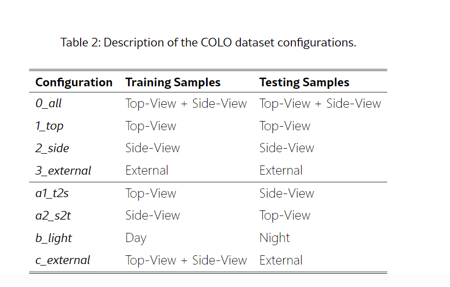
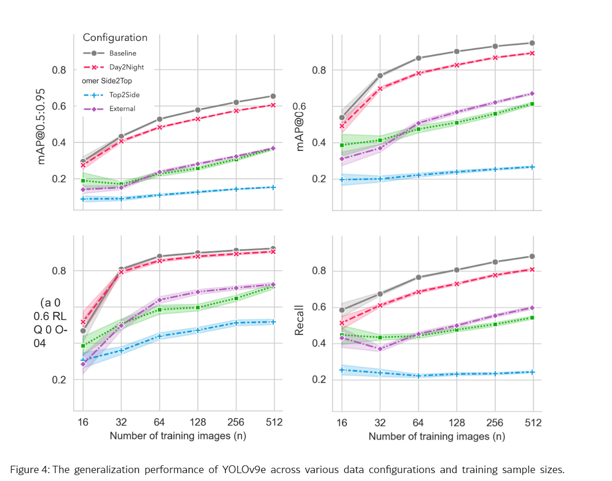
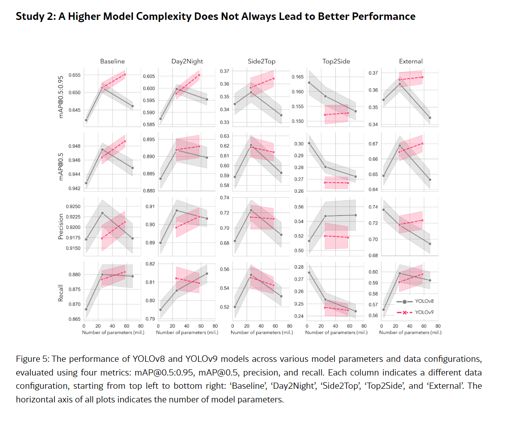
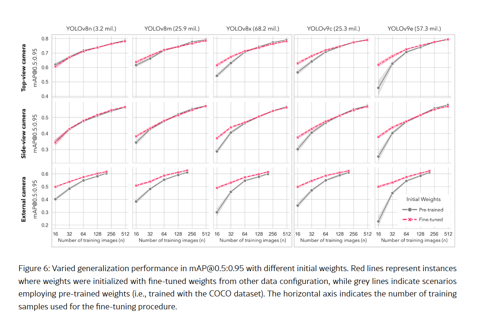

# COLO 论文简要总结与相关性分析 (这篇文章的图可以参考)

## 一句话概括

这篇文章发布了一个室内奶牛目标检测数据集 COLO，并通过一系列 YOLOv8、YOLOv9 实验研究：当摄像机视角、光照、训练数据量、模型规模和初始化权重发生变化时，奶牛检测模型还能不能保持性能。

它是一篇“数据集 + 泛化现象分析”论文，不是提出新型域泛化算法的论文。

## 1. 研究背景

很多奶牛检测研究只在采集数据的原始环境中训练和测试，得到较高精度后就认为模型可用。但模型部署到另一摄像机、另一视角或另一光照环境时，性能可能明显下降。

文章主要研究三个问题：

1. 光照变化和摄像机视角变化，哪个对模型泛化影响更大？
2. 参数更多、结构更复杂的模型，泛化能力是否一定更好？
3. 使用相似奶牛任务训练过的权重，是否一定优于普通 COCO 预训练权重？

## 2. COLO 数据集

完整 COLO 数据集包含：

- 1,254 张室内牛舍图像
- 11,818 个奶牛边界框
- 单类别目标检测：cow
- 同时提供 YOLO 和 COCO 标注格式
- 奶牛主要为 Holstein 和 Jersey

图像来自三台摄像机：

| 视角      | 图像数 | 特点                             |
| --------- | ------ | -------------------------------- |
| Top View  | 504    | 高位俯视                         |
| Side View | 500    | 约 40° 的侧向视角                |
| External  | 250    | 更低、更远的新摄像机，遮挡较严重 |

数据还覆盖白天、室内人工照明和近红外夜间图像。因此，作者可以在同一个牛舍数据集中分别研究视角变化和光照变化。

## 3. 实验设计

### 实验一：环境变化和训练数据量

作者使用 YOLOv9e，构造了五种训练到测试设置：

- Baseline：训练和测试都包含常规视角与光照，但图像不重合
- Top2Side：顶部视角训练，侧面视角测试
- Side2Top：侧面视角训练，顶部视角测试
- Day2Night：白天训练，人工照明和近红外图像测试
- External：顶部和侧面图像训练，第三台外部摄像机图像测试

训练集规模从 16 张逐步增加到约 512 张，测试集固定为 100 张；不同样本量使用多个随机种子重复实验。

### 实验二：模型规模

比较五种模型：

- YOLOv8n：3.2M 参数
- YOLOv8m：25.9M
- YOLOv8x：68.2M
- YOLOv9c：25.6M
- YOLOv9e：58.2M

除了检测指标，文章还比较了训练时间以及 CPU、GPU 推理速度。

### 实验三：初始化权重

作者比较两种初始化方式：

- 普通 COCO 预训练权重
- 已经在相关奶牛视角数据上微调过的自定义权重

目的是判断相关任务的预训练经验，在不同模型规模和样本量下是否仍然有优势。

## 4. 主要结论

### 视角变化比光照变化更严重

Day2Night 的表现接近常规 Baseline，说明颜色、亮度变化配合 HSV 等数据增强后，相对容易适应。

摄像机视角改变则造成明显下降：

- Side2Top 的 mAP@0.5 大约下降 30%
- Top2Side 大约下降 60%
- Top2Side 是最困难的设置，模型会漏掉大量侧面视角的奶牛

原因是视角变化不仅改变牛的外观，还会引入栏杆、牛舍设施和牛群相互遮挡。这些变化不能通过普通的颜色、翻转和缩放增强充分模拟。

**侧视图数据对侧视图目标域的准确率尤其重要，且侧视图训练数据比顶视图训练数据更难被替代。**

### 更大的模型不一定更好

模型参数量与泛化性能不存在稳定的单调关系。

在部分实验中，YOLOv8m 等中等规模模型优于更大的 YOLOv8x；在最困难的 Top2Side 设置中，增加模型复杂度甚至可能导致更差的泛化。

因此，不能根据模型在 COCO 上的排名直接决定牛只检测模型的选择。

### 小模型在简单环境中已经足够

文章报告，在相对同质的检测环境中，YOLOv8n 使用较少训练图像也能达到较高的 mAP@0.5。对于只要求牛只计数、而不强调边界框特别精确的应用，小模型可能更划算。

但这个结论依赖 COLO 的具体场景，不能直接推广到复杂的跨数据集测试。

**不对，应该是大参数模型更容易学到域内特征，这对泛化迁移有负作用。**

### 自定义初始化权重并非总有必要

对于 YOLOv8n、YOLOv8m 等较小模型，相关奶牛数据预训练权重带来的提升比较有限。

对于复杂模型和小样本训练，自定义权重更有价值；随着目标训练样本增加，两种初始化方式之间的差距通常逐渐缩小。

作者设置了三类目标任务：

| 目标训练与测试视角 | 方案 B 的初始化权重来源                |
| ------------------ | -------------------------------------- |
| Top-View           | 已在 Side-View 上微调的模型            |
| Side-View          | 已在 Top-View 上微调的模型             |
| External           | 已在 Top-View + Side-View 上微调的模型 |

作者的结论是：

- 小模型，如 YOLOv8n、YOLOv8m，使用相关奶牛权重和普通 COCO 权重差别不大；
- 大模型且目标数据很少时，相关任务权重通常更有帮助；
- 随着目标域训练图像增加，这种初始化优势逐渐缩小；
- 对 External 视角，即使加入更多目标数据，相关权重与 COCO 权重之间的差距也不一定完全消失。

## 5. 与 CowCV 工作的关系

这篇文章与你的工作高度相关，但两者的研究尺度不同。

| 维度     | COLO 论文                  | CowCV 当前方向                                 |
| -------- | -------------------------- | ---------------------------------------------- |
| 数据来源 | 一个牛场、三台摄像机       | 多个公开牛只数据集                             |
| 泛化类型 | 同一数据集内跨视角、跨光照 | 跨数据集、跨来源、跨场景                       |
| 任务     | 单类别奶牛检测             | 统一单类别牛只检测基准                         |
| 模型     | YOLOv8、YOLOv9             | YOLO11m，并计划比较 Faster R-CNN、RT-DETR 等   |
| 主要贡献 | 新数据集和影响因素分析     | 多源资源整合、统一基准、跨域评测和数据平台     |
| 域的定义 | 视角或光照配置             | 图像级多维域标签，不直接把整个数据集当作一个域 |

## 6. 对你的直接价值

这篇文章适合在 CowCV 中承担四个角色：

1. **直接相关工作**
   可以用来说明奶牛检测模型确实存在明显的环境泛化问题，特别是摄像机视角变化。
2. **CowCV 的组成数据集**
   COLO 可以作为 CowCV 中一个公开数据来源，并保留 Top、Side、External、Day、Night 等域标签。
3. **域划分实验参考**
   可以借鉴它的 Top2Side、Side2Top 和 Day2Night 设置，在 CowCV 中增加“数据集内部跨域”评测。
4. **对照研究**
   COLO 研究的是同一牛场内部的条件变化；CowCV 可以进一步回答模型从一个公开牛只数据集迁移到另一个数据集时会下降多少，以及最差目标域在哪里。

## 7. 不能直接照搬的地方

这篇文章还不能代表严格的多数据集泛化研究：

- 数据主要来自同一个牛场，场景范围有限
- 只有 cow 一个类别
- 主要比较 YOLOv8 和 YOLOv9
- 没有提出专门的域泛化或域适应方法
- 不同视角可能仍包含相同牛只、相近时间和相同牛舍背景
- 它研究的是条件变化，不等于跨牛场、跨数据集的真实分布迁移

因此，COLO 的实验结果可以证明“视角很重要”，但不能直接证明多数据集环境下视角就是唯一或最大的泛化因素。

## 8. 对 CowCV 论文创新边界的影响

这篇论文已经研究过：

- 牛只检测的模型泛化
- 视角与光照变化
- 训练样本量
- 模型复杂度
- 初始化权重

所以 CowCV 不宜笼统声称“首次研究牛只检测模型的泛化问题”。

更合适的创新表述是：

> CowCV 将多个异构牛只视觉数据源统一为一致的检测任务，在严格隔离目标域的条件下，系统评估检测模型的跨数据集、跨场景和最差域泛化能力，并同时提供可复现基准与数据检索平台。

## 综合判断

这篇文章与你的工作具有较高相关性，建议纳入重点相关工作并使用 COLO 数据集，但它不是与你完全相同的工作。

它解决的是“小范围、可控条件下，哪些因素导致泛化下降”；你的 CowCV 更适合解决“大范围、多来源条件下，模型究竟能否跨数据集泛化，以及如何建立统一、可复现的评测基准”。

另外，如果你当前 COLO 数据只有 1,004 张图像和 9,846 个框，很可能只包含 Top View 与 Side View，没有包含 250 张 External 图像及其约 1,972 个实例。正式实验前需要确认你使用的是完整版本还是主摄像机子集。

当前 COLO 数据只有 1,004 张图像和 9,846 个框，只包含 Top View 与 Side View。