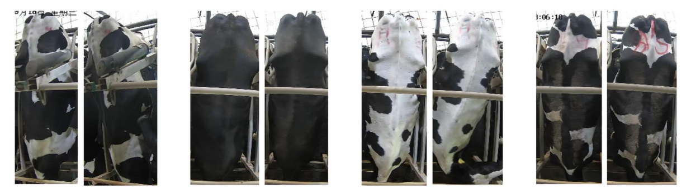
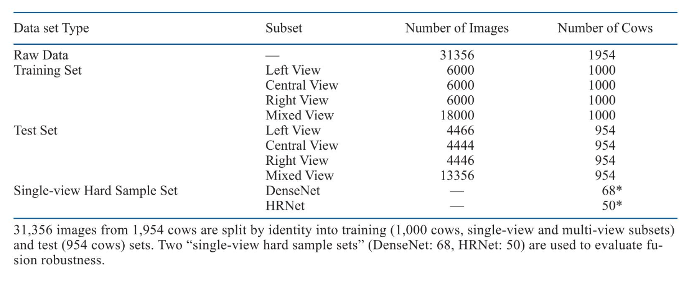
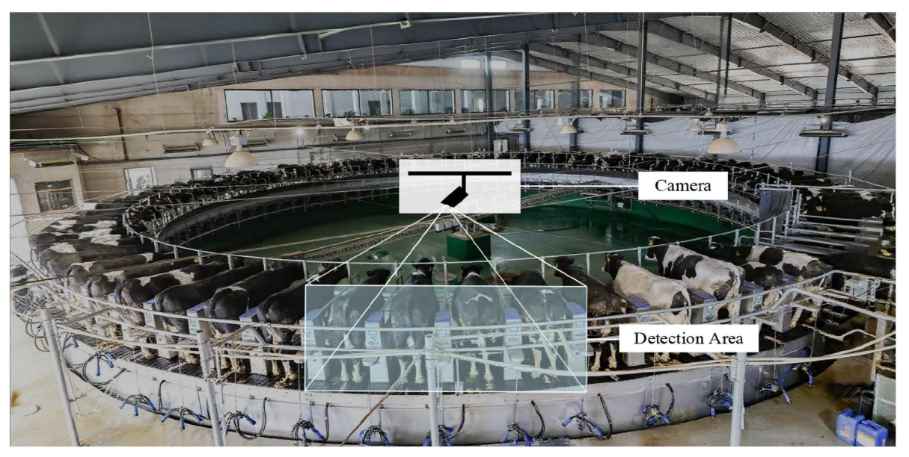
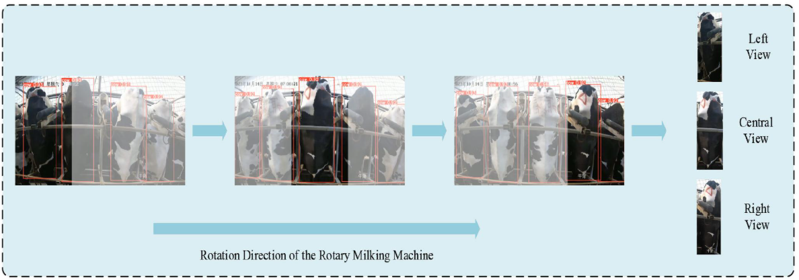
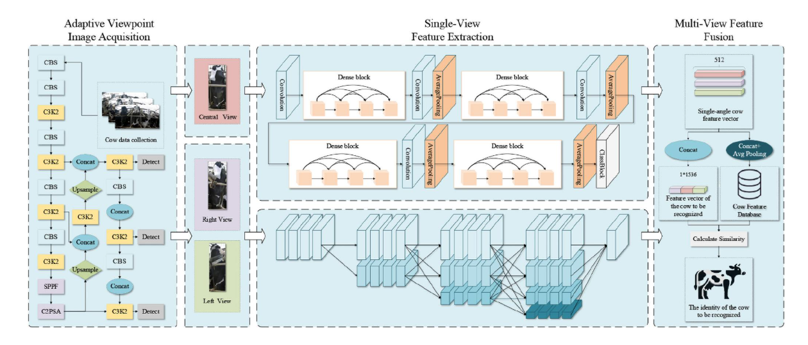
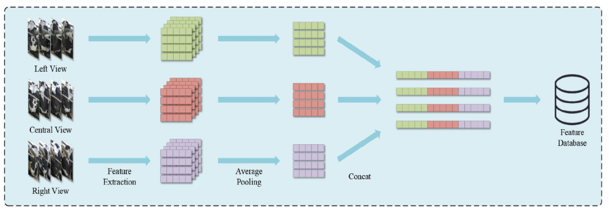
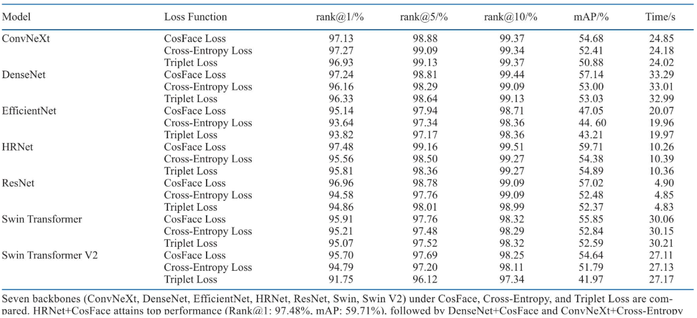
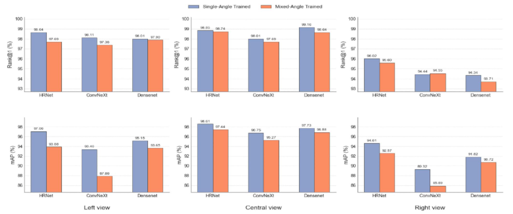

## 一种基于牛背部多视图特征融合的奶牛识别方法

### 引言

个体识别是现代精准奶牛养殖的基础，对于提高生产效率和保障动物福利至关重要。

通过将个体奶牛身份与产奶量、体细胞计数等关键生理和生产指标实时关联，农场管理者可以准确监测泌乳性能，从而为育种决策、淘汰策略和精准饲喂管理提供客观依据。

然而，挤奶环境由于其独特的操作限制，对个体识别构成了重大挑战。在挤奶场景下，牛的头部常被饲喂槽遮挡，使得基于面部的识别方法难以有效实施，而牛的侧腹也容易被相邻个体或设备遮挡。相比之下，牛的背部在整个挤奶过程中始终保持稳定且开阔的俯视视角，为高可靠性的视觉识别提供了理想的特征区域。

目前，基于背部视图的识别方法已展现出巨大潜力。

Mon 等人利用 YOLOv8 模型结合 VGG 特征和 SVM 分类器，在通道和挤奶厅中识别牛的背部，在多样的环境条件下实现了实时跟踪和识别。

Wang 等人（2024）提出了 LightCowsNet，一种基于现有轻量级骨干网络的新型网络。通过采用注意力机制、倒残差结构和深度可分离卷积，他们在公开的牛背数据集上实现了 94.26% 的准确率。

尽管这些研究验证了基于背部特征识别的可行性，但也揭示了单一视图方法的固有瓶颈。

为了克服单特征识别的局限性，多特征融合技术已广泛应用于奶牛识别领域，以增强系统的鲁棒性和准确性。

Bhole等人（2022）结合了RGB图像和热成像。通过采用晚期融合策略并利用CORF3D轮廓图，他们实现了荷斯坦奶牛的高精度识别，有效解决了纹理噪声的干扰。此外，针对多部位特征融合，Lu等人（2023）利用定位关键区域（LKA）模块融合了奶牛头部、躯干和全身的特征。该方法在不需要标注信息的情况下实现了高精度识别和细粒度特征提取。

为解决挤奶场景下的单视角识别问题，本文提出一种基于奶牛乳体背部多视角特征融合的奶牛身份识别方法。在挤奶位正上方安装摄像头，结合YOLO11n与ByteTrack进行奶牛检测与跟踪，提取背部中心、左侧、右侧三个视角的多视角数据。在混合角度数据上对比了HRNet（高分辨率网络）(Wang et al., 2021)、EfficientNet(Tan and Le, 2019)、DenseNet(Huang et al., 2017)、ResNet(He et al., 2016)、Swin Transformer(Liu et al., 2021)、Swin Transformer V2(Ze Liu et al., 2022)和ConvNeXt(Zhuang Liu et al., 2022)这7种网络的性能，并选取性能最优的3种网络作为单视角的候选特征提取网络。最后，将3个视角的特征向量（细节后续提供）进行融合，得到包含奶牛完整视角特征信息的特征向量，并与农场数据库中保存的特征向量进行匹配，旨在实现挤奶场景下奶牛身份的高精度识别。

### 数据收集与数据集构建

本研究使用的数据集取自中国山东省一家大型奶牛场的成年荷斯坦奶牛。选择该品种是因为其独特的黑白相间的斑驳体表花纹，为我们的视觉识别方法提供了天然的生物识别基础。从视频中，提取了关键帧并进行手动标注，构建了一个包含31,356张原始图像的多视角奶牛背部数据集。

为确保评估的独立于主体（或身份独立），我们根据牛的身份（ID）对数据集进行了划分，1,000头牛分配给训练/验证池，将954头牛分配给测试集。我们构建了2种类型的训练集以满足不同的实验需求。首先，为了评估单视图模型的性能，我们建立了一个单视图训练集。该数据集包含3个独立的子集（左、中、右视图），每个子集包含6,000张图像。其次，为了训练一个视图鲁棒性模型，将这3个子集合并形成一个混合视图训练集（总共18,000张图像）。训练池中所有1,000头牛的数据以5:1的比例分别划分为训练集和验证集，用于模型训练和超参数调优，未使用k折交叉验证。

在测试阶段，为了全面评估模型性能，我们还设计了单视角和混合视角测试集。单视角测试集包含3个子集：左侧（4,466张图像）、中央（4,444张图像）和右侧（4,446张图像）。混合视角测试集包含全部13,356张测试图像（来自954头测试牛）。在评估过程中，为了模拟真实世界的识别场景，我们采用了查询-图库协议（Chen H et al., 2023）。对于每个测试个体，从每个视角随机选择一张图像作为查询，而该身份的所有剩余图像则构成检索图库。

此外，为了专门挑战多视图融合算法，我们构建了一个单视图困难样本集。该数据集通过选择所有被单视图基线模型（DenseNet或HRNet）错误识别的个体来填充。该数据集包含85头独特的牛：68头被DenseNet错误识别，50头被HRNet错误识别，33头被两个模型错误识别。

### 识别方案

为解决单视角识别在处理牛体遮挡、姿态变化、污渍变化等问题时的局限性，本文提出了一种基于牛背部多视角特征融合的识别方法，对于待识别的牛，系统捕捉其通过摄像头下方的过程，并从3个视角提取图像及其对应的特征向量。然后将这3个特征向量进行拼接，形成待识别样本的融合查询向量。通过计算该融合查询向量与库中所有牛身份特征向量的余弦相似度，将与库中特征向量具有最高相似度的牛的身份作为最终识别结果。并通过实验验证了其在准确性和鲁棒性方面的优势。

本研究首先通过划分虚拟区域（中心、左侧、右侧）于挤奶台上方，并结合YOLO11n目标检测与ByteTrack跟踪算法，ByteTrack算法立即为每头检测到的牛分配了一个跟踪ID，确保了每头牛身份轨迹的连续性和唯一性，实现对奶牛进入不同区域时多视角背部图像的自动抓拍与分类。

相机的固定视场被水平地等分为左、中、右三个区域，每个区域对应一个特定的观测视角。对于ByteTrack持续跟踪的每一头牛，系统实时获取其检测框的中心点坐标。当跟踪的牛随着转盘移动，且其检测框中心点的x坐标进入左侧区域的范围时，系统自动将该牛在当前帧的图像标记为“左视图”并进行采集。当其继续移动，中心点x坐标进入中部区域时，系统将其标记为“中视图”并采集图像。最后，当其进入右侧区域时，即完成了“右视图”的采集。

为了获得同一头牛在不同视角下更稳定、更具代表性的特征，对身份特征库中同一头牛在同一视角下的所有图像特征向量进行了平均池化操作。该操作有效平滑了单张图像间的细微差异，降低了噪声的影响，并对信息进行压缩以提取该视角下的核心特征。

本文采用了特征拼接策略，将经过平均池化后的左、中、右三个视角的特征向量进行拼接，形成更全面的融合特征向量，作为图库中奶牛的身份特征。

基于识别任务的主要指标Rank@1准确率，HRNet在左侧（97.82%）和右侧（97.65%）视图上均取得了最高性能，而DenseNet在中心视图（98.03%）上表现最佳。因此，在后续的多视图特征融合框架中，选择HRNet作为左侧和右侧视图的主干网络，DenseNet作为中心视图的主干网络。

### Loss Functions

为增强模型在不同视角下表征单头牛个体特征的能力，本研究选取了3种具有代表性的损失函数进行对比实验，涵盖了传统的分类损失与先进的度量学习损失。

三元组损失（Triplet Loss）（Schroff et al., 2015）是一种经典的度量学习目标，用于鼓励模型学习一个嵌入空间，在该空间中，相同身份样本（正对）的特征距离相对于不同身份样本（负对）的特征距离被最小化。这是通过在训练过程中构建锚点-正例-负例三元组来实现的。

还采用了CosFace损失（Wang et al., 2018），这是基于角度裕度交叉熵损失的变体。它对特征和分类器权重进行了归一化，并在角度空间中引入了固定的余弦裕度，从而促进了更紧凑的类内分布和更分离的类间表示。该损失的公式如下：

### 评估指标

为了从多角度全面评估模型的识别性能，采用了以下评估指标。Rank@k 准确率衡量了在排序检索列表的 top-k 位置内出现正确身份的概率。其中 Rank@1 作为识别准确率的主要指标。平均精度均值 (mAP) 用于评估排序的整体质量，因为它联合考虑了完整检索列表中所有相关匹配项的精度和召回率；更高的 mAP 值表明检索性能更优。精度 (P) 量化了预测为正例的样本中真实为正例的比例，反映了预测的可靠性。召回率 (R) 衡量了所有实际正例样本中成功检索到的比例，表明了模型的覆盖范围或完整性。

如表3所示，HRNet与CosFace Loss的结合取得了最佳的整体性能，其Rank@1准确率为97.48%，mAP为59.71%，推理时间为10.26秒。DenseNet和ConvNeXt也展现了具有竞争力的识别准确率，其Rank@1得分分别为97.24%和97.27%。

相比之下，EfficientNet、Swin Transformer 和 Swin Transformer V2 在评估的各项指标上均未表现出明显的优势。值得注意的是，ResNet 结合 CosFace Loss 实现了最快的推理速度（4.90 秒）和可观的 mAP（57.02%），但其 Rank@1 准确率落后于性能最佳的模型。

单视图训练在 mAP 上的优势显而易见：对于 HRNet 和 ConvNeXt 在左视图上，以及 ConvNeXt 在右视图上，单视图训练分别将 mAP 提高了 3.18%、5.52% 和 3.43%。这些结果表明，视图特定的训练能够使模型更好地捕捉姿态和视角相关的特征，从而获得更鲁棒的检索性能。

为了严格评估多视图特征融合在牛身份识别中的有效性，我们比较了三种不同的融合范式：

（i）Uniform-DenseNet，它采用DenseNet作为所有3个视点（左、中、右）的共享骨干网络；

  (ii)Uniform-HRNet，其同样对所有视图使用HRNet；

  (iii)异构混合（Heterogeneous-Mix）方法，该方法利用了第3.3节中确定的特定于视角的最佳骨干网络——左视图和右视图采用HRNet，中心视图采用DenseNet。

除了整体度量外，我们还专门检查了一个困难样本子集，该子集被定义为在相应配置下被所有单视图模型错误识别的实例。此分析旨在量化在涉及遮挡、姿态变化或瞬态视觉干扰（例如，污垢或光照变化）的挑战性场景中，多视图融合所带来的鲁棒性提升。结果总结在表 4 中。多视图特征融合在所有实验配置中均能持续提升识别性能。所提出的Heterogeneous-Mix策略实现了最高的平均精度均值（99.83%），同时保持了Uniform-DenseNet达到的最高Rank@1准确率（99.69%），并成功纠正了88.00%–95.59%的单视图识别错误。融合策略在困难样本上显示出显著的收益。HeterogeneousMix 方法正确地重新识别了 50 个先前失败案例中的 47 个（恢复率为 94.00%），而 Uniform-DenseNet 恢复了 68 个中的 65 个（恢复率为 95.59%）。

本研究系统地证明了多视图特征融合在牛身份识别方面相对于传统单视图方法的显著优势。实验结果证实，尽管任何单个摄像机的视场都有限，但融合从三个互补视角（中心、左侧和右侧视图）提取的特征，与单视图基线相比，能够持续提高Rank@1准确率和平均精度均值（mAP）。