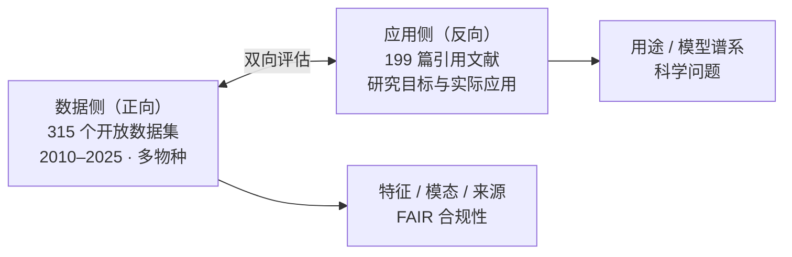
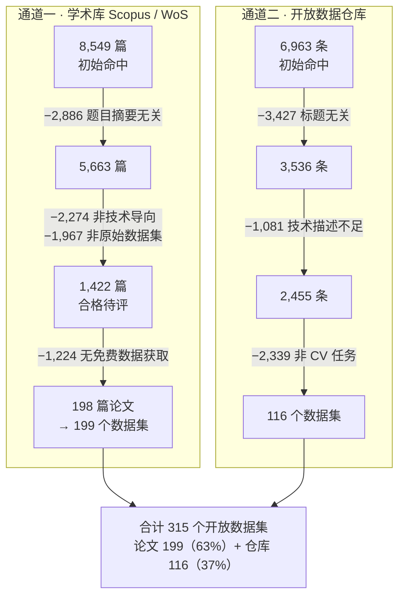

# 开放数据集与 AI/GenAI 驱动的精准畜牧计算机视觉：双向综述（Comput Electron Agric 2026）

> **双向（bidirectional）综述**：既盘点"有哪些开放数据集"（正向），又追踪"谁引用了它们、拿去做了什么"（反向）——把"数据集 → 应用"的完整链条打通。在 2010–2025 年间识别出 **315 个开放数据集**，并系统梳理非 AI / AI / GenAI 三条技术路线的替代关系。

> **与同目录 2025 综述的关系**：本文与《[精准畜牧养殖公开计算机视觉数据集系统综述（Comput Electron Agric 2025）](<精准畜牧养殖公开计算机视觉数据集系统综述 (Comput Electron Agric 2025).md>)》同选题、不同切口。Bhujel 2025 只盘点数据集本身（67 个，2015 年后），本文扩到 **315 个（2010 年起）**且**增加了引用侧分析**。两篇互补：2025 篇细，2026 篇广。

> ⚠️ **引用前必读**：本文存在多处**内部数字不一致**（BECA 数据集出现 29,000+ / 29,061 / 16,889 / 12,172 四个规模数字），且第 6 节标题为 "Benchmarking" 但**未做任何统一基准测试**。引用具体数字前请回查原始数据集，详见 §11 待核实清单。

---

## 1. 论文信息

| 项 | 内容 |
|---|---|
| 标题 | *Open Datasets and AI/GenAI-Driven Computer Vision for Precision Livestock Farming: A Bidirectional Review* |
| 作者 | Alexey Ruchay（通讯作者之一，RUDN 俄罗斯人民友谊大学 / 俄科院生物系统与农业技术联邦研究中心）、Vladimir Kolpakov（俄科院）、Hao Guo（中国农业大学土地科学与技术学院）、Andrea Pezzuolo（通讯，帕多瓦大学土地环境农林系） |
| 期刊 | *Computers and Electronics in Agriculture*（一区 TOP） |
| 卷期 | Vol. 250, Article 111917, 2026 |
| DOI | [10.1016/j.compag.2026.111917](https://doi.org/10.1016/j.compag.2026.111917) |
| 时间线 | 收稿 2026-03-21 / 修回 2026-05-08 / 接收 2026-05-17 / 在线 2026-05-22 |
| 类型 | Review Article，28 页，开放获取（CC BY-NC-ND 4.0） |
| 关键词 | Animal Housing / Open Data / Computer Vision / Artificial Intelligence / Generative AI / Large Language Models / YOLO |
| 资助 | 俄罗斯科学基金（RSF）项目 No. 21-76-20014 |

> 注：本文作者与同目录《[27个牛类公开数据集详细档案](27个牛类公开数据集详细档案.md)》中 Ruchay 系列 RGB-D 体尺数据集（CowDB / CowDatabase / CowDatabase2）的作者为同一人，文中多次自引。

---

## 2. 研究定位与三个目标

### 2.1 为什么要做这篇

此前 PLF 综述的两类局限（作者自述）：

1. **只比算法**：已有综述聚焦特定任务的模型性能（体重估计、行为识别等），对**公开数据集的元数据与分类体系覆盖不足**；
2. **缺跨物种对比**：近期综述开始指出家禽、反刍动物领域缺大规模开放数据集，但**跨物种的数据集可获取性全面对比仍然缺席**。

### 2.2 三个目标

- **① 系统识别与编目**：跨 Scopus / Web of Science 学术库与主要开放仓库，摸清 PLF 计算机视觉相关的开放数据集家底；
- **② 批判性分析**：数据集的特征、模态、来源分别是什么，判断"能不能用、怎么用"；
- **③ 细致审查引用文献**：逐一查谁引用了每个数据集，弄清 —— (i) 主要用途与应用；(ii) 所用模型谱系（传统非 AI / 常规 AI / 高级 GenAI）；(iii) 研究想回答什么科学问题。

### 2.3 "双向"到底指什么



**综合**：这个"双向"设计是本文相对其他 PLF 综述最主要的方法论差异，也是它能同时给出"数据现状诊断"和"应用现状诊断"的原因。

---

## 3. 方法（第 2 节）

> 注意：本节是**综述自身的方法学**，不是实验方法——全文没有训练、没有评测协议。

### 3.1 双通道检索策略

| 通道 | 来源 | 目标 |
|---|---|---|
| ① 学术库挖掘 | Scopus / Web of Science | 2010–2025 年**明确引入并验证过新 PLF 数据集**的同行评议文献；要求被 YOLOv8 / Faster R-CNN 等架构实证测试过 |
| ② 开放仓库收割 | Zenodo、Kaggle、GitHub、Figshare、Mendeley Data、Dryad | 可能未进同行评议的**独立数据产物或补充记录** |

**检索式**（作用于 title-abstract-keyword 字段）：

```
Bovine OR Cattle OR Calf OR Veal OR Beef OR Dairy OR Cow OR Calve
OR Pig OR Sow OR Swine OR Sheep OR Goat OR Horse OR Buffalo
OR Chicken OR Broiler OR Hen OR Poultry
```

**纳入标准**（三条硬性）：公开可获取（无需向作者申请）／出自 Scopus-WoS 索引的同行评议文献／已被 CV 应用实证验证。

**时间范围的特殊处理**：主范围为 2010–2025，但**2026 年的 'Early Access' / 'In Press' 论文也纳入，并在定量统计中一律计为 2025 年数据点**。

### 3.2 PRISMA 筛选流程

遵循 PRISMA 指南（Page et al., 2021），识别 → 筛选 → 纳入三阶段，两条通道各自出流程图（Fig. 1、Fig. 2）。



> ⚠️ **"−1,224 无免费数据获取" 是全文最能说明问题的一步**：1,422 篇合格研究中因拿不到免费数据砍掉 1,224 篇（约 86%，本笔记按 1,224 / 1,422 计算）。作者以此强调对 FAIR 原则（Findability / Accessibility / Interoperability / Reusability）的坚持。

> ⚠️ **数字瑕疵**：正文 2.1 明确写"最终纳入 **198 篇**"，而摘要与结论均写论文贡献 **199 个数据集**。两者差 1，合理推测是其中一篇论文提供了 2 个数据集——**但论文未说明**，属表述不一致，非数据矛盾。

### 3.3 三纪元分类框架

数据提取按**三个技术纪元**切分文献，这套框架在引言即已埋下伏笔，第 5 节正式展开：

| 纪元 | 数据集形态 |
|---|---|
| 非 AI | 专家主导的小规模基准 |
| AI | 大规模、人工核验的仓库，用于稳健 CV 训练 |
| GenAI | 靠 Recognition & Generation 模型与 Accelerated Data Engines **自动构建** |

作者自述目的：刻画一条从"劳动密集的人工挑选"到"模型驱动的高效工作流"的轨迹。

### 3.4 五簇 + 三亚簇（聚类分析）

**五个主题簇**（Table 1）：

| # | 簇 | 关联关键词（节选） |
|---|---|---|
| 1 | 个体识别与追踪 | 面部 / 鼻纹 / 虹膜生物特征、毛色花纹、耳标、Re-ID、多目标跟踪、2D/3D 定位 |
| 2 | 健康监测与疾病诊断 | 自动诊断、早期疾病检测、跛行与步态、粪便监测、乳房炎筛查、热成像健康评估 |
| 3 | 行为分析与福利评估 | 姿态活动分类（站/走/躺/采食/反刍）、饮水、社交与攻击交互（咬耳咬尾、爬跨）、发情监测 |
| 4 | 形态表型与生产指标 | 高通量表型、3D 形态重建、体况评分 BCS、自动体重估计、胴体与肌纤维分析 |
| 5 | 环境与遥感监测 | 舍内微气候（氨气、CO₂、温湿指数）、无人机牧场、卫星多光谱、资源分布制图 |

**三个技术子簇**（Table 2，簇 × 子簇层级矩阵）——映射"从原始采集到可行动智能"的数据演进：


设计意图（**综合**）：让低层 CV 任务（姿态分类、微气候监测）能直接挂到高层的福利与生产结果上，避免"一堆论文各说各话"。

### 3.5 数据提取与补充材料

正文只做**叙事综合**，每个数据集给一句简要描述（只保留物种、任务簇、关键技术指标）；全部技术细节放入**四个附件**（Elsevier 补充材料，2026-09-28 实测可直下，已存 `D:\tempc\QQ\`）：

| 文件 | 对应 | 类型 | 内容与结构 |
|---|---|---|---|
| `1-s2.0-S0168169926005120-mmc1.docx` | Annex 1 | Word（150 KB） | 论文来源数据集的**逐条自然语言详细描述**，按物种分节；每条含动物数、图像数、采集设备与分辨率帧率、光照条件、标注方式、应用目标、采集地点 |
| `1-s2.0-S0168169926005120-mmc2.docx` | Annex 2 | Word（47 KB） | 仓库来源数据集的同款详细描述（较简，因仓库本身元数据较少） |
| `1-s2.0-S0168169926005120-mmc3.xlsx` | Annex 3 | Excel（72 KB） | 论文来源**汇总表**，按物种分 5 个 sheet |
| `1-s2.0-S0168169926005120-mmc4.xlsx` | Annex 4 | Excel（35 KB） | 仓库来源**汇总表**，按物种分 4 个 sheet |

**直链**（`ars.els-cdn.com`，可绕过 DOI 跳转直接下载，把末尾文件名换掉即可）：

```
https://ars.els-cdn.com/content/image/1-s2.0-S0168169926005120-mmc1.docx
https://ars.els-cdn.com/content/image/1-s2.0-S0168169926005120-mmc2.docx
https://ars.els-cdn.com/content/image/1-s2.0-S0168169926005120-mmc3.xlsx
https://ars.els-cdn.com/content/image/1-s2.0-S0168169926005120-mmc4.xlsx
```

**两张汇总表的实际结构**（实测，论文正文未说明）：

| | Annex 3（mmc3.xlsx，论文来源） | Annex 4（mmc4.xlsx，仓库来源） |
|---|---|---|
| sheet 划分 | Beef / Dairy / Pig / Poultry / Others（**5 个**） | **Cattle** / Pig / Poultry / Others（**4 个**，牛不细分） |
| 列数 | 8 列 | 10 列 |
| 列名 | Dataset name with added article link、AI Task Category、Modality、Imaging environment、Dataset Size、Annotation、Applications、Web Link | 序号、Dataset name、AI Task Category、Modality、Imaging environment、Dataset Size、Annotation、Applications、Web Link、**Year** |
| 独有列 | 数据集名后直接带文献引用 | **多一个「Year」列**（发布时间）+ 序号列 |

> **牛只数据集在附件中的确切位置（共 3 张表）**：
> `mmc3.xlsx → Beef`（46 条）、`mmc3.xlsx → Dairy`（45 条）、`mmc4.xlsx → Cattle`（43 条），小计 **134 条**。
> 论文正文声称牛为 131（= 88 + 43），**差 3**，见 §11。
>
> ⚠️ **附表本身有两处质量问题**（2026-09-28 实测并修正）：① `Beef` / `Dairy` 中 **41 行**的 `AI Task Category` 与 `Imaging environment` 两列内容被**整列互换**（B 列装的是采集环境，D 列装的是任务类别）；② 跨行合并单元格导致 12 条 `env`、9 条 `size` 的**假缺失**。修正后 134 条字段零缺失，另发现 7 条含多个下载链接。
>
> → 已基于这 134 条完成 CowCV 检测视图硬约束的初筛，见《[CowCV 候选数据集初筛-Ruchay 2026 补充材料 134 条](<CowCV 候选数据集初筛-Ruchay 2026 补充材料 134 条.md>)》（结果：P0 11 / P1 31 / P2 36 / X 56）。

> ⚠️ **附件远比正文好用**：正文第 3、4 节只有汇总统计，附件才是**逐条可查、带原始网页直链**的清单。做数据集筛选时直接用附件，不要从正文反推。

---

## 4. 数据集盘点（第 3 节）

这是全文分量最重的一节（约 10 页），用**四个互补维度交叉切分**同一批数据集：何时发布、做什么任务、成熟到什么程度、体量多大。

### 4.1 时间趋势（3.1）

**按物种**（Fig. 4 论文来源 / Fig. 5 仓库来源）——每个物种讲一个"起步年份 → 2025 数量"的故事：

| 物种 | 起步 | 2025 数量 | 起点事件 / 代表数据集 |
|---|---|---|---|
| 奶牛 | 2015 | 14 | 唯一贡献者（2015–2018）；MMCOWS（多模态）、COLO（跨栏舍泛化） |
| 肉牛 | 2020 | 19 | 延迟爆发，近年数量超所有物种；BECA、CVB（502 片段） |
| 猪 | 2019 | 7–8 | 早期基准针对群养遮挡与光照变化；PigLife（22,000 猪实例，覆盖妊娠到育肥全阶段） |
| 家禽 | 2020 | 9 | BClayinghens（76.1 GB 可见光 + 热红外） |
| 其他 | 2015 | 13 | DORIS（放牧与捕食者检测，如狼） |

**仓库侧**（Fig. 5）：2020 年前几乎停滞（仅 2016 一个猪相关数据集）→ 2020 年 4 个 → 2021 年 8 个 → 2024 年 19 个 → **2025 年 64 个**（牛 26 + 猪 16 + 禽 10），比任何前一年翻三倍以上。

**来源拆分**（这是全文最常被引用的数字）：

| 物种 | 合计 | 论文 | 仓库 |
|---|---|---|---|
| 牛 | **131** | 88 | 43 |
| 猪 | 59 | 36 | 23 |
| 家禽 | 43 | 25 | 18 |
| 其他 | 82 | 50 | 32 |
| **总计** | **315** | **199** | **116** |

> 315 个中绝大多数发布于近五年，作者称之为"数据爆炸（data explosion）"。

**按应用**（Fig. 6）——五个簇各一条曲线，总数 1（2015）→ 59（2025）：

| 应用簇 | 2015 | 2025 | 备注 |
|---|---|---|---|
| 个体识别与追踪 | 1 | **37** | 绝对主导；2024 已达 30；被视为"所有其他 PLF 应用的基础层" |
| 健康监测与疾病诊断 | 0 | 7 | 模态多样：可见光 / 热红外 / 可穿戴 IMU |
| 行为分析与福利评估 | 1（2017 起） | 6 | CVB、CBVD-5 提供数千视频段 |
| 形态表型与生产指标 | 0（2018 起） | 6 | 3D 点云 + 多深度相机 + 全基因组关联数据 |
| 环境与遥感监测 | — | 3（预计） | Sentinel-2 多光谱 + 地面饲草采样点 |

**按技术**（Fig. 7）——三纪元的量化：

| 纪元 | 2015 | 关键节点 | 2025 |
|---|---|---|---|
| 非 AI | 1 | 2018 归零 → 2019 回升至 4 | 7 |
| AI | — | 2019 年 6 个（被 COCO / ImageNet 范式催化） | **49** |
| GenAI | — | **2023 年首次出现** | 3 |

### 4.2 数据集分类（3.2，Fig. 8）

不比数量了，改成**按物种说"重点押在哪些任务簇上"，每个论断挂一个具体数据集 + 具体数字**：

| 物种 | 重心 | 代表数据集与规模 |
|---|---|---|
| 乳用 | 个体识别追踪 + 健康监测 | CattleEyeView 30,703 俯视帧；MmCows 480 万高清帧 + 同步体温与产奶量；CBVD-5 206,100 图像；COLO 11,818 牛实例 |
| 肉牛 | 大规模识别 + 行为监控 | BECA 16,889 图像 / 5,661 头；CVB 标注 11 种视觉可辨行为；阿伯丁安格斯 3D 体模测体高胸围 |
| 猪 | 个体追踪 + 行为分析 | FaroPigReID-33 重识别 90.44%；2,000 万白天观测；HotPig（24 头猪，32 °C 热应激） |
| 家禽 | 偏健康、疾病诊断 | BClayinghens 61,133 多模态图像（鸡冠温度测病） |
| 其他 | 偏识别 | 奶山羊多尺度可变形 transformer 实例分割；CabriTrack 144 小时加速度计；Horsing Around 120 万样本 |

### 4.3 应用尺度分析（3.3，Fig. 9–10）

本节引入最有价值的分析角度：按**落地成熟度**分三档 —— **Research/Lab / Pilot Scale / Full Scale**。

**按物种**：奶牛偏 Research/Lab（21 个）；肉牛已转 Pilot（18 个）；**猪最特殊 —— Full / Pilot / Research-Lab 各 12 个，三项完全均衡**（高密度群养环境强需求推动）；家禽稳定在 Pilot + Lab，Full Scale 偏低；"其他"类 Lab 基础厚（31 个）但全量部署少。总体 **Research/Lab 主导，共 87 个**。

**按应用**：

| 尺度 | 各应用数据集数 |
|---|---|
| Research/Lab | 形态表型 35、个体识别 34、行为分析 32、健康监测 31 |
| Pilot | 形态表型 27、健康监测 26、行为分析 25、环境遥感 16 |
| Full | 个体识别 25、形态表型 23、行为分析 18、环境遥感 12 |

> **这组数据的潜台词**：CV 在实验室刷得很高（99.5%、100% 频频出现），但一进商业农场就掉 —— 多相机猪追踪的**相机交接准确率只有 74.0%**。这正是"实验 vs 真实"的落差所在。

### 4.4 规模与分辨率（3.4，Fig. 11–12）

- **目标数呈两极分化**：约 **83%（70/84）** 集中在最小的 0–18,000 区间，但存在长尾顶到 90,000–108,000。
  > ⚠️ 分母 84 与总量 315 对不上，疑为"论文来源中报了目标数的子集"，原文未交代。
- **存储与分辨率**：牛生物特征数据集达 2.29 GB；分辨率从 640×360 跃至 4032×3024，航拍 3000×4000。
- **分辨率收益有量化**：128×128 → 512×512 使分割精度 86.06% → 90.98%；关键点召回从 0.11（低分辨率）升至 0.66（480 px）。
- **高分辨率论文数**：1（2015）→ 预计 39（2025）；低分辨率 15、混合 9。
- **视频 vs 静态图**：视频多了时间维度，代表性内容稀疏，逐帧标注极其繁琐；**行为转换的时间边界**（如牛从吃草转到休息）让标注和模型收敛同时变难。

---

## 5. 数据集被拿去做了什么（第 4 节）

全文最长的一节（约 12 页），是"双向综述"的**反向落点**。组织方式按物种切五块，每块配一张格式统一的表（Table 3–7：`Species | Application | Model | Performance | Reference`），写法是**"一句话点题 → 按任务分段 → 3–5 个模型 + 性能数字 + 该模型的局限"**。

### 5.1 五物种任务侧重与代表指标

| 小节 | 任务重心 | 标志性数字 |
|---|---|---|
| 乳用牛 | 最全面：行为、识别、步态、生理、繁殖五条线 | 鼻纹 Wide ResNet50 **99.5%**；Holstein2025（YOLO11n 检测 0.995 AP + ConvNeXt-Tiny 97%）；CowXNet 发情 A1-score 91% |
| 肉牛 | 个体识别 + 体重体况 | VGG16_BN **98.7%**（28.3 ms 延迟）；LaWE 体重 97%（MAE 6.9 kg）；TimeSformer 五行为 90.33% |
| 猪 | 检测计数、姿态交互、生理估计、时序行为 | 同一 PigLife 上 TridentNet 从零训练 **mAP 37.2%** vs YOLO8-m 微调 **91.3%**；体重 MAE 3.263 kg（5.92 M 参数） |
| 家禽 | **疾病与病理诊断压倒性为主** | ConvNeXtV2 **98.97%**（超 ResNet-50 的 97.03%）；病毒分类 F1 **99.04%**；YOLOv8x recall 95.73% |
| 羊 / 山羊 / 马 | 品种分类、BCS、姿态与 3D 重建 | Goat-CNN BCS **97.94%**（参数比 VGG16 少 80%）；SheepNet CMC-1 97.22%；Horse-30（8,114 帧） |

### 5.2 值得单独记住的条目

**① 肉牛 · few-shot 迁移学习最有参考价值**
Shojaeipour 等人用深度迁移学习，**每头牛只需 5 张图就让 300 头达到 99.11%** —— 说明牛只个体特征的表征高度可迁移，对新品种 / 新牧场的冷启动有直接启发。但作者点明通病：这类生物特征模型**依赖高质量的正面或背面姿态**，放牧环境下难以稳定获取。

**② 肉牛 · 跛行是全节唯一"跌到及格线"的任务**
整节几乎所有任务都在 90%+，但基于视频姿态估计的跛行检测在 CowScreeningDB 上**只有约 69%**。原因：不同运动评分之间的步态差异太细微。说明**细粒度分级问题远未解决**。

**③ 猪 · 37.2% vs 91.3% 是全文含金量最高的对照**
同一数据集、同一任务，从零训练与多阶段微调差 **2.5 倍**。直接说明：在数据稀缺的农业场景里，**预训练权重与适配策略的重要性远大于架构本身**。

**④ 猪 · 教科书级的域偏移崩塌**
CNN-LSTM 做饲槽社交行为分类，随机验证 **0.968**，换到"跨饲槽（across-feeder）"场景后掉到 **76.6%**。

**⑤ 猪 · 咬耳检测精确率与误报率的取舍**
YOLOv4 + DeepSORT 咬耳 AP 98%，但跟踪导致 14% 误报；YOLOv7 AP 97.5%（推理更快），但误报率升到 34%。**这类"精度 + 开销 + 误报"三指标条目才真正有用。**

**⑥ 家禽 · 结构上和别的物种不同**
几乎所有高精度模型都指向疾病 / 病理诊断（肠道病、呼吸道、鸡冠颜色、视觉病理），而非行为或计数；数据集也最大（Y-BGD 用到 144,001 帧）。说明家禽 CV 是**诊断驱动**的领域。

**⑦ 其他 · 一条反直觉的工程结论**
作者在 4.5 结尾说：在 BCS 任务上系统评估后发现，**传统的重复卷积往往比 mobile / ghost 这类轻量模块更好地学到农业特定体态特征**。与"越轻量越好"的直觉相反。

### 5.3 本节的结构性问题（**综合**）

**所有 90%+ / 99% 的数字跨行都不可比** —— 每个数字都来自各自论文的**自报结果**，数据集不同、训练/测试划分不同、指标定义混用（precision / mAP / recall / AP / Accuracy 混着来），且无统一复现。

**真正可比的只有两处**（因为跑在同一数据集上）：
1. 猪：TridentNet vs YOLO8-m（PigLife 上 37.2% vs 91.3%）
2. 猪：TSM vs C3D（同一任务，96% mAP / 125 FPS vs 94% mAP / 65.67 M 参数）

**结论**：第 4 节是**强罗列、弱分析**，适合当索引，但不能当比较研究引用。

---

## 6. 三条技术路线（第 5 节）

引言与 3.1.3 埋下的三条方法线在此正式展开。每条的写法：原理特性 → 具体技术手段 + 案例数字 → 局限。

### 6.1 非 AI（确定性算法，吃物理与光谱特性）

| 技术子类 | 案例与数字 |
|---|---|
| 阈值分割 | 奶牛深度图在 HSV 空间取色相通道分离动物（图像特征与实际体重 **Pearson 相关 0.95**）；猪用 Otsu 自适应背景减除识别躺卧（**~95%**）；无人机手工阈值 + 图像差分判定活动 |
| 形态学 | 小目标移除 + 连通域标记做羊活重估计；分水岭算法分割多动物连通区（拥挤围栏计数关键步骤）；Blob 分析绵羊计数 **95.6%**，但处理不了严重前景遮挡；肉牛 8 位滤波做鼻纹，受控场景 **100%** |
| 几何建模与 3D | 点云滤波做牛体尺重建，**9 个维度误差 <3%**；白鸭胴体 5 部位像素面积法估重；CORF 模型用 push-pull 抑制提取抗毛发纹理噪声的轮廓图，用于挤奶出站识别 |

> **核心结论**：在强对比或高度受控环境里，确定性方法**能媲美学习模型**（鼻纹 90–100%、体尺误差 <3%），且完全绕过数据采集与标注。**它最适合环境变量能标准化的农场** —— 泛化不是它的目标，稳定才是。

### 6.2 AI（YOLO 家族 + R-CNN 统治）

| 任务 | 案例与数字 |
|---|---|
| 目标检测 | **YOLOv11n（2.6 M 参数）在自由栏舍基线只有 0.76 mAP@0.5**，且随相机角度剧烈波动；家禽 YOLOv8m 96.48%；猪的 Faster R-CNN / RetinaNet 在密集采食场景因遮挡漏检 |
| 识别与健康分类 | CattleFaceNet 91.35%；YOLO-ResNet 鼻纹 few-shot **99.11%**；DenseNet-121 猪分选 94.04%；CNN 红外热成像测病鸡 97% |
| 图像分割 | Mask R-CNN 分割奶牛轮廓做纵向体重预测 96%；肉牛平均像素精度 0.92；PigMS R-CNN（101 层 ResNet）分割群养猪 |
| 姿态估计 | SimCC-HRNet-W48 在牛 **0.90 AP**、羊 **0.94 AP**；BECA-L 追踪 103 头牛 5 个月 |
| 时序模型 | CNN-LSTM 奶牛行为 91%；23 层架构解码加速度计数据；STARFORMER 同时做分割 / 跟踪 / 动作识别 |

**局限清楚**：标注贵、跨农场泛化差、时序模型资源密集难上边缘。

### 6.3 GenAI（直击标注瓶颈）

| 方向 | 案例与数字 |
|---|---|
| 自动标注 | Accelerated Data Engine 整合 Grounding DINO + SAM，**人工量降 78.4%**（141 h → 30.5 h），多物种复杂环境保持 74.6–84.1%；猪的 CLIP-SAM / Grounding DINO-HQSAM 零样本分割 mAP **与全监督的 MViTv2 相当** |
| 生成式增强 | WGAN + ResNet 合成病猪样本；YOLOv8 + Mosaic 增强在家禽病理检测上 mAP50 达 0.988 |

**局限**：高遮挡场景（群养猪栏）细粒度细节仍弱，SAM 基方法有"每实例多掩码"问题。

> ⚠️ **术语警告（**推断**）**：本文的 "GenAI" 用得很宽泛，实际混进了两类东西 ——
> - **真·生成式**：GAN 合成样本、Stable Diffusion 生成姿态（输出是新内容）；
> - **严格说不属于生成式**：Grounding DINO + SAM 自动标注、CLIP-SAM 零样本分割（这些是**判别式**基础模型的零样本能力，输出是掩码和框，不是新内容）。
>
> 读的时候要自己把这个区分拎出来。对研究的影响：**"造数据"（合成，可能引入分布偏移）和"自动打标"（不改分布）的风险完全不同**。

---

## 7. 指标体系（第 6 节）

> ⚠️ **标题与内容不符**：本节名为 "Performance Analysis and **Benchmarking**"，但**论文未做任何统一基准测试** —— 没有重跑任何模型、没有横向复现任何数据，只是"统计大家都在用什么指标"。
>
> **正确定位是"指标使用情况综述"，不是 benchmark**。这也是全文数据可比性问题的根源：第 6 节本应承担"统一评测"职责，却只做了指标盘点。**引用本文时不能把它当 benchmark 来源。**

| 任务类型 | 主流指标 | 代表数字 |
|---|---|---|
| 分类 / 诊断 | precision、recall、ROC、accuracy | 家禽 Vision Transformer **97.62%**（超传统 CNN）；肉类腐败二分类 92.3%（受缺气候元数据拖累）；块状皮肤病用 ROC 曲线 |
| 目标检测 | mAP、IoU、Average Recall | YOLOv5m 野生动物 **98.90%**（mAP@0.5）；单峰骆驼精确率 97.1%；**mAP@0.5:0.95** 用于防过度计数；CherryChèvre 用不同目标尺寸的 Average Recall |
| 行为与福利 | sensitivity、specificity、Kappa | 猪用 Kappa 对齐加速度计与多农场视频标注；奶牛报 macro-averaged sensitivity 保持类间等权重；牧场牛用 F1-confidence 曲线；BECA 达 mAP@0.5 **99.34%** 且高光照对比下稳健 |
| 架构横评 | accuracy + 参数量 + 延迟 | VGG16 96.80% 但参数大不利边缘；ViT 克服 CNN 卷积核尺寸限制；Goat-CNN 层次化提取优于 mobile / residual；EfficientNetV2B0 96.98% 且延迟显著更低 |
| 领域专用 | PCK、Jaccard Index、MCC、F-score | PCK 按边界框对角线缩放误差阈值，保证尺寸无关评估 |
| 硬件部署 | FLOPs、处理时间 | 多生物特征识别必须优先低延迟以支持边缘实时 |

**需要注意的内部重复**：本节数字与第 4 节大量重复（VGG16 96.80%、EfficientNetV2B0 96.98%、BECA 99.34% 都是原样搬来），基本是同一批结果的重新组织。

---

## 8. 挑战（第 7 节）

开篇立总纲：前景很大（动物福利、生产力、环境可持续三者兼顾），**但能否兑现取决于四件事 —— 数据集规模、可获取性、质量评估、更广义的"数字足迹"**。

### 8.1 数据规模与可获取性（7.1）

写法是"**每个痛点配一个数字**"：

| 痛点 | 具体数字 |
|---|---|
| 算力门槛 | 先进 YOLO / DETR 变体内存需求**可超 24 GB VRAM**，构成财务与后勤障碍 |
| 标注成本 | **MS COCO 光是创建目标实例标签据称就要 70,000+ 工时** |
| 可获取性 | **只有少数研究者公开**自己的检测 / 跟踪数据集；即便公开，通常也只覆盖**单一猪舍或围栏** |
| 数据请求 | 研究者不回应数据可用性请求，实质阻断跨研究比较 |
| 训练样本量 | **多数模型只用单一农场的有限案例开发，有些研究只涉及 5 头牛** |

**制度性困境**：标注量与标注可靠性不可兼得 —— 多评估者能提高可靠性，但受人员与时间限制，同期能标完的数据集更少。结果是**大量研究依赖单一评估者标注、且不报告信度**。

**解决方案**：
- **Accelerated Data Engine**：零样本初标注 + 人工审核，**141 h → 30.5 h**（省 78.4%）
- **边缘计算**：嵌入式设备直跑 ML，**电池寿命比云端方案提升 1000 倍**；训练后全整数量化让内存占用低至 **2 kB**、功耗量级 **200 nW**，同时保持 95%+ 准确率
- **协作仓库**：Aerial Wildlife Image Repository、CowScreeningDB 提供跨组汇集平台（含可删减隐私敏感信息的标注工具）
- 合成数据生成（GAN）引入不同气候与光照，提升鲁棒性与泛化
- 集成模型架构 / scale-out（多模型协同），缓解"加新动物类别需完全重训"的扩展性问题

### 8.2 数据质量评估与标注挑战（7.2）

- **标注主观性**：家禽呼吸监测中，**三位专家同时考虑全部标注时的最高一致性只有 28.79%**
- **对冲手段**：设置**两周"洗脱期"**后，肉类腐败分类达 **Fleiss' Kappa 0.87**
- **自动视频分析也不完美**：4,154 次采食器访问中 47 次未被检测到（数据错误 + 文件损坏）
- **公共仓库质量参差**：Roboflow 等常有边界框不准确（目标被裁剪或融合）
- **资源受限时的取舍**：有些项目主动"要量不要准"，靠单人视觉检查减少标签歧义

**未来方向是人机分工的重新划分**：
- 多步质控（文件完整性 + 元数据验证）后才入库
- 众包升级为**资格制** —— 只在测试对上达到 100% 准确率的工人才授予"lameness hero"资格
- **核心转变：`human-in-the-loop` 让专家从"单调标注"转向"数据集审核"**，人工只修复杂场景
- 开源平台（如 Animal Video Analysis Tool）促进多模态标注的专业输入；畜牧专家跨学科验证确保类别标签在多种数字格式中位置正确

> ⚠️ 一句非常实用的提醒：**细微细节（比如训练采样器的选择）能显著改变模型的真实世界效能**。

### 8.3 数字足迹与伦理考量（7.3）

**核心判断**：数字足迹的形态变了 —— **从"群体聚合观察"转向"颗粒化的个体中心记录"**。YOLO + DeepSORT 给每头动物分配唯一 ID，鼻纹生物特征、粪便影像等进一步拼出**一头动物生命周期的完整数字画像**。

随之而来三组张力：

1. **技术 vs 现实**：鼻纹上的稻草或苍蝇、动物运动噪声让真实部署中的生物特征验证受阻；电池寿命、数据传输、给野生动物安全佩戴传感器仍是难题
2. **识别 vs 法律**：自动识别引发**数据所有权**与**"生物特征能否作为牲畜验证的法律证据"**的争议；即便在研究中，也常需**畜群所有者明示同意**才能处理或发布数据
3. **精度 vs 动物福利**：非侵入相机陷阱数据量大到人工分析不经济；皮下传感器保真度高但侵入式测量**与福利目标本身冲突**。更微妙的是 —— **持续监控可能无意中改变动物的自然行为**，从而损害人口统计与行为学研究的完整性

**未来方向**：
- 多模态整合（温度、位置元数据 + 图像）已显示可把野生动物分类准确率**从 98.4% 提到 98.9%**
- GAN 合成数据提升跨气候鲁棒性；自主机器人做捕食者检测
- 焦点将转向**实时部署**与**面向农民的界面**，把复杂数字足迹转化为可行动的管理洞察

---

## 9. 结论与建议（第 8 节）

### 9.1 叙事部分

315 个数据集的盘点揭示了 PLF 的"关键成熟"，作者给出两个判断：

1. **从"物种专属的孤岛"转向"统一的、以数据为中心的生态系统"**；这些资源不再只是孤立任务的输入，而是**演变为 LLM 和视觉-语言框架的骨干**，能支撑整体畜群推理与预测性诊断
2. 标志着**从被动监测转向主动的、生成式时代**，高质量开放获取数据是"全球粮食安全与动物福利的**单一最有价值资产**"

> ⚠️ **两条批判性观察（**综合/推断**）**：
> - **"统一生态"与本文自己的数据矛盾**：第 3 节数据显示数据集**极度偏科**（牛 131 / 猪 59 / 禽 43 / 其他 82），且全文反复强调"缺乏标准化、公开可访问的基准数据集"。**数据集数量增长 ≠ 生态统一** —— 作者把"数据变多"读成了"数据变统一"，属叙事上的过度乐观。
> - **"单一最有价值资产"是修辞而非论证**，说服力靠气势不靠证据。

### 9.2 四条行动建议

| # | 建议 | 具体内容 |
|---|---|---|
| 1 | **建统一基准** | 迫切需要统一的、多物种、可复现的基准数据集，整合并扩展现有资源，覆盖多样农场环境与动物种群 |
| 2 | **加速数据集构建** | Accelerated Data Engine 等（用 referring / grounding 模型自动标注）在减少人工与时间方面潜力大 |
| 3 | **推开放科学** | 拥抱开放数据与开源原则，对促进协作、支持微调、促进模块化组件集成到分析管道至关重要 |
| 4 | **强化专业标注** | 持续需要专业的多模态标注（舍饲环境、动物状态、行为上下文），需用户友好工具与标准化方法 |

### 9.3 作者自述的三条局限

1. 分析仅限**英文**数据集与研究，可能排除非英语畜牧部门的相关区域发展
2. 仓库托管数据的**长期持久性与 FAIR 合规性仍然可变、难以随时间验证**
3. GenAI 快速演进，专门为合成数据生成设计的新数据集涌现速度**快于传统同行评议周期所能记录的速度**

> ⚠️ **作者回避了最根本的那条（**推断**）**：三条局限都是"我们没覆盖到某某范围"（语言、时效、持久性），但**第 6 节暴露的"所有数字均来自各论文自报、未做统一验证"这个更致命的方法学局限，结论里一字未提**。这是全文最应自省却回避的地方。

---

## 10. 与牛只检测研究（CowCV）的关联

> 关联对象：**CowCV**（牛只检测数据资源标准化与跨域迁移基准），当前检测视图共 14 个数据集 / 31,373 张，详见《[CowCV 候选数据集评估（边界框类）](<CowCV 候选数据集评估（边界框类）.md>)》与《[精准畜牧养殖公开计算机视觉数据集系统综述（Comput Electron Agric 2025）](<精准畜牧养殖公开计算机视觉数据集系统综述 (Comput Electron Agric 2025).md>)》附录 B。

### 10.1 作为候选池的价值

- **体量远超前作**：本文牛类 131 个数据集 vs Bhujel 2025 的 32 个，**候选池扩大约 4 倍**。对 CowCV 而言这是一份现成的**扩展候选清单**（尽管本文正文只给简表、详细信息在 Annex 1–4 补充材料）。
- **可能填补 CowCV 的域空白**：Bhujel 2025 已指出"热成像 / 红外数据集极少（牛类仅 3 个）"。本文牛类池更广，可重点筛查是否含新的红外 / 热成像源 —— 这对 CMBN、HCRD 等红外数据集参与的跨域实验是直接的补强素材。
- **"无人机高空航拍"这一档**：Bhujel 2025 附录 B 曾指出 CowCV 域标签体系缺该档。本文第 4 节明确列出 UAV-based LiDAR、AerialCattle2017、Cattle-counting 等航拍源，可作为该档的补充证据。

### 10.2 作为负迁移研究论据的价值

本文最有价值的地方在于它**提供了大量"分布偏移导致性能崩塌"的现成证据**，却**始终没有把它命名为负迁移（negative transfer）**：

| 证据 | 出处 | 说明 |
|---|---|---|
| 随机验证 0.968 → 跨饲槽 76.6% | §4.3 猪 | 同任务、换场景即崩塌 |
| TridentNet 37.2% vs YOLO8-m 91.3% | §4.2 肉牛（同 PigLife） | 预训练/适配 > 架构本身 |
| YOLOv11n 自由栏舍 0.76 mAP@0.5 | §6.2 | 与动辄 99% 的受控结果形成强烈反差 |
| 跛行检测仅约 69% | §4.2 肉牛 | 全节唯一及格线附近的任务 |
| "敏感于 blocking-by-time 验证" | §6.3 | 时间维度的分布偏移 |
| 受控 85% vs 不平衡条件显著差异 | §7 挤奶机器人场景 | 环境一变就掉 |

作者用的词是 "generalisation"、"domain shift"、"blocking-by-time" 等**分散说法**，从未聚合成"多源异构数据融合可能引发负迁移"这一命题。

> **选题立足点（**推断**）**：本文反复逼近"多源异构数据集融合的分布偏移风险"，却未正式提出。这意味着 CowCV 的定位不是"填补一个无人问津的空白"，而是 —— **给一个已被反复观察、却尚未被命名的现象，提供定义、度量方法与规避策略**。这是更强的 motivation 写法。

### 10.3 引用时的方法论警示

本文第 4 节的自报数字**不能直接作为 CowCV 的对比基线**，原因见 §5.3 与 §7。若要使用，须回到原始数据集 / 原始论文核对评测协议一致性。

---

## 11. 待核实清单

> 以下均为阅读中发现的**论文内部不一致或表述模糊**，引用前须回查原始出处。

- [ ] **BECA 数据集规模出现四个数字**：§3.1.1 "over 29,000 images" / §4.2 "29,061 annotated images"（BECA-D + BECA-L）/ §4.1.2 "12,172 annotated images over five months" / §3.2 与 §4.1 "16,889 images from 5,661 cattle"。四者关系（不同版本？训练/测试子集？笔误？）**论文未说明**。
- [ ] **198 篇 vs 199 个数据集**：§2.1 写"最终纳入 198 篇"，摘要与结论写论文贡献 199 个数据集。
- [ ] **"70 out of 84" 的分母 84**：与总量 315 对不上，疑为"论文来源中报了目标数的子集"，原文未交代。
- [ ] **第 6 节标题名不副实**：名为 Benchmarking，实为指标盘点，无统一基准测试。
- [ ] **两条通道的检索时间点未交代**：8,549 篇与 6,963 条分别是何时检索的？
- [ ] **"GenAI" 术语边界模糊**：混入 Grounding DINO、SAM、CLIP 等判别式基础模型（详见 §6.3 术语警告）。
- [ ] **第 7.1 与 7.2 节内容重叠**：边界框不准、专家一致性差、数据采集障碍等要点在两节重复出现，分节逻辑不清。
- [ ] **附件条数与正文统计对不上**（2026-09-28 实测补充材料）：`mmc3.xlsx`（Annex 3，论文来源）实际 **206 条** vs 正文声称 199（**+7**）；其中 Beef 46 + Dairy 45 = **91** vs 声称 88（**+3**）。`mmc4.xlsx`（Annex 4，仓库来源）实际 **116 条**，与正文完全一致。牛只总计实测 **134** vs 声称 131。差异来源未明，疑为表格含未纳入正文统计的条目（待逐行核对）。
- [ ] **分辨率 Fig. 12 的 "projected 39 by 2025"**：用了"预计"字样，实际值待核。

---

## 总结

一句话：**用"数据集 + 引用者"的双向盘点，把 PLF 的 CV 研究从"模型竞赛"重新描述为"数据竞赛"** —— 315 个数据集证明领域已从数据荒漠走向数据爆炸，但爆炸的是数量，不是多样性；三条技术线（非 AI → AI → GenAI）的替代关系清晰，可真正的硬伤（跨环境泛化、标注可靠性、商业落地）一个都没解决。

对做牛只检测数据工作的人，这份综述有两重价值：

1. **作为清单**：牛类 131 个数据集是比 Bhujel 2025（32 个）更广的候选池；
2. **作为靶子**：它**把负迁移的现象证据收集齐了，却没有给它命名** —— 这正是 CowCV 可以切入的位置。

但引用时务必记住：**它的数字是二手自报的、它的"Benchmarking"名不副实、它的内部数字有多处打架**。把它当**地图**用，不要当**标尺**用。

---

## 延伸阅读

- 同主题前作（细而窄）：*A systematic survey of public computer vision datasets for precision livestock farming*，Bhujel et al., Comput Electron Agric 229:109718, 2025 — 见同目录笔记
- 数据集池化负迁移：*Fusion or Confusion? A Look at Dataset Pooling for Infrared Object Detection*（CVPR 2025 PBVS Workshop）— 见同目录笔记
- 跨数据集泛化：同目录《[面向领域特定性下鲁棒的跨数据集目标检测泛化](面向领域特定性下鲁棒的跨数据集目标检测泛化.md)》
- Accelerated Data Engine 原始论文：Wu et al., 2024（本文 §4、§5.3、§7.1 反复引用的 78.4% 数据来源）
- FAIR 原则：Wilkinson et al., 2016, *Scientific Data*
- PRISMA 指南：Page et al., 2021, *BMJ*

---

*整理自 2026-09-28 与小0的对话，对话底稿为论文 PDF 全文（28 页）逐节精读。*

*证据分级说明：正文表格中的论文引用、规模数字、性能指标均为**事实**（可回溯至 PDF 原文）；"综合"标记的段落为基于单一来源的归纳；"推断"标记的段落为对话中的分析性判断，未经原文直接支持。所有"待核实"项见 §11。*
