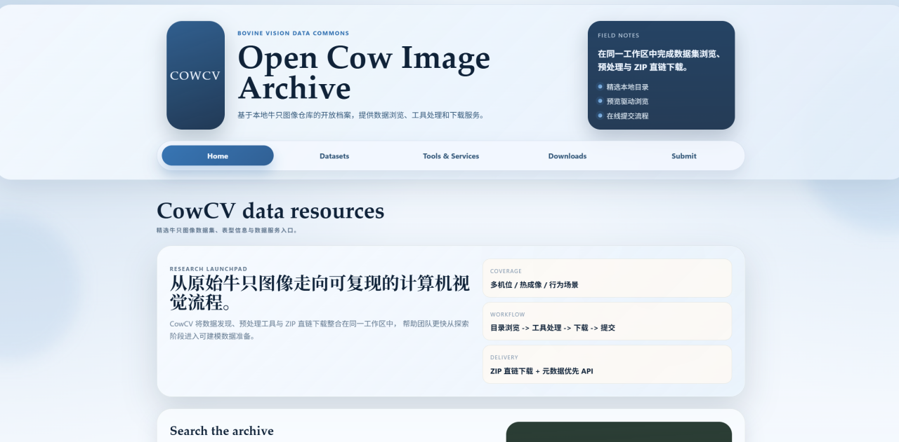
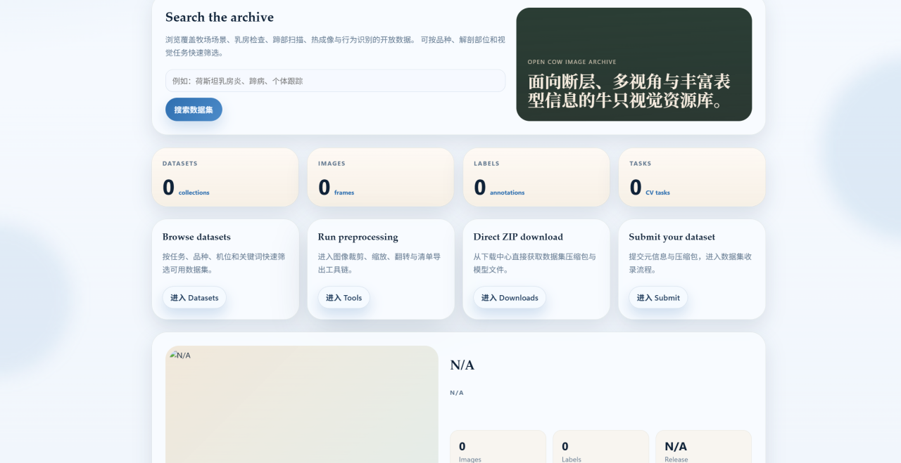
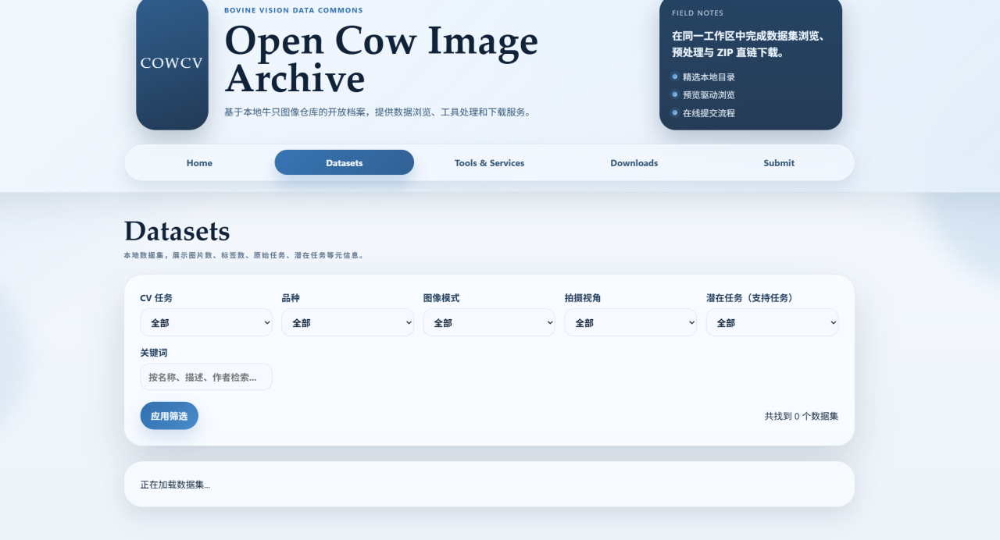
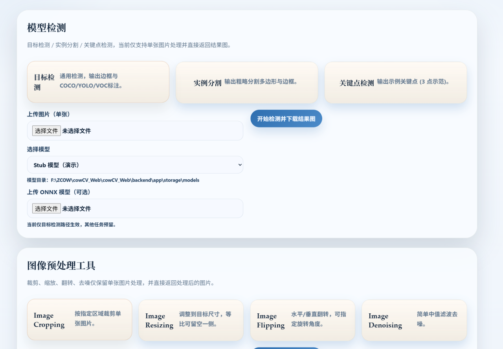

# CowCV：面向跨场景牛只目标检测的多源视觉数据资源、统一基准与在线平台

> 文章类型：数据资源与基准论文初稿  
> 当前版本：2026-07-20  
> 作者、单位、通信作者及目标期刊：[待补充]

## 摘要 (后续更新)

牛只目标检测是个体识别、行为分析、健康监测和精准养殖等智慧畜牧任务的基础。然而，现有牛只视觉数据通常分散在不同平台，采集设备、场景、拍摄视角、标注格式与类别定义差异明显，导致数据复用成本较高，也限制了检测模型在统一协议下的公平比较。为此，本文构建了 CowCV 多源牛只视觉数据资源与基准平台。当前基准工作集整合了14个具有代表性的牛只检测数据集，共包含31,373张图像，覆盖室内牛舍、户外牧场、俯视监控、鱼眼成像、红外或低照度以及互联网复杂背景等多种视觉域。针对 VOC XML、COCO JSON、CVAT XML、CSV 和既有 YOLO 标签等异构标注，本文建立了统一的单类别牛只检测表示；对于原始分割、姿态或其他任务标注不能准确表达整牛检测目标的数据，按照统一规范重新标注牛只边界框。随后通过类别合并、图片与标签配对、非法坐标检查、退化框清理和来源分组划分等步骤进行质量控制。

在基准实验中，本文首先采用统一配置的 YOLO11m 对14个数据集进行单数据集训练与验证。实验结果显示，不同数据域之间存在显著性能差异：CBPD_ODD 和 HCRD 的 mAP@0.5:0.95 分别达到0.9384和0.9327，而 COCO cow subset、8-calves 和 Google Open Images cow subset 分别为0.5175、0.5628和0.4562。Cows2021 与 Dairy Cow 在独立测试集上的 mAP@0.5:0.95 分别达到0.8629和0.8820，表明模型在对应数据域内具有较稳定的检测能力。与此同时，不同数据集之间的性能差异说明，单一数据域上的高精度不能直接代表面向未见场景的泛化能力。除数据整理与基准评测外，本文还开发了功能完整的 CowCV 数据门户，支持数据集检索、条件筛选、样本浏览、文件下载、数据提交、模型检测和图像预处理。CowCV 为牛只检测数据的标准化管理、模型复现和跨场景泛化研究提供了统一基础。

**关键词：** 牛只目标检测；智慧畜牧；多源数据集；数据标准化；基准评测；跨域泛化；CowCV

## 1 研究背景

大规模、集约化养殖在提高畜产品供给能力的同时，也对个体健康监测、精准饲喂、繁殖管理和动物福利提出了更高要求。传统人工巡检依赖养殖人员的经验，工作强度大且难以持续覆盖全部个体。精准畜牧业通过传感器、物联网和人工智能技术连续获取动物状态，为养殖决策提供客观依据。其中，计算机视觉具有非接触、可持续运行和易于复用既有监控设备等优势，已成为牛只自动监测的重要技术路径。相关牛只数据集论文通常也从这一应用需求出发：BECA 强调规模化肉牛养殖中的长期个体管理需求，8-Calves 将个体连续监测与疾病早期发现、采食分析及动物福利联系起来，COLO 则将牛只定位视为精准畜牧资源管理和健康监测的基础。[精准畜牧与动物视觉综述待补]

在牛只视觉分析流程中，目标检测负责确定图像或视频中牛只的位置，是个体识别、多目标跟踪、行为分析、姿态估计和体况评价等任务的上游基础。只有在复杂场景中稳定检出牛只，后续系统才能可靠地提取个体图像、维持运动轨迹并关联生产信息。现有检测方法主要包括以 YOLO、SSD 和 RetinaNet 为代表的单阶段检测器，以 Faster R-CNN 为代表的两阶段检测器，以及以 RT-DETR 为代表的端到端 Transformer 检测器。不同架构在检测精度、训练稳定性、推理速度和计算成本方面各有特点，因此仅使用一种模型难以全面说明数据集的有效性和适用范围。

近年来，面向牛只检测、识别和跟踪的视觉数据集逐渐增多，但各数据集通常针对某一种养殖环境或任务独立构建。[Cows2021](https://research-information.bris.ac.uk/en/datasets/cows2021-dataset) 以荷斯坦奶牛视频为基础，为检测与个体识别研究提供了身份关联数据；BECA 包含多品种肉牛图像以及跨月连续跟踪子集，并进一步提供定向边界框和关键点标注，强调长期识别、姿态变化和背部视角下的目标重叠问题；[8-Calves](https://arxiv.org/abs/2503.13777) 聚焦室内饲喂过程中频繁且严重的遮挡、快速运动和时间连续性，并通过大规模模型测试说明细粒度定位与身份保持仍具有挑战。

不同采集系统也带来了显著的视觉域差异。[COLO](https://arxiv.org/abs/2407.20372) 专门考察室内牛舍中相机视角与光照变化对牛只定位模型泛化能力的影响，指出同一模型在侧视、俯视和不同照明条件下可能产生明显性能差异；[MooTrack360](https://openaccess.thecvf.com/content/WACV2026/html/Christiansen_MooTrack360_A_Novel_Fisheye_Camera_Dataset_for_Robust_Multi_Diary_WACV_2026_paper.html) 使用顶部鱼眼摄像头记录密集奶牛群体，覆盖鱼眼畸变、视场重叠、白天到红外辅助夜间成像及目标遮挡；XGain 则补充了户外牧场俯拍和行为标注场景。这些数据共同表明，牛只视觉模型需要面对视角、光照、设备、背景、目标密度、品种与生长阶段等多种变化。

尽管已有数据集各具特色，现有资源仍呈现明显的分散与异构特征。首先，不同数据集分别发布在机构网站、通用数据平台或论文附件中，研究者难以快速发现和比较。其次，原始标注包括 VOC XML、COCO JSON、CVAT XML、CSV、旋转框、关键点及不同版本的 YOLO 格式，类别体系还可能混合整牛、身体部位、行为和个体身份。再次，部分研究仅在单一数据集的随机划分上报告结果；当连续视频帧、同一牛只的多视图图像或同源增强样本跨越训练集与测试集时，容易高估模型的实际泛化能力。

其他数据集论文的背景部分通常在指出真实场景困难后，通过多模型基准证明数据集价值。例如，8-Calves 对 YOLO 与 Transformer 系列共28种检测器进行测试，HBID24K 对10种目标检测模型进行比较，COLO 则围绕模型复杂度、视角和光照条件分析泛化表现。这类设计说明，数据集论文不仅需要描述数据规模和标注流程，还应通过具有代表性的模型体系揭示数据难度、架构差异和潜在应用边界。

基于上述问题，本文构建 CowCV 多源牛只视觉数据资源、统一目标检测基准与在线数据门户。CowCV 将分散数据纳入共同组织框架，以单类别 `cow` 作为当前检测基准的共享语义，同时保留原始行为、关键点和身份信息。本文现阶段报告已完成并复核的 YOLO11m 基线；后续将在相同数据版本、划分和评价指标下加入 RT-DETR、Faster R-CNN、SSD 和 RetinaNet，形成覆盖单阶段、两阶段与 Transformer 架构的多模型基准。

本文的主要贡献如下：

1. 整合14个牛只目标检测数据集，形成包含31,373张图像的多源基准工作集，覆盖室内、室外、普通透视、俯视、鱼眼、红外和互联网复杂背景等多种场景。
2. 建立面向整牛检测的统一标注规范：对可用检测框进行结构化转换，对原始分割、姿态或其他任务标注不适合目标检测的数据重新标注整牛边界框，并通过类别修正、配对检查、坐标检查和来源分组划分提高数据一致性与评测可靠性。
3. 建立包含多维域标签的统一评测协议，现阶段完成 YOLO11m 单数据集基线和独立测试集评估，并为后续 RT-DETR、Faster R-CNN、SSD、RetinaNet 以及单源跨域、多源留一域泛化实验提供共同参照。
4. 开发 CowCV 数据门户，将数据发现、元信息浏览、下载、提交、模型检测和图像预处理工具整合到同一平台，提高牛只视觉数据的可发现性、可访问性与可复用性。

## 2 相关工作

### 2.1 牛只视觉数据集

牛只视觉数据的发展大致经历了从单一检测或个体识别数据，向视频连续监测、长期重识别和多任务标注扩展的过程。早期资源主要利用荷斯坦奶牛稳定的黑白花纹和俯视图像开展非接触个体识别；随后，研究逐步引入连续视频、行为标签、关键点、实例分割和跟踪身份，以支持更完整的精准畜牧视觉分析。表1总结了与 CowCV 定位密切相关的代表性公开数据集，其中既包括当前已经收集的数据，也包括仅用于文献对比的外部数据集。表中规模按照原论文或官方数据页面记录，未必等同于 CowCV 当前实际纳入训练的子集规模。

**表1 代表性牛只视觉数据集及其任务特点**

| 数据集 | 年份 | 原始规模 | 采集视角与场景 | 主要标注与任务 | CowCV当前是否已收集 |
|---|---:|---|---|---|---|
| [OpenCows2020](https://doi.org/10.5523/bris.10m32xl88x2b61zlkkgz3fml17) | 2020 | 46头荷斯坦奶牛 | 牛舍俯视、开放牛群 | 检测定位、个体识别 | 否，仅作为相关工作引用 |
| [Cows2021](https://arxiv.org/abs/2105.01938) | 2021 | 10,402张RGB图像、301段视频 | 牛舍俯视、同一牛群连续视频 | 定位框、身份、视频自监督识别 | 是：`Cows2021 Database.zip` |
| [CattleEyeView](https://arxiv.org/abs/2312.08764) | 2023 | 30,703帧、14段视频、753个俯视牛只实例 | 6个品种、顶部视角、通道场景 | 身体与头部框、计数、跟踪ID、24关键点、实例分割 | 否，仅作为相关工作引用 |
| [COLO](https://arxiv.org/abs/2407.20372) | 2024 | 1,254张图像、11,818个牛只实例 | 室内散栏牛舍、侧视与俯视、不同光照 | 轴对齐检测框 | 是：`COLO.zip` |
| [CBVD-5](https://doi.org/10.1038/s41598-024-65953-x) | 2024 | 107头牛、96小时、687段视频、206,100帧 | 7台监控相机、昼夜牛舍 | 个体框及5类行为 | 是：压缩包当前命名为 `CVBD.zip` |
| [8-Calves](https://arxiv.org/abs/2503.13777) | 2025 | 1小时视频、8头犊牛、超过537,000个身份框 | 室内饲喂、快速运动、严重遮挡 | 检测框、个体身份、连续跟踪 | 是：`8-calves.zip` |
| [BECA](https://www.nature.com/articles/s41597-025-06326-5) | 2025 | BECA-D：16,889张图像、5,661头牛；BECA-L：12,172张图像、103头牛、最长5个月 | 多品种肉牛、背部视角、长期连续采集 | 检测、定向框、姿态关键点、长期重识别 | 否，原下载源不可用，仅作为相关工作引用 |
| [XGain Cattle Behavior](https://doi.org/10.5281/zenodo.15688349) | 2025 | 12,578张人工标注图像 | 户外牧场、6米高俯拍、多天气 | YOLO检测框、3类行为 | 是：`XGain.zip` |
| [MooTrack360](https://openaccess.thecvf.com/content/WACV2026/html/Christiansen_MooTrack360_A_Novel_Fisheye_Camera_Dataset_for_Robust_Multi_Diary_WACV_2026_paper.html) | 2026 | 1,500张图像、102,747个实例及1小时跟踪视频 | 顶部鱼眼、密集牛群、白天与红外辅助夜间 | 检测框、行为状态、跟踪轨迹、相机标定 | 是：`MooTrack360.zip` |

从任务类型看，OpenCows2020、Cows2021 和 BECA 更关注个体身份及长期重识别，检测主要承担获取标准化个体图像的上游作用；CBVD-5 与 XGain 以行为识别为主要目标，同时提供可转换为牛只检测任务的边界框；CattleEyeView 将检测、计数、跟踪、姿态和分割统一到同一视频数据中；COLO、8-Calves 和 MooTrack360 则更加突出检测器在视角变化、遮挡、密集目标和鱼眼畸变条件下的性能。

这些数据集为特定任务提供了重要基础，但原始组织形式与类别体系并不一致。部分资源使用 VOC XML 或 COCO JSON，部分使用 CVAT XML、自定义视频标注或 YOLO 文本；轴对齐框、定向框、行为类别、关键点、个体身份和实例掩膜也常被混合存储。不同论文通常在各自的数据划分和模型配置下报告结果，因此表中的指标不能直接横向比较。

CowCV 的目标不是替代原始数据集，也不是将所有任务标签压缩为单一形式，而是在遵守原始许可证和引用要求的前提下，为共同的牛只目标检测任务建立统一索引、类别定义、标注来源记录、质量检查和评测入口。对于原始检测框语义与整牛检测一致的数据，CowCV 进行格式转换与复核；对于原始标注主要服务于分割、姿态识别、身体部位或其他任务，不能直接作为整牛检测标签的数据，CowCV 依据统一标注规范重新绘制牛只边界框。行为、身份、关键点、掩膜和跟踪信息仍作为扩展标注保留，以支持后续多任务研究。OpenCows2020、CattleEyeView 和 BECA 目前均未收集，只用于相关工作对比；它们不计入 CowCV 当前数据量和基准结果。

### 2.2 多源数据整合与跨域评测

目标检测模型在训练域与测试域分布一致时通常能够取得较高性能，但当牧场环境、相机设备、视角、天气或目标尺度发生变化时，性能可能明显下降。与通用目标检测数据相比，牛只数据往往具有更强的场景相关性，例如固定机位、连续视频帧、特定牛群和稳定背景，这使随机划分更容易高估模型的泛化能力。因此，除单数据集基线外，还需要建立能够描述真实部署差异的跨域评测协议。[领域泛化相关引用待补]

本文不将“一个数据集”简单等同于“一个域”。同一数据集内部可能同时包含白天与夜间、俯视与侧视、独立图片与连续视频帧等不同子域；不同数据集也可能共享相似的采集环境。本文对本地原始数据按文件序列和子目录进行分层视觉抽样，发现环境、视角、成像和数据来源需要分别记录。例如，Cattle Body Parts 以室内视频帧为主但混有少量户外网络图片，Dairy Cow 同时包含白天RGB与夜间灰度或红外辅助图像。因此，CowCV 从以下维度为图像建立多标签域描述：

| 域维度 | 计划使用的标签 | 主要影响 |
|---|---|---|
| 养殖环境 | 室内牛舍、半开放牛场、户外草场、开放网络混合场景 | 背景纹理、天气、设施遮挡与场景复杂度 |
| 拍摄视角 | 顶部俯视、高位斜俯视、地面侧视、多视角、鱼眼 | 目标形状、尺度、旋转角度与可见部位 |
| 光照与成像 | 白天RGB、人工照明、低照度灰度、红外辅助、混合成像 | 颜色、纹理、噪声和对比度变化 |
| 目标结构 | 单目标、稀疏多目标、密集多目标、犊牛、成年牛、多品种 | 遮挡程度、体型、纹理和目标间重叠 |
| 数据来源 | 独立照片、固定相机连续帧、网络抓取图片、合并或重复来源 | 样本相关性、背景多样性和数据泄漏风险 |
| 牛只属性 | 犊牛/成牛、荷斯坦/其他品种/混合品种 | 体型、毛色、纹理和生长阶段差异 |

基于视觉审核结果，当前14个基准数据集暂按七类粗域进行结果汇总：

| 粗域 | 数据集 | 主要共同特征 |
|---|---|---|
| D1 室内常规俯视 | Cows2021、8-calves | 固定顶部相机和连续帧；成年牛与犊牛、地面材质和密度不同 |
| D2 室内固定侧视/多视角 | COLO、HCRD | 室内牛舍固定相机；COLO包含侧视与俯视，HCRD为固定侧视RGB |
| D3 半开放牛场 | CID、Dairy Cow、NWAFU Cattle Dataset | 地面视角下的牛舍院落或受控场地；Dairy Cow另含昼夜成像 |
| D4 鱼眼密集目标 | MooTrack360 | 顶部鱼眼、强径向畸变和超密集目标 |
| D5 户外高位草场 | XGain | 户外草地、高位广角、小目标和大背景占比 |
| D6 开放网络图像 | animals_10、CImage、COCO cow subset、Google Open Images cow subset | 独立网络图片，背景、尺度、品种和构图变化大 |
| D7 混合来源 | CBPD_ODD | 室内视频帧为主，混有少量户外或网络图片 |

上述粗域仅用于汇总和可视化，不取代图像级多标签。特别是 D7 不能被解释为单一环境域；CID 的当前基准仅使用2,056张受控场地图像，原始 `yt_images` 视频截帧不纳入本轮训练；HCRD 本地原始目录仅发现固定侧视RGB `full photo`，因此不再将其标记为红外热像域。

域标签能够支持两种互补分析：一是以完整数据集为单位建立跨数据集矩阵，衡量不同数据源之间的迁移性能；二是以光照、视角或密度等因素为单位构造受控跨域实验，减少多个变化因素同时出现时对结论解释的干扰。

### 2.3 视觉数据平台

视觉数据平台承担数据发布、检索、预览、标注管理、格式转换和模型评测等功能，是连接原始图像资源与计算机视觉实验的重要基础设施。现有平台大致可以分为通用科研数据仓库、机器学习数据集社区、计算机视觉数据管理平台和领域专用数据资源库四类。不同类型平台解决的问题有所侧重，但尚难直接满足多源牛只视觉数据的统一管理与跨域评测需求。

| 平台类型 | 代表性平台 | 主要能力 | 用于牛只视觉研究时的局限 |
|---|---|---|---|
| 通用科研数据仓库 | [Zenodo](https://zenodo.org/)、[Figshare](https://figshare.com/) | 文件托管、DOI、版本发布、许可与引用信息 | 元信息结构面向通用科研资源，通常不统一记录视角、光照、品种、标注任务和检测协议 |
| 通用数据集与竞赛社区 | [Kaggle Datasets](https://www.kaggle.com/datasets) | 数据检索、下载、Notebook、讨论和竞赛 | 数据说明与质量依赖发布者，类别定义、目录结构、划分方式和许可证完整性不一致 |
| 机器学习数据集中心 | [Hugging Face Datasets](https://huggingface.co/datasets) | 数据集托管、在线预览、版本管理和程序化加载 | 强调统一访问接口，但不同牛只数据集的标注语义、质量记录和评测结果仍需使用者自行核对 |
| 计算机视觉数据平台 | [Roboflow Universe](https://universe.roboflow.com/) | 数据浏览、在线标注、预处理、格式导出和模型训练工作流 | 用户贡献数据的质量与授权条件存在差异，畜牧领域元信息和跨数据集基准并非统一要求 |
| 农业专用机器学习资源 | [AgML](https://github.com/Project-AgML/AgML) 等 | 汇集农业图像任务并提供数据加载和模型实验接口 | 覆盖作物、病害、杂草和动物等多种主题，对牛只检测的场景、身份、行为和域标签描述仍不够细化 |

通用平台首先解决“数据在哪里”和“如何下载”的问题，但多源视觉研究还需要回答“标注是否可比较”“数据是否经过复核”“训练与测试是否存在泄漏”以及“模型在哪些域上失效”等问题。对于牛只视觉数据，仅提供图像与压缩包并不足以形成可靠基准，还需要同时管理以下信息：

1. **数据来源与许可**：记录原论文、下载地址、许可证、可再分发范围和引用要求。
2. **采集与域元信息**：记录品种、生长阶段、室内或室外环境、相机类型、拍摄视角、光照、目标密度和图像来源。
3. **标注语义与处理历史**：区分原始检测框、行为标签、关键点、分割掩膜与重新标注的整牛框，并保留转换和人工复核记录。
4. **版本与数据划分**：记录图像和标签版本、训练/验证/测试划分、随机种子及按牛只、视频或相机分组的防泄漏策略。
5. **基准结果与复现材料**：关联模型配置、权重、评价指标、运行日志、域内结果和跨域结果，使数据集页面不仅展示资源，也展示可复现实验依据。

CowCV 在功能上借鉴通用视觉数据平台的检索、预览、下载和在线工具流程，但其定位是面向牛只计算机视觉的领域专用资源与评测平台。平台对当前20项已收集资源建立统一目录，并从中形成14个经过复核的目标检测基准数据集；同时记录原始任务与统一任务、标注来源、重新标注状态、场景与域标签、数据划分和模型结果。用户可以按照计算机视觉任务、品种、图像模态、拍摄视角、潜在任务及关键词筛选数据，也可以使用模型检测和图像预处理服务，并下载允许分发的数据集与模型文件。

因此，CowCV 与通用托管平台的差异不在于重复保存更多文件，而在于将分散资源组织为具有统一语义、质量记录和实验关联的数据体系。该设计使平台同时承担数据入口、标注规范载体和 Benchmark 发布界面的作用，为后续多模型比较、跨数据集矩阵和留一域泛化实验提供持续更新的基础。

## 3 CowCV 数据资源构建

### 3.1 当前收集范围与数据纳入原则

根据当前数据资源清单，CowCV 已收集20项原始资源：XGain、COLO、MooTrack360、8-Calves、PASCAL VOC cow subset、Holstein Cattle Recognition Images、CBVD-5（压缩包名为 `CVBD.zip`）、Cows2021、Dairy Cow、NWAFU Cattle Dataset、Cow-images、COCO 2017 cow subset、Google Open Images cow subset、CMBN、CID、Cattle Body Parts、AP-10K cow subset、Animals-10、Animal-Pose cow subset和 Animal Image Dataset (90 Different Animals)。这些资源并非全部进入当前基准，是否纳入取决于牛只图片规模、检测标注质量和场景适用性。

当前工作集优先纳入满足以下条件的数据集：

1. 图像中包含可用于牛只检测的完整或主要可见牛体目标。
2. 已提供语义合适的整牛检测框，或能够通过重新标注与人工复核获得可靠目标框。
3. 数据来源、许可证和引用信息可追溯。
4. 图像数量和场景信息足以支持基本训练或独立评测。

Google Open Images cow subset 虽然来源复杂，包含与养殖场图像差异明显的互联网场景，但其图片、标签、类别和坐标格式已经完成检查，因此本轮将其作为开放互联网域纳入单数据集基线。CMBN 由 NWAFU Cattle Dataset 与 Dairy Cow 整合而成，两套源数据已分别进入基准，当前不再重复训练。CBVD-5 已确认存在较大范围的漏标和不完整标注，现阶段暂不纳入基准；下一阶段优先对其逐图全面复核，补齐所有可见牛只标注，必要时重新标注整个数据集，并在完成目标覆盖率与标注质量复核后再决定是否纳入。AP-10K、Animal-Pose 和 VOC cow subset 等小规模资源可在后续作为未见域测试集，而不作为本轮主要训练数据。

### 3.2 当前基准工作集

当前14个数据集共包含31,373张图像，其中训练集23,851张、验证集4,971张、独立测试集2,551张。Cows2021 和 Dairy Cow 保留独立测试集，其余数据集当前报告训练/验证划分结果。

| 数据集 | 图像数 | 当前划分（train/val/test） | 主要场景或来源 | 当前检测类别 |
|---|---:|---:|---|---|
| animals_10 | 1,616 | 1,293/323/- | 互联网多样化背景 | cow |
| Cattle Body Parts（训练名 CBPD_ODD） | 365 | 292/73/- | 室内侧视视频帧为主、混有少量户外网络图片 | cow |
| Holstein Cattle Recognition Images（训练名 HCRD） | 1,063 | 851/212/- | 室内固定侧视RGB、栏杆遮挡 | cow |
| COCO cow subset | 1,720 | 1,376/344/- | 通用场景、尺度和背景差异较大 | cow |
| NWAFU Cattle Dataset | 1,878 | 1,503/375/- | 半开放牛舍与院落、地面侧视、多品种 | cow |
| Cow-images（训练名 CImage） | 176 | 141/35/- | 开放网络图片、户外/特写混合、多品种 | cow |
| CID | 2,056 | 1,645/411/- | 受控半开放测量区、单牛多视角 | cow |
| Cows2021 | 10,402 | 7,248/1,023/2,131 | 室内俯视走道、连续采集 | cow |
| Dairy Cow | 4,120 | 3,140/560/420 | 半开放牛场、白天RGB与夜间灰度/红外辅助 | cow |
| 8-calves | 900 | 700/200/- | 室内犊牛、遮挡场景 | cow |
| COLO | 1,004 | 803/201/- | 室内多角度、多光照 | cow |
| MooTrack360 | 1,500 | 1,200/300/- | 室内顶部鱼眼、强畸变、超密集牛群 | cow |
| XGain | 1,657 | 1,326/331/- | 户外草场、高位广角俯视、远距离小目标 | cow |
| Google Open Images cow subset | 2,916 | 2,333/583/- | 开放互联网图像、来源与背景复杂 | cow |
| **合计** | **31,373** | **23,851/4,971/2,551** | 多源异构场景 | cow |

### 3.3 标注标准化

CowCV 当前检测基准统一采用 YOLO 归一化边界框格式：

```text
class_id x_center y_center width height
```

所有数值均相对于图像宽高进行归一化，当前共同检测类别为 `0 cow`。由于原始资源的标注目标并不完全一致，本文将检测标签的构建方式分为三类：

| 原始标注情况 | CowCV 处理方式 | 处理原则 |
|---|---|---|
| 已提供语义正确的整牛检测框 | 使用结构化解析器读取 VOC XML、COCO JSON、CVAT XML、CSV 或 YOLO 标签，转换为统一格式并人工复核 | 只改变存储格式和类别编号，不改变原始目标语义 |
| 已有分割、姿态、关键点、身体部位或行为标注，但不适合整牛目标检测 | 依据统一的整牛检测规范重新绘制边界框 | 不直接将掩膜外接矩形、关键点包围范围或局部区域当作整牛检测标签 |
| 缺少可用检测标注 | 使用模型生成初始候选框，再由人工检查、修正漏标和误标 | 最终训练标签以人工确认结果为准，模型输出不直接进入基准 |

重新标注时，标注对象统一定义为图像中可辨认的完整牛体或主要可见牛体。对于遮挡或被图像边界截断的目标，边界框应贴合当前可见区域；不将头部、背部、腿部等局部区域单独作为 `cow` 类目标。原始分割掩膜、关键点、行为、身份和跟踪标注均保存在独立目录中，新建的检测标签不覆盖原始文件。正式投稿前还需补充每个数据集对应的标注来源、重新标注图片数量、标注人员数量和复核方式。

### 3.4 数据质量控制

质量控制包括以下步骤：

1. 检查图片与标签是否一一对应，并识别缺失标签、冗余标签和失效软链接。
2. 检查类别编号、字段数量、非数值内容、负值、零面积框和越界坐标。
3. 对转换或重新标注后的标签进行抽样可视化，核对目标框位置、目标完整性与类别语义。
4. 尽可能按牛只身份、视频、相机或原始图像来源分组划分，降低同源样本跨集合泄漏风险。
5. 保留原始数据和原始标注，只在独立训练视图中进行清理和转换，保证处理过程可追溯。

在新增数据处理中，COLO 删除了13个零宽退化框，MooTrack360 修正了2个轻微越界框；8-calves 排除了无检测标签的数据集说明图。XGain 的 UUID 原图及其 `_1` 变体被放入同一划分；MooTrack360 按相机或视频来源分组；8-calves 按采集时段与牛只来源分组。CID 本轮仅使用2,056张已标注图像，明确排除由原始 YouTube 视频截取的图像，避免将未纳入当前协议的数据来源混入训练。

2026年7月进一步对原始数据进行视觉域审核。审核确认 CID 的 `images` 与 `yt_images` 属于不同来源，CBPD_ODD 以室内视频帧为主但混有少量网络图片，CImage 更接近开放网络图像，NWAFU 更接近半开放牛场，HCRD 本地目录主要为固定侧视 RGB 图像而非热像数据。Google Open Images 中还发现少量疑似非牛、雕塑或目标过小的样本，正式跨域评估前需逐图复核类别和边界框语义。上述来源标签和视觉域标签将独立于统一的 `cow` 类别保存。

## 4 基准实验

### 4.1 实验设置

本文基于 Python 和 PyTorch，使用 Ultralytics 框架实现目标检测模型的训练与评估。主要实验在单张 NVIDIA A100-PCIE-40GB GPU 上完成，具体软硬件环境如表所示。

| 环境项目 | 配置 |
|---|---|
| 操作系统 | CentOS 7 |
| GPU | NVIDIA A100-PCIE-40GB |
| GPU 显存 | 40 GB |
| Conda 环境 | `ultralytics` |
| Python | 3.10.18 |
| PyTorch | 2.6.0+cu118 |
| CUDA 构建版本 | 11.8（PyTorch `cu118`） |
| Ultralytics | 8.4.92 |
| 基线模型 | YOLO11m |

所有单数据集基线均从相同的 YOLO11m 预训练权重开始训练，训练轮数为100，输入图像统一缩放至640 × 640，并采用单卡训练和自动混合精度。首批 animals_10、CBPD_ODD、HCRD、COCO cow subset、NWAFU Cattle Dataset 和 CImage 使用批大小16，后续实验主要使用批大小32。数据增强、优化器和学习率调度遵循对应 Ultralytics 训练配置，完整参数随各实验的 `args.yaml` 和训练日志保存，以支持结果复现。

表中“最佳轮次”依据 `results.csv` 中验证集 mAP@0.5:0.95 的最高值确定；Ultralytics 生成的 `best.pt` 按综合 fitness 保存，二者在个别实验中可能不对应同一轮次。由于各数据集采用官方划分或来源感知划分，单数据集结果主要用于衡量模型在各自数据域内的可学习性和定位能力。跨数据集结果将在后续使用冻结的统一测试集合单独报告，避免与域内验证结果混淆。

### 4.2 评价指标

本文采用 Precision、Recall、mAP@0.5 和 mAP@0.5:0.95 评价牛只检测性能。预测框与真实框之间的重叠程度使用交并比（Intersection over Union, IoU）衡量：

$$
IoU = \frac{|B_p \cap B_g|}{|B_p \cup B_g|},
$$

其中，$B_p$ 和 $B_g$ 分别表示预测框和真实框。在给定 IoU 阈值和置信度阈值下，满足类别一致、IoU 达到阈值且与真实框完成一对一匹配的预测记为真正例（True Positive, TP）；未能与真实目标正确匹配的预测记为假正例（False Positive, FP）；未被任何预测框正确检出的真实目标记为假负例（False Negative, FN）。目标检测通常不显式统计背景中的真负例（True Negative, TN），因此本文的检测评价主要基于 TP、FP 和 FN。

精确率（Precision, $P$）表示所有预测为牛只的检测结果中正确检测所占的比例：

$$
P = \frac{TP}{TP+FP}.
$$

召回率（Recall, $R$）表示所有真实牛只目标中被模型正确检出的比例：

$$
R = \frac{TP}{TP+FN}.
$$

平均精度（Average Precision, AP）由精确率-召回率曲线下的面积计算：

$$
AP = \int_0^1 P(R)\,dR.
$$

对于包含 $C$ 个类别的检测任务，平均精度均值（mean Average Precision, mAP）定义为各类别 AP 的平均值：

$$
mAP = \frac{1}{C}\sum_{c=1}^{C}AP_c.
$$

本文当前统一检测类别只有 `cow`，因此在固定 IoU 阈值下，mAP 与该类别的 AP 数值相同。mAP@0.5 表示在 IoU 阈值为0.5时计算的检测精度；mAP@0.5:0.95 则在0.50至0.95范围内以0.05为步长，对10个 IoU 阈值下的 AP 取平均：

$$
mAP@0.5{:}0.95 = \frac{1}{10}\sum_{t \in \{0.50,0.55,\ldots,0.95\}} AP_t.
$$

mAP@0.5 更侧重目标是否被正确检出，而 mAP@0.5:0.95 对边界框定位精度要求更严格。本文同时报告上述指标，以综合评价模型的误检、漏检和定位性能。

### 4.3 YOLO11m 单数据集结果

| 数据集 | 最佳轮次 | Precision | Recall | mAP@0.5 | mAP@0.5:0.95 |
|---|---:|---:|---:|---:|---:|
| CBPD_ODD | 83 | 0.9898 | 0.9783 | 0.9932 | 0.9384 |
| HCRD | 90 | 0.9876 | 0.9746 | 0.9916 | 0.9327 |
| Dairy Cow | 100 | 0.9956 | 0.9946 | 0.9949 | 0.8754 |
| CID | 75 | 0.9409 | 0.9562 | 0.9873 | 0.8731 |
| Cows2021 | 30 | 0.9751 | 0.9796 | 0.9916 | 0.8600 |
| XGain | 99 | 0.9796 | 0.9835 | 0.9941 | 0.8314 |
| CImage | 1 | 0.9076 | 0.8667 | 0.9210 | 0.7586 |
| NWAFU Cattle Dataset | 100 | 0.8763 | 0.8466 | 0.9131 | 0.7371 |
| animals_10 | 99 | 0.9027 | 0.7881 | 0.8703 | 0.6808 |
| MooTrack360 | 99 | 0.9474 | 0.9206 | 0.9684 | 0.6709 |
| COLO | 80 | 0.9175 | 0.8983 | 0.9537 | 0.6508 |
| 8-calves | 52 | 0.9628 | 0.9513 | 0.9764 | 0.5628 |
| COCO cow subset | 90 | 0.8079 | 0.7101 | 0.7749 | 0.5175 |
| Google Open Images cow subset | 89 | 0.8197 | 0.6529 | 0.7286 | 0.4562 |

YOLO11m 在 CBPD_ODD、HCRD、Dairy Cow、CID、Cows2021 和 XGain 上取得了较高的 mAP@0.5:0.95。CBPD_ODD 和 HCRD 分别达到0.9384和0.9327，说明模型在这两个数据域中能够同时获得较高检出率和定位精度。Dairy Cow、CID 与 Cows2021 的 mAP@0.5:0.95 均高于0.85，表明这些数据具有较稳定的域内基线。

8-calves 的 Precision 和 Recall 分别达到0.9628和0.9513，mAP@0.5 达到0.9764，但 mAP@0.5:0.95 仅为0.5628。这一差异表明模型能够正确发现大多数牛只，却在更严格 IoU 条件下难以保持精确定位，可能与遮挡、目标框定义或小规模数据有关。MooTrack360 包含鱼眼畸变和高密度目标，其 mAP@0.5 为0.9684，而 mAP@0.5:0.95 为0.6709，也体现了复杂几何条件对边界框精度的影响。

COCO cow subset 与 Google Open Images cow subset 的 Precision、Recall 和 mAP 均低于其他多数数据集。两者来源于通用场景或开放互联网图像，图像背景、目标尺度、内容类型和拍摄条件差异较大，因此比场景集中的养殖场数据更具挑战性。其中 Google Open Images cow subset 的 Recall 为0.6529，mAP@0.5:0.95为0.4562，在当前14项实验中最低，说明复杂来源显著增加了漏检和精确定位难度。CImage 虽然取得0.7586的 mAP@0.5:0.95，但最佳结果出现在第1轮，提示其176张图像的规模可能导致快速过拟合。后续应通过更小模型、早停和独立测试集进一步验证。

### 4.4 独立测试集结果

Cows2021 和 Dairy Cow 具有训练过程中未参与模型选择的独立测试集。其结果如下：

| 数据集 | Precision | Recall | mAP@0.5 | mAP@0.5:0.95 |
|---|---:|---:|---:|---:|
| Cows2021 | 0.9421 | 0.9937 | 0.9809 | 0.8629 |
| Dairy Cow | 0.9902 | 0.9870 | 0.9945 | 0.8820 |

两个模型在独立测试集上的 mAP@0.5:0.95 与验证集结果接近，说明其域内性能相对稳定。不过，这一结果仍不能替代跨数据集测试，因为独立测试集与训练集通常来自相同数据采集体系。

### 4.5 多模型对比设计与当前实验边界

为避免基准结论依赖单一检测器，后续实验将选择具有不同检测范式的代表性模型：

| 检测范式 | 代表模型 | 对比目的 |
|---|---|---|
| 单阶段检测器 | YOLO11m、SSD、RetinaNet | 比较实时检测能力、多尺度特征和类别不平衡处理策略 |
| 两阶段检测器 | Faster R-CNN | 评估候选区域机制在遮挡、密集目标和严格定位条件下的表现 |
| 端到端 Transformer 检测器 | RT-DETR | 评估端到端检测与全局关系建模能力 |

所有模型将使用相同版本的数据、相同的训练/验证/测试划分和统一的类别定义，并在同一测试集合上报告 Precision、Recall、mAP@0.5 与 mAP@0.5:0.95。模型训练轮次、预训练权重、输入尺寸和数据增强等配置将完整记录；同时补充参数量、FLOPs、推理速度和显存占用，以分析精度与计算成本之间的权衡。

本稿当前仅纳入已经完成并复核的 YOLO11m 结果。服务器上已有的部分 RT-DETR 实验尚未按照当前统一的数据版本、划分和评价协议完成复核，因而暂不引用。RT-DETR、Faster R-CNN、SSD 和 RetinaNet 将在全部测试完成且数据口径一致后加入正式结果表，本阶段不提前比较模型优劣。

### 4.6 跨域对比实验设计

跨域评测将使用冻结的数据划分，并保证同一牛只、同一视频、同一相机连续帧或同源增强图像不跨越训练集与测试集。计划开展以下四组实验：

1. **域内基线（In-domain）**：模型在同一域的训练集上训练，并在该域独立测试集上评估，用作跨域性能下降的参照。
2. **单源跨域（Single-source cross-domain）**：模型只在源域训练，直接在其他目标域测试且不进行微调，形成完整的源域到目标域性能矩阵。
3. **多源留一域（Leave-one-domain-out）**：每次将一个域完全留作未见目标域，使用其余域联合训练，评估多源数据对未知场景的泛化能力。
4. **受控因素迁移（Factor-controlled transfer）**：分别构造白天到夜间、普通透视到鱼眼、室内到半开放牛场、养殖场到互联网图像、高位草场到室内监控等对比。RGB与红外不作为 HCRD 的固定域标签，而应依据图像级或相机级元数据单独分析。

为避免大数据集淹没小数据集，多源训练将采用域均衡采样或限制每个域每轮参与训练的样本数。零样本跨域实验中不得使用目标域图像进行训练、超参数选择或早停；如后续开展少样本域适配，将与零样本结果分表报告。所有模型使用相同冻结测试集，并至少使用多个随机种子重复实验，报告均值和标准差。

跨域性能除报告 Precision、Recall、mAP@0.5 和 mAP@0.5:0.95 外，还将计算绝对泛化差距与相对性能下降：

$$
\Delta_{abs} = mAP_{ID} - mAP_{OOD},
$$

$$
Drop_{rel} = \frac{mAP_{ID} - mAP_{OOD}}{mAP_{ID}} \times 100\%.
$$

其中，$mAP_{ID}$ 为模型在源域或已见域测试集上的 mAP@0.5:0.95，$mAP_{OOD}$ 为其在未见目标域上的对应指标。最终同时报告平均跨域性能、最差域性能和各域性能下降，避免平均值掩盖模型在特定困难域上的失效。

跨域矩阵以14个数据集为行列建立完整的14 × 14单源迁移表；D1-D7仅用于对矩阵结果进行等权宏平均和分组解释。每个数据集的图像级域标签随结果一并保存，D7混合来源数据不得被解释为纯环境域迁移。

#### 4.6.1 Cows2021 单源零样本跨域实验

为在不重新训练模型的前提下先获得一组口径清晰的跨域结果，本文优先开展以 Cows2021 为唯一源域的零样本跨数据集测试。选择 Cows2021 的原因有三点：其一，该数据集是当前工作集中规模最大的单一来源数据集，包含10,402张图像；其二，其训练集、验证集和独立测试集已经按既有协议划分，可使用2,131张独立测试图像建立可靠的域内参照；其三，Cows2021 主要由室内俯视走道中的连续采集图像构成，与半开放牛场、昼夜成像、鱼眼密集场景、高位草场和开放互联网图像之间存在明确的视觉分布差异。

实验分别使用仅在 Cows2021 训练集上训练的 YOLO11m 与 RT-DETR-L 最佳权重，不进行任何目标域微调。两个模型首先在 Cows2021 独立测试集上获得域内结果，随后直接在其余13个数据集的冻结验证集上推理。目标域图像不得用于训练、超参数选择、早停、阈值搜索或权重选择；所有数据统一为单类别 `cow`，输入尺寸固定为640 × 640，评价代码、IoU范围和数据版本保持一致。目标域及其主要分布偏移如下：

| 目标域分组 | 数据集 | 相对 Cows2021 的主要变化 |
|---|---|---|
| D1近域俯视 | 8-calves | 同为顶部监控，但牛只年龄、稻草地面、目标密度和遮挡变化 |
| D2室内固定侧视/多视角 | COLO、HCRD | 视角、栏杆遮挡、牛舍布局和目标密度变化；HCRD为固定侧视RGB |
| D3半开放牛场 | CID、Dairy Cow、NWAFU Cattle Dataset | 室内通道到半开放院落或受控测量区，视角、品种和背景变化；Dairy Cow另含昼夜成像 |
| D4鱼眼密集目标 | MooTrack360 | 普通透视到顶部鱼眼、强畸变和超密集目标变化 |
| D5户外高位草场 | XGain | 室内俯视到户外高位广角，大背景和远距离小目标变化 |
| D6开放网络图像 | animals_10、CImage、COCO cow subset、Google Open Images cow subset | 固定养殖环境到开放背景、尺度、品种和构图变化 |
| D7混合来源 | CBPD_ODD | 室内视频帧为主但混有少量网络图片，来源差异与环境差异同时存在 |

除 Precision、Recall、mAP@0.5 和 mAP@0.5:0.95 外，针对每个目标域 $t$ 计算跨域保持率：

$$
Retention_t = \frac{mAP_t^{OOD}}{mAP_{Cows2021}^{ID}} \times 100\%.
$$

同时分别报告13个目标数据集的平均 OOD mAP、最差数据集 mAP、跨域保持率均值，以及按 D1-D7 粗域分组后的宏平均结果。由于不同目标数据集的图像数量差异较大，整体结果采用“先在每个数据集上计算指标、再对数据集等权平均”的宏平均方式，避免大数据集主导结论。YOLO11m 与 RT-DETR-L 的比较以相同目标域上的 OOD mAP、保持率和最差数据集表现为依据，而不只比较各自在源域验证集上的峰值。

实验结果按下表记录：

| 目标数据集 | 域类型 | YOLO11m mAP@0.5:0.95 | YOLO11m 保持率 | RT-DETR-L mAP@0.5:0.95 | RT-DETR-L 保持率 |
|---|---|---:|---:|---:|---:|
| Cows2021 test | 域内参照 | 待测试 | 100% | 待测试 | 100% |
| CID | D3半开放牛场/受控多视角 | 待测试 | 待计算 | 待测试 | 待计算 |
| Dairy Cow | D3半开放牛场/昼夜成像 | 待测试 | 待计算 | 待测试 | 待计算 |
| 8-calves | D1近域俯视/犊牛遮挡 | 待测试 | 待计算 | 待测试 | 待计算 |
| COLO | D2室内侧视+俯视/密集 | 待测试 | 待计算 | 待测试 | 待计算 |
| CImage | D6开放网络/多尺度 | 待测试 | 待计算 | 待测试 | 待计算 |
| HCRD | D2室内固定侧视RGB | 待测试 | 待计算 | 待测试 | 待计算 |
| CBPD_ODD | D7混合来源/室内视频为主 | 待测试 | 待计算 | 待测试 | 待计算 |
| NWAFU Cattle Dataset | D3半开放牛场/多品种 | 待测试 | 待计算 | 待测试 | 待计算 |
| XGain | D5户外高位草场/小目标 | 待测试 | 待计算 | 待测试 | 待计算 |
| MooTrack360 | D4室内鱼眼/超密集 | 待测试 | 待计算 | 待测试 | 待计算 |
| animals_10 | D6开放网络/混合场景 | 待测试 | 待计算 | 待测试 | 待计算 |
| COCO cow subset | D6开放网络/通用场景 | 待测试 | 待计算 | 待测试 | 待计算 |
| Google Open Images cow subset | D6开放网络/强异质 | 待测试 | 待计算 | 待测试 | 待计算 |
| **13域宏平均** | **OOD汇总** | **待计算** | **待计算** | **待计算** | **待计算** |
| **最差目标域** | **OOD下界** | **待计算** | **待计算** | **待计算** | **待计算** |

该实验回答的是“**仅在单一室内俯视数据上训练的检测器能否直接迁移到未见牛只场景**”，不将结果解释为完整的领域泛化排名。后续将在所有数据集冻结独立测试划分后扩展为完整的14 × 14单源跨域矩阵和多源留一域实验，并通过多个随机种子检验结论稳定性。

## 5 CowCV 数据门户

### 5.1 平台定位与界面设计

CowCV 数据门户以“Open Cow Image Archive”为界面主题，旨在把多源牛只视觉数据的发现、浏览、预处理、下载和提交集中到同一工作区。与通用数据托管平台相比，CowCV 重点呈现与牛只视觉研究直接相关的计算机视觉任务、品种、图像模态、拍摄机位、潜在任务和基准结果等元信息。

平台采用统一的顶部品牌区域和主导航栏。当前主导航包含 Home、Datasets、Tools & Services、Downloads 和 Submit 五个入口，对应“数据发现 → 数据查看与筛选 → 工具处理 → 文件下载 → 数据提交”的主要用户流程。首页首先说明平台定位和数据交付方式，再提供关键词检索、资源统计和主要功能入口。



*图1 CowCV 首页顶部区域、平台定位与主导航。*

### 5.2 首页检索与资源概览

首页检索框允许用户使用牧场场景、乳房检查、蹄部扫描、热成像、行为识别和个体跟踪等关键词查找数据集。统计区域计划动态展示已接入的数据集数量、图像数量、标注数量和计算机视觉任务数量；下方提供数据集浏览、预处理、ZIP下载和数据提交的快捷入口。



*图2 CowCV 首页的关键词检索、资源统计和快捷功能入口。截图采集时使用未加载目录数据的演示配置，因此统计值显示为0或N/A，不代表 CowCV 实际数据规模或功能完成度。*

### 5.3 数据集发现与条件筛选

Datasets 页面面向多源数据的快速发现。用户可以按照以下维度组合筛选：

1. **CV任务**：目标检测、实例分割、关键点检测、行为识别或其他任务。
2. **品种**：按荷斯坦牛或其他已记录品种筛选。
3. **图像模态**：RGB、红外、热成像或其他成像形式。
4. **拍摄视角**：俯视、侧视、正视、多视角或鱼眼。
5. **潜在任务**：根据数据现有内容判断还可支持的扩展研究任务。
6. **关键词**：按数据集名称、说明和作者信息检索。

筛选结果以数据集条目呈现，并进一步链接到详情页面。详情页用于展示数据集说明、图像样例、标注数量、原始任务、统一检测任务、来源、许可信息和可下载资源。该元信息体系也可与本文提出的域标签关联，使用户能够按照室内/室外、视角、光照、密度和数据来源选择跨域实验数据。



*图3 CowCV 数据集页面支持按任务、品种、图像模态、拍摄视角、潜在任务和关键词进行筛选。*

### 5.4 模型检测与图像预处理

Tools & Services 页面由模型检测和图像预处理两部分组成。模型检测服务支持目标检测、实例分割和关键点检测三类任务。用户可以上传单张图片、选择已有模型或上传 ONNX 模型，并下载带有预测结果的输出图。当前截图只展示了目标检测任务被选中时的界面，未覆盖实例分割、关键点检测及其他已完成功能。截图中的 `Stub 模型（演示）` 是采集截图时使用的演示配置，不代表正式模型服务尚未完成。

图像预处理模块支持单张图片裁剪、尺寸缩放、水平或垂直翻转和中值滤波去噪，处理完成后直接返回结果图片。该工具面向快速样本检查与轻量级预处理，不替代完整训练管线中的批量数据增强脚本。



*图4 CowCV 模型检测与图像预处理界面。截图仅展示目标检测任务的选中状态；平台同时提供实例分割和关键点检测服务。*

### 5.5 下载与数据提交

Downloads 页面用于集中展示可下载的数据集压缩包、单个资源文件和模型文件。对允许直接分发的数据，用户可以获取 ZIP 文件；对于存在许可证或用途限制的数据，正式部署时应增加许可说明和申请流程。Submit 页面允许研究者填写数据集元信息并提交压缩包，后端保存提交记录和文件，为后续人工审核、版本登记和目录更新提供入口。

### 5.6 系统架构与当前状态

CowCV 前端采用 React、Vite 和 React Router 构建，后端采用 FastAPI 和 Uvicorn 提供接口服务。平台使用关系型数据库管理数据集、资产、任务与提交记录，并在数据库目录为空时支持从本地媒体目录扫描数据。前端和后端可分别构建为 Docker 镜像，前端静态资源由 Nginx 提供，后端负责 API 与媒体访问。

```text
用户浏览器
    ↓
React/Vite 前端
    ↓ REST API
FastAPI 后端
    ├── MySQL 元信息目录
    ├── 本地媒体与模型文件
    └── 上传、提交及下载记录
```

CowCV 的页面功能、后端服务和本地联调已经完成，现有截图只展示了其中一部分页面及演示状态。截图中的0项数据、N/A条目和Stub模型来自未连接完整数据目录及正式模型配置时的截图环境，不代表对应功能尚未实现。当前主要困难集中在生产环境部署，包括大规模媒体文件挂载、数据库与环境变量配置、模型文件部署、反向代理、域名和HTTPS设置等。上述问题属于部署与运行环境配置，而不是网站功能缺失。正式论文应在生产环境完成数据同步后补充完整页面和真实统计截图。

## 6 讨论

### 6.1 多源数据整合的价值

当前工作集覆盖的视觉域具有明显互补性。Cows2021 和 8-calves 代表固定顶部监控下的室内俯视场景，但分别对应成年牛和犊牛；COLO 与 HCRD 代表室内固定侧视或多视角场景；CID、Dairy Cow 和 NWAFU 覆盖半开放牛场与受控测量区；XGain 提供户外高位草场的小目标场景；MooTrack360 引入顶部鱼眼畸变与超密集目标；COCO、animals_10、CImage 和 Google Open Images 则提供开放网络背景。CBPD_ODD 作为室内视频为主的混合来源数据，能够反映来源差异与环境差异叠加时的评测风险。这种多样性使 CowCV 不仅能够用于域内模型训练，也能够支持跨域泛化、数据集亲缘性和数据贡献度分析。

### 6.2 单数据集高精度的局限

本轮结果表明，多数数据集能够训练出较高精度的域内模型，但不同数据集的自测指标不可直接用于评价数据集优劣。固定相机、连续帧和单一背景会降低任务难度，而鱼眼成像、密集遮挡和互联网复杂场景会提高定位难度。此外，不同划分协议也会影响结果。因此，本文当前结果应被视为可复现的单数据集基线，而不是最终的跨域排名。

### 6.3 数据标准化中的风险

将多种原始类别统一为 `cow` 能够支持共同检测任务，但也会隐藏行为、身体部位和个体身份等细粒度信息。CowCV 在生成统一检测视图时保留原始标注，以便未来扩展多任务研究。对于许可证限制不同的数据集，平台还需要分别明确可下载范围、再分发条件和引用要求。

## 7 局限性与未来工作

当前研究仍存在以下局限：

1. 部分数据集缺少独立测试集，当前验证结果仍可能受到划分方式影响。
2. CBPD_ODD、HCRD 等数据集的场景元信息和完整标注统计仍需进一步核对。
3. 当前仅报告 YOLO11m 基线，RT-DETR、Faster R-CNN、SSD 和 RetinaNet 尚未完成统一协议下的全部测试，因此暂时不能判断结果是否依赖特定检测器架构。
4. 跨数据集矩阵、留一域评估和困难场景子集分析尚未在当前 YOLO11m 工作集上全部完成。
5. CowCV 网站功能开发和本地服务已经完成，但公网生产部署仍需处理大规模数据挂载、数据库配置、模型文件部署、反向代理、域名和HTTPS等环境问题。
6. CBVD-5 现有标注存在较大范围的漏标和不完整标注，尚未完成逐图全面复核或重新标注，当前不纳入基准结果。

后续工作将按照以下顺序推进：首先优先对 CBVD-5 逐图全面复核并补齐漏标，必要时重新标注整个数据集，同时冻结其他数据集的测试划分并补齐元信息与许可证记录；其次完成 RT-DETR、Faster R-CNN、SSD 和 RetinaNet 的统一训练与测试，并与 YOLO11m 进行公平比较；随后建立完整的 cross-dataset 和 leave-one-domain-out 评测矩阵，量化模型在未见域上的性能下降；最后完善 CowCV 的真实部署、下载审计、数据版本管理和基准结果页面。

## 8 结论

本文提出 CowCV 多源牛只视觉数据资源、目标检测基准与在线平台。当前工作集整合14个数据集和31,373张图像，通过统一类别、标注转换、质量检查和来源感知划分降低了多源数据复用与比较的成本。YOLO11m 基线结果揭示了不同牛只视觉域之间明显的难度差异，并为后续跨数据集泛化和多模型比较建立了可复现起点。CowCV 数据门户进一步将数据发现、元信息浏览、下载与基础工具整合到同一入口。随着 CBVD-5 标注全面复核或重标、RT-DETR、Faster R-CNN、SSD、RetinaNet 对比实验、留一域评估和平台部署的完成，CowCV 有望成为牛只计算机视觉研究中可持续扩展的数据与评测基础设施。

## 数据与代码可用性

- CowCV 网站地址：[待部署后补充]
- 代码仓库地址：[待补充]
- 数据集下载方式及许可证说明：[待补充]
- YOLO11m 训练配置、划分文件与结果文件：[整理后补充公开地址]

## 伦理与许可说明

本文使用的数据主要来自公开数据集及已有研究资源。正式投稿前需逐项核对原始许可证、再分发限制和引用要求。涉及真实牧场、研究机构或动物实验采集的数据，应补充原始数据集声明及相应伦理审批信息。本文不应在未获得授权的情况下公开受限制的原始图像或个人、机构敏感信息。

## 致谢

[项目来源、导师、合作单位、计算资源与数据集作者待补充]

## 参考文献

> 正式参考文献将在确定目标期刊格式后统一整理。以下条目仅作为当前写作占位，不应直接用于投稿。

1. Andrew, W., Gao, J., Mullan, S., Campbell, N., Dowsey, A. W., and Burghardt, T. Visual Identification of Individual Holstein-Friesian Cattle via Deep Metric Learning. *Computers and Electronics in Agriculture*, 185:106133, 2021. DOI: [10.1016/j.compag.2021.106133](https://doi.org/10.1016/j.compag.2021.106133).
2. Gao, J., Burghardt, T., Andrew, W., Dowsey, A. W., and Campbell, N. W. Towards Self-Supervision for Video Identification of Individual Holstein-Friesian Cattle: The Cows2021 Dataset. arXiv:2105.01938, 2021.
3. Ong, K. E., et al. CattleEyeView: A Multi-task Top-down View Cattle Dataset for Smarter Precision Livestock Farming. *IEEE VCIP*, 2023. arXiv:2312.08764.
4. Das, M., Ferreira, G., and Chen, C. P. J. A Model Generalization Study in Localizing Indoor Cows with COw LOcalization (COLO) Dataset. arXiv:2407.20372, 2024.
5. Li, K., Fan, D., Wu, H., and Zhao, A. A New Dataset for Video-Based Cow Behavior Recognition. *Scientific Reports*, 14, 2024. DOI: [10.1038/s41598-024-65953-x](https://doi.org/10.1038/s41598-024-65953-x).
6. Fang, X., Hannuna, S., Campbell, N., and Simpson, E. 8-Calves: A Benchmark for Object Detection and Identity Classification in Occlusion-Rich Environments. arXiv:2503.13777, 2025.
7. Zhang, Y., et al. BECA: A Computer Vision Dataset for Long-Term Recognition in Beef Cattle. *Scientific Data*, 2025. [Nature article s41597-025-06326-5](https://www.nature.com/articles/s41597-025-06326-5).
8. Benaissa, S., Maselyne, J., De Temmerman, P.-J., Coussement, S., and Vangeyte, J. Computer Vision Dataset for Detecting Cattle Behaviors in Pasture Environments. Zenodo, 2025. DOI: [10.5281/zenodo.15688349](https://doi.org/10.5281/zenodo.15688349).
9. Christiansen, R. G. K., Nguyen, T. V., Malskær, L. R., Bodenhagen, L., and Kraft, D. MooTrack360: A Novel Fisheye Camera Dataset for Robust Multi Dairy Cow Detection and Tracking. *WACV*, pp. 451-460, 2026.
10. NWAFU Cattle Dataset 相关论文。[完整信息待补]
11. Dairy Cow 数据集相关论文。[完整信息待补]
12. 牛只视觉检测与智慧畜牧综述。[待补]
13. 目标检测领域泛化与跨数据集评测相关研究。[待补]
