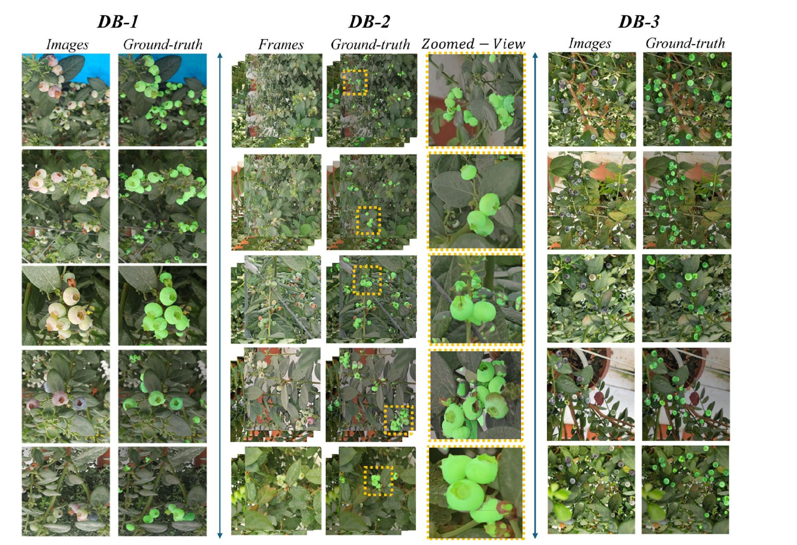
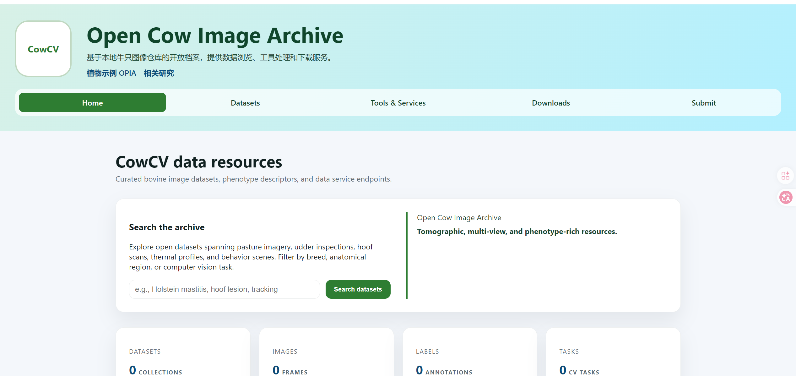
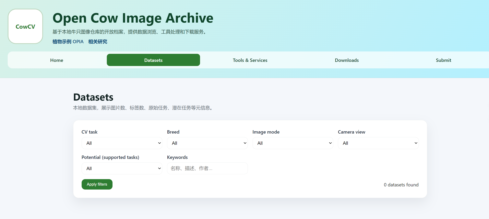

## 牛只目标检测进展

### 数据集标注

已完成数据集标注工作

### 论文大纲

**背景**，`大规模、集约化地饲养和育肥肉牛对于社会发展至关重要。大规模养殖可以降低成本、节省空间，同时满足日益增长的生产需求。精准畜牧业利用现代技术提高效率、动物福利和可持续性，在此背景下至关重要。随着奶牛业变得日益智能化和精简化，肉牛业的类似进步也值得关注。`类似的描述引出文章的的目的。

**各个数据集的图片的格式已经相关介绍**,以及图片类似与`AgriVision：一个用于推进密集结果蓝莓作物中机器人视觉的基准数据集。DB-1 的标注是通过一个结构化的多步骤协议进行的，以确保准确性和一致性......DB-2 在初始数据集的基础上，对从收集的视频中提取的剩余 141,453 帧进行了标注......DB-3：**合成数据集**。为了减轻手动标注的高成本和劳动密集型性质，我们开发了一个合成数据集（DB-3）......`

`用于介绍各个数据集的表格`

**拍摄环境**，对于多数目标检测，分割数据集，文章中都会有很大一部分内容来详细介绍拍摄的环境以及拍摄的过程。例如`用于计算机视觉的玉米和小麦多样化杂草种类手动注释和策划数据集.为了生成光照良好、高分辨率的实验单元俯视图像，使用了Moving Fields设施的Scanalyzer 3D成像舱之一。在该成像舱中，一台RGB相机（Basler piA2400-17gm）垂直安装在传送带上方2.8米处。为了生成一组高质量图像的数据集，这些图像捕捉了几种杂草物种个体植物的初始生长动态，......这些地块都会被自动浇水和拍照。Moving Fields设施（LemnaTec GmbH）建于温室中，由一个传送带系统、三个灌溉站和四个“Scanalyzer 3d”照片舱组成.`因为我们的数据集并非文章中类似的单个数据集，所以会对这个部分进行简化。

**基准测试**，多数目标检测，分割数据集都会引入基准测试，来证明数据集的可靠性。例如`HBID24K鸟类目标检测数据集：为了验证数据集的效用，我们对10种最先进的目标检测模型进行了基准测试。结果证明了HBID24K在提高检测精度和可扩展性方面的有效性。在测试的模型中，YOLOv10在平均精度均值（mAP）、精确率和召回率得分方面均表现最佳，这凸显了其在保护领域的适用性。用于计算机视觉的玉米和小麦多样化杂草种类手动注释和策划数据集：我们选择了两种不同的基于深度学习的模型架构，ResNet-3434和EfficientNet_b035，来评估分类性能。对于超参数优化，我们使用了网格搜索和五种不同的学习率（从1e-3到1e-4范围内的对数均匀分布中采样）。由于类别不平衡性高，我们通过对少数类进行过采样，在批次中采样了512个植物切片。 `

我们打算使用多种常用模型的F1分数来评价数据集的可靠性。

**网站介绍** 目前网站还没有完全完工，该部分会介绍网站的功能，已及benchmark测试的结果。

**主页**

**查询**

###### 工具（该部分内容很多还没有实现）

**数据集的下载**

后续还会添加数据集内单张图片显示等功能，并进行benchmark测试。
