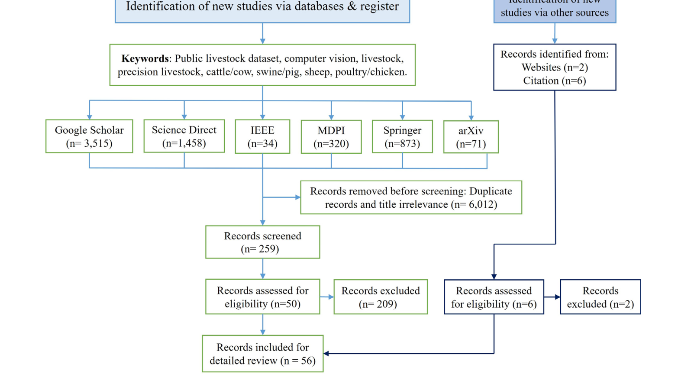
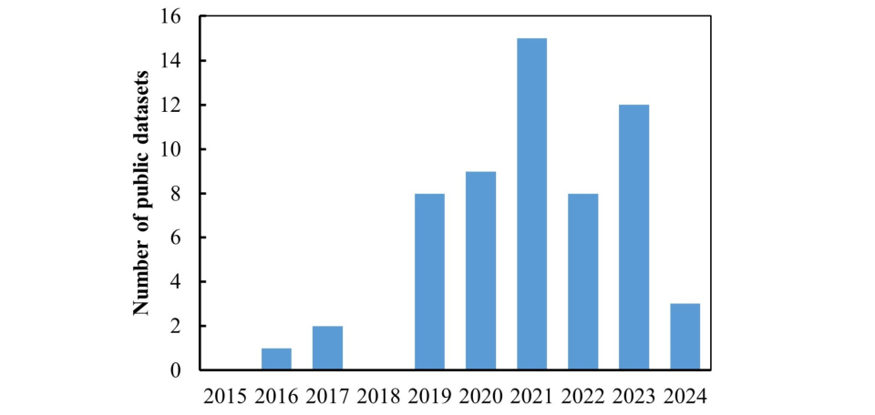
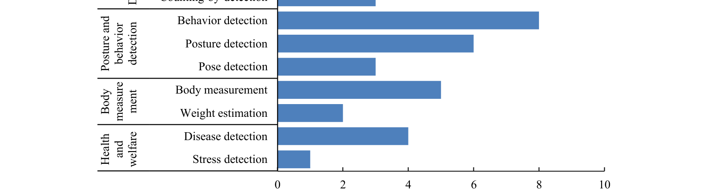
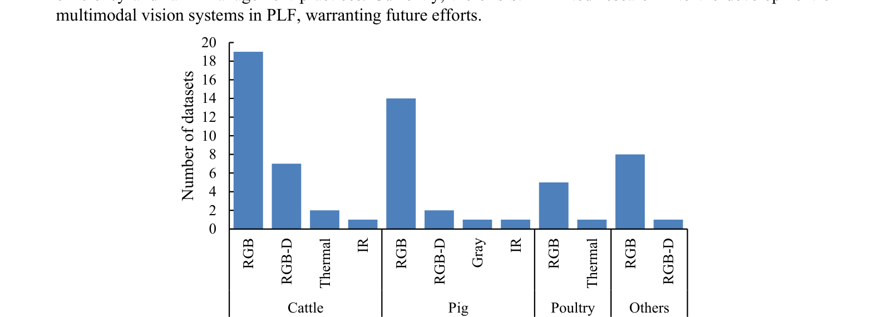

# 精准畜牧养殖公开计算机视觉数据集：系统综述（Comput Electron Agric 2025）

## 1. 论文信息

- **标题**：*A systematic survey of public computer vision datasets for precision livestock farming*
- **作者**：Anil Bhujel、Yibin Wang、Yuzhen Lu（通讯，luyuzhen@msu.edu）、Daniel Morris、Mukesh Dangol
- **单位**：密歇根州立大学生物系统与农业工程系；尼泊尔文化旅游民航部
- **期刊**：*Computers and Electronics in Agriculture*（一区 TOP），Vol.229, Article 109718, 2025 年 2 月
- **DOI**：[10.1016/j.compag.2024.109718](https://doi.org/10.1016/j.compag.2024.109718)
- **arXiv 预印本**：[2406.10628](https://arxiv.org/abs/2406.10628)（2024-06-15，58 个数据集版本）
- **配套 GitHub**（数据集清单，持续更新）：[Anil-Bhujel/Public-Computer-Vision-Dataset-A-Systematic-Survey](https://github.com/Anil-Bhujel/Public-Computer-Vision-Dataset-A-Systematic-Survey)
- **资助**：美国 NSF Phase 1 STTR Grant 2232959

> 首个以"数据集本身"为研究对象的畜牧 CV 系统综述：按 PRISMA 2020 流程筛出 65 篇论文中的 **67 个公开数据集**（牛 32、猪 19、家禽 6、其他 10），逐个分析采集方式、标注规模与基线应用，结论是"高质量标注数据少 + 情境元数据缺失"是 PLF 的真正瓶颈。

> ⚠️ 版本说明：arXiv v1 全文详述 58 个数据集（牛 27 / 猪 17 / 禽 5 / 其他 9），正式发表版扩充至 67 个。本笔记正文详译基于 arXiv v1（有全文），正式版新增的 9 个数据集见 [7.3 节](#73-正式版新增数据集github-清单)。

## 2. 研究目的

DL 推动的 AI 进步重塑了 CV 领域。ImageNet（ILSVRC）等大规模开源数据集加速了通用 CV 算法向人类水平精度的迈进——**大规模公开数据集的存在，是算法成就的前提**。如今 DL 驱动的 CV 系统已能在农业生产中替代大部分人工、实现 7×24 小时自动监测。

精准畜牧养殖（PLF）是高度依赖 CV 与 AI 的新兴领域。过去十年，CV 系统已广泛用于畜群高通量表型分析、行为监测与福利评估。主流成像模态是 RGB 彩色成像与 RGB-D 深度成像，其中消费级 RGB-D 传感器在体重估计等 3D 生物测量中日益流行。近年出现了从"人工特征工程"到"数据驱动 DL"的范式转移。

但 DL 有效工作的前提是**大量标注数据**——现代 DL 模型包含百万至百亿级可学习参数，天生"数据饥渴"。为 DL 构建大规模图像数据集（尤其从零训练用）是出了名的费时费力，在畜牧场景中有时根本不可行。CV 社区有 COCO、ImageNet，**PLF 领域却没有对应物**。

此前约 11 篇相关综述的局限（本文的切入点）：

| 综述 | 覆盖 | 局限 |
|---|---|---|
| Nasirahmadi et al. 2017 | 牛/猪行为检测 CV 系统 | 聚焦应用 |
| Okinda et al. 2020 | 家禽福利监测 | 聚焦应用 |
| Oliveira et al. 2021 | 畜牧 DL 算法（分类/检测/分割/表型） | 聚焦算法 |
| Mahmud et al. 2021 | 精准养牛 DL | 单一物种 |
| Qiao et al. 2021 | 牛检测/体况评分/体重估计 | 聚焦应用 |
| Arulmozhi et al. 2021 | 猪行为监测 2D/3D 影像 | 单一物种 |
| Chen et al. 2021 | 猪/牛行为识别：CV→DL 演进 | 聚焦算法 |
| Bahlo & Dahlhaus 2021 | 澳大利亚开放畜牧数据的 FAIR 性 | 未明确图像数据集占比 |
| Yousefi et al. 2022 | UAV 牲畜检测/定位 DL | 聚焦 UAV 场景 |
| Dohmen et al. 2022 | CV+ML 体重测量 | 聚焦应用 |
| Wang et al. 2023 | 3D CV 与图像预处理（牛生长管理） | 聚焦 3D 场景 |

**本文定位**：首次对 PLF 公开图像/视频数据集做系统挖掘，覆盖多畜种、多任务，从应用、数据量、模态、成像环境四个维度建立分类体系，并讨论数据整理与共享的未来需求。

## 3. 综述方法（PRISMA 2020）

### 3.1 纳入标准

1. 数据用于**计算机视觉**应用；
2. 数据**公开可得**、无需联系作者同意即可获取；
3. 数据用于**牲畜表型**研究；
4. 论文发表于 **2015 年之后**（开源畜牽数据集基本是 2010 年代中期 DL 兴起后才出现的）。

### 3.2 检索与筛选流程

检索词："livestock dataset"、"public livestock dataset"、"image dataset"、"livestock monitoring"、"cow/cattle monitoring"、"pig/swine monitoring"、"poultry/chicken monitoring"、"sheep monitoring" 等及其组合，在主流数据库高级检索。

流程数字：六大库初检 6,271 篇（Google Scholar 3,515 / ScienceDirect 1,458 / Springer 873 / MDPI 320 / arXiv 71 / IEEE 34）→ 去重与标题过滤剔除 6,012 → 粗筛 259 → 资格评估后剩 50；另从引文追溯与网站补充 8 篇 → 6 篇。**最终纳入 56 篇**（arXiv 版），详述 58 个数据集。

### 3.3 十年发表趋势

2015-2017 年几乎空白（各 0-1 个），2019 年起明显加速，2021 年达到峰值（15 个）——说明这是个正在爆发但基数仍很小的领域。

## 4. 数据集盘点（按畜种）

研究者对"公开高质量畜牧行为 CV 数据集稀缺"已完全共识。公开数据量虽在增长，但**远低于 ImageNet / MS COCO 量级**。58 个数据集均可在网上免费获取且作者已授权复用；多数可直接使用，少数为原始/半处理状态需再加工。

### 4.1 牛类数据集（27 个，占近半）

**牛是公开数据集最多的畜种**。任务覆盖：个体检测（背部花纹/鼻纹/脸部识别）、行为、姿态、体尺体重、计数。

| 数据集                      | 模态         | 环境         | 规模                 | 标注          | 应用    |
| ------------------------ | ---------- | ---------- | ------------------ | ----------- | ----- |
| FriesianCattle2015       | RGB-D      | 挤奶站        | 83 训练 + 294 测试     | 图像级         | 个体检测  |
| FriesianCattle2017       | RGB        | 农场通道       | 940 图              | 边界框         | 个体检测  |
| AerialCattle2017         | RGB        | 户外         | 46,430 帧           | 边界框         | 个体检测  |
| Aerial-livestock-dataset | RGB        | 户外         | 89 图 / 4,996 实例    | 边界框         | 牛检测   |
| BeefCattleMuzzle         | RGB        | 开放环境       | 4,923 图 / 268 头    | 图像级         | 鼻纹识别  |
| OpenCows2020             | RGB        | 室内+户外      | 3,703 图 / 6,917 实例 | 边界框         | 个体检测  |
| Cows2021                 | RGB        | 户外通道       | 10,402 图 / 186 头   | 带角度框        | 个体检测  |
| HolsteinCowRecognition   | 热成像+RGB    | 研究农场       | 1,237 对 / 136 头    | 图像级         | 个体识别  |
| HolsteinCattle           | 热成像+RGB    | 研究农场       | 3,694 对 / 383 头    | 图像级         | 个体识别  |
| RecBov51c                | RGB        | 农场通道       | 27,849 帧 / 51 头    | 图像级         | 品种识别  |
| CowBehavior              | RGB        | 挤奶站        | >170 万帧 / 280 视频   | 图像级（10 类）   | 行为检测  |
| NWAFU-CattleDataset      | RGB        | 户外         | 2,134 图 / 63 头     | 16 关键点      | 姿态检测  |
| CowDB                    | RGB-D      | 商业农场       | 154 头海福特           | 9 项体尺       | 体尺测量  |
| CowDatabase              | RGB-D      | 商业农场       | 103 头海福特           | 10 项体尺      | 体尺测量  |
| CowDatabase2             | RGB-D      | 商业农场       | 119 头黑安格斯          | 基因型+屠宰性状    | 体尺/生产 |
| 300-Cattle-Source        | RGB        | 头夹系统       | 2,632 图 / 300 头    | 图像级         | 鼻纹识别  |
| CattleVideo              | RGB        | 商业农场       | 14,400 训 + 3,750 测 | 图像级         | 检测跟踪  |
| MultiviewC               | RGB-D（合成）  | 商业农场（虚幻引擎） | 3,920 图 / 15 头     | 3D 边界框      | 3D 检测 |
| Cattle-counting          | RGB        | 开阔牧场       | 5,058 航拍图          | 边界框         | 计数    |
| Cattle_Dataset           | RGB        | 开放环境       | 10,239 脸图 / 103 头  | 图像级         | 牛脸识别  |
| Aerial_pasture           | RGB        | 户外牧场       | 670 图 / 1,948 标注   | 边界框         | 计数    |
| Cattle_Video_Behaviors   | RGB        | 户外放牧       | 502 段 ×15s 视频      | 边界框（11 类行为） | 行为检测  |
| LShapeAnalyser-cow       | RGB-D      | 室内挤奶站      | 203 头              | 自动关键点       | 体况评分  |
| PCD Dataset              | LiDAR 点云   | 育种场        | 2,106 点云 / 100 头   | 4 区域体表分割    | 体重估计  |
| CattleEyeView            | RGB        | 户外装运坡道     | 14 视频 / 30,703 帧   | 框+分割+24 关键点 | 多任务   |
| Dairy Cow                | **红外（IR）** | 农场         | 1,800 图 / 10 头     | 框 + 16 关键点  | 姿态估计  |
| Cows Frontal Face        | RGB        | 多农场        | 2,893 图 / 459 头    | 边界框         | 牛脸/鼻纹 |

重点数据集细节：

- **FriesianCattle2015**：首个公开 3D 牛类数据集（Andrew et al. 2016）。靠背部花纹识别荷斯坦-弗里生个体。Kinect RGB-D 相机装在挤奶站出口上方 4 m，深度 512×424@16bit、RGB 1920×1080@30fps。92 头牛 764 对 RGB-D 图，训练/测试划分为 10 头 83 图 / 40 头 294 图。
- **AerialCattle2017**：无人机户外拍摄。首帧手工标框，后续帧用 KCF 跟踪自动裁剪 ROI 再归类——**用跟踪算法降低标注成本**的早期范例。34 段牛群视频（平均约 20 s）→ 46,340 帧。
- **Aerial-livestock-dataset**（Han et al. 2019）：89 张高分辨率航拍图（3000×4000），4,996 个"livestock"实例，按难度分三类：Ⅰ 黑色简单背景（29 图）、Ⅱ 黑色+地貌复杂背景（17 图）、Ⅲ 密集多色+雪地建筑干扰（43 图，最难）。
- **BeefCattleMuzzle**：鼻纹作为生物特征识别肉牛。自然行为状态下拍摄，聚焦/裁剪/滤波后保留 268 头牛的 4,923 张 300×300 鼻纹图。
- **Cows2021**：186 头牛 10,402 图，标注框带朝向角 (cx, cy, w, h, θ)，用于**自监督对比学习**个体识别验证。
- **HolsteinCattle（热成像）**：383 头荷斯坦牛 3,694 对 RGB+热图像对，热相机距牛 5 m、高 1.5 m 侧视，连续 9 天下午挤奶时拍摄。
- **CowBehavior**：**可能是最大的牛行为数据集**——自动挤奶站前 3.3 m 高处相机，两个月 280 段视频、超 170 万帧，10 类行为（互动三种方向/饮水/好奇/排队/拥挤/低可见度/正常），标注按优先级从上到下取类。
- **NWAFU-CattleDataset（西农）**：63 头牛（33 奶牛+30 肉牛）2,134 图，手机拍摄，标注 16 个身体关键点（头顶/颈/脊柱/四肢髋膝蹄/尾椎），用于姿态估计。
- **Ruchay 系列三件套（CowDB/CowDatabase/CowDatabase2）**：RGB-D 多视角（左右+顶视）重建牛 3D 体形，配套手工测量体尺（体重/鬐甲高/臀高/胸深/胸围/髂骨宽等 9-10 项）。CowDatabase2 还含 RFID、基因分型与 56 项屠宰性状参数。
- **MultiviewC**：**合成数据集**，Unreal Engine 4.26 渲染 39 m×39 m 牛场场景，7 相机（4 角+3 水槽顶）每 2 s 拍一次，15 头模拟牛 5 种动作，3,920 张带 3D 框——用于多视角 3D 检测基准。
- **Cattle-counting**：6 个牧场、5 个飞行高度（80-120 m）、一天三个时段的 5,058 张航拍图，Faster R-CNN 计数。
- **CattleEyeView**：多任务基准（检测/计数/姿态/跟踪/分割），14 段俯视视频 30,370 帧、753 个实例，覆盖 6 个品种（安格斯/婆罗门/夏洛莱/抗旱王/海福特/圣格鲁迪斯）——**品种多样性最好的牛数据集**。
- **Dairy Cow（红外）**：海康威视红外监控相机拍 10 头奶牛 1,800 张，YOLOv4 去背景 + 姿态分类网络，识别站立/行走/躺卧三种姿态。

### 4.2 猪类数据集（17 个）

第二大类，集中在**姿态与行为识别**（约 60% 的姿态/行为数据集是猪）。多样化公开数据不足仍是养猪业的瓶颈。

| 数据集 | 模态 | 环境 | 规模 | 标注 | 应用 |
|---|---|---|---|---|---|
| PNPB | RGB | 实验农场 | 20 视频 ×5.5 min | 框+3 关键点 | 新物体行为 |
| PigBehavior | RGB | 商业猪舍 | 735,094 实例 / 113,379 图 | 边界框 | 姿态/饮水（健康） |
| PigFeeding-NNVBehavior | RGB | 商业猪舍 | 34,370 图（7 类） | 图像级 | 采食/非营养性访问 |
| PigAgonisticBehavior | RGB | 单空间料栏 | 15,679 段 30 帧视频 | 图像级（5 类） | 攻击性行为 |
| CountingPigs | RGB | 互联网+猪舍 | 3,401 图 / 约 3 万头 | 质心坐标 | 计数 |
| PigPosture | RGB | 商业猪舍 | 305 图 / 7,277 框 | 边界框 | 躺/非躺 |
| PigDetection | RGB+IR | 研究中心猪舍 | 13,047 框 | 边界框 | 姿态基准 |
| Pig_Behaviors | RGB-D | 农场 | 7,200 标注帧（12 段） | 框+ID（5 类行为） | 检测/跟踪 |
| Multi-camera-pig-tracking | RGB | 商业猪舍 | 429 检测 + 1,200 跟踪帧 | 全局 ID 框 | 多相机跟踪 |
| Pig-multi-part-detection | RGB+IR | 商业猪舍 | 2,000 图 | 4 部位关键点 | 姿态估计 |
| Pig-tracking | RGB（含红外夜视） | 商业猪舍 | 15 视频 ×30 min | 肩/尾关键点+ID | 跟踪 |
| Pig-detection&tracking | 灰度 | 研究农场 | 49 视频 → 2,457 图 | 4 部位关键点 | 检测跟踪 |
| PigPostureActivity | RGB | 实验猪舍 | 668 测试帧 | 边界框 | 姿态+行走 |
| PigTrace | RGB | 商业农场（5 场） | 540 帧 / 30 视频 | 分割+ID（4 类活动） | 实例分割跟踪 |
| LShapeAnalyser-pig | RGB-D | 室内笼养 | 201 头 | 自动关键点 | 体况评分 |
| DifferentStagesPig | RGB | 商业农场 | 319 图 + 17 视频 | 图像级 | 生长阶段/健康 |
| Aggressive-Behavior-Recognition | RGB | 商业农场 | 541 攻击 + 565 非攻击段 | 视频级 | 攻击行为识别 |

重点细节：

- **PigBehavior**：天花板 RGB-D 相机，15 头猪，73.5 万行为实例（站立 10.5 万/坐 2.4 万/侧卧 41.7 万/胸卧 16.6 万/饮水 2.3 万），用于**受限饲喂条件下的应激检测**。
- **PigAgonisticBehavior**：料栏上方 2.44 m RGB-D 相机，6 周、6 个社交组轮换，标注无接触/耳-身/头-身/撬压/爬跨五类交互，撬压与爬跨类做了增强后共 15,679 段。
- **Multi-camera-pig-tracking**：3 个广角相机（顶 4 m + 斜 2.2 m ×2），YOLOv4 检测 + DeepSORT 局部 ID + **单应性估计配全局 ID**——多相机跨视角跟踪基准。
- **Pig-tracking**：15 段 30 分钟视频（保育/育肥前期/育肥后期各 5 段，日/夜各半，夜间用红外泛光灯），覆盖高/中/低活动水平，肩尾关键点+耳标 ID。
- **Aggressive-Behavior-Recognition**：CNN(空间)+GRU(时间) 混合模型，撕咬/撞击/踩踏/追逐为攻击类，爬跨/玩耍/躺卧/采食/饮水为非攻击类，各 3 秒/段。

### 4.3 家禽数据集（5 个）

禽类监测难点：真实圈舍环境背景复杂、光照多变。虽然禽业是农业与食品供应的重要板块，**其 CV 数据集相对匮乏**。

| 数据集 | 模态 | 环境 | 规模 | 标注 | 应用 |
|---|---|---|---|---|---|
| ChickenGender | RGB | 商业禽场 | 800 群图 + 1,000 单鸡 | 边界框 | 性别分类 |
| Chicken_Poo | RGB | 大学/社区禽场 | 14,618 图（7,991 健康 + 6,627 不健康） | 边界框 | 粪便健康检测 |
| Poultry_Disease | RGB | 中小禽场 | 数据集1: 1,255（PCR 确认）/ 数据集2: 6,812（4 类） | 图像级/框/掩码 | 疾病检测 |
| GalliformeSpectra | RGB | 多国鸡场 | 1,010 图（10 品种 ×101） | 图像级 | 品种分类 |
| Broiler Dataset | RGB+热成像 | 研究农场 | 10,000 图 / 50,000 框 | 图像级 | 病理现象检测 |

- **Poultry_Disease**：普通手机 + ODK 工具采集一年，含球虫病/新城疫/沙门氏菌/健康四类，数据集 1 有 PCR 实验室确认报告（健康 347/沙门 349/球虫 373/新城 186），数据集 2 为农场标注版本——**少数有实验室金标准的健康数据集**。
- **Broiler Dataset**：肉鸡病理（嗜睡/肌腱滑脱/眼部病变/应激张喙/嗉囊下垂）RGB+热成像，YOLO 系模型检测。

### 4.4 其他畜种数据集（9 个）

羊/山羊 7 个 + 水牛、马各 1 个。

| 数据集 | 模态 | 环境 | 规模 | 标注 | 应用 |
|---|---|---|---|---|---|
| SheepBreed | RGB | 商业农场 | 1,642 图 / 4 品种 | 图像级 | 品种分类 |
| SheepBase | RGB | 自然环境 | 6,559 张羊脸 | 边界框 | 羊脸检测/识别 |
| SheepActivity | RGB | 自然环境 | 417 视频 / 149,327 帧 | 图像级 | 活动检测 |
| LEsheepWeight | RGB-D | 羊场 | 6,373 图 / 726 只 | 对应实测活重 | 活重估计 |
| GoatImage | RGB | 开源+农场 | 3,278 图 | 13,761 框（脸/眼/鼻/耳） | 山羊脸检测 |
| Drone-goat-detection | RGB | 放牧草地 | 517 图 / 8,830 质心 | 边界框+活动 | 航拍活动检测 |
| CherryChevre | RGB | 农场/牧场 | 6,160 图 / 35,381 框 | 边界框 | 山羊检测 |
| Buffalo-Pak | RGB | 未说明 | 325 图（3 品种） | 图像级 | 水牛品种分类 |
| Horse-10 | RGB | 户外 | 8,114 帧 / 30 匹 | 22 个解剖关键点 | 马姿态度估计 |

- **SheepActivity**：手机多角度（矢状/侧向）拍摄吃草/站立/行走/奔跑/趴卧，**作者未跑任何 CV 算法，质量与可用性待验证**——综述如实指出。
- **Horse-10**：DeepLabCut 生态的标杆姿态数据集，每匹马 200+ 种姿态，60fps。

## 5. 讨论

### 5.1 按应用分类的统计

**动物检测一骑绝尘**，其后依次为行为检测、个体脸/鼻纹识别、跟踪、姿态、品种、体尺。四大家族：

- **检测与跟踪**：俯视检测数据集不少，但体尺、跟踪、姿态估计、健康监测的数据集明显不足；
- **姿态与行为**：RGB 静态帧只能定位躺/坐等姿态，社交行为等复杂活动**必须依赖视频的时空信息**；
- **体尺测量**：对健康与福利评估至关重要，数据稀缺；
- **健康与福利**：数据最少。

要弥合缺口，**空间+时间数据协同**是关键，才能支撑从业者做数据驱动决策。

### 5.2 成像模态统计

- **RGB 绝对主导**（牛 19 / 猪 14 / 禽 5 / 其他 8）：简单、易得、便宜、高效；
- **RGB-D 第二**（牛 7 / 猪 2 / 其他 1）：3D 相机与点云在体积测量、体重与姿态估计上兴起；
- **热成像与红外极少**（牛各 2 与 1、猪 IR 1、禽热 1）：多模态融合在 PLF 中还研究得很不够。

### 5.3 六大挑战（4.3 节详译）

**① 个体与群体检测跟踪**
- 复杂环境中对猪、肉鸡等"空间不变性差"的动物做高可靠个体检测跟踪仍是难题；
- 脸/虹膜/鼻纹等生物标记可识别个体，但自动采集与预处理极耗时——Li et al. (2022) 制备脸部数据集时**约 85% 的原始帧被判无效剔除**；
- **缺少带充分元数据**（农场环境、光照、背景类型、动物姿态/尺寸/密度、遮挡重叠、画面覆盖区等）的顶级标注数据集；
- 现有俯视数据集偏爱荷斯坦奶牛这类**背部花纹视觉上易分辨**的品种；
- 密集种群长视频的多目标跟踪仍是硬骨头，多视角+精心设计的算法是潜在出路。

**② 姿态与行为检测**
- 约 60% 姿态行为数据集来自猪；
- 躺卧/采食/站立/吃草等靠空间特征可判，社交互动、走跑等**必须时空特征**；
- 加入上下文（社交动态、个体特征、健康状态、转换/混合行为、农场与动物信息）可增强模型泛化。

**③ 健康与福利监测**
- CV 非侵入、无接触，可无应激监测并防人畜共病传播；
- 但**真正采自患病动物的数据集只有 4 个**（禽 3 + 猪不同阶段 1），多数健康检测研究是"类比型"（用姿态/活动间接推断）——健康量化数据集是最突出的空白。

**④ 体尺与体重估计**
- 3D 视觉技术（多角度 2D 相机、激光飞行时间、LiDAR、深度相机）已成为主流路线；
- 自底向上（先关键点后骨架）精度高，自顶向下（先轮廓后体表 landmark）吞吐量大但精度偏低；
- 三大挑战：直接处理 3D 数据的模型有限、高质量公开 3D 数据集明显缺乏、系统噪声敏感。

**⑤ 成像模态的局限**
- RGB 在复杂场景（社交行为、体测）难以达到人类水平精度；
- 3D 成像对环境（光/温/湿）与物体运动敏感，产生噪声伪影，预处理链路重、依赖专业工具与人员；
- 俯视视角固有缺陷：遮挡、阴影、相机高度引入的尺度变化；
- 大规模视频标注（框/品种/行为）极其耗资源；**上下文元信息缺失**使观察无法与天气、饲喂计划、健康记录等外因关联，制约洞见与决策。

**⑥ 动物实验伦理与协议**
- 多国设监管机构（如美国 IACUC），批准是动物研究第一道程序；
- 普遍接受 **3R 原则**（Reduce 减少用量 / Replace 替代有感知动物 / Refine 优化实验设计与护理）；
- 建议研究者公开图像整理过程文档（元数据、方法、工具、动物健康与应激状况），以最少重复动物数复现研究。

## 6. 现有局限与前进方向（4.4 节）

### 6.1 现有数据集的六大局限

1. **情境元数据**文档有限或缺失；
2. 相似应用间**采集与标注无统一协议标准**；
3. 部分数据集**不完全符合 FAIR 原则**（可发现/可访问/可互操作/可复用）；
4. 数据托管在研究者**个人云盘**，随时可能失效，且无备份；
5. 动物健康状态的**定量分析与早期检测数据不足**；
6. 数据**多样性与异质性缺乏**，限制模型鲁棒性。

### 6.2 八条前进方向

1. 学界+产业+资助方**共建数据采集与准备标准**；
2. 由权威机构**牵头建 PLF 大规模基准数据库**；
3. **多模态算法**精确检测复杂行为与微妙健康问题；
4. **多视角相机**缓解遮挡、支持长期跟踪；
5. 高分辨率高测距精度的新一代 **3D 成像**增强体测鲁棒性;
6. **维护与保存**开源数据集确保未来可复用；
7. **半监督/自监督**建模缓解标注瓶颈；
8. **生成模型/图像增强合成数据**补充真实影像。

## 7. 结论

- **数据集是 PLF 进步的基石**，是数据驱动方案成功的前提；
- 58 个公开数据集（正式版 67 个）：牛 27 / 猪 17 / 禽 5 / 其他 9；应用上检测跟踪主导，其后是姿态行为、活体测量、健康福利；
- **超过三分之二由 RGB 相机采集**，其余主要是 RGB-D；
- 光照变化、遮挡、数据集文档缺失是三大现实复杂性；
- 未来需要：面向特定/新兴应用的更多高质量公开数据集、实时监测系统开发、AI 技术在 PLF 的深入探索。

### 7.3 正式版新增数据集（GitHub 清单）

正式发表版在 arXiv v1 基础上新增 9 个（均为 2024 年新作）：

| 类别  | 新增数据集                            | 出处                   |
| --- | -------------------------------- | -------------------- |
| 牛   | CVD Cattle Retinal Image         | Cihan et al., 2024   |
| 牛   | BCS Cattle Dataset（体况评分）         | Winkler et al., 2024 |
| 牛   | ADE Cattle Dataset               | Wu et al., 2024      |
| 牛   | CattNIS dataset                  | Saygılı et al., 2024 |
| 牛   | Cattle Side&BackView Dataset     | Bai et al., 2024     |
| 猪   | ORP-PigTracking                  | Lu et al., 2024      |
| 猪   | PigLife Dataset                  | Li et al., 2024      |
| 禽   | BCLayingHens（蛋鸡）                 | Ma et al., 2024b     |
| 其他  | DORIS Dataset（羊/人/狼+深度图+YOLO 标注） | Yang et al., 2024    |

GitHub 仓库另设"综述后新增"专栏，收录 2025-2026 年新作（如 FaroPigSeg、Benchmarking Pig Detection/Tracking、Individual Animal ReID 等）。

## 9. 与牛只检测研究的关联

- 这 67 个数据集（尤其牛类 32 个）可直接作为**池化实验的候选池清单**，每条都带模态/环境/标注/URL，可按"RGB vs 红外""室内 vs 航拍""框 vs 关键点"切片组池；
- 综述明确指出**热成像/红外数据集极少**（牛类仅 3 个：HolsteinCowRecognition、HolsteinCattle、Dairy Cow），你手里的 CMBN、HCRD 等红外数据集**不在其清单中**——这本身就是"多源异构红外牛只检测"研究稀缺性的直接论据，可写进论文 motivation；
- 其"元数据缺失限制模型泛化"的结论，与数据集池化中负迁移的成因分析可以互相呼应（域差异 = 环境/传感器/标注体系的差异，综述在 6.1-2 条印证了无统一标准是领域通病）。

## 总结

一句话：**用 67 个数据集的系统盘点，把"畜牧 CV 数据稀缺"从直觉变成了可量化的领域诊断**——检测一枝独秀、健康监测接近空白、RGB 独大、元数据缺失。做 PLF 数据工作的，这份清单和它的分类体系是绕不开的地图。

-----

## 延伸阅读

- 数据集池化负迁移分析：*Fusion or Confusion? A Look at Dataset Pooling for Infrared Object Detection*（CVPR 2025 PBVS Workshop）
- 澳洲畜牧数据 FAIR 性评估：Bahlo & Dahlhaus (2021), Comput Electron Agric 188
- 猪/牛行为识别 CV→DL 演进：Chen et al. (2021), Comput Electron Agric
- 综述同组新作：Bhujel et al. 的母猪姿态/跟踪系列数据集（2025-2026，见 GitHub）

## 附录

### A. 3.1 节全文翻译（牛类数据集）

> 以下为论文 3.1 节 *Cattle Datasets* 的逐节完整翻译，对应 arXiv 版正文第 4–11 页。数据集的论文 DOI、实测下载链接与许可协议，见本仓库《27个牛类公开数据集详细档案》。

#### 3.1 牛类数据集

公开畜牧数据集以牛为主。表 1 列出了 27 个带标注的相关数据集。本节逐一阐明每个数据集的用途与应用，以及配套的成像传感器、成像环境和数据集规模。

#### 3.1.1 FriesianCattle2015

FriesianCattle2015 是由 Andrew 等人（2016）采集并公开的**首个 3D 数据集**。它通过荷斯坦-弗里生牛独特的背部颜色花纹与斑纹来检测个体。牛只对象借助经验确定的距离阈值（最大值 3.4 m、最小值 2 m）从背景中分割出来。预处理后得到 92 头牛的 764 对 RGB-D 图像，随后按图像级做了标注。作者在农场环境中采集该数据集，使用一台消费级 RGB-D 相机安装在离地 4 m 处，拍摄牛只离开挤奶站的时刻。相机配置为：深度分辨率 512×424 像素、16 位表示，RGB 视频帧分辨率 1920×1080、30 帧/秒（fps）。作者将数据集划分为训练子集与测试子集，分别包含 10 头牛的 83 张图像与 40 头牛的 294 张图像。

#### 3.1.2 FriesianCattle2017

Andrew 等人（2017）实现了区域卷积神经网络（R-CNN）模型来定位和检测个体牛只。该数据集通过人工用边界框标注牛只对象并给每头牛分配唯一 ID 制备而成。他们创建了两个数据集：① FriesianCattle2017 由位于地面的俯视 RGB 相机拍摄；② AerialCattle2017 由无人机从空中视角拍摄（Andrew et al., 2017）。FriesianCattle2017 包含室内环境中 89 个个体的 940 张图像，由架设在待挤栏与挤奶站之间通道上方的 RGB-D 相机采集。事实上，其相机与装置与 FriesianCattle2015 数据集完全相同（Andrew et al., 2016）。

#### 3.1.3 AerialCattle2017

AerialCattle2017 数据集是在户外田野环境中，由搭载 RGB 相机的无人机采集的（Andrew et al., 2017）。与 FriesianCattle2017 类似，它也用于通过目标检测模型实现个体牛的定位与检测。牛只对象的地面真值标注是人工对视频**首帧**用边界框完成的；随后将核化相关滤波（KCF）跟踪算法（Henriques et al., 2015）应用于视频的后续帧，以识别并裁剪出牛的兴趣区域（ROI），最终把裁剪出的 ROI 图像标注到各自对应的牛的类别中。AerialCattle2017 采集了 34 段牛群视频片段，平均时长约 20 秒。采集到的视频经预处理后，得到 46,340 帧 RGB 图像供公开使用。

#### 3.1.4 Aerial-livestock-dataset

Aerial-Livestock-Dataset 是用四旋翼飞行器在草地上空采集的，目标为牲畜检测（Han et al., 2019）。该数据集由 89 张高空拍摄的高分辨率图像（3000×4000 像素）构成，每个牲畜实例都用边界框标注为"livestock"，共产生 4,996 个实例。按牲畜颜色与背景复杂度，它分为三个子类（见图 3）：第 Ⅰ 类含 29 张黑色牲畜、背景简单的图像；第 Ⅱ 类含 17 帧黑色牛只、地貌背景嘈杂的图像；第 Ⅲ 类由最具挑战性的 43 张图像构成，牲畜密集分布且颜色多样（黑、灰、白等），还叠加了雪、建筑、地形结构等干扰因素。

#### 表 1 公开牛类数据集

| 数据集                                             | 模态        | 成像环境    | 数据集规模                   | 标注                | 应用                      | URL                                                                    |
| ----------------------------------------------- | --------- | ------- | ----------------------- | ----------------- | ----------------------- | ---------------------------------------------------------------------- |
| FriesianCattle2015 (Andrew et al., 2016)        | RGB-D     | 农场挤奶站   | 83 训练 + 294 测试图像        | 图像级               | 个体牛检测                   | https://data.bris.ac.uk/data/dataset/wurzq71kfm561ljahbwjhx9n3         |
| FriesianCattle2017 (Andrew et al., 2017)        | RGB       | 农场      | 940 张 RGB 图像            | 边界框               | 个体牛检测                   | https://data.bris.ac.uk/data/dataset/2yizcfbkuv4352pzc32n54371r        |
| AerialCattle2017 (Andrew et al., 2017)          | RGB       | 户外田野    | 46,430 帧 jpg            | 边界框               | 个体牛检测                   | https://data.bris.ac.uk/data/dataset/3owflku95bxsx24643cybxu3qh        |
| Aerial-livestock-dataset (Han et al., 2019)     | RGB       | 户外田野    | 89 图 / 4,996 实例         | 边界框               | 牛只检测                    | https://github.com/hanl2010/Aerial-livestock-dataset/releases          |
| BeefCattleMuzzle (G. Li et al., 2022)           | RGB       | 开放环境    | 4,923 图像                | 图像级               | 牛鼻纹检测                   | http://doi.10.5281/zenodo.6324360                                      |
| OpenCows2020 (Andrew et al., 2021)              | RGB       | 室内与户外田野 | 3,703 图 / 6,917 实例      | 边界框               | 个体牛检测                   | https://data.bris.ac.uk/data/dataset/10m32xl88x2b61zlkkgz3fml17        |
| Cows2021 (Gao et al., 2021)                     | RGB       | 户外田野    | 10,402 图像               | 带框朝向角的边界框         | 个体牛检测                   | https://data.bris.ac.uk/data/dataset/4vnrca7qw1642qlwxjadp87h7         |
| Holstein CowRecognition (Bhole et al., 2019)    | 热成像 + RGB | 研究农场    | 1,237 对热/RGB 图像         | 图像级               | 个体牛检测                   | https://dataverse.nl/dataset.xhtml?persistentId=doi:10.34894/O1ZBSA    |
| HolsteinCattle (Bhole et al., 2022)             | 热成像 + RGB | 研究农场    | 3,694 对 RGB/热图像         | 图像级               | 个体牛检测                   | https://dataverse.nl/dataset.xhtml?persistentId=doi:10.34894/7M108F    |
| RecBov51c Dataset (Weber et al., 2020)          | RGB       | 农场环境    | 27,849 图像               | 图像级               | 牛品种检测                   | https://data.mendeley.com/datasets/8ysxtyf8p2/1                        |
| CowBehavior (Koskela et al., 2022)              | RGB       | 挤奶站     | >170 万图像                | 图像级               | 牛行为检测                   | https://zenodo.org/record/3981400                                      |
| NWAFU_CattleDataset (Li et al., 2019)           | RGB       | 户外田野    | 2,134 图 / 63 头牛         | 关键点（16 个身体点）      | 牛姿态检测                   | https://drive.google.com/open?id=1bLQFHd9rqllmEaYvbcAqEBJtlyfuKPdP     |
| CowDB (Ruchay et al., 2020)                     | RGB-D     | 商业农场    | 154 头海福特牛               | 不适用               | 牛体尺测量                   | https://github.com/ruchaya/CowDB                                       |
| CowDatabase (Ruchay et al., 2020)               | RGB-D     | 商业农场    | 103 头海福特牛               | 不适用               | 体尺测量                    | https://github.com/ruchaya/CowDatabase                                 |
| CowDatabase2 (Ruchay et al., 2022b)             | RGB-D     | 商业农场    | 119 头黑安格斯牛              | 不适用               | 体尺测量                    | https://github.com/ruchaya/CowDatabase2                                |
| 300-Cattle-Source (Shojaeipour et al., 2021)    | RGB       | 头部保定系统  | 2,632 图 / 300 头牛        | 图像级               | 牛鼻纹检测                   | https://cloud.une.edu.au/index.php/s/eMwaHAPK08dCDru                   |
| CattleVideo (Qiao et al., 2021a)                | RGB       | 商业农场    | 14,400 训练 + 3,750 测试图像  | 图像级               | 检测式跟踪                   | https://drive.google.com/file/d/13LZmzb5XcqzUVQo3EiTIf4pur4lFHmZD/view |
| MultiviewC (Ma et al., 2021)                    | RGB-D     | 商业农场    | 3,920 图像                | 3D 边界框            | 3D 牛只检测                 | https://github.com/Jiahao-Ma/MultiviewC                                |
| Cattle-counting (Soares et al., 2021)           | RGB       | 大型开阔牧场  | 5,058 图像                | 边界框               | 检测式计数                   | https://vhasoares.github.io/downloads.html                             |
| Cattle_Dataset (Z. Li et al., 2022)             | RGB       | 开放环境    | 10,239 张牛脸图             | 图像级               | 牛脸检测                    | https://github.com/Oliver6999/cattle_dataset/tree/main                 |
| Aerial Pasture (Shao et al., 2020)              | RGB       | 户外牧场区   | 670 图 / 1,948 标注        | 边界框               | 检测式计数                   | http://bird.nae-lab.org/cattle/                                        |
| Cattle_Video_Behaviors (CVB) (Zia et al., 2023) | RGB       | 户外田野    | 502 段 15 秒视频（各 450 帧）   | 边界框               | 行为检测                    | https://data.csiro.au/collection/csiro%3A58916v1                       |
| LShapeAnalyser-cow (Zhang et al., 2023)         | RGB-D     | 室内挤奶站   | 203 头牛                  | 不适用               | 体尺测量                    | https://gitee.com/kznd/lshape-analyser/tree/master/Dataset/dairy       |
| PCD Dataset (Hou et al., 2023)                  | RGB-D     | 育种农场    | 增强后 2,106 个点云 / 100 头肉牛 | 关键点（背区、胸区、臀区、空白区） | 体重估计                    | https://github.com/colorful-days/0724/tree/master/data                 |
| CattleEyeView (Ong et al., 2023)                | RGB       | 农场装运坡道  | 14 段俯视视频（30,703 帧）      | 边界框、语义分割          | 多任务（检测、计数、姿态估计、跟踪、语义分割） | https://github.com/AnimalEyeQ/CattleEyeView?tab=readme-ov-file         |
| Dairy Cow (Gong et al., 2022)                   | 红外（IR）    | 农场环境    | 10 头牛采样 1,800 张图像       | 边界框、关键点           | 姿态（站、走、卧）估计             | https://www.kaggle.com/twisdu/dairycow                                 |
| Cows Frontal Face (Ahmed et al., 2024)          | RGB       | 多个农场    | 459 头牛 2,893 张图像        | 边界框               | 牛脸检测                    | https://zenodo.org/records/10535934                                    |

#### 3.1.5 BeefCattleMuzzle

BeefCattleMuzzle 数据集是在畜栏外、从不同距离用 RGB 无反数码相机（X-T4，富士胶片，东京，日本）对肉牛成像制备的。鼻纹图案是动物的生物特征之一，本数据集用它来识别个体肉牛（Li et al., 2022）。数据采集于动物处于自然行为状态、无人工干预时。采集图像经过多步预处理（对焦、裁剪、滤波）。预处理后，数据集中保留了 268 头个体肉牛的 4,923 张带标注（图像级）鼻纹图像，鼻纹图分辨率 300×300 像素，并按牛只分开存放。

#### 3.1.6 OpenCows2020

该数据集包含从室内与户外环境拍摄的荷斯坦-弗里生牛俯视 RGB 图像。数据集用覆盖牛躯干（不含头、颈、尾）的边界框手工标注，用于荷斯坦-弗里生牛的检测与生物特征识别。Andrew 等人（2021）通过整合其此前工作（Andrew et al., 2019、2017、2016）所用的图像数据制备该数据集，共产生 3,703 张图像、6,917 个牛只实例。数据集包含各种尺寸的标注框，多数画面中只有一到两头动物。

#### 3.1.7 Cows2021

Cows2021 数据集同样用于个体级别的荷斯坦-弗里生牛定位与检测。视频序列中的所有牛只实例都被唯一分配了 186 头牛中的某个 ID（Gao et al., 2021）。作者利用该数据集验证了一个使用对比学习与聚类的自监督网络。体量方面，数据集包含从 301 段视频片段中提取的 10,402 张 RGB 图像，涉及 186 头荷斯坦-弗里生牛。视频由 RGB-D 相机（RealSense D435，英特尔，加州，美国）在田野环境中拍摄，相机从 4 m 高处向下对准待挤栏与挤奶厅之间的牛只通道。牛只对象的标注仅包含身体部分，剔除头、颈、尾与腿部，共得到 13,784 个实例。此外还加入了额外信息（θ），用于表示与边界框质心对应的框朝向，即 (cx, cy, w, h, θ)。

#### 3.1.8 HolsteinCattleRecognition

该数据集（Bhole et al., 2019）的用途是利用热成像与 RGB 成像识别单头荷斯坦牛。数据集给出了 136 头挤奶牛的热成像与 RGB 图像对，使用一台热相机（FLIR，Teledyne FLIR LLC，Wilsonville，美国），安装在农场环境挤奶站处、距动物 5 m 的位置，拍摄动物的侧视图。对 136 头荷斯坦牛而言，每头动物的图像对数量最少 6 对、最多 14 对，共产生 1,237 对图像。图像对按图像级标注，依据牛只所佩戴的项圈标牌分配 ID。

#### 3.1.9 HolsteinCattle

与 HolsteinCattleRecognition 数据集（Bhole et al., 2019）类似，HolsteinCattle 数据集（Bhole et al., 2022）同样是为侧视角度下个体荷斯坦牛的检测与监测而创建的。该数据集采用图像级标注进行类别分类，把属于各个体的图像分开存放。它包含 383 头个体荷斯坦牛的 3,694 对 RGB 与热成像图像。个体牛图像在连续 9 天的每个下午挤奶时段于挤奶厅拍摄。使用一台热相机，安装在离地 1.5 m、距牛 5 m 处，拍摄动物侧视图。

#### 3.1.10 RecBov51c Dataset

该数据集用于个体级别识别潘塔内罗（Pantaneira）品种牛（Weber et al., 2020）。图像取自 51 头潘塔内罗牛，按图像级标注用于识别。公母及各年龄段牛只均由四台 RGB 相机拍摄，四台相机分别位于商业农场牛只通道的不同位置。由此，四台相机拍摄了牛体不同部位（背部、剖面、侧面与脸部）。这样，从 212 段视频片段中共提取出 27,849 帧。由于每头动物经过时的曝光时长不同，数据集中每头牛的图像数量并不相同。该数据集没有牛的全身图像，因为头部或腿部区域不可避免地存在遮挡。每头动物的图像分开存放，形成 51 个类别用于图像级分类。

#### 3.1.11 CowBehavior

这大概是最大的牛行为数据集，包含两个月内采集的 170 万余张图像（Koskela et al., 2022）。该数据集用于监测牛的行为、识别其各类活动。拍摄使用一台彩色相机，安装在自动挤奶站前方 3.3 m 高处。此外，相机位置与倾角被调整过，以保证数据集的多样性。数据集包含 280 段带标签视频（超过 170 万帧）。每段视频平均长度为 4 分 09 秒。每个视频帧都按图像级标注，赋予表 2 中给出的对应类别标签。

> 译者注：本笔记实测 Zenodo 页面显示为 253 个视频文件、1,526,473 个标注帧（论文用的 280 段视频中有 27 段因含人物被移除，但保留其 JSON 标注文件）。引用具体数字时建议以数据集页面为准。

#### 表 2 标注使用的类别（按优先级从上到下递减，Koskela et al., 2022）

| 编码  | 名称                         | 简要说明                |
| --- | -------------------------- | ------------------- |
| -1  | undefined（未定义）             | 噪声过大、无法确定正确类别的情况或疑虑 |
| 0   | human（人）                   | 图像中存在人              |
| 1   | interaction frontal（正面互动）  | 头对头或头对颈             |
| 2   | interaction lateral（侧面互动）  | 头或身体触碰另一头牛的头或身体     |
| 3   | interaction vertical（垂直互动） | 头部或其他身体部位压在身体或头部上方  |
| 4   | crowded（拥挤）                | 关注区域内有超过五头牛         |
| 5   | drinking（饮水）               | 一头牛正在饮水             |
| 6   | curiosity（好奇）              | 把头伸进自动挤奶系统（AMS）的罩体内 |
| 7   | queue（排队）                  | 至少一头牛在挤奶站外等待        |
| 8   | low visibility（低可见度）       | 夜晚或黄昏               |
| 9   | normal（正常）                 | 无事发生、躺卧、排尿等         |

#### 3.1.12 NWAFU-CattleDataset

该数据集由 63 头牛（33 头奶牛与 30 头肉牛）的 2,134 张图像构成，人工标注了 16 个关键点（Li et al., 2019）。它被用于检测与动物行为相关的动物姿态。用于姿态估计的身体地标标注为：1-头顶、2-颈部、3-脊柱、4-右前大腿根部、5-右前膝、6-右前蹄、7-左前大腿根部、8-左前膝、9-左前蹄、10-尾椎、11-右后大腿根部、12-右后膝、13-左后蹄、14-左后大腿根部、15-左后膝、16-左后蹄。视频由智能手机拍摄（分辨率 1920×1080 像素、30 fps），在农舍自然条件下采集。

> 译者注：原文第 13 个关键点写作 "Left hind hoof"（左后蹄），但按左右对称顺序此处应为 "Right hind hoof"（右后蹄），疑为原文笔误。

#### 3.1.13 CowDB

该数据集（Ruchay et al., 2020）通过 RGB 与深度信息（两个侧视加一个俯视）重建牛的 3D 体形，重建结果用手工测量的动物体形做了验证。RGB-D 图像从 103 头个体牛的左、右、俯视三个视角采集，同时记录了手工测量的九项体尺参数（见图 4）。两台 RGB 深度相机安装在动物通道的左右两侧、距牛约 2 m 处，俯视相机位于离地 3 m 高处。

> 译者注：原文此处写 103 头，但表 1 与 GitHub 仓库均记 CowDB 为 154 头海福特牛；而 3.1.14 节 CowDatabase 原文写 154 头、表 1 写 103 头——正文与表格间的数字被互换了，引用时需注意核实。

#### 3.1.14 CowDatabase

CowDatabase 数据集（Ruchay et al., 2020）由农场环境中用 RGB-D 相机采集的 154 头海福特牛构成，目标是体形估计。它包含对应于每张 RGB-D 图像的手工测量十项牛体参数（WT：体重、WH：鬐甲高、HH：臀高、CD：胸深、HG：胸围、IW：髂骨宽、HJW：髋关节宽、OBL：斜体长、HL：臀长、CW：胸宽），如图 4 所示。深度图与 RGB 图像的分辨率分别为 512×424 像素与 1920×1080 像素。

#### 3.1.15 CowDatabase2

Ruchay 等人（2022c）针对阿伯丁安格斯牛品种，利用全基因组关联研究与单核苷酸多态性，研究了牛生长、生产性能与胴体品质等多种生产参数。他们采集了 96 头个体牛的 RGB 与深度图像，同时收录其物理标牌编号（RFID）、体重、鬐甲高、臀高、胸宽、胸高、基因分型数据以及多项屠宰性状（活重、产肉量、应激损耗、前躯 19 项特征参数、后躯 15 项参数、内脏 22 项参数）。两台 Microsoft Kinect v2 深度相机安装在距动物约 2.0 m 处，另有一台位于顶部，以采集在喂料器附近通道中行走的牛的三个侧向点云数据。多台相机采集的图像通过笔记本电脑同步，帧率 30 fps，RGB 与深度分辨率分别为 1920×1080 与 512×424 像素。

#### 3.1.16 300-Cattle-Source

该数据集经预处理后由 300 头混合品种的牛属（Bos Taurus）肉牛的 2,632 张 RGB 图像构成（Shojaeipour et al., 2021）。作者将该数据集用于训练与验证一个少样本深度迁移学习模型，以从鼻纹图案进行个体牛检测。图像在户外农场自然光照条件下采集，采集时牛头被固定在头部保定器中接受眼部治疗，相机置于离地 1 m 处。相机设为连拍模式，每次按下拍摄十张（每秒 6 张）。

#### 3.1.17 CattleVideo

该数据集使用了 50 头牛的 363 段后视视频，分三个时期拍摄、每月间隔一次（Qiao et al., 2021a）。视频序列被送入 Inception-v3 模型提取特征，再应用于基于注意力的长短期记忆模型进行动物检测。一台立体视觉相机（ZED，StereoLabs，旧金山，加州，美国）配置为帧分辨率 1920×1080 像素、30 fps，安装在商业农场，采集 40 帧的视频片段。动物身份依据耳标从视频片段中手工标注。由于视频是在自然农场条件下、于不同日期与时段在通往饲养场的通道上录制的，数据集包含多样的动物姿态、杂乱的背景与变化的光照水平，对动物识别任务构成挑战。

#### 3.1.18 MultiviewC 数据集

Ma 等人（2021）制备了一个合成的多视角 3D 数据集，能够为不同物体尺寸提供真实且多样的测试用例。该数据集在把场景固定在晴天光照条件下的牛场后，使用虚幻引擎（v4.26）生成，覆盖 39 m×39 m 的方形地面，量化为 3,900×3,900 的网格。场景用七台相机采集，其中 4 台固定在区域四角，另外 3 台置于饮水槽顶部。相机设置为每两秒拍摄一张 720×1280 像素的图像。这样，每台相机录制 560 张图像，合计 3,920 张，目标为 15 头演示五种随机动作（睡觉、吃草、奔跑、行走、闲逛）的牛。该数据集包含动物处于不同动作时各个 3D 目标尺寸的多样性。

#### 3.1.19 Cattle-counting

该数据集由带有地理参考信息的、来自六个农场区域的大型牧场航拍图像 5,058 张构成（Soares et al., 2021）。图像中的动物用 LabelImg 工具定位并标注为"cattle"（Tzutalin, 2015）。随后，标注图像被用于基于 Faster R-CNN 目标检测模型（Ren et al., 2015）统计动物数量。搭载高分辨率相机的四旋翼飞行器在六个不同田地上空以多种高度（80、90、100、110 与 120 m）飞行，在一天中的不同时段（上午、正午、下午）采集图像。三个土壤较干燥的沙质田地上只有白色牛只，而其余三个红土、牧草更绿的田地上则有多色牛只（白、黑、棕、红与花斑）。

#### 3.1.20 Cattle_dataset

该数据集用于通过 DL 分类模型从脸部图像分类个体牛。Li 等人（2022）使用数码彩色相机从农场采集了 103 头西门塔尔肉牛的视频数据。图像分辨率 1920×1080，以 50 fps 拍摄以减轻运动造成的模糊。视频（103 头牛的 295 段视频）每段时长 2 至 4 分钟，经预处理每段视频取 1,000 帧。无效帧与相似帧被进一步滤除。如此，共有 10,239 张有效图像（每头牛 100 张，其中 4 头牛图像更少）被公开。

#### 3.1.21 Aerial_pasture

该数据集用于通过多张图像统计牧场区域内的牛只数量（Shao et al., 2020），其中来自多张图像的检测结果通过 Structure from Motion（SfM）技术（Wu, 2013）重建 3D 模型加以合并，以避免重复计数。Shao 等人（2020）采集了 4,000×3,000 像素分辨率的航拍图像，并整理了两个字数据集。数据集 1 包含 656 张在晴朗明亮天气、从 50 m 高度拍摄的航拍图像，覆盖约 80 m×60 m 的区域；数据集 2 包含 14 张在不同区域与季节、但天气条件相似时拍摄的图像。数据集已用覆盖牛只对象的边界框手工标注，并带有四类数据质量元数据（正常、截断、模糊、遮挡）。结果是：数据集 1 有来自 212 个个体目标的 1,886 个标注，平均牛只尺寸 87×90 像素；数据集 2 含来自 6 个个体目标的 62 个标注，尺寸 59×101 像素。

#### 3.1.22 Cattle_Video_Behaviors（CVB）

该数据集用于识别十一种视觉上可区分且互斥的牛行为 [吃草、行走、奔跑、反刍-站立、反刍-躺卧、休息-站立、休息-躺卧、饮水、理毛、其他（除未指定行为之外者）、隐藏]（Zia et al., 2023）。它由 502 段 15 秒长的视频片段构成。每段视频均在放牧场自然光照条件下以 30 fps 拍摄，因而每段视频含 450 帧。为提升标注效率，使用预训练的 YOLOv7 目标检测模型（Wang et al., 2022）对牛只进行检测与跟踪。随后用计算机视觉标注工具（CVAT，https://www.cvat.ai/）（Sekachev et al., 2020）对检测到的牛只进行标注。共标注了十一种视觉可感知且互斥的牛行为谱（Zia et al., 2023）。

#### 3.1.23 LShapeAnalyser-cow

该数据集用于通过 Zhang 等人（2023）开发的 LShapeAnalyser 系统测量并评分动物的 3D 体形。LShapeAnalyser-cow 数据集（Zhang et al., 2023）由 203 头奶牛构成，在挤奶期间拍摄（以确保牛只很少或没有移动），使用 RGB-D 相机从斜后方视角采集。该数据集没有人工标注的关键点；相反，作者采用了自动工具 DeepLabCut（Mathis et al., 2018）进行地标标注（上体表 3 个点）。

#### 3.1.24 PCD Dataset

该数据集中可获得由 LiDAR 传感器（O3D303，IFM 公司，埃森，德国）从 100 头肉牛生成的、用于活体体重估计的 3D 点云数据集（Liu et al. 作，Hou et al., 2023）。数据集经多种滤波预处理（条件滤波、统计滤波与体素栅格的融合滤波），随后应用随机采样一致性（RANSAC）（Tong et al., 2015）与欧氏距离聚类（Raguram et al., 2008）技术，提取出干净的牛只 3D 轮廓。这样，牛体的每个体素都包含 3D 坐标与标签信息。使用 Semantic-segmentation-editor 工具（Hitachi Automotive and Industry Laboratory, 2018）把牛体表面划分为四个区域（见图 5），每个体素按所属区域标注。

> 译者注：原文此句 "The LiDAR sensor ... (Hou et al., 2023)" 存在明显的句法冗余（主谓结构重复），译文已按语义理顺。

#### 3.1.25 CattleEyeView

Ong 等人（2023）采集了一个多用途牛只数据集，用于计数、检测、姿态估计、跟踪与语义分割任务，并将其应用于多种深度学习模型。数据集由 RGB 相机在 4 个月内于早晚时段录制。所获数据的标注包含牛身与牛头的边界框、唯一跟踪 ID、实际牛只数量、用于姿态估计的 24 个关键点以及分割掩码。从 30,370 帧（14 段视频片段）中，共有 753 个牛只实例被人工用边界框标注。此外，数据集包含六个不同的牛品种（安格斯、婆罗门、夏洛莱、抗旱王、海福特与圣格鲁迪斯），体色与花纹各异。

#### 3.1.26 Dairy Cow

该数据集用于在 10 头不同牛的图像中检测牛只及其日常姿态（站立、躺卧与行走）（Gong et al., 2022）。使用两台监控红外（IR）视频相机（海康威视），配置为图像分辨率 1920×1080 像素、帧率 25 帧/秒，录制 10 头动物的视频。用 LabelImg 工具（Tzutalin, 2015）做动物标注，用 Labelme 工具（Russell et al., 2008）在 1,800 张图像中标注 16 个侧视牛体关键点（头部、左前腿根、右前腿根、左前膝、右前膝、左前蹄、右前蹄、左后腿根、右后腿根、左后膝、右后膝、左后蹄、右后蹄、颈部、脊柱与尾椎）。作者使用 YOLOv4（Bochkovskiy et al., 2020）做背景去除，随后用姿态分类网络进行动物姿态估计（Cao et al., 2018）。

#### 3.1.27 Cows Frontal Face

动物的鼻纹图案可作为区分个体的独特生物标记。该数据集由 459 头牛的 2,893 张鼻纹图像构成。使用三台不同的彩色成像设备（一台数码相机与两部手机）在清晨拍摄了混合品种牛的正脸图像（Ahmed et al., 2024）。所得数据用 LabelImg 工具（Tzutalin, 2015）标注，并训练 YOLO v7（Wang et al., 2022）在 459 头不同牛中识别个体牛 ID。

#### 附：3.1 节读者提示（译者补充）

- **数据集分类依据**：本节把 OpenCows2020、Cows2021 等实际同时做"检测 + 识别"的数据集归入检测类，与其论文的分类（见 3.1.2 的 "Cattle Classification Datasets"）并不完全一致，读表时以数据集的实际标注内容为准。
- **规模数字的出入**：CowDB 与 CowDatabase 的 103/154 头在原文正文与表 1 之间互换；CowBehavior 的帧数在原文与数据集页面之间也有差异（均见前述译者注）。
- **术语提醒**：本节标题中的 "individual cattle detection" 指的是**实例级检测**（每头牛一个框），并不区分个体身份；身份区分属于 "identification"。

---

### B. 边界框类数据集对 CowCV 的适配性评估

> 评估日期：2026-09-28。评估对象为 3.1 节中标为 `边界框` 的牛类数据集，判断其能否纳入 **CowCV**（牛只检测数据资源标准化与跨域迁移基准）的当前检测视图。完整论证与出处见本仓库《CowCV 候选数据集评估（边界框类）》。

#### B.1 评估标尺

CowCV 当前检测视图的硬约束（来自其 3.1 节纳入原则、3.3 节标注标准化、2.2 节域标签体系）：

| 维度    | 要求                                                 |
| ----- | -------------------------------------------------- |
| 类别    | **单类 `cow`**，原始多类需合并                               |
| 框语义   | **整牛水平边界框（HBB）**，可由原始框转换或重新标注获得                    |
| 格式    | YOLO 归一化 `class_id x_center y_center width height` |
| 规模    | 数量**不是**硬阈值（176 张的 CImage 亦纳入），但过小需在结果中解释          |
| 标注质量  | 漏标严重者须复核后再定（CBVD-5 被暂缓的前例）                         |
| 来源独立性 | 与已纳数据集**同源或近重复**的不重复计入（CMBN 被排除的前例）                |
| 许可    | 许可证与**再分发范围**须逐项核验（CowCV 要发布数据门户）                  |
| 帧冗余   | 连续视频帧须按来源序列分层抽样                                    |
|       |                                                    |
|       |                                                    |

#### B.2 逐个体检

综述表 1 中标为 `边界框` 的共 11 个：Cows2021、Dairy Cow 已纳入；OpenCows2020、CattleEyeView 已被排除。**待评估 7 个 + 复议 2 个**：

| # | 数据集 | 规模 | 视角/环境 | 判断 |
|---|---|---|---|---|
| 1 | **Cattle-counting** | 5,058 图 | 6 农场 × 5 高度（80–120 m）× 3 时段 | ✅ **强烈推荐** |
| 2 | **Aerial-livestock-dataset** | 89 图 / 4,996 实例 | 四旋翼草地，3000×4000 | ✅ **推荐** |
| 3 | **AerialCattle2017** | 46,430 帧（34 段视频） | 无人机户外田野 | ⚠️ 有条件纳入 |
| 4 | **Aerial Pasture** | 670 图 / 1,948 标注 | 50 m 航拍 | ⚠️ 许可待核 |
| 5 | **CVB** | 502 段 ×450 帧 | 户外放牧场，四机位 | ⚠️ 抽帧后纳入 |
| 6 | **FriesianCattle2017** | 940 图 / 89 头 | 农场通道俯视 | ❌ 不建议 |
| 7 | **Cows Frontal Face** | 2,893 图 / 459 头 | 多农场，**牛脸特写** | ❌ 不适合 |
| 8 | OpenCows2020（复议） | 3,703 图 / 6,917 实例 | 室内+户外俯视 | ❌ 维持排除 |
| 9 | CattleEyeView（复议） | 30,703 帧 / 753 实例 | 装运坡道俯视 | ❌ 维持排除 |

**① Cattle-counting — ✅ 强烈推荐**

- 论文：Soares et al. (2021), Comput Electron Agric 189:106354，DOI 10.1016/j.compag.2021.106354
- 获取：✅ 官网有效（`vhasoares.github.io/downloads.html`），含 **Whole training dataset** 与 **BR_set test collection** 两个下载项；另有第三方镜像（Supervisely 3.28 GB）
- 标注：LabelImg 边界框，统一标签 `cattle` → 直接映射 `cow`；采集用四旋翼，5 个高度 × 3 时段；3 个沙土场地仅白牛、3 个红土场地多色牛
- **核心价值：提供官方独立测试集（BR_set）**。CowCV 目前仅 Cows2021 与 Dairy Cow 保留原始名义 `test` 划分，而纳入原则第 4 条要求"原始资源另有独立测试划分时才用于独立测试评估"——Cattle-counting 可补上第三个冻结测试域
- 附加价值：填补"无人机高空航拍"空白；高度×时段×土壤近似正交，可直接支撑尺度变化的域分析
- 需注意：5,058 张使 CowCV 总量由 31,373 → 约 36,431 张（+16%），需评估域平衡；原始 3000×4000 高分辨率需确认预处理兼容；BR_set 须与训练池严格隔离

**② Aerial-livestock-dataset — ✅ 推荐（需确认类别语义）**

- 论文：Han, Tao, Martin (2019), Computational Visual Media 5:221-228，DOI 10.1007/s41095-019-0132-5
- 获取：`github.com/hanl2010/Aerial-livestock-dataset/releases`
- 规模：89 张四旋翼航拍图，4,996 个实例（**平均 56 个/图，高密度小目标**）；自带三档难度分级（Ⅰ 简单背景 29 图 / Ⅱ 地貌噪声 17 图 / Ⅲ 密集多色+雪地建筑干扰 43 图）
- 价值：与 Cattle-counting 构成"高密度 vs 大场景"的航拍域对照；难度分级可作为鲁棒性分层维度（现有 14 个数据集均无此类元信息）
- ⚠️ **先决条件**：标签为 `livestock`（牲畜）而非 `cattle`，须逐图确认是否混有羊只；若混入则只能取牛只子集，规模进一步缩水

**③ AerialCattle2017 — ⚠️ 有条件纳入**

- 论文：Andrew, Greatwood, Burghardt (2017), ICCVW，DOI 10.1109/ICCVW.2017.336
- 获取：✅ `data.bris.ac.uk/data/dataset/3owflku95bxsx24643cybxu3qh`（同域名另两个集已实测可用）
- 规模：34 段牛群视频（平均约 20 秒）→ 46,430 帧
- 价值：唯一同时具备"无人机视角 + 个体身份 ID"者
- ⚠️ **两个必须处理的问题**：① **不能整批纳入**——46,430 帧来自 34 段视频，帧间高度相关，建议每段均匀抽 10–20 帧（约 340–680 帧）；② **框质量必须审计**——地面真值由**首帧人工框 + KCF 跟踪算法传播**生成，存在漂移风险，需抽样人工核验（可参照 CBVD-5 的复核路径）

**④ Aerial Pasture — ⚠️ 许可与重复性双待核**

- 论文：Shao et al. (2020), Int J Remote Sens 41(1):31-52，DOI 10.1080/01431161.2019.1624858
- 获取：⚠️ 原站 `bird.nae-lab.org/cattle/` **实测无响应**；替代源为 Dataset Ninja 镜像（Supervisely 3.28 GB，或原始格式 Dataset1 图 3.17 GB + Dataset2 72.9 MB）
- 规模：数据集 1 为 656 图（晴天 50 m 高，覆盖约 80×60 m）；数据集 2 为 14 图；共 1,948 个标注
- 亮点：**标注自带 4 类数据质量元数据**（正常/截断/模糊/遮挡）；用 SfM 三维重建合并多图结果以避免重复计数
- ⚠️ **许可冲突（最关键）**：许可为 **CC BY-NC-ND 4.0**，其中 **ND（禁止演绎）**条款意味着不能发布其修改版/转换版；而 CowCV 要把原始框转 YOLO 格式、重命名并重新划分，可能被解释为演绎作品。**纳入前须获作者书面许可，或仅作为外部评测集引用、不进数据门户**
- ⚠️ **与 Aerial-livestock-dataset 的近重复风险**：两者均为亚洲团队、草地放牧、航拍小目标牛（团队不同：清华 vs 东大/NII，未见同源证据），但场景高度相似，须做图像级近重复审计

**⑤ CVB（Cattle Video Behaviors）— ⚠️ 抽帧后可用**

- 论文：Zia et al. (2023), arXiv:2305.16555（CSIRO）；获取：✅ `data.csiro.au/collection/csiro:58916v1`，DOI 10.25919/3g3t-p068
- 许可：CC BY-NC-SA 4.0（**SA 条款**同样影响再分发方式）
- 规模：502 段 15 秒视频 × 450 帧 ≈ **225,900 帧**；每帧含边界框 + 11 类行为标签，另提供标准 AVA 格式
- ⚠️ 帧量巨大，**按视频抽帧**（建议每段 5–10 帧，约 2,500–5,000 帧），并保留视频级分组以支持来源感知划分
- ⚠️ 场景与已纳入的 XGain（户外草场高位俯视，1,657 张）重叠，需评估该域是否过度代表
- ✅ 额外收益：行为标签可作为扩展标注保留，支撑后续多任务研究

**⑥ FriesianCattle2017 — ❌ 不建议纳入（同源泄漏）**

- 与**已纳入的 Cows2021 同团队、同机位、同牛群**：Cows2021 为"待挤栏与挤奶厅之间走道、4 m 固定垂直俯视、同一牛群"，FriesianCattle2017 则是同一装置的早期子集（论文原文明确其相机与装置同 FriesianCattle2015）
- 同时纳入会造成**实质性数据泄漏**（同一批牛的同一机位图像出现在训练与评测两侧），违反纳入原则第 5 条
- 场景上无新域贡献：顶视走道域已被 Cows2021（10,402 张）充分代表
- 与已排除的 OpenCows2020 保持一致——否则等于换个名字把同源数据放进训练池

**⑦ Cows Frontal Face — ❌ 不适合（框语义不兼容）**

- 获取 ✅（Zenodo 记录 10535934，13.9 GB，**CC BY 4.0** 许可最宽松），但标注为**鼻纹/脸部框**
- 此类图像拍摄距离极近，**牛的身体通常不在画面内**，无法重绘为整牛 HBB，不满足纳入原则第 1 条"可辨认的完整或主要可见牛体目标"
- 处理：维持为相关工作引用，可放入"其他任务类型数据集"讨论

**⑧ OpenCows2020（复议）— ❌ 维持排除**：与 Cows2021 同团队、同牛群、同场景；Cows2021 论文明确其数据整合了 Andrew 此前工作，OpenCows2020 正是那批工作的汇总。建议在论文中把排除理由写明为**同源重叠**（现表 1 仅写"仅作为相关工作引用"，易被追问）

**⑨ CattleEyeView（复议）— ❌ 维持排除**：① 场景冗余（顶部俯视通道，与 Cows2021、8-calves、COLO、MooTrack360 同属顶视族）；② 标注混杂（同时提供身体框与头部框，头框不符合整牛语义，需拆分）；③ 实例密度低（30,703 帧仅 753 个实例）。若后续要扩展"多品种"维度，其 **6 个品种**是现有数据集中最丰富的，可作为待议项保留

#### B.3 结论汇总

| 优先级 | 数据集 | 建议动作 | 阻塞项 |
|---|---|---|---|
| **P0** | Cattle-counting | 立即收集并纳入 | 无（官网有效，含官方独立测试集） |
| **P1** | Aerial-livestock-dataset | 收集并复核类别 | 确认是否混有非牛牲畜 |
| **P1** | AerialCattle2017 | 抽帧 + 框质量审计后纳入 | KCF 跟踪框漂移 |
| **P2** | CVB | 抽帧后纳入 | 帧冗余、与 XGain 场景重叠、SA 许可 |
| **P2** | Aerial Pasture | 先解决许可 | CC BY-NC-ND 与数据门户冲突；原站失效需走镜像 |
| — | FriesianCattle2017 | 不纳入 | 与 Cows2021 同源同场景 |
| — | Cows Frontal Face | 不纳入 | 脸框无法转为整牛框 |
| — | OpenCows2020 / CattleEyeView | 维持排除 | 同源重叠 / 场景冗余+标注混杂 |

#### B.4 两个结构性建议

1. **域标签体系缺"无人机高空航拍"这一档**。现有视角标签为顶部俯视、高位斜俯视、地面侧视、多视角、鱼眼；而本次推荐的候选多为 80–120 m 无人机与 50 m 航拍，**目标尺度比现有全部数据小一个数量级**（牛约 87×90 像素或更小）。建议新增该档，或把"尺度"独立为单独维度——否则新数据只能勉强归入"顶部俯视"，会掩盖真正的域差异，而这恰是最能体现跨域泛化难度的域。
2. **航拍域可能过度代表**。若 P0+P1 全纳入，航拍类将达约 5,800+ 张（+16%），而室内场景（8-calves 900、COLO 1,004）反而偏少。CowCV 的域定向迁移实验对域间样本量差异敏感，建议对大集**子采样保持域平衡**，或在论文中显式记录差异并讨论其对跨域结论的影响。

#### B.5 后续待办

- [ ] 下载 Cattle-counting 训练集与 BR_set，核对图像数、标注格式与许可
- [ ] 逐图确认 Aerial-livestock-dataset 的 `livestock` 标签是否纯牛
- [ ] 对 AerialCattle2017 抽样 50–100 帧人工核验 KCF 传播框质量
- [ ] 对 Aerial Pasture / Aerial-livestock-dataset 做图像级近重复审计
- [ ] 与 Aerial Pasture 作者确认 CC BY-NC-ND 下的转换与再分发边界
- [ ] 决定是否在域标签体系中新增"无人机高空航拍"档

> **事实与推断的边界**：本节中的论文引用、规模数字、许可类型、链接状态均为查证所得（链接为 2026-09-28 实测）；同源性判断、冗余评估与域平衡影响属于基于现有信息的**推断**，需在数据层面完成近重复审计后方可确认。

