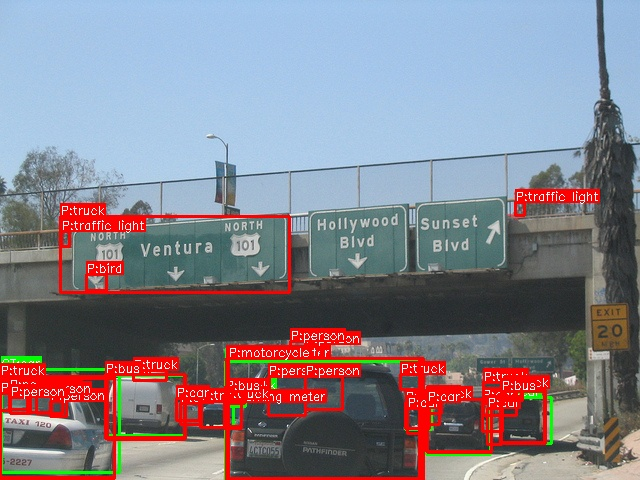
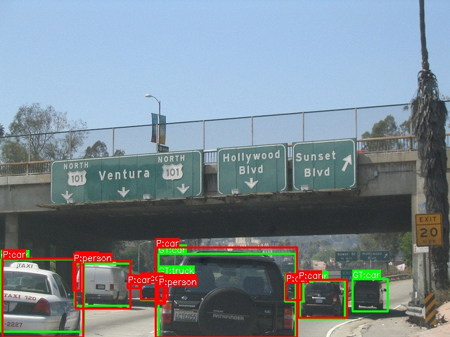
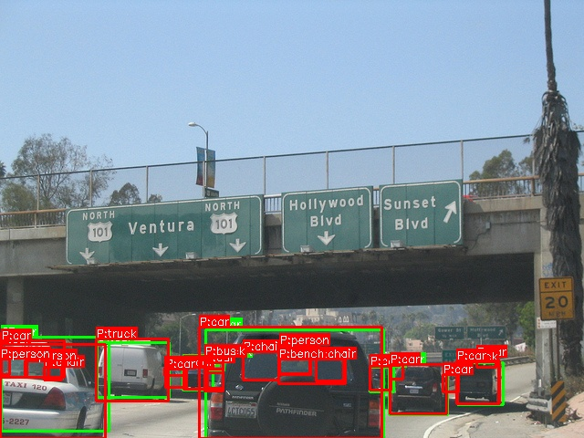
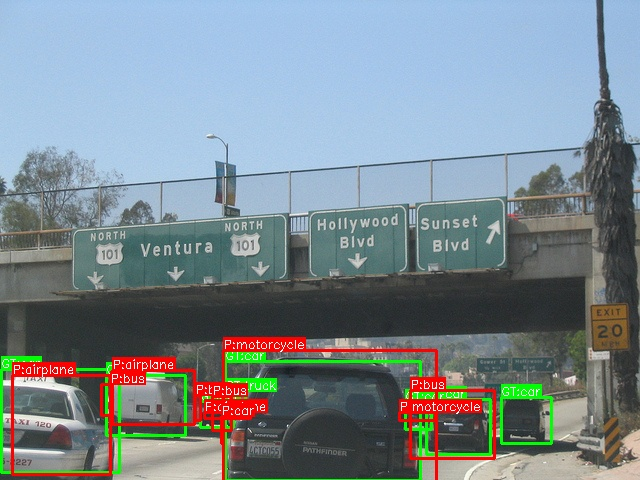
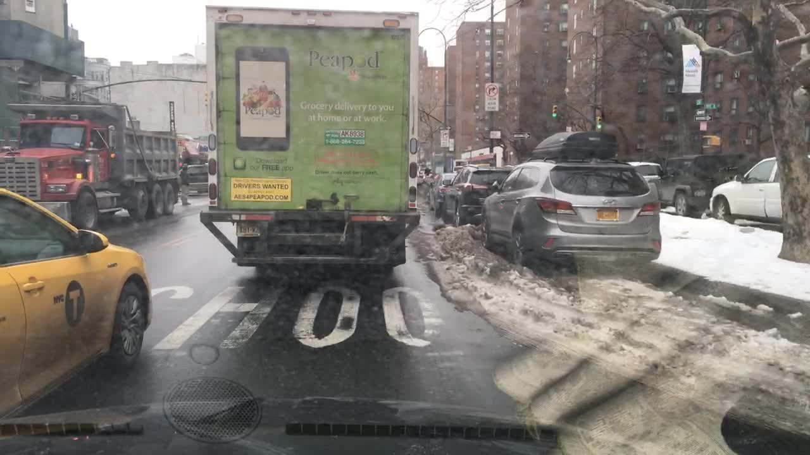
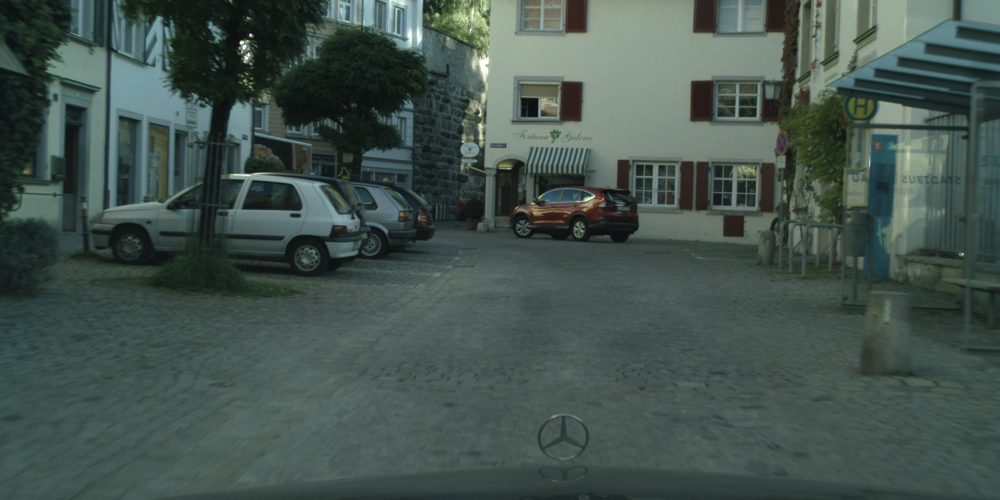
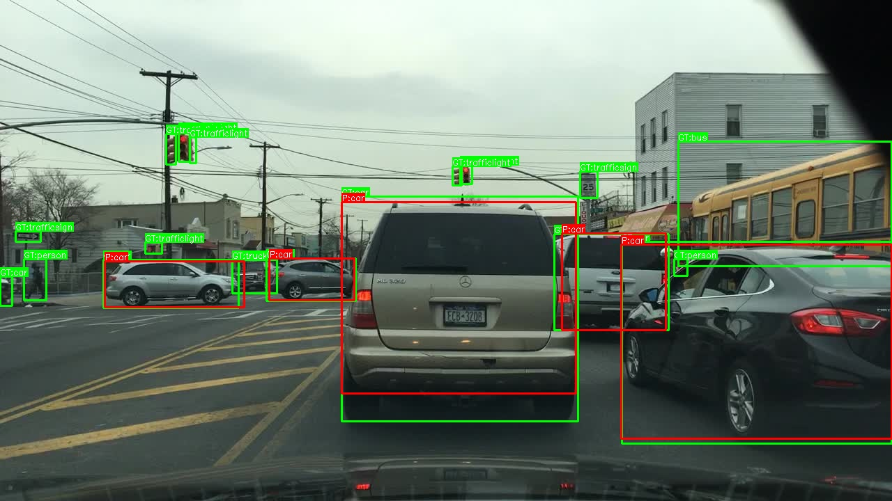
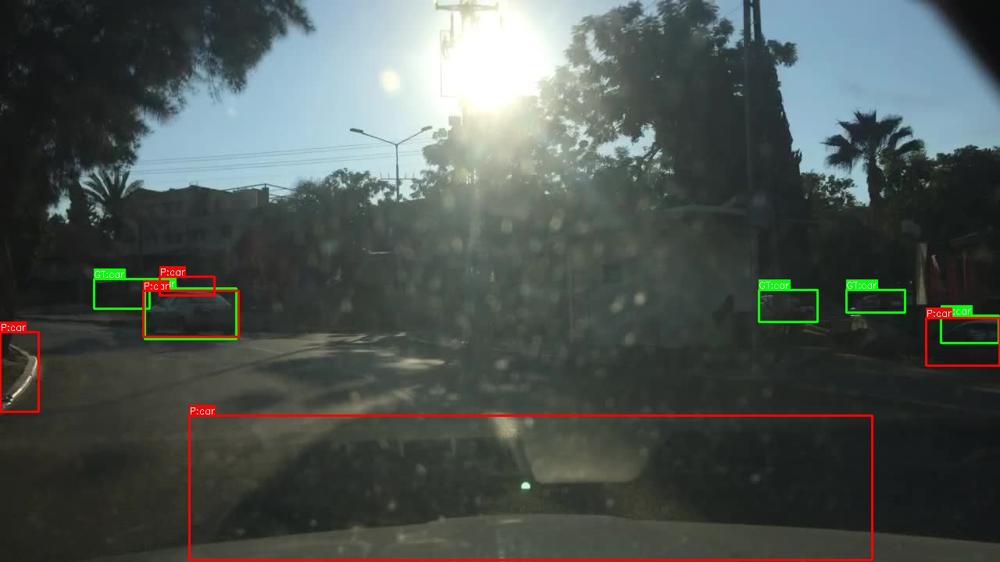
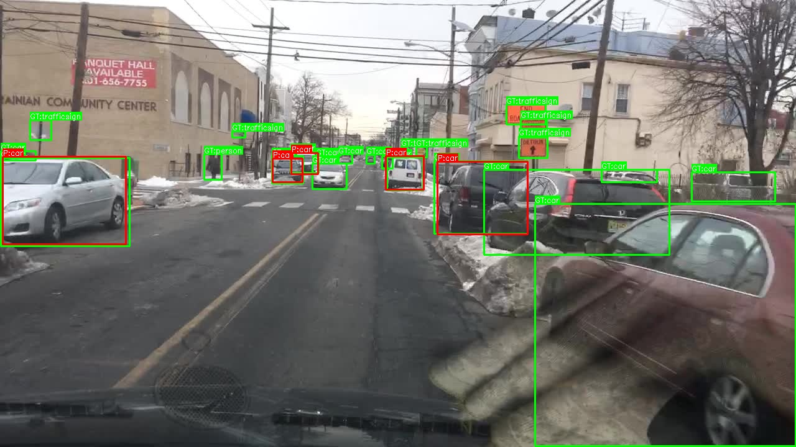
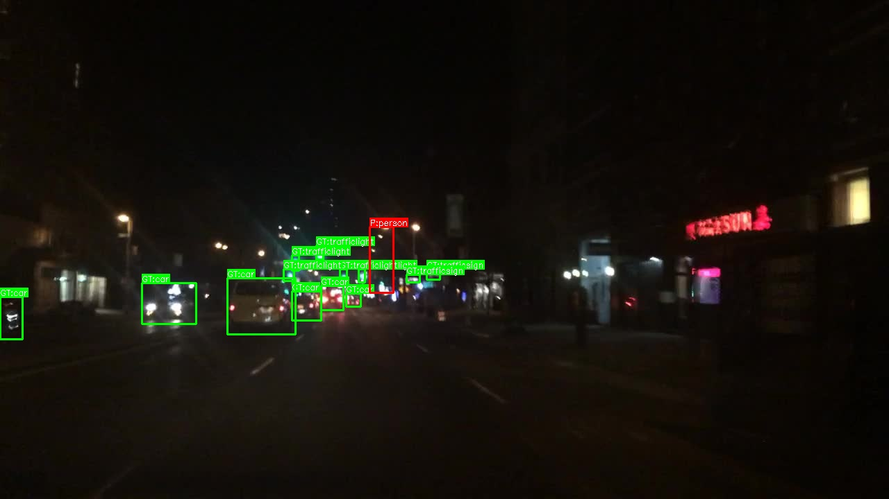

## 面向领域特定性下鲁棒的跨数据集目标检测泛化

   目标检测器在分布内通常表现良好，但在不同的基准测试上会急剧下降。我们将基准测试分为具有多样化日常场景的设置无关数据集和与狭窄环境相关的设置特定数据集，并在所有训练-测试对中评估标准检测器系列。这揭示了 CD-OD 中清晰的结构：同一设置类型内的迁移相对稳定，而跨设置类型的迁移则大幅下降且通常不对称。最严重的故障发生在从特定源迁移到无关目标时，并且在开放标签对齐后仍然存在，这表明在最困难的情况下，域偏移占主导地位。为了将域偏移与标签不匹配分离开来，我们将闭合标签迁移与开放标签协议进行比较，该协议使用 CLIP 相似度将预测类别映射到最近的目标标签。开放标签评估产生了持续但有限的收益，许多修正的案例对应于图像证据支持的语义近失。总的来说，我们提供了在设置特异性下 CD-OD 的原则性表征，以及在分布偏移下评估检测器的实用指南。

关键词：目标检测 · 域泛化 · 跨数据集基准测试。

---

**作者**：Ritabrata Chakraborty, Hrishit Mitra, Shivakumara Palaiahnakote, Umapada Pal

**arXiv**：2601.09497（2026年1月）| 15页，4图，6表 | CC BY-SA 4.0

**代码**：https://github.com/Ritabrata04/cdod-icpr.git

**领域**：cs.CV / cs.LG（ICPR 方向）

---

跨数据集目标检测（CD-OD）：在一个数据集上训练、在另一个数据集上测试。现代检测器在分布内表现良好，但换到别的基准上就**急剧退化**。这篇论文要回答的问题是——**检测器跨数据集到底掉多少？为什么掉？是"看不懂图"还是"叫不对名字"？**

### 背景与动机

论文用一个真实事件切入：2025年10月底，一辆 Waymo 无人车在旧金山撞死了一只叫 KitKat 的猫。作者强调这不是单一组件的失败，而是部署现实的缩影——真实场景里有不寻常的遮挡、罕见的物体轨迹、常见评估集里弱覆盖的工况。

**Likert 评分任务**：评价的是图像或图像集合的**视觉多样性（visual diversity）**，不完全等于“单张图片的场景复杂度”。重点是场景、物体类别、背景、视角和拍摄条件是否丰富、多变。

**Yes/No 图像对任务**：判断两张图片是否来自**同一个数据集**。这里最好不要直接替换为“同一个域”，因为 Cityscapes 和 BDD100K 都属于驾驶场景域，但仍是两个不同的数据集。

Table 1 的主要结论是：

> 人类能够从视觉线索中识别不同数据集所具有的稳定特征，说明数据集之间确实存在可感知的“场景特异性”。

具体表现为：

- 判断两张图是否来自同一数据集的总体准确率达到 **84.0%**。
- 对“不同数据集”的判断更准确：**89.7%**；对“同一数据集”为 **80.3%**。
- Likert 评分虽然完全一致率只有 **35.3%**，但允许相差一个等级后，一致率达到 **65.4%**，说明参与者对视觉多样性的判断仍存在一定共识。
- Likert 的 IQR 为 **[2, 8]**，也说明不同图像集合的多样性评分差异较大。

因此，作者认为数据集具有可辨认的视觉“签名”，模型也可能学习这些数据集特有的场景和采集先验，从而影响跨数据集泛化。

跨数据集结果之所以难解读，是因为**两个效应纠缠在一起**：

1. **视觉分布偏移（domain shift）**：图像统计本身不同导致性能下降；
2. **标签分类法偏移（label/taxonomy mismatch）**：数据集对概念的命名、拆分、合并方式不同，检测器输出了语义合理的标签，但在严格目标词汇表下仍被判错。

这俩混在一起，就说不清检测器是"看不懂图"还是"叫错名字"了。`（这篇的核心贡献就是把这俩拆开）`

**Figure 1：同一张 COCO 图在不同源数据集训练下的检测对比**（直观感受跨域退化）：

### 核心视角：Setting Specificity（设置特异性）

作者提出"设置特异性"作为分析数据集的因子，把数据集分成两类：

- **Setting-specific（特定场景）**：针对单一操作环境，场景结构重复、视角一致、分类法任务聚焦（如驾驶、医疗、农业）；
- **Setting-agnostic（通用场景）**：覆盖多种设置和场景类型，捕获条件变化大，标签空间更广（如 COCO）。

这产生四种迁移模式：$S \to T$，其中 $S, T \in \{\text{specific}, \text{agnostic}\}$。

**四种迁移模式就是源数据集类型与目标数据集类型的全部有序组合：**

| 迁移模式                | 含义                           | 论文中的例子         |
| ----------------------- | ------------------------------ | -------------------- |
| **Specific → Specific** | 从特定场景迁移到另一个特定场景 | Cityscapes → BDD100K |
| **Specific → Agnostic** | 从特定场景迁移到通用场景       | Cityscapes → COCO    |
| **Agnostic → Specific** | 从通用场景迁移到特定场景       | COCO → Cityscapes    |
| **Agnostic → Agnostic** | 从通用场景迁移到另一个通用场景 | COCO → Objects365    |

需要注意迁移是**有方向的**。例如 `COCO → Cityscapes` 和 `Cityscapes → COCO` 属于两种不同模式，性能也不一定对称。

特定场景一般指相对受限或一致视角，背景。而通用场景一般指多视角多背景。

两类数据集的视觉样例对比--设置特定（驾驶视角、结构重复）与设置无关（日常多样）的差异肉眼可辨：

**Setting-specific 样例（BDD100K / Cityscapes）：**

**Setting-agnostic 样例（COCO / Objects365）：**

> **对牛只项目的关联**：牛只检测正是一个典型的 setting-specific 场景。从 COCO 迁移到牛只数据集属于 agnostic->specific，论文显示这类迁移是**不对称**的，且瓶颈在域迁移而非标签。`（这正是我们做跨数据集泛化时会遇到的）`

#### 人类研究验证

作者用 78 名参与者的人类研究来验证 setting specificity 是可感知的真实信号（Table 1）：

- 用 COCO、Cityscapes、Objects365、BDD100K 的精选图，让参与者评估视觉多样性、判断图像对是否来自同一数据集；
- Likert 响应：均值 4.83，中位数 4；
- Yes/No 任务准确率 84.0%（GT=Yes 时 80.3%，GT=No 时 89.7%）。

结论：**数据集 exhibits stable setting-level signatures that humans can recover from visual cues alone**——设置特异性是肉眼可辨的稳定信号，不是主观臆造。`（先用人验证概念成立，再做机器实验，这个论证链很扎实）`

跨数据集测试同时包含两种困难：

\[ \text{性能下降} = \text{视觉域偏移} + \text{标签体系不一致} \]

### 方法：分离域迁移与标签不匹配

#### 任务定义

设 $\mathcal{D}_s$、$\mathcal{D}_t$ 为源/目标检测数据集，图像空间 $\mathcal{X}_s, \mathcal{X}_t$，标签词汇表 $\mathcal{Y}_s, \mathcal{Y}_t$。在 $\mathcal{D}_s$ 上训练，在 $\mathcal{D}_t$ 上评估。所有目标评估为**零样本**，无目标访问。

#### 两种评估协议

**Closed-label（闭标签）**：评分限制在源、目标共享标签的一对一交集，用显式映射文件对齐，大小写不敏感，不做语义折叠，过滤掉不在共享集合中的预测。

**Open-label（开标签）**：为估计跨数据集损失中由分类法不匹配驱动的部分，把预测类名用 CLIP 映射到最近的目标标签——

对预测标签 $\hat{y}$，计算其与每个目标标签 $c \in \mathcal{Y}_t$ 的相似度，当最佳相似度超过阈值 $\tau$ 时把 $\hat{y}$ 分配给最近的目标标签。**只改标签评分，定位（框、IoU 匹配）不变**，重映射在 NMS 之后应用。

`（思路很巧：闭标签 = 域迁移 + 标签不匹配的总量；开标签 ≈ 消除标签不匹配后的剩余。两者之差就是标签不匹配的贡献，剩余的就是域迁移。）`

#### 语义近似缺失诊断（Near-miss Diagnostics）

模型已经正确定位了目标，但预测类别与 GT 标签不完全相同，不过两者在语义上非常接近。

例如：

- GT：`sofa`，预测：`couch`
- GT：`motorcycle`，预测：`motorbike`
- GT：`truck`，预测：`vehicle`
- 严格的闭集评估会把这些预测全部判为错误，但它们可能主要是由**不同数据集的标签体系不一致**导致的，而不一定是模型没有识别出目标。

用 CLIP 定义三个诊断量，区分"语义接近的错配"和"真正的语义混淆"：

1. **文本-文本相似度**：$s_{tt}(\hat{y}, y) = \cos(e_T(\hat{y}), e_T(y))$
2. **真值标签排名**：$\text{rank}_{\text{GT}|\hat{y}} = 1 + \sum_{c \in \mathcal{Y}_t} \mathbb{1}[\cos(e_T(\hat{y}), e_T(c)) > \cos(e_T(\hat{y}), e_T(y))]$
3. **区域级偏好边际**：$s_{it}(r, c) = \cos(e_I(r), e_T(c))$，$\Delta_{it} = s_{it}(r, y) - s_{it}(r, \hat{y})$

当 $s_{tt} \geq \tau$ 且 $\text{rank}_{\text{GT}|\hat{y}} \leq K$ 时，把该不匹配视为**语义近似缺失**（near-miss）——即"叫错了但语义很近，且有图像证据支持"。

**标签之间必须足够相似；**

**GT 标签必须位于预测标签最接近的前 \(K\) 个目标类别中。**

### 数据集

| 数据集 | 图像数 | 类别数 | 设置类型 |
|--------|--------|--------|----------|
| COCO | 5,000 | 80 | Agnostic |
| Objects365 | 38,000 | 365 | Agnostic |
| Cityscapes | 500 | 8 | Specific |
| BDD100K | 10,000 | 10 | Specific |

选择理由：

- COCO、Objects365 代表通用集合，对象覆盖广、上下文多样；
- Cityscapes、BDD100K 代表设置特定的驾驶集合，结构化相机视角、驾驶中心分类法；
- Cityscapes 的 8 个实例类完全包含在 BDD100K 标签空间中（BDD 额外 2 个标签）；
- BDD100K 相比 Cityscapes 捕获条件更多样（白天/夜间、雨/雪等）。`（这样配对能控制变量地比较同类型 vs 跨类型迁移）`

### 训练与实现

- **固定训练配方**跨所有源数据集，每个源基准训练一个模型，单一代码库避免工具包依赖变异；
- 检测器：**Faster R-CNN + ResNet-50 FPN**（选它因为稳定、广泛采用、显式解耦定位与分类、容量平衡）；
- 框架：PyTorch + MMDetection，标准 1× 学习率计划；
- 语义相似度：**CLIP ViT-L/14** 文本嵌入，原始标签字符串作为提示；
- 硬件：NVIDIA RTX A5000 (24 GB)。

### 实验结果

#### 1. 闭标签跨数据集泛化（Table 3）

| Train\Test | COCO | Cityscapes | Objects365 | BDD | Avg. |
|------------|------|------------|------------|-----|------|
| COCO | **0.376** | 0.015 | 0.286 | 0.019 | 0.174 |
| Cityscapes | 0.206 | **0.402** | 0.268 | 0.275 | **0.287** |
| Objects365 | 0.046 | 0.020 | **0.198** | 0.102 | 0.092 |
| BDD | 0.131 | 0.025 | 0.103 | **0.298** | 0.139 |
| **Avg.** | 0.189 | **0.115** | **0.213** | 0.174 | - |

关键发现：

- **Cityscapes 是最可迁移的训练集**（平均 0.287），对驾驶和通用目标都强；
- **Objects365 是最弱的源**（平均 0.092），尽管域内得分 0.198；`（类别多反而迁移差，量大不等于质优）`
- **迁移强烈不对称**：COCO->Objects365 (0.286) ≫ Objects365->COCO (0.046)；Cityscapes->BDD (0.275) ≫ BDD->Cityscapes (0.025)；
- Cityscapes 是最难的目标（平均 0.115），Objects365 是最容易的目标（平均 0.213）。

#### 2. 开标签跨数据集评估（Table 4，τ=0.6）

| Train\Test | COCO | Cityscapes | Objects365 | BDD | Avg. |
|------------|------|------------|------------|-----|------|
| COCO | 0.376 | 0.030 (+0.015) | 0.322 (+0.036) | 0.038 (+0.019) | 0.192 |
| Cityscapes | 0.235 (+0.029) | 0.402 | 0.296 (+0.028) | 0.287 (+0.012) | 0.305 |
| Objects365 | 0.082 (+0.036) | 0.032 (+0.012) | 0.198 | 0.124 (+0.022) | 0.109 |
| BDD | 0.160 (+0.029) | 0.040 (+0.015) | 0.132 (+0.029) | 0.298 | 0.158 |
| **Avg.** | 0.213 | 0.126 | 0.237 | 0.187 | - |

关键发现：

- 开标签匹配在**所有非对角线条目**上都产生**一致但有界**的增益；
- 最大改进出现在两个 agnostic 数据集之间、以及驾驶数据集到更广词汇表的迁移；
- COCO->Objects365: 0.286->0.322 (+0.036)；Objects365->COCO: 0.046->0.082 (+0.036)；
- **开标签评估未关闭鲁棒性差距**：COCO->Cityscapes 仅 0.030，COCO->BDD 仅 0.038。`（消除标签不匹配后差距还在，说明瓶颈是域迁移）`

#### 3. CLIP 近似缺失消融（Table 5）

| Train->Test | ΔmAP | Near-miss ↑ | E[s_tt] ↑ | Med. Rank | Top-5 ↑ | E[Δ_it] |
|------------|------|-------------|-----------|-----------|---------|---------|
| O365->BDD | +0.25 | 41% | 0.73 | 2 | 88% | +0.018 (62%) |
| O365->City | +0.15 | 33% | 0.71 | 3 | 81% | +0.012 (58%) |
| COCO->O365 | +0.04 | 18% | 0.69 | 4 | 64% | +0.006 (55%) |
| O365->COCO | +0.04 | 17% | 0.70 | 4 | 66% | +0.005 (54%) |
| City->COCO | +0.01 | 4% | 0.58 | 14 | 21% | -0.002 (46%) |

- 受益于开标签的迁移，近似缺失率更高、语义更接近；
- Objects365->BDD 有 41% 近似缺失率，均值相似度 0.73，中位排名 2，Top-5 包含率 88%；
- Cityscapes->COCO 近似缺失率仅 4%——剩余错误由**语义混淆和域迁移**主导，而非分类法不匹配。

#### 阈值敏感性（Table 6）

| Pair | τ=0.5 | τ=0.6 | τ=0.7 | Closed |
|------|-------|-------|-------|--------|
| O365->BDD | 0.565 | 0.580 | 0.522 | 0.298 |
| O365->City | 0.430 | 0.475 | 0.398 | 0.268 |
| COCO->O365 | 0.243 | 0.242 | 0.226 | 0.198 |

τ=0.6 在多数情况下最佳。

#### 定性结果（Figure 4）

跨域检测的 good/bad 对比（COCO->BDD、City->BDD 的成功与失败案例）。夜间、眩光等大域偏移场景退化最严重，印证了"agnostic->specific 的鲁棒性悬崖"：

### 三大核心发现（Discussion）

**1. 设置特定目标暴露"鲁棒性悬崖"**

迁移到驾驶数据集极其脆弱：agnostic->specific 性能在闭标签下崩溃，开标签后仍然很低。**外观、视角、上下文偏移在最难的情形下压倒标签不匹配**——域迁移占主导。

**2. 跨数据集偏移是方向性的**

许多迁移对强烈不对称，所以"domain gap"**不能被视为对称的**。只报告单向精选 source->target 结果可能隐藏更难的方向、夸大鲁棒性。`（这点很重要：做跨数据集实验必须双向都报，单向会自欺）`

**3. 标签不匹配是真实但有界的**

开标签评估产生一致但有限的增益，近似缺失统计能区分"语义接近的错配"和"真正的语义混淆"。开标签评分后的大残余下降指向**标签对齐之外的鲁棒性失败**。

### 结论与局限

- 在设置特异性框架下组织基准、在所有训练-测试对上评估、在闭/开标签下运行推理，**显式分离语义错位与视觉域偏移**；
- 最显著退化发生在 agnostic->specific；即使解决标签不匹配，域偏移仍占主导；
- 对安全关键部署有重要意义。

**局限**：仅限标准检测器架构；固定基准集合，可能未覆盖所有真实分布偏移形式。
**未来**：探索域适应策略克服偏移；进一步研究 agnostic 与 specific 数据间的相互作用。

### 对牛只项目的启示

1. **牛只是 setting-specific**：从 COCO 这类 agnostic 数据集迁移到牛只数据集，属于论文中"鲁棒性悬崖"那一类——性能会大幅下降，且**不能指望靠标签对齐（如 CLIP 重映射）救回来**，瓶颈在域迁移本身。

2. **双向评估**：若做跨数据集泛化实验，务必**双向报**（牛只↔COCO），单向结果会掩盖不对称性。Objects365 量大却迁移最差，说明源数据集的"可迁移性"不取决于规模，而取决于设置匹配度。

3. **可复用的评估协议**：论文的闭/开标签协议 + CLIP near-miss 诊断可以直接搬到我自己的跨数据集评估里，用来量化"掉点中有多少是标签问题、多少是域问题"——这对解释实验结果非常有用。

4. **域适应是正解**：既然标签对齐收益有限，针对牛只场景应优先考虑域适应/风格迁移/数据增广，而非纠结标签词汇表对齐。`（和论文 Related Work 里 DA 方法那段的判断一致）`
