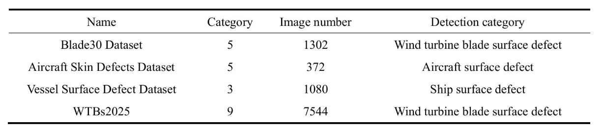

## 风力涡轮机叶片表面缺陷高质量图像数据集构建与性能验证

风力发电已成为增长最快的可再生能源之一，在碳达峰、碳中和目标的指引下，我国风力发电机容量和叶片直径持续取得突破。

然而，由于加工、运输、安装以及运行环境的复杂性，风力涡轮机叶片（WTBs）表面损伤在所难免。如果这些损伤不能及时修复，将对风力发电机的安全性和效率产生一定的负面影响。

传统的叶片损伤检测多指人工目视检查8，主要包括叶片维护平台检查、绳索下降检查和高功率望远镜检查。这些方法存在效率低、成本高、操作危险等缺点。目前的叶片损伤检测技术主要依赖基于传感器的方法，包括超声波探伤9、声发射信号监测10、振动信号分析11和光纤传感检测12等。

随着无人机（UAV）和计算机视觉技术的不断更新和发展，利用无人机进行WTB故障检测是WTB检测技术研究中备受关注的方向16,17。然而，该领域有效数据集的构建已成为制约其发展的瓶颈。早期研究多依赖于合成数据或在实验室环境中收集的小规模数据集（例如，仅几百张图像）。这些数据集泛化能力差，例如只有单一的缺陷类型，并且缺乏多视角的真实场景数据。

无人机和机器人已被用于风力涡轮机叶片检查，以通过高分辨率相机或红外热成像设备18收集图像数据。利用无人机和机器人收集的数据训练深度学习神经网络可以提高缺陷识别能力。随着神经网络理论的不断发展，风力涡轮机叶片表面缺陷的检测过程变得越来越自动化和智能化。准确性可以达到一定水平，从而降低人工检查的成本19。然而，该领域仍面临许多挑战，受限于数据收集、数据标注和泛化能力等问题：

（a）数据采集的难度。叶片表面缺陷数据的采集通常在高海拔或恶劣环境下进行。受气候条件（风速、光照、雨雪等）的限制，难以采集清晰完整的图像20。

（二）缺陷类型与数据标注的复杂性。叶片表面缺陷类型多样，包括涂层裂纹、腐蚀、涂层脱落、雷击等。每种缺陷在不同光照和角度下表现不同，这降低了检测的准确性21。

（c）数据不平衡问题。某些缺陷（例如闪电击穿）的样本稀少，导致数据集不平衡，从而影响模型学习。

为提高风电场运行维护效率、促进工业智能化生产，本研究构建了WTBs2025数据集，专门用于风力涡轮机叶片缺陷的检测与识别。分析了WTBs2025数据集的必要性与有效性，以验证其在特定场景下的相关性、不可替代性及实际应用价值。本文的主要贡献如下：

数据集收集与预处理：首先，从风电场涡轮叶片叶片检查报告中获取数据。确定了闪电 strike、保护膜损坏、漏油、腐蚀和其他缺陷。其次，进行数据清洗以去除重复图像和模糊图像。接下来，使用标注工具对各种损坏类型进行标注。最后，对原始数据进行数据增强以扩展数据集。

WTBs2025的扩充与构建：由于雷击频率较低，可用数据有限。通过旋转、改变亮度和镜像进行简单增强，随后使用高斯注意力深度卷积生成对抗网络（GA-DCGAN）进行数据增强。通过生成高质量、多样化的合成数据，可以增加训练样本数量，从而缓解数据不足导致的过拟合或欠拟合问题。完成上述步骤后，WTBs2025的规模达到7,544张图像。 

数据集验证：通过技术验证确认数据集的质量和可用性，该验证包括不同的流行深度学习模型。这为研究人员提供了充足的实验数据以供未来研究。

原始WTBs2025数据集包含7316张标注图像，涵盖九种缺陷类型：油漆裂纹（447张）、保护膜损坏（549张）、雷击（57张）、涂层剥离（1085张）、腐蚀（2799张）、漏油（520张）、针孔（569张）、表面污渍（263张）和局部损坏（1027张）。其中，经过两次数据增强后，雷击缺陷的数量达到285个，WTBs2025数据集共有7544张图像。该数据集对于专注于WTB表面缺陷检测的项目具有重要价值。原始WTBs2025数据集的缺陷类型分布如图2所示，其中雷击缺陷仅占总数的1%。

### 方法

WTBs2025 的开发主要包括四个阶段：数据收集、数据预处理、数据增强和数据标注。工作流程中每个阶段的详细信息如下：

数据收集 WTBs2025 数据集包含的图像是在中国山西、甘肃和陕西省多个陆上风电场进行的例行检查活动中采集的。图像采集使用 Survey3W 可见光RGB相机进行，由训练有素的检查人员在风力涡轮机的实际运行条件下近距离操作。原始图像的分辨率为4000×3000像素，能够可靠地可视化不同空间尺度的风力涡轮机叶片表面缺陷。

数据预处理 为确保不同训练框架之间的数据一致性和兼容性，在预处理过程中，WTBs2025 数据集中的所有图像均被转换为 JPG 格式。

此外，所有图像均统一调整为 640 × 640 像素，以标准化模型输入分辨率。

数据增强 WTBs2025中原始闪电图像的数量仅为57张，而其他缺陷类型的图像有数百甚至数千张。在WTB缺陷类型中，闪电图像是从非常有限的真实样本中收集的，这导致模型训练数据的分布不平衡。目标检测模型可能无法学习到足够的特征，导致检测性能下降。

而其他缺陷类型仍然保留了足够的样本量以进行稳定的模型训练。为了避免引入不必要的分发转移，并能够对数据增强的有效性进行受控评估，GAN-based augmentation 仅应用于闪电类别。这一设计选择使得GA-DCGAN在缓解极端不平衡方面的影响能够被独立分析，而不会受到同时增强多个缺陷类别的混淆效应的影响。

鉴于以上原因，我们通过改变亮度、镜像和旋转来进行简单的数据增强，将数据集扩展到228张图像，如图3所示。

数据标注 风力发电机塔筒（WTB）的损坏类型主要包括涂层裂纹、保护膜损坏、雷击、涂层剥离、腐蚀、漏油、针孔、表面污渍和局部损坏。使用LabelImg标注工具，在WTBs2025的每张图像上为每处损伤绘制最小外接矩形框，并标注其所属的损伤类别。每批图像由两人独立标注，随后由作者对标注结果进行比对和验证，以最大限度地减少主观偏差，确保数据集的可靠性和质量。

### 数据记录

WTBs2025 已上传至公共figshare26存储库，格式为zip文件。该文件分为9个目录，分别对应WTB中的9种缺陷类型，即油漆裂纹、保护膜损坏、雷击、涂层剥离、腐蚀、漏油、针孔、表面污渍和局部损坏。每个文件夹包含两个子目录：images和labels。

为便于清晰使用和长期可复现性，提供了标准化的数据集规范。所有图像均以JPG格式存储，经过预处理后分辨率统一为640×640像素。标注遵循YOLO格式，每个标签文件对应一张图像，包含类别索引和归一化的边界框坐标。

### 技术验证

相关数据集的比较 为了验证目标检测算法的效率，本研究比较了该领域的多个数据集，旨在为视觉研究人员更好地开发、改进和评估目标检测算法提供见解。下文将对三种常用数据集进行分析，并与WTBs2025进行比较。

在类别方面，这些数据集涵盖了多种不同的类别，包括WTB、飞机和船舶缺陷。WTBs2025更侧重于WTB损伤的检测，并提供了更具体的应用场景。在图像数量方面，这些数据集之间存在显著差异。与其他数据集相比，WTBs2025在图像数量方面具有一定优势，为研究人员提供了充足的数据资源。表3展示了一对不同的缺陷检测数据集。

缺陷检测评估 本实验采用精确率（Precision）、召回率（Recall）和平均精度均值（mAP）来评估模型。真正例（TP）和真负例（TN）代表正确预测，其中TP代表正确检测到目标，TN表示非目标被正确分类为非目标。假正例（FP）和假负例（FN）表示误预测，其中FP表示非目标被错误地预测为目标，FN表示未能检测到目标。

其中精确率（P）定义为正确预测为阳性样本的数量与所有预测为阳性样本数量的比率。公式如（5）：
$$
pression = \frac{TP}{TP + FP}
$$
召回率（Recall, R）表示模型能够正确预测为正例的样本中，所有真实正例样本所占的比例。
$$
Recal = \frac{TP}{TP + FN}
$$
平均精度（AP）是指以召回率（Recall）为横轴、精度（Precision）为纵轴所构成的曲线所围成的面积。

实验中的平均精度均值 mAP 是数据集中所有类别的平均精度的均值。公式如(8)所示：

其中 m 表示目标类别的总数。

从表6可以看出，不同模型在不同缺陷类型的检测性能上表现出显著差异。对于保护膜损伤和油漆裂纹，YOLO系列模型（YOLOv8、YOLOv9、YOLOv10、YOLO11、YOLO26）的mAP值高于Faster R-CNN、SSD和RetinaNet，这反映了它们能够准确地定位具有明显结构模式的缺陷。对于涂层剥离这种尺寸较小、视觉不明显的缺陷，Faster R-CNN和SSD等两阶段模型表现出较低的mAP，而YOLO11和YOLO26通过增强的特征聚合提高了检测性能。

总体而言，WTBs2025 数据集具有多样的缺陷类型、尺度和纹理，能够评估不同架构的优缺点。单阶段模型在视觉上明显和多尺度缺陷的检测精度方面始终较高，而双阶段模型在较小或不太明显的缺陷方面表现相对较低。该比较表明，该数据集能够有效地对不同缺陷类别和尺度的模型进行基准测试。